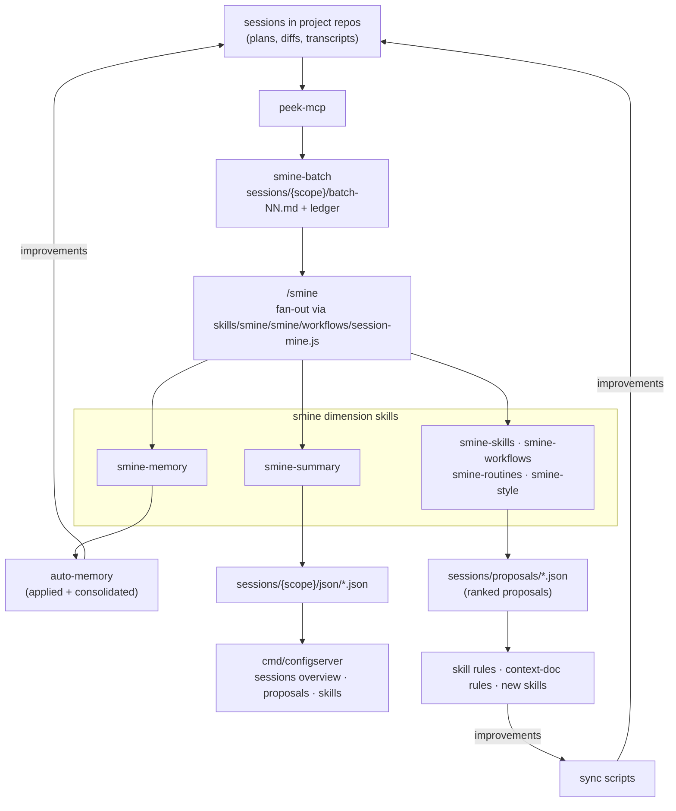
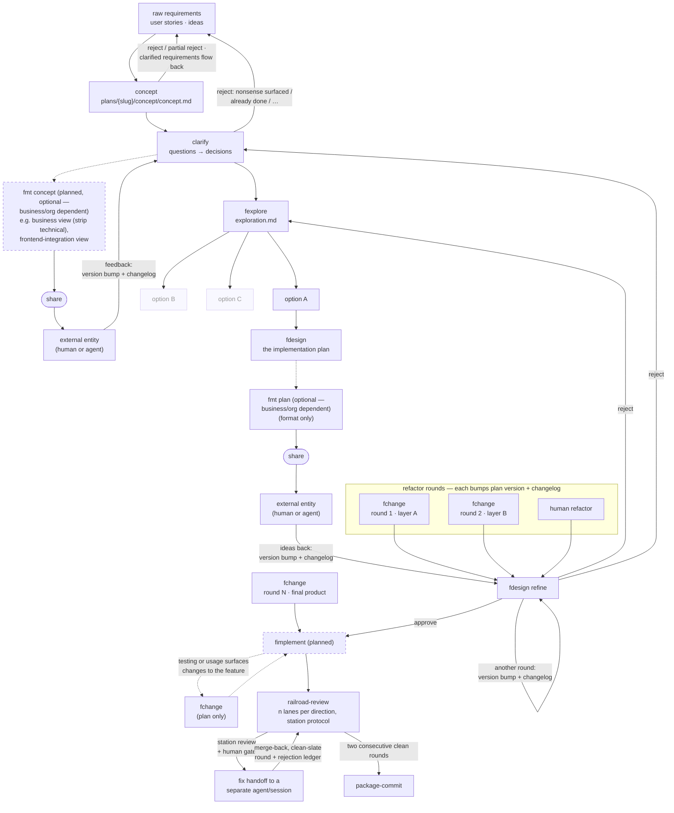
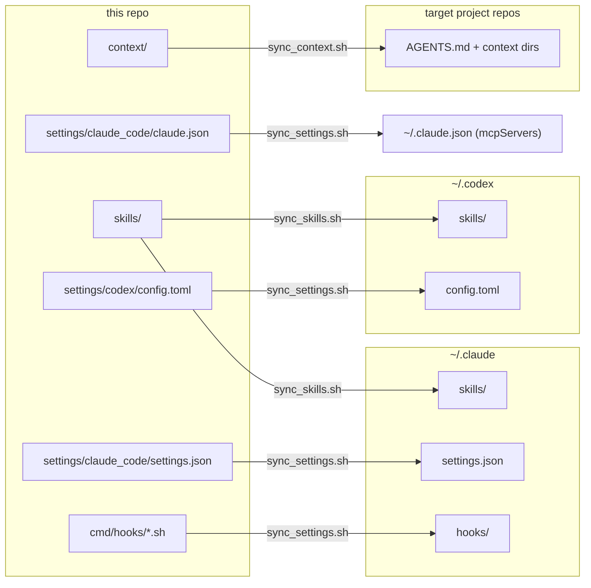

# smine

**smine (Session Mine)** — an evidence-based improvement loop for Claude Code (and a bit of Codex):
mine your own past sessions for agent mistakes, user corrections and workflow patterns, turn the
findings into skill rules, context docs and memory, and deploy them so the next session runs under
the improved instructions. The repo is the source of truth for that whole setup — skills, settings,
agent context files, hooks, and a small web UI for reviewing proposals and toggling settings.
Nothing here is read in place — sync scripts deploy copies to `~/.claude` / `~/.codex` or into
target repos.

## The idea

- Agents are only as good as the standing instructions they run under, and those instructions rot when they live scattered across home directories. Everything lives here, versioned, and gets deployed.
- The instructions are **evidence-based**: skill rules come out of a retrospective loop over real sessions, not speculation. Every rule worth having traces back to something that actually went wrong (many carry their origin quote) or demonstrably worked.

## The feedback loop (how we got here)

1. Work happens in local Claude Code / Codex sessions in the actual project repos — plans, diffs, and transcripts accumulate there.
2. **peek-mcp** exposes those sessions (turns, plan, diff) to other sessions, so one session can read what another did (`skills/orchestration/peek`).
3. **Session Mining** (s)mine the transcripts for agent mistakes, user corrections, workflow shapes, and frustration signals.
   - This started as ad-hoc analysis and was then formalized into `skills/smine/`, which mines a session batch and then fans each batch out to the six dimensions (`smine-memory`, `smine-skills`, `smine-workflows`, `smine-routines`, `smine-style`, `smine-summary`)
   - memory gets applied and consolidated, everything else lands as ranked proposals under `sessions/proposals/`, (or gets auto-applied if active) plus a machine-readable JSON per batch under `sessions/<scope>/json/`
   - Each dimension keeps its own `analyzed-*.txt` ledger.
   - `/smine --no-batch` routes already-mined batches; `/smine --no-<dimension>` skips one;
   - `--max-proposals-per-dimension` / `--max-proposals-mined` cap nightly production
5. Findings land here: as skill rules, as context-doc rules (e.g. a new typed entry in `context/rules/`), or as whole new skills (`fexplore` came out of retrospective batch 19).
6. Sync deploys the updated skills/context — the next session runs under the improved rules.
7. Repeat.



## Layout

| Path | Contents |
| :--- | :--- |
| `skills/` | Skill definitions (`<name>/SKILL.md` + optional reference files). Directory name = skill name. |
| `settings/claude_code/settings.json` | Claude Code settings (permissions allowlist, hooks, model). |
| `settings/codex/config.toml` | Codex CLI config. |
| `context/` | Agent context deployed into target repos as per-repo packs — and this repo's own pack: `AGENTS.md` (template with `{{ROLE}}`), `rules/` (typed `FACT/NEVER/ALWAYS` entries in activity chapters — `concepting.md` with the hot-class gates, `implementing.md` with stops/integrity, `reviewing.md` with the Definition of Done, `navigating.md` — plus the committed `rules.json` registry and UI-editable `aspects.json`), `style/` (artifact style guides: `plan.md`; add your own, e.g. per-language guides — `style/<lang>.md` files become selectable in `sync_context.sh`), `facts/` (this repo's facts; target repos own theirs). |
| `cmd/hooks/` | Hook scripts deployed to `~/.claude/hooks/` (see below). |
| `cmd/sync/` | Deployment scripts (see below). |
| `cmd/worktrees/` | Helpers for parallel agent work in git worktrees: sync target branch into `claude/*` worktrees, print status, force-remove agent worktrees. |
| `cmd/configserver/`, `internal/` | Go web app to toggle hooks, permissions, env, model, and MCP servers in `~/.claude/settings.json`. |
| `cmd/secretscan/` | Go CLI: deterministic secret scanner for repo working tree and git history (`internal/secretscan/`). Exit codes: 0 clean, 1 findings, 2 error. |
| `sessions/` | Retrospective output: batch reports + per-dimension `analyzed-*.txt` ledgers (`personal/`, `work/`), cross-scope ranked proposals (`proposals/`), batch JSON summaries (`<scope>/json/`). |
| `skills/<skill>/workflows/` | Workflow scripts (deterministic multi-agent orchestration), bundled with their fronting skill (see `docs/workflows.md`). `skills/smine/smine/workflows/session-mine.js` mines transcripts and fans each batch out to the dimension skills. |
| `tests/` | Skill output artifacts for eyeballing rule changes (e.g. `tests/fdesign/`: the mode/caveman plan matrix). |
| `docs/checklist.md` | Running log of workflow problems and their status. |

## The planning skill family

Ordering doctrine — violating it has invalidated approved plans (authoritative map with hand-off artifacts: [docs/skill-map.md](docs/skill-map.md)). The diagram shows the **target workflow** — dashed nodes are planned skills that don't exist yet; `skill-map.md` stays authoritative for what exists today:



- `concept` — draft the concept document / user stories into `plans/`; already a filter — reject or partial reject (some stories hold, some don't), and clarified requirements flow back into the raw requirements
- `clarify` — drain open questions into binding decisions: `[USER]` vs `[BUSINESS]` owner routing, source-requirements diff; can reject back to the raw requirements (reasons are manifold — nonsense that only surfaced now, already done, …)
- `fmt concept` *(planned, optional — depends on the business/org situation and the requirements)* — reformat the concept for an audience (business = strip technical, frontend-integration, …) and share it; feedback pipes back into `clarify` with version bump + changelog
- `fexplore` — survey ALL sensible solutions before any design locks in; constraint-first; output `plans/{slug}/design/exploration.md`; exactly one option enters `fdesign`, the rest stay documented but discarded
- `fdesign` — the implementation plan: anchored facts, decisions, diffs, tests, stop conditions; familiarity modes `unfamiliar | familiar | owned`, optional `caveman` style
- `fdesign refine` — the fdesign route revising an existing plan driver-by-driver; delta reported in chat + plan Changelog + `⟲` rev-markers; loops on itself per round, and can reject back to explore or clarify — the restart keeps everything learned; refactor rounds (agent and human) apply here too, the plan carries enough code for it
- `fchange` — the plan for any change to an existing feature: post-implementation adjustments, behavioral tweaks, contract changes, and behavior-preserving restructuring of any size; impact classified in the plan (behavior-preserving | behavioral | contract-touching), plan-only — `fimplement` executes; refactor rounds targeting different layers — applied to refined plans as well as the final product — each bump plan version + changelog, alongside human refactor rounds
- `fimplement` *(planned)* — execute the approved plan
- `commit` — per-package (or per-file) build/test/commit with dot-notation messages

Supporting skills: `diagnose-debug` (root cause before fix), `railroad-review` (convention review organized as directions — code-style, correctness, critical, data-integrity, contracts, tests, security, special-focus; solo mode walks them in one agent, railroad mode (default) fans out n lanes per direction, merges per direction and then into one station review, and iterates the station protocol — human gate, durable rejection ledger, fix handoff to a separate agent/session — until two consecutive clean rounds), `dev-stack` (local e2e stacks), `coverage-increase` (coverage gaps → gated brief → tests, same session), `smine`, `peek`, `jq` (cheap JSON extraction), `caveman` (terse output style the planning skills delegate to).

The smine pipeline mines and routes session batches (see feedback loop step 4): `smine` (pipeline front, Skill-fronts-Workflow), `smine-batch` (transcript miner → batch report), `smine-memory` (apply + consolidate), `smine-skills` / `smine-workflows` / `smine-routines` / `smine-style` (ranked proposals), `smine-summary` (batch → schema-conformant JSON).

Plan presentation rules for all of them live in [context/style/plan.md](context/style/plan.md): section order, stacked table cells, in-plan Q&A (OPEN decision rows, never popups), changelog, mode-invariant code.

## Installation (MacOS)
- **Fork the repository**
- `git clone` the fork
- `install.sh` — installs [peek-mcp](https://github.com/kevinhorst/peek-mcp) ≥ 1.0.7 (`--no-peek` to skip), optionally serena (`--serena`), builds `bin/configserver`, materializes the routine plists from `routines/*/*.plist.template` (gitignored; edited later via the config server's Routines page), and runs the server as LaunchAgent `com.smine.configserver` on `:6001` (logs in `~/Library/Logs/`). Stop with `launchctl bootout gui/$(id -u)/com.smine.configserver` — a plain `kill` gets restarted.
- For the nightly routine (`routines/smine-nightly/`, the loop's primary driver): `brew install flock coreutils`, then write a token from `claude setup-token` to `~/.config/claude-routine/token` (0600). The config server auto-bootstraps the routine at startup; without the token a run exits 78 and does nothing. Operations manual: [routines/README.md](routines/README.md).
- Then run the sync scripts below to deploy settings, skills, and context.

## Sync scripts

One direction only — the repo is the source of truth, nothing is read in place:



- `cmd/sync/sync_settings.sh` — `settings.json` → `~/.claude/`, `config.toml` → `~/.codex/` (codex MCP servers ride along inside), hooks → `~/.claude/hooks/`. Merges `mcpServers` from `settings/claude_code/claude.json` into `~/.claude.json` additively — repo wins per server, everything else untouched. `--serena` configures serena in the deployed settings.
- `cmd/sync/sync_skills.sh` — skills → `~/.claude/skills/` and `~/.codex/skills/`, agent definitions → `~/.claude/agents/`. Offers per-directory pruning of skills gone from the repo.
- `cmd/sync/sync_context.sh` — builds a context pack in a target repo: expands the `AGENTS.md` template, syncs baseline rules + style guides, copies selected language guides. Never touches repo-owned content (`facts/`, overlay rules). Settings persist to `<pack>/context-pack.json`, so re-syncs are non-interactive. Flags: `--context-dir`, `--langs`, `--role`, `--symlink|--no-symlink`.

## review-context hook

`cmd/hooks/review-context.sh` runs on `UserPromptSubmit` (wired in `settings.json`)
and injects `AGENTS.md`, `go.mod`, every `rules/*.md` doctrine chapter (baseline + repo overlays — implementing, reviewing incl. the Definition of Done, navigating), and whichever style guides the target pack carries into
every prompt. Because Claude Code ignores matchers on `UserPromptSubmit` hooks,
the script has its own kill switch:

```
~/.claude/hooks/review-context-toggle.sh        # toggle
~/.claude/hooks/review-context-toggle.sh off    # disable injection
~/.claude/hooks/review-context-toggle.sh on     # enable injection
```

No `settings.json` edit or session restart needed; the hook entry stays wired but inert.

## configserver

Go + htmx web app on `:6001` that reads/writes `~/.claude/settings.json` and reads the repo artifacts the loop produces — ranked proposals, batch JSON summaries, skills (see the feedback-loop diagram above).

```
make serve          # build and run on :6001 against ~/.claude/settings.json
make build          # build to ./bin/configserver
make test           # run tests (race detector on)
make audit          # go mod verify + vet + tests
```

### Repos, routines, skill analytics

Beyond the config editors the server manages multi-repo worktrees, launchd routines, and per-skill analytics. Flags (cwd-relative defaults):

| Flag | Default | Purpose |
|---|---|---|
| `-repos` | `repos.json` | repo registry file (machine-specific, gitignored) |
| `-routines` | `routines` | routines directory (one contract subdir per routine; `routines/_templates/` holds the packaging templates) |
| `-evals` | `evals` | eval results root (`evals/<skill>/*.json`, /skillroutine-eval schema) |
| `-examples` | `examples` | skill examples root |
| `-worktree-scripts` | `cmd/worktrees` | worktree scripts dir (made absolute at boot) |
| `-context` | `context` | context source root shown on the Context page (`/context`: browse the docs, sync them into a target repo via `sync_context.sh`, with a native macOS folder picker) |
| `-peek-port` | `4242` | peek-mcp HTTP port; `0` disables peek entirely |
| `-peek-start` | `true` | spawn peek-mcp when nothing serves the port |
| `-peek-bin` | `peek-mcp` | peek-mcp binary, resolved via PATH |

`repos.json` format:

```json
{
  "repos": [
    { "name": "smine", "path": "/absolute/path/to/smine" }
  ]
}
```

Session liveness comes from peek-mcp (v1.0.7+) as MCP client over Streamable HTTP at `127.0.0.1:<peek-port>/mcp` — the server spawns the binary itself unless one is already serving, so a standalone `peek-mcp start` is no longer needed. peek down → the session column degrades, pages keep rendering.

Routines wrap `claude -p` in launchd jobs: copy `routines/_templates/` into `routines/<name>/`, rename the plist to the label, edit the marked spots (or author one via `/skillroutine-create`). The wrapper requires `flock` and `timeout` (`brew install flock coreutils`). First real routine: `routines/smine-nightly/` — headless `/smine --nightly` at 03:00 followed by an apply stage when proposal votes are pending (two stages, one publish), non-bare against the shared `~/.claude` (skills, peek-mcp, allowlist), auth via `CLAUDE_CODE_OAUTH_TOKEN` sourced from `~/.config/claude-routine/token` (0600, written from `claude setup-token`, never committed). Its plist ships as a `.plist.template`; `install.sh` materializes the real, gitignored plist. Operations: [routines/README.md](routines/README.md).

## Releases

Tagged releases (`v*.*.*`) publish darwin arm64 and amd64 binaries (`smine-configserver-*`, `smine-secretscan-*`) via GitHub Actions; `make build-release GOOS=darwin GOARCH=arm64 VERSION=x.y.z` builds them locally into `bin/release/`.

## License

MIT — see [LICENSE](LICENSE).
