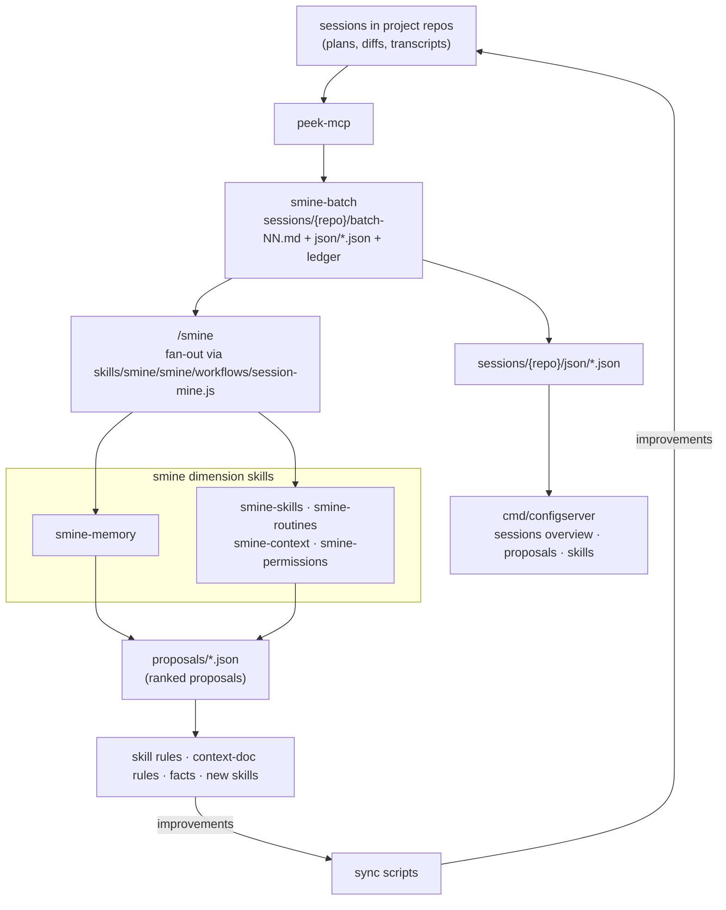
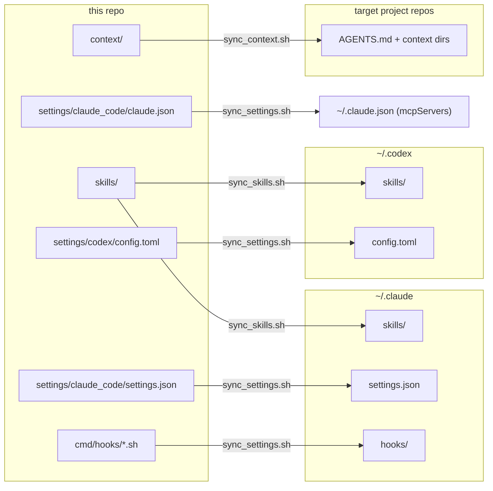
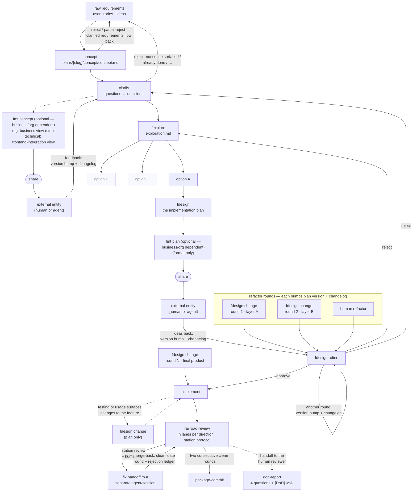
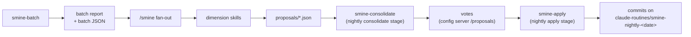

# smine

**smine (Session Mine)** — an evidence-based improvement loop for Claude Code and Codex:
mine your own past sessions for actionable findings — skill and workflow candidates, recurring
corrections, rule and doc drift, harness friction — turn them into skill rules and context docs,
and deploy them so the next session runs under
the improved instructions. The repo is the source of truth for that whole setup — skills, settings,
agent context files, hooks, and a web UI for reviewing proposals, managing routines and repos, and editing settings.
Nothing here is read in place — sync scripts deploy copies to `~/.claude` / `~/.codex` or into
target repos.

Two premises underpin the setup. Agents are only as good as the standing instructions they run under, and those
instructions rot when they live scattered across home directories — so everything lives here,
versioned and deployed. And the instructions are **evidence-based**: skill rules come out of a
retrospective loop over real sessions, not speculation — every rule worth having traces back to
something that actually went wrong (many carry their origin quote) or demonstrably worked.

## The feedback loop

1. Work happens in local Claude Code / Codex sessions in the actual project repos — plans, diffs, and transcripts accumulate there.
2. **peek-mcp** exposes the relevant session information (agent and user conversation, plan, diff and other metadata like touched files and used skills) to other agents via MCP (`skills/orchestration/peek`).
3. **Session mining**: `/smine` mines transcript batches for actionable findings — skill, workflow, and routine candidates, memory and context updates, rule and doc drift, harness friction, exemplars — then fans each batch out to multiple dimension skills; a consolidation stage cleans the proposal store afterwards. Every dimension produces ranked proposals under `proposals/`. Stages, flags, and artifacts: [smine pipeline](#smine-pipeline).
4. Accepted findings become skill rules, context-doc entries (e.g. a new typed entry in `context/actions/`), or whole new skills (`fexplore` originated from a retrospective) — via proposal votes in the config server and the nightly apply stage.
5. Sync deploys the updated skills/context — the next session runs under the improved rules.
6. Repeat.



## Installation (macOS)

- Download the source archive (`Source code (tar.gz)`) from the [latest release](https://github.com/kevinhorst/smine/releases/latest) and extract it to a folder of your choice — the folder's name and location are yours; the extracted tree is the install.
- `install.sh` — first initializes the folder as a standalone git repository (branch `main`, one initial commit, no remote) unless `.git` already exists, then installs [peek-mcp](https://github.com/kevinhorst/peek-mcp) ≥ 1.2.2 (`--no-peek` to skip), optionally serena (`--serena`), builds `bin/configserver`, materializes the routine plists from `routines/*/*.plist.template` (gitignored; edited later via the config server's Routines page), and runs the server as LaunchAgent `com.smine.configserver` on `:6001` (logs in `~/Library/Logs/`). Stop with `launchctl bootout gui/$(id -u)/com.smine.configserver` — launchd restarts the process after a plain `kill`.
- For the nightly routine (`routines/smine-nightly/`, the loop's primary driver): `brew install flock coreutils`, then write a token from `claude setup-token` to `~/.config/claude-routine/token` (0600) — or add labeled per-account tokens via the config server's Configure widget (`~/.config/claude-routine/tokens/<label>`, selected per routine via the Token setting). The config server auto-bootstraps the routine at startup; without the token a run exits 78 and does nothing. Operations manual: [routines/README.md](routines/README.md).
- Then run the [sync scripts](#sync-scripts) to deploy settings, skills, and context.
- One-shot seeding from the machine's session history: the Welcome page's Bootstrap button, or `bash cmd/bootstrap/run.sh` with `BOOTSTRAP_TOKEN_FILE` (and optionally `BOOTSTRAP_SINCE=YYYY-MM-DD` / `BOOTSTRAP_N`) — the wrapper stages style → mine → consolidate → apply → orchestrate as separate headless claude runs; `BOOTSTRAP_DRY_RUN=1` prints the stage commands without running anything.

The install dir is your own repository — it is not connected to this GitHub repo. To push it anywhere, add your own remote: `git remote add origin <url>`. Updates never run git for you; commit your local changes before updating.

### Multiple macOS profiles on one Mac

All user profiles share the machine's loopback port space, so every install needs its own port trio — otherwise the second profile's configserver finds the first profile's peek on the shared port and refuses it (the log names the foreign homes and the session column stays disabled rather than showing another user's sessions). Install per profile with explicit ports:

```bash
CONFIGSERVER_PORT=6002 PEEK_PORT=4243 PEEK_CONTROL_PORT=42443 ./install.sh
```

The resolved values are persisted to the gitignored `install.env`, so later plain `./install.sh` re-runs keep the profile's ports; environment variables always override the stored values. `PEEK_CLAUDE_HOME`/`PEEK_CODEX_HOME` optionally point the spawned peek at non-default agent homes. `install.env` also feeds `{{PEEK_CONTROL_PORT}}` in the settings template, so each profile's Claude Code exports telemetry to its own peek. Reinstalling is the peek update vector: install.sh kills this profile's running peek (never another profile's — it only sees your own processes) so the fresh configserver respawns the just-installed binary.

## Installation (Windows)

Quick start: download `smine-setup.exe` from the [latest release](https://github.com/kevinhorst/smine/releases/latest) and run it — the wizard lays down the full source tree and prebuilt binaries into the chosen folder (default `%USERPROFILE%\smine`) and delegates everything else to `configserver.exe -install`, which initializes the folder as a standalone git repository (no remote) when fresh; an existing install has its files updated in place — commit local changes first and review the update with `git status`. The setup exe is unsigned; SmartScreen may warn on first run — choose **More info → Run anyway**, or `Unblock-File smine-setup.exe` in PowerShell.

Prerequisites by install path:

| Path | Needs | Bundled / handled |
|---|---|---|
| `smine-setup.exe` | Git for Windows (wizard offers winget), a Claude runtime (see below) | Go not needed; jq.exe, peek-mcp.exe, all smine binaries ship in the installer; repo files ship in the installer |
| From source (`install.ps1`) | Git for Windows, Go, jq (installed via winget after a consent prompt) | builds the binaries itself, then delegates to `configserver.exe -install` |

The from-source path runs from the repo root via `.\install.bat` — a thin launcher that runs `install.ps1` under `-ExecutionPolicy Bypass` (a PowerShell script cannot lift the default `Restricted` policy itself). It forwards `-Addr`, `-PeekPort`, `-PeekControlPort`.

`configserver.exe -install` carries all shared install logic for both paths: it self-elevates once (`Register-ScheduledTask` needs an elevated token; the registered task itself runs at logon as your plain user), locates Git Bash, resolves a Claude runtime, registers `%LOCALAPPDATA%\smine\bin` on your User PATH, syncs settings/hooks/skills, and registers the logon task.

Claude runtime: **Claude Desktop or the claude CLI** (native installer or npm). A `claude` already visible from Git Bash wins; otherwise the installer deploys a shim at `%LOCALAPPDATA%\smine\bin\claude` that re-resolves Claude Desktop's bundled `claude.exe` at each call — Desktop updates need no re-install. Neither found is a warning, not an error: the install completes and routines simply won't run until a runtime appears. Log off and back on (or restart the config server) once, so the routine runtime picks up the new PATH entry. `install.ps1` prompts once for the routine OAuth token (from `claude setup-token`) and writes it to `%USERPROFILE%\.config\claude-routine\token`; skipping leaves routines exiting 78 until the file exists.

Git Bash is the one supplied by Git for Windows — no WSL. The server and routine wrapper run fully detached (windowsgui subsystem — no console window, no Quick-Edit freezes). Logs: `%LOCALAPPDATA%\claude-routine\logs\` — `configserver.log` for the server, `<routine label>.out.log`/`.err.log` per routine. Follow live with `Get-Content <log> -Wait`.

The install dir is your own repository — it is not connected to this GitHub repo. To push it anywhere, add your own remote: `git remote add origin <url>`. Updates never run git for you; commit your local changes before updating.

## Sync scripts

One direction only — the repo is the source of truth, nothing is read in place:



- `cmd/sync/sync_settings.sh` — `settings.json` → `~/.claude/`, `config.toml` → `~/.codex/` (codex MCP servers ride along inside), hooks → `~/.claude/hooks/`. Merges `mcpServers` from `settings/claude_code/claude.json` into `~/.claude.json` additively — repo wins per server, everything else untouched. `--serena` configures serena in the deployed settings.
- `cmd/sync/sync_skills.sh` — skills → `~/.claude/skills/` and `~/.codex/skills/`, agent definitions → `~/.claude/agents/`. Offers per-directory pruning of skills gone from the repo.
- `cmd/sync/sync_context.sh` — deploys the context into a target repo: expands the `AGENTS.md` template, syncs baseline actions + rules guides through `cmd/rules filter` (entries whose `Reach:` does not cover the target and unselected-language entries never ship), ships the reach-covered gate slice via `acdsl dist` (rules, registry subset, prebuilt `bin/acdsl` + verifier binaries — the deployed read hook activates automatically), copies selected language guides, and generates the target's `context.json` (entries + aspects) with the per-target settings in its `deploy` section — so re-syncs are non-interactive. Never touches repo-owned content (`facts/`, overlay actions, `registry.local.json`). Flags: `--context-dir`, `--langs`, `--role`, `--no-prose`, `--acdsl|--no-acdsl`, `--symlink|--no-symlink`.

## global-context hook

`cmd/hooks/global-context.sh` runs on `SessionStart` and `SubagentStart` (wired in
`settings.json`) and injects always-read global content — things every session needs
that belong neither in `CLAUDE.md`/`AGENTS.md` nor in a skill's context: declaration.
Content lives in `<context-dir>/global/*.md` (e.g. company facts); the hook is silent
when the directory is absent or empty. Because `SessionStart` hooks have no matcher
granularity, the script has its own kill switch (`GLOBAL_CONTEXT_ENABLED` in
`~/.claude/hooks/global-context.env`):

```
~/.claude/hooks/global-context-toggle.sh        # toggle
~/.claude/hooks/global-context-toggle.sh off    # disable injection
~/.claude/hooks/global-context-toggle.sh on     # enable injection
```

No `settings.json` edit or session restart needed; the hook entry stays wired but inert.

## Layout

| Path | Contents |
| :--- | :--- |
| `skills/` | Skill definitions (`<name>/SKILL.md` + optional reference files and bundled `workflows/` scripts). Directory name = skill name. Structure: [skills/README.md](skills/README.md). |
| `settings/claude_code/settings.json` | Claude Code settings (permissions allowlist, hooks, model). |
| `settings/codex/config.toml` | Codex CLI config. |
| `context/` | Agent context deployed into target repos — and this repo's own: the `AGENTS.md` template, `actions/` (typed `ACTION-*` entries), `rules/` (`RULE-*` guides), `facts/` (repo-owned `FACT-*` entries), generated `context.json`. Entry taxonomy: [context/actions/README.md](context/actions/README.md). |
| `acdsl/` | ACDSL rule corpus: `rules.acdsl`, `registry.json`, per-rule pass/fail testdata. See [ACDSL](#acdsl). |
| `cmd/hooks/` | Hook scripts deployed to `~/.claude/hooks/` (see above). |
| `cmd/sync/` | Deployment scripts (see above). |
| `cmd/worktrees/` | Helpers for parallel agent work in git worktrees: sync target branch into `claude/*` worktrees, print status, force-remove agent worktrees. |
| `cmd/configserver/`, `internal/` | Go web app to toggle hooks, permissions, env, model, and MCP servers in `~/.claude/settings.json`; apply permission rules from rendered docs. |
| `routines/` | Scheduled `claude -p` routines (one contract subdir each) + packaging templates. Operations manual: [routines/README.md](routines/README.md). |
| `sessions/` | Retrospective output: one folder per connected repo (plus `default/` for repo-less sessions, `archived/` for archived folders): batch reports + per-dimension `analyzed-*.txt` ledgers, batch JSON summaries (`<repo>/json/`); cross-repo ranked proposals live in `proposals/`. |
| `evals/` | Skill eval results (`<skill>-<date>/eval.json`, skillroutine-eval schema) and their run artifacts. |
| `docs/` | ACDSL spec ([acdsl-spec.md](docs/acdsl-spec.md)) and Go tooling notes, [telemetry decision record](docs/telemetry.md), workflow-problem [checklist](docs/checklist.md). |

## ACDSL

ACDSL (agent-checkable DSL) makes repo conventions machine-verifiable. Rules live in
`acdsl/rules.acdsl`; during a session they are projected into governed files as header blocks
(stripped before commit — a check gate refuses staged projection blocks), and every rule carries
pass/fail fixtures that run in `make test`. `sync_context.sh` ships the reach-covered gate slice
(rules, registry subset, prebuilt `bin/acdsl` + verifier binaries) into target repos, where the
deployed read hook activates it automatically. Spec: [docs/acdsl-spec.md](docs/acdsl-spec.md);
CLI and verifiers: [docs/acdsl-go-tools.md](docs/acdsl-go-tools.md); corpus: [acdsl/README.md](acdsl/README.md).

## Skill map

Single source of truth for skill ordering and hand-offs. Each skill's own `## When to use` section carries only its one-line position and links here. Plan presentation rules for all planning skills live in [context/rules/plan.md](context/rules/plan.md): section order, stacked table cells, in-plan Q&A (OPEN decision rows, never popups), changelog, mode-invariant code.

### Planning chain

Ordering doctrine — violating it has invalidated approved plans:

```
idea (optional) → concept → clarify → fexplore → fdesign (+ change and refine routes) → (merge-risk, optional) → fimplement → package-commit
```



| Step | Skill | What it does | Artifact out |
| :--- | :--- | :--- | :--- |
| 0 | `idea` *(optional)* | Pre-concept stress-test or possibility mapping of a half-formed idea; a dead idea terminates the chain | `plans/{slug}/idea/idea.md` on close |
| 1 | `concept` | Draft the concept / user stories; already a filter — reject or partial reject, clarified requirements flow back to the raw requirements | `plans/{slug}/concept/concept.md`, `user_stories.md`, design pages |
| 1b | `fmt concept` *(optional)* | Audience renderings of the concept (business = strip technical, frontend-integration, …), no content change; share feedback pipes back into `clarify` with version bump + changelog | shared rendering |
| 2 | `clarify` | Drain open questions into binding decisions (`[USER]` vs `[BUSINESS]` routing, source-requirements diff); can reject back to the raw requirements. `concept` chains straight into it when questions remain | same files, Open Questions drained into Decisions |
| 3 | `fexplore` *(optional — solution space open/contested)* | Survey ALL sensible solutions constraint-first; exactly one option enters `fdesign`, the rest stay documented but discarded | `plans/{slug}/design/exploration.md` |
| 4 | `fdesign` | The implementation plan: anchored facts, decisions, diffs, tests, stop conditions; familiarity modes `unfamiliar \| familiar \| owned`, optional `caveman` style | `plans/{slug}/design/raw.md` — the binding contract |
| 4b | `fdesign refine` | Driver-by-driver revision pre-implementation; delta in chat + Changelog + `⟲` rev-markers; loops per round, can reject back to explore or clarify keeping everything learned | `design/refined.md` (supersedes raw, gate re-passed) |
| 4c | `fdesign change` | Any change to an existing feature (see below) | `design/change-<topic>.md` |
| 4d | `fmt plan` *(optional)* | Format migration + familiarity up-conversion, no content change | reformatted plan |
| 5 | `fimplement` | Execute the approved plan as a binding contract | working, committed code |
| 6 | `package-commit` | Per-package (or per-file) build/test/commit, dot-notation messages | validated commits |

On `fdesign change` and the side branches:

- `fdesign change` covers everything from post-implementation tweaks to full restructurings, migrations, and consolidations; impact is classified in the plan (behavior-preserving | behavioral | contract-touching), never pre-classified by the user; same rigor and downstream, no concept/explore stages upstream.
- It is the post-implementation loop target: implementation → verification → `fdesign change` (plan) → `fimplement` → `package-commit`.
- `merge-risk` — optional read-only check between steps 4 and 5: lists other recent sessions on the same repo (via peek-mcp) whose diffs or plans touch the plan's files, so a collision is seen before implementation starts.
- `fmt skill` migrates a skill body to entries — content unchanged — and is the precondition for per-entry evals.

### smine pipeline



| Step | Skill | Artifact out |
| :--- | :--- | :--- |
| 1 | `smine` | Runs the whole retrospective — mine then fan-out — via the `session-mine` workflow |
| 2 | `smine-batch` | `sessions/<repo>/*batch-NN.md` + `sessions/<repo>/json/<batch>.json` + ledger (stage 1: transcript mining + batch JSON) |
| 3a | `smine-memory` | `proposals/context.json` (fact-surface groups; runs after 3d — shared file) |
| 3b | `smine-skills` | `proposals/skills.json` |
| 3c | `smine-routines` | `proposals/routines.json` |
| 3d | `smine-context` | `proposals/context.json` |
| 3e | `smine-permissions` | `proposals/permissions.json` (allowlist-addition proposals from batch permission grants) |
| 3f | `smine-consolidate` | proposals-store cleanup (dedup, re-home, presentation, schema/audit gate); smine-nightly consolidate stage between fan-out and apply |
| 4 | `smine-apply` | consumes the votes sidecar; dispositions + implementations committed on `claude-routines/smine-nightly-<date>` by the smine-nightly wrapper's apply stage |

`/smine` is the default route — it mines and fans out; `/smine --no-batch` routes already-mined batches, `/smine --no-<dimension>` skips a dimension, `--max-proposals-per-dimension` / `--max-proposals-mined` cap nightly production. A dimension skill runs standalone only when a single dimension on one batch is wanted; `/smine-batch` is the raw miner alone. Each dimension keeps its own `analyzed-*.txt` ledger (historical filenames, unchanged).

#### Cost

Empirical numbers from ~30 days of nightly runs (all on Opus 4.8, medium reasoning effort): a full smine run analyzing 10 sessions (500-800k token context window per session, delivered via peek-mcp) averages **$10–15** in API-equivalent pricing.
A $5 routine budget failed consistently; $15 usually went through. As of 2026-08-23 that maps to a Team Premium plan's 5-hour usage window — a standard Team seat was not enough.
It is advised to run the smine routine at a window where usage is usually low, so it does not interfere with day to day work or other routines.

The Goal in v1.2 is to deliver a detailed usage breakdown and bring the cost down significantly.

### Standalone skills

No fixed chain position; invoked on demand:

| Skill | Purpose |
| :--- | :--- |
| `diagnose-debug` | Verified root-cause diagnosis before any fix |
| `spec-drift` | Read-only drift report — doc mode diffs a doc set against the code, contract mode classifies every consumer of one changed contract with a fix order |
| `railroad-review` | Multi-agent station-protocol review over any scope (committed range or uncommitted snapshot) |
| `dod-report` | Reviewer-handoff DoD report — why/validated/tested plus a `[DoD]`-marked entry walk; downstream of `railroad-review`, standalone-capable |
| `code-verdict` | Problem-or-fine verdict on scoped existing code; alternatives only on a confirmed problem, escalates to `fexplore` when feature-level |
| `support-decision` | Read-only adjudication of an external position against the actual code/spec |
| `fimpact` | Per-axis change evaluation (maintainability, security, business impact, …) |
| `coverage-increase` | Coverage gaps → gated brief → tests; hands off to `package-commit` |
| `dev-stack` | Local e2e dev stacks (docker-compose + Makefile + seeded data) |
| `merge-resolve` | Merge diverged branches by resolving all conflicts once at final-tree level; any conflicted integration (failed cherry-pick chains, mid-rebase) normalizes into this flow |
| `merge-risk` | Read-only overlap check against other recent sessions' diffs/plans (peek-mcp); optional between `fdesign` and `fimplement` |
| `parallelize` | Matrix bake-off of one skill across model/effort/arg-variant/replica cells; fronts the parallelize workflow |
| `skillroutine-create` | Skill authoring and routine scaffolding, one arg-routed `skill\|routine` |
| `skillroutine-eval` | Score skill runs on self/context/output axes; matrix mode fronts the parallel-eval pipe; headless counterpart is the `skill-eval` routine |
| `investigate` | N independent investigations of one question, primary-source re-verification, merged baseline + refuted-hypotheses register |
| `delegate` | Explicit-only delegation of one eligible skill to a cheaper runner; owns the whole mechanism, skills only declare eligibility |
| `close` | End-of-session cleanup: removes the session's pool worktree and `claude/*` branch, safety-gated; success kills the session |
| `peek` | Show another session — conversation, plan, diff |
| `jq` / `xlsx` | Cheap JSON extraction / spreadsheet work — mainly for agent use (the `no-human` skill package, rarely invoked by a human) |
| `caveman` | Terse output style modifier the planning skills delegate to minimal .md stolen from [caveman](https://github.com/juliusbrussee/caveman)|

### Composition (workflow piping)

Three primitives, all harness-native:

1. **Skill fronts workflow** — SKILL.md resolves intake, the session calls the Workflow tool on a script in the skill's directory (`parallelize`, `investigate`, `smine`, `skillroutine-eval` matrix mode, `delegate`).
2. **Workflow nests workflow** — `workflow({scriptPath}, args)` runs another workflow inline, sharing budget and concurrency; one nesting level only. The pipe primitive.
3. **Workflow runs skill** — an `agent()` stage whose prompt invokes the Skill tool and follows it unattended.

Pipe doctrine:

- A pipe is a thin workflow script in the **consumer** skill's `workflows/` dir: nest A's workflow via `workflow()`, adapt its structured return to B's input contract in pure JS, run B via an agent stage.
- Paths a pipe needs travel in `args` — workflow scripts have no filesystem or env access.
- One nesting level means pipes are never piped: a longer chain is one pipe script calling its children sequentially.

First instance: `skillroutine-parallel-eval` ([parallel-eval.js](skills/skillroutine/skillroutine-eval/workflows/parallel-eval.js)) — nests parallelize for a sandboxed multi-model fan-out, copies surviving artifacts out of the cell worktrees, writes the eval manifest, scores every run with skillroutine-eval.

## configserver

Go + htmx web app on `:6001` that reads/writes `~/.claude/settings.json` and reads the repo artifacts the loop produces — ranked proposals, batch JSON summaries, skills (see the feedback-loop diagram above).

```
make serve          # build and run on :6001 against ~/.claude/settings.json
make build          # build to ./bin/configserver
make test           # run tests (race detector on)
make audit          # fast gate: mod verify + vet + acdsl gates + tests (no race detector)
make audit-full     # release gate: audit + race tests + cmd/tests shell suite
```

### Repos, routines, skill analytics

Beyond the config editors the server manages multi-repo worktrees, launchd routines, and per-skill analytics. Flags (cwd-relative defaults):

| Flag | Default | Purpose |
|---|---|---|
| `-repos` | `repos.json` | repo registry file (machine-specific, gitignored) |
| `-routines` | `routines` | routines directory (one contract subdir per routine; `routines/_templates/` holds the packaging templates) |
| `-evals` | `evals` | eval results root (`evals/<skill>-<date>/eval.json`, /skillroutine-eval schema) |
| `-examples` | `examples` | skill examples root |
| `-worktree-scripts` | `cmd/worktrees` | worktree scripts dir (made absolute at boot) |
| `-context` | `context` | context source root shown on the Context page (`/context`: browse the docs, sync them into a target repo via `sync_context.sh`, with a native folder picker) |
| `-peek-port` | `4242` | peek-mcp HTTP port; `0` disables peek entirely |
| `-peek-control-port` | `42442` | peek-mcp control dashboard + OTLP receiver port (peek's canonical base); `0` disables the dashboard |
| `-peek-start` | `true` | spawn peek-mcp when nothing serves the port; a listener is reused only when its `/healthz` identity matches this profile's homes, anything else disables the peek integration with a logged error |
| `-peek-bin` | `peek-mcp` | peek-mcp binary, resolved via PATH |
| `-claude-home` | `~/.claude` | claude home passed to the spawned peek-mcp |
| `-codex-home` | `~/.codex` | codex home passed to the spawned peek-mcp |

`repos.json` format:

```json
{
  "repos": [
    { "name": "smine", "path": "/absolute/path/to/smine" }
  ]
}
```

Session liveness comes from peek-mcp (v1.0.7+) as MCP client over Streamable HTTP at `127.0.0.1:<peek-port>/mcp` — the server spawns the binary itself unless one is already serving, so a standalone `peek-mcp start` is no longer needed. The spawn passes `--back-link` with the config server's own address (peek's dashboard nav then links back here as "Hub"; older peek binaries without the flag fail to start — keep peek current). If peek is down, the session column degrades; pages keep rendering.

Claude Code telemetry (peek v1.2+): the settings template (`settings/claude_code/settings.json`) carries the OTLP export env (`CLAUDE_CODE_ENABLE_TELEMETRY`, endpoint `http://127.0.0.1:{{PEEK_CONTROL_PORT}}/otlp`, expanded from `install.env`, default 42442) and `sync_settings.sh` deploying it **is** the setup step — never run `peek-mcp setup` on a managed machine; the template is the single source of truth and matches what setup would write byte-for-byte. The receiver is the configserver-spawned peek's control server (`-peek-control-port`, default 42442 = peek's canonical base); per-session peeks run `--control-port=0` in both fragments so they never contend for the port. Drift (e.g. after a peek version bump) surfaces through peek's own detector: startup log, `/stats`, and `session_events` `time.telemetry` report `misconfigured` with the expected values.

### Telemetry & usage analytics

Decision record from the 2026-07-22 investigation: [docs/telemetry.md](docs/telemetry.md). Short version — spend overview ("how much did I use") adopts the native ccusage binary (planned for version 1.2), nothing in-house; skill/tool efficacy ("is serena better than Grep") uses Claude Code's native OTel events received by the config server; transcripts (peek/smine) keep historical backfill and sequence analysis.

### Routines

Routines wrap `claude -p` in launchd jobs: copy `routines/_templates/` into `routines/<name>/`, rename the plist to the label, edit the marked spots (or author one via `/skillroutine-create`). The wrapper requires `flock` and `timeout` (`brew install flock coreutils`). First real routine: `routines/smine-nightly/` — headless `/smine --nightly` at 03:00 followed by an apply stage when proposal votes are pending (two stages, one publish), non-bare against the shared `~/.claude` (skills, peek-mcp, allowlist), auth via `CLAUDE_CODE_OAUTH_TOKEN` sourced from `~/.config/claude-routine/token` (0600, written from `claude setup-token`, never committed). Its plist ships as a `.plist.template`; `install.sh` materializes the real, gitignored plist. Operations: [routines/README.md](routines/README.md).

## Releases

Tagged releases (`v*.*.*`) run through GitHub Actions ([.github/workflows/ci.yml](.github/workflows/ci.yml)), gated on the test job:

- **darwin** — arm64 and amd64 binaries (`smine-configserver-*` and siblings) published as release assets; `make build-release GOOS=darwin GOARCH=arm64 VERSION=x.y.z` builds them locally into `bin/release/`.
- **windows** — the same job cross-builds the windows payload (`configserver.exe`, `routinewrap.exe`, `acdsl.exe`, `rules.exe`, every verifier binary) and fetches pinned third-party payloads (`jq.exe`, `peek-mcp.exe`); a windows job then compiles `smine-setup.exe` from [installer/windows/smine.iss](installer/windows/smine.iss) with Inno Setup and attaches it to the same release.

`make installer-check` compiles the installer script against a dummy payload via a dockerized `iscc` — run it before touching the installer or CI, so a tag run is never the first compile.

## License

MIT — see [LICENSE](LICENSE).
