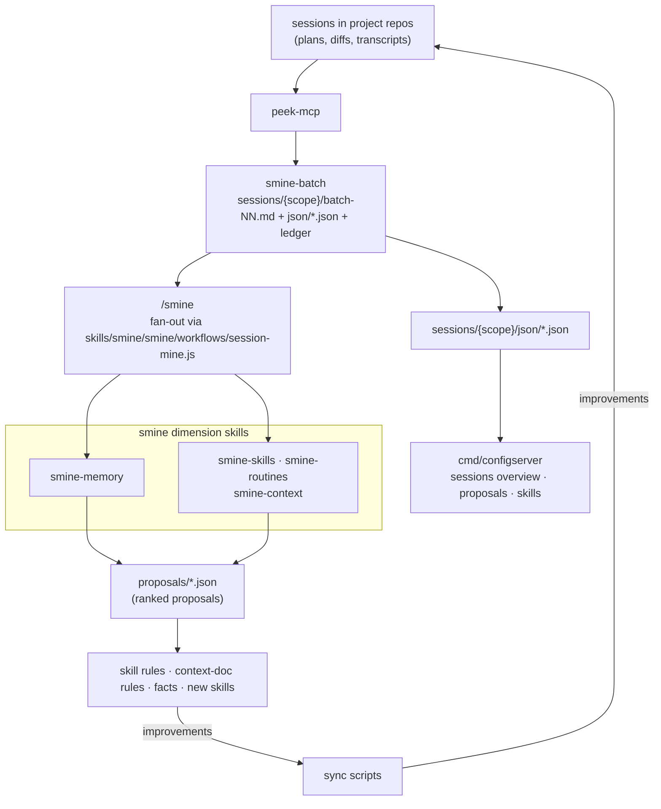
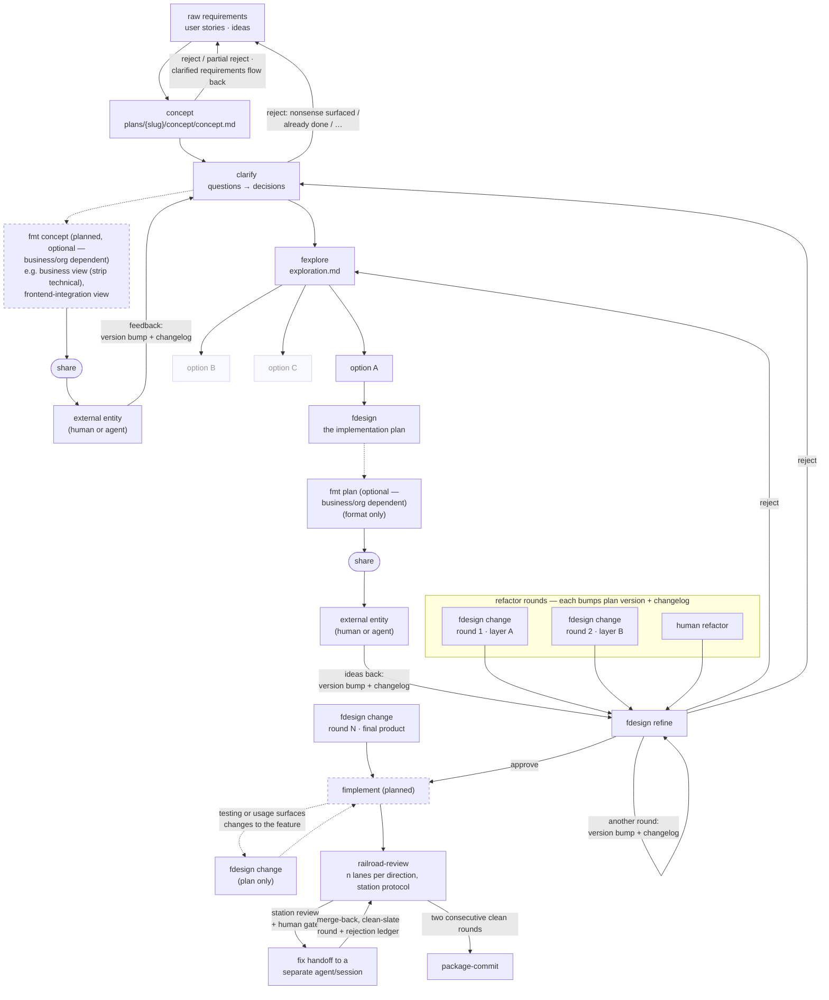
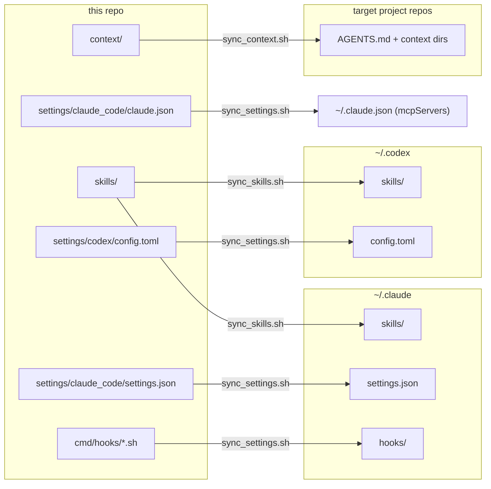

# smine

**smine (Session Mine)** — an evidence-based improvement loop for Claude Code and Codex:
mine your own past sessions for agent mistakes, user corrections and workflow patterns, turn the
findings into skill rules and context docs, and deploy them so the next session runs under
the improved instructions. The repo is the source of truth for that whole setup — skills, settings,
agent context files, hooks, and a small web UI for reviewing proposals and toggling settings.
Nothing here is read in place — sync scripts deploy copies to `~/.claude` / `~/.codex` or into
target repos.

## The idea

- Agents are only as good as the standing instructions they run under, and those instructions rot when they live scattered across home directories. Everything lives here, versioned, and gets deployed.
- The instructions are **evidence-based**: skill rules come out of a retrospective loop over real sessions, not speculation. Every rule worth having traces back to something that actually went wrong (many carry their origin quote) or demonstrably worked.

## The feedback loop (how we got here)

1. Work happens in local Claude Code / Codex sessions in the actual project repos — plans, diffs, and transcripts accumulate there.
2. **peek-mcp** exposes those sessions (turns, plan, diff) to other sessions, so one session can read what another did (`skills/orchestration/peek`).
3. **Session Mining** (s)mine the transcripts for agent mistakes, user corrections, workflow shapes, and frustration signals.
   - This started as ad-hoc analysis and was then formalized into `skills/smine/`, which mines a session batch (emitting the batch markdown **and** its machine-readable JSON per batch under `sessions/<scope>/json/`) and then fans each batch out to the four dimensions (`smine-memory`, `smine-skills`, `smine-routines`, `smine-context`)
   - every dimension lands as ranked proposals under `proposals/` (or gets auto-applied if active) — the memory dimension proposes facts into `proposals/context.json` targeting context docs, never auto-memory
   - Each dimension keeps its own `analyzed-*.txt` ledger.
   - `/smine --no-batch` routes already-mined batches; `/smine --no-<dimension>` skips one;
   - `--max-proposals-per-dimension` / `--max-proposals-mined` cap nightly production
5. Findings land here: as skill rules, as context-doc rules (e.g. a new typed entry in `context/actions/`), or as whole new skills (`fexplore` came out of retrospective batch 19).
6. Sync deploys the updated skills/context — the next session runs under the improved rules.
7. Repeat.



## Layout

| Path | Contents |
| :--- | :--- |
| `skills/` | Skill definitions (`<name>/SKILL.md` + optional reference files). Directory name = skill name. Structure: [skills/README.md](skills/README.md). |
| `settings/claude_code/settings.json` | Claude Code settings (permissions allowlist, hooks, model). |
| `settings/codex/config.toml` | Codex CLI config. |
| `context/` | Agent context deployed into target repos — and this repo's own context: `AGENTS.md` (template with `{{ROLE}}`), `actions/` (typed `ACTION-*` entries in activity chapters — `concepting.md` with the hot-class gates, `implementing.md` with stops/integrity, `reviewing.md` with the Definition of Done, `navigating.md`), `rules/` (`RULE-*` guides: `plan.md`, `commits.md`; add your own per-language guides — `rules/<lang>.md` files become selectable in `sync_context.sh`), `facts/` (this repo's `FACT-*` entries; target repos own theirs), and the generated `context.json` (every entry plus the UI-editable aspect taxonomy, machine-readable). |
| `cmd/hooks/` | Hook scripts deployed to `~/.claude/hooks/` (see below). |
| `cmd/sync/` | Deployment scripts (see below). |
| `cmd/worktrees/` | Helpers for parallel agent work in git worktrees: sync target branch into `claude/*` worktrees, print status, force-remove agent worktrees. |
| `cmd/configserver/`, `internal/` | Go web app to toggle hooks, permissions, env, model, and MCP servers in `~/.claude/settings.json`; apply permission rules from rendered docs. |
| `sessions/` | Retrospective output: batch reports + per-dimension `analyzed-*.txt` ledgers (`personal/`, `work/`), cross-scope ranked proposals (`proposals/`), batch JSON summaries (`<scope>/json/`). |
| `skills/<skill>/workflows/` | Workflow scripts (deterministic multi-agent orchestration), bundled with their fronting skill (see [skills/README.md](skills/README.md)). `skills/smine/smine/workflows/session-mine.js` mines transcripts and fans each batch out to the dimension skills. |
| `tests/` | Skill output artifacts for eyeballing rule changes (e.g. `tests/fdesign/`: the mode/caveman plan matrix). |
| `docs/checklist.md` | Running log of workflow problems and their status. |

## The planning skill family

Ordering doctrine — violating it has invalidated approved plans (authoritative map with hand-off artifacts: [Skill map](#skill-map) below). The diagram shows the **target workflow** — dashed nodes are planned skills that don't exist yet; the Skill map section stays authoritative for what exists today:



- `concept` — draft the concept document / user stories into `plans/`; already a filter — reject or partial reject (some stories hold, some don't), and clarified requirements flow back into the raw requirements
- `clarify` — drain open questions into binding decisions: `[USER]` vs `[BUSINESS]` owner routing, source-requirements diff; can reject back to the raw requirements (reasons are manifold — nonsense that only surfaced now, already done, …)
- `fmt concept` *(planned, optional — depends on the business/org situation and the requirements)* — reformat the concept for an audience (business = strip technical, frontend-integration, …) and share it; feedback pipes back into `clarify` with version bump + changelog
- `fexplore` — survey ALL sensible solutions before any design locks in; constraint-first; output `plans/{slug}/design/exploration.md`; exactly one option enters `fdesign`, the rest stay documented but discarded
- `fdesign` — the implementation plan: anchored facts, decisions, diffs, tests, stop conditions; familiarity modes `unfamiliar | familiar | owned`, optional `caveman` style
- `fdesign refine` — the fdesign route revising an existing plan driver-by-driver; delta reported in chat + plan Changelog + `⟲` rev-markers; loops on itself per round, and can reject back to explore or clarify — the restart keeps everything learned; refactor rounds (agent and human) apply here too, the plan carries enough code for it
- `fdesign change` — the fdesign route for any change to an existing feature: post-implementation adjustments, behavioral tweaks, contract changes, and behavior-preserving restructuring of any size; impact classified in the plan (behavior-preserving | behavioral | contract-touching), plan-only — `fimplement` executes; refactor rounds targeting different layers — applied to refined plans as well as the final product — each bump plan version + changelog, alongside human refactor rounds
- `fimplement` *(planned)* — execute the approved plan
- `commit` — per-package (or per-file) build/test/commit with dot-notation messages

Supporting skills: `diagnose-debug` (root cause before fix), `railroad-review` (convention review organized as directions — code-style, correctness, critical, data-integrity, contracts, tests, security, special-focus; solo mode walks them in one agent, railroad mode (default) fans out n lanes per direction, merges per direction and then into one station review, and iterates the station protocol — human gate, durable rejection ledger, fix handoff to a separate agent/session — until two consecutive clean rounds), `dev-stack` (local e2e stacks), `coverage-increase` (coverage gaps → gated brief → tests, same session), `smine`, `peek`, `jq` (cheap JSON extraction), `caveman` (terse output style the planning skills delegate to).

The smine pipeline mines and routes session batches (see feedback loop step 4): `smine` (pipeline front, Skill-fronts-Workflow), `smine-batch` (transcript miner → batch report), `smine-memory` / `smine-skills` / `smine-routines` / `smine-context` (ranked proposals; the memory dimension proposes facts into `proposals/context.json`, shared with `smine-context`). The batch JSON (schema-conformant) is emitted by `smine-batch` itself.

Plan presentation rules for all of them live in [context/rules/plan.md](context/rules/plan.md): section order, stacked table cells, in-plan Q&A (OPEN decision rows, never popups), changelog, mode-invariant code.

## Skill map

Single source of truth for skill ordering and hand-offs. Each skill's own `## When to use` section carries only its one-line position and links here.

### Planning chain

Ordering doctrine — violating it has invalidated approved plans:

```
idea (optional) → concept → clarify → fexplore → fdesign (+ change and refine routes) → (merge-risk, optional) → fimplement → package-commit
```

| Step | Skill | Artifact out | Feeds the next step as |
| :--- | :--- | :--- | :--- |
| 0 | `idea` *(optional — no commitment to a feature yet)* | `plans/{slug}/idea/idea.md` on close (dialogic session is the primary surface) | The surviving claim and tested assumptions the concept is drafted from; a dead idea terminates the chain |
| 1 | `concept` | `plans/{slug}/concept/concept.md`, `user_stories.md`, design pages | The concept the questions are drained from |
| 2 | `clarify` | Same files, Open Questions drained into Decisions | A stable concept — clarifying after plan approval invalidates decisions. `concept` chains straight into it in the same session when Open Questions remain |
| 3 | `fexplore` *(optional — solution space open/contested)* | `plans/{slug}/design/exploration.md` | Chosen option, recorded in the plan as a `[USER]` decision |
| 4 | `fdesign` | `plans/{slug}/design/raw.md` — the implementation plan; its `refine` route *(optional — drivers against the plan, pre-implementation)* updates `design/refined.md`, gate re-passed (refined supersedes raw); its `change` route writes `design/change-<topic>.md` for an implemented feature | The binding contract implementation follows |
| 5 | `fimplement` | Working, committed code | The approved plan run to completion as a binding contract |
| 6 | `package-commit` | Per-package validated commits | — |

`fdesign change` is the fdesign route for any change to an existing feature — post-implementation adjustments through full restructurings, migrations, and consolidations. Impact is classified in the plan (behavior-preserving | behavioral | contract-touching), never pre-classified by the user; same rigor, same downstream (`fimplement` → package-commit — fimplement consumes change plans too), no concept/explore stages upstream. It is also the post-implementation loop target: implementation → verification → `fdesign change` (plan) → `fimplement` → `package-commit`. `merge-risk` is an optional read-only check between step 4 and step 5: it lists other recent sessions on the same repo (via peek-mcp) whose diffs or plans touch the plan's files, so a collision is seen before implementation starts. `fmt plan` is a side-branch off step 4 (either route): format migration plus familiarity-mode up-conversion, no content change. `fmt concept` is the same side-branch off step 1: audience renderings, no content change. `fmt skill` migrates a skill body to entries — content unchanged — and is the precondition for per-entry evals.

### Analyze chain

```
smine (pipeline) = smine-batch → batch report + batch JSON → fan-out → dimension skills → proposals → smine-consolidate (smine-nightly consolidate stage) → votes (config server /proposals) → smine-apply (smine-nightly apply stage) → commits on claude-routines/smine-nightly-<date>
```

| Step | Skill | Artifact out |
| :--- | :--- | :--- |
| 1 | `smine` | Runs the whole retrospective — mine then fan-out — via the `session-mine` workflow |
| 2 | `smine-batch` | `sessions/<scope>/*batch-NN.md` + `sessions/<scope>/json/<batch>.json` + ledger (stage 1: transcript mining + batch JSON) |
| 3a | `smine-memory` | `proposals/context.json` (fact-surface groups; runs after 3d — shared file) |
| 3b | `smine-skills` | `proposals/skills.json` |
| 3c | `smine-routines` | `proposals/routines.json` |
| 3d | `smine-context` | `proposals/context.json` |
| 3e | `smine-consolidate` | proposals-store cleanup (dedup, re-home, presentation, schema/audit gate); smine-nightly consolidate stage between fan-out and apply |
| 4 | `smine-apply` | consumes the votes sidecar; dispositions + implementations committed on `claude-routines/smine-nightly-<date>` by the smine-nightly wrapper's apply stage |

`/smine` is the default route — it mines and fans out; `/smine --no-batch` routes already-mined batches, and `/smine --no-<dimension>` skips a dimension. A dimension skill runs standalone only when a single dimension on one batch is wanted; `/smine-batch` is the raw miner alone. Each dimension keeps its own `analyzed-*.txt` ledger (historical filenames, unchanged).

### Standalone skills

No fixed chain position; invoked on demand: `diagnose-debug` (diagnosis before any fix), `spec-drift` (read-only drift report — doc mode diffs a doc set against current code, contract mode enumerates and classifies every consumer of one changed contract with a recommended fix order; /diagnose-debug may hand off into contract mode; every finding hands off to a follow-up fix session), `railroad-review` (multi-agent station protocol over any scope — committed range or uncommitted snapshot), `skillroutine-create` (repo skill authoring and launchd routine scaffolding + bootstrap — one arg-routed skill|routine; the routine route is often downstream of the skill route or /smine-routines), `fimpact` (per-axis change evaluation), `support-decision` (read-only adjudication of an external position against a closed verdict question), `code-verdict` (problem-or-fine verdict on a scoped piece of existing code, alternatives evaluated only on a confirmed problem; escalates to /fexplore when the space turns out feature-level), `coverage-increase` (hands off to package-commit), `parallelize` (matrix bake-off of one skill invocation across model/effort/arg-variant/replica cells; fronts the parallelize workflow), `skillroutine-eval` (score skill runs on three axes — self: the skill's entry ids, context: the ids the run received, output: quality rules + metrics; matrix mode fronts the skillroutine-parallel-eval pipe workflow with a skill-variant dimension, nesting the parallelize workflow; the headless counterpart is the `skill-eval` routine — real `claude -p` cells with context on/off and skill-variant arms, then this skill in manifest mode), `investigate` (fan out N independent investigations of one open question, re-verify load-bearing claims against primary sources, merge into one baseline plus a refuted-hypotheses register; fronts the investigate workflow), `delegate` (explicit-only runner delegation: runs one eligible skill on a cheaper subagent; owns the whole mechanism — skills only declare eligibility in their Model section; unattended-safe targets run through its `delegate-run` workflow, gated targets on the Agent tool for the SendMessage relay), `dev-stack`, `peek`, `jq`, `xlsx`, `caveman` (style modifier the planning skills delegate to), `close` (explicit end-of-session cleanup: removes the current session's pool worktree and claude/* branch via remove_agent_worktrees.sh, safety-gated, never forced; success kills the session), `merge-resolve` (merge two diverged branches by resolving all conflicts once at final-tree level — any conflicted integration ask, including failed cherry-pick chains and mid-rebase state, is normalized into this one flow; verified by build, tests and parent diffs), `merge-risk` (read-only pre-implementation check — lists other recent sessions on the same repo whose diffs/plans overlap the current plan's files, via peek-mcp; optional between fdesign (any route) and fimplement).

### Composition (workflow piping)

How skills and workflows compose — three primitives, all harness-native:

1. **Skill fronts workflow** — the skill's SKILL.md resolves intake, the main session calls the Workflow tool with a `scriptPath` inside the skill's directory (`parallelize`, `investigate`, `smine`, `skillroutine-eval` matrix mode, `delegate` for unattended-safe targets).
2. **Workflow nests workflow** — `workflow({scriptPath}, args)` inside a script runs another workflow inline, deterministically, sharing budget and concurrency. One nesting level only. This is the pipe primitive.
3. **Workflow runs skill** — an `agent()` stage (`agentType: 'general-purpose'`) whose prompt invokes the Skill tool and follows it unattended (parallelize cells run their target skill this way; the `session-mine` workflow runs smine-batch and the dimension skills this way; the skillroutine-parallel-eval pipe runs skillroutine-eval this way).

**Pipe doctrine:** piping skill A's output into skill B is codified as a thin workflow script — nest A's workflow via `workflow()`, adapt its structured return to B's input contract in pure JS, run B via an agent stage. The pipe lives in the **consumer** skill's `workflows/` dir (the adapter produces the consumer's input contract; the consumer's SKILL.md is the trigger surface; sync deploys the script with the skill for free). Paths a pipe needs (sibling scripts, SKILL.md locations) always travel in `args` — workflow scripts have no filesystem or env access. Because nesting is one level deep, pipes are never piped: a longer chain is one pipe script calling its children sequentially.

First instance: `skillroutine-parallel-eval` (`skills/skillroutine/skillroutine-eval/workflows/parallel-eval.js`) — nests the parallelize workflow for a sandboxed multi-model fan-out, copies surviving artifacts out of the ephemeral cell worktrees, writes the eval manifest, and scores every run with skillroutine-eval.

## Installation (MacOS)
- **Fork the repository**
- `git clone` the fork
- `install.sh` — installs [peek-mcp](https://github.com/kevinhorst/peek-mcp) ≥ 1.0.7 (`--no-peek` to skip), optionally serena (`--serena`), builds `bin/configserver`, materializes the routine plists from `routines/*/*.plist.template` (gitignored; edited later via the config server's Routines page), and runs the server as LaunchAgent `com.smine.configserver` on `:6001` (logs in `~/Library/Logs/`). Stop with `launchctl bootout gui/$(id -u)/com.smine.configserver` — a plain `kill` gets restarted.
- For the nightly routine (`routines/smine-nightly/`, the loop's primary driver): `brew install flock coreutils`, then write a token from `claude setup-token` to `~/.config/claude-routine/token` (0600) — or add labeled per-account tokens via the config server's Configure widget (`~/.config/claude-routine/tokens/<label>`, selected per routine via the Token setting). The config server auto-bootstraps the routine at startup; without the token a run exits 78 and does nothing. Operations manual: [routines/README.md](routines/README.md).
- Then run the sync scripts below to deploy settings, skills, and context.

## Installation (Windows)

Quick start: download `smine-setup.exe` from the [latest release](https://github.com/kevinhorst/smine/releases/latest) and run it — the wizard clones the repo (default `%USERPROFILE%\smine`; an existing clone is fast-forward-updated), lays down prebuilt binaries, and delegates everything else to `configserver.exe -install`. The setup exe is unsigned; SmartScreen may warn on first run — choose **More info → Run anyway**, or `Unblock-File smine-setup.exe` in PowerShell.

Prerequisites by install path:

| Path | Needs | Bundled / handled |
|---|---|---|
| `smine-setup.exe` | Git for Windows (wizard offers winget), a Claude runtime (see below) | Go not needed; jq.exe, peek-mcp.exe, all smine binaries ship in the installer; repo cloned by the wizard |
| From source (`install.ps1`) | Git for Windows, Go, jq (installed via winget after a consent prompt) | builds the binaries itself, then delegates to `configserver.exe -install` |

The from-source path runs from the repo root via `.\install.bat` — a thin launcher that runs `install.ps1` under `-ExecutionPolicy Bypass` (a PowerShell script cannot lift the default `Restricted` policy itself). It forwards `-Addr`, `-PeekPort`, `-PeekControlPort`.

`configserver.exe -install` carries all shared install logic for both paths: it self-elevates once (`Register-ScheduledTask` needs an elevated token; the registered task itself runs at logon as your plain user), locates Git Bash, resolves a Claude runtime, registers `%LOCALAPPDATA%\smine\bin` on your User PATH, syncs settings/hooks/skills, and registers the logon task.

Claude runtime: **Claude Desktop or the claude CLI** (native installer or npm). A `claude` already visible from Git Bash wins; otherwise the installer locates Claude Desktop's bundled `claude.exe` (under `%LOCALAPPDATA%\Packages\Claude_*\…\claude-code\<version>\`) and deploys a shim at `%LOCALAPPDATA%\smine\bin\claude` as the Desktop fallback — the shim re-resolves the newest version at each call, so Desktop updates need no re-install. Neither found is a warning, not an error: the install completes and routines simply won't run until a runtime appears (codex-only machines get everything but routines). Log off and back on (or restart the config server) once, so the routine runtime picks up the new PATH entry. `install.ps1` prompts once for the routine OAuth token (from `claude setup-token`) and writes it to `%USERPROFILE%\.config\claude-routine\token`; skipping leaves routines exiting 78 until the file exists.

Git Bash (`bash.exe`) is the one supplied by Git for Windows — no WSL. After a fresh winget install, open a new terminal so the updated PATH is picked up, then re-run.

The server and routine wrapper run fully detached (windowsgui subsystem — no console window, no Quick-Edit freezes). Logs: `%LOCALAPPDATA%\claude-routine\logs\` — `configserver.log` for the server, `<routine label>.out.log`/`.err.log` per routine. Follow live with `Get-Content <log> -Wait`.

## Sync scripts

One direction only — the repo is the source of truth, nothing is read in place:



- `cmd/sync/sync_settings.sh` — `settings.json` → `~/.claude/`, `config.toml` → `~/.codex/` (codex MCP servers ride along inside), hooks → `~/.claude/hooks/`. Merges `mcpServers` from `settings/claude_code/claude.json` into `~/.claude.json` additively — repo wins per server, everything else untouched. `--serena` configures serena in the deployed settings.
- `cmd/sync/sync_skills.sh` — skills → `~/.claude/skills/` and `~/.codex/skills/`, agent definitions → `~/.claude/agents/`. Offers per-directory pruning of skills gone from the repo.
- `cmd/sync/sync_context.sh` — deploys the context into a target repo: expands the `AGENTS.md` template, syncs baseline actions + rules guides through `cmd/rules filter` (entries whose `Reach:` does not cover the target and unselected-language entries never ship), ships the reach-covered gate slice via `acdsl dist` (rules, registry subset, prebuilt `bin/acdsl` + verifier binaries — the deployed read hook activates automatically), copies selected language guides, and generates the target's `context.json` (entries + aspects) with the per-target settings in its `deploy` section — so re-syncs are non-interactive. Never touches repo-owned content (`facts/`, overlay actions, `registry.local.json`). Flags: `--context-dir`, `--langs`, `--role`, `--no-prose`, `--acdsl|--no-acdsl`, `--symlink|--no-symlink`.

## global-context hook

`cmd/hooks/global-context.sh` runs on `SessionStart` and `SubagentStart` (wired in
`settings.json`) and injects always-read global content — things every session needs
that belong neither in `CLAUDE.md`/`AGENTS.md` nor in a skill's context: declaration.
Content lives in `<context-dir>/global/*.md` (e.g. company facts); the hook is silent
when the directory is absent or empty. Because `SessionStart` hooks have no matcher
granularity, the script has its own kill switch (`GLOBAL_CONTEXT_ENABLED` in
`~/.claude/hooks/global-context.env`):

```
~/.claude/hooks/global-context-toggle.sh        # toggle
~/.claude/hooks/global-context-toggle.sh off    # disable injection
~/.claude/hooks/global-context-toggle.sh on     # enable injection
```

No `settings.json` edit or session restart needed; the hook entry stays wired but inert.

## configserver

Go + htmx web app on `:6001` that reads/writes `~/.claude/settings.json` and reads the repo artifacts the loop produces — ranked proposals, batch JSON summaries, skills (see the feedback-loop diagram above).

```
make serve          # build and run on :6001 against ~/.claude/settings.json
make build          # build to ./bin/configserver
make test           # run tests (race detector on)
make audit          # fast gate: mod verify + vet + acdsl gates + tests (no race detector)
make audit-full     # release gate: audit + race tests + cmd/tests shell suite
```

### Repos, routines, skill analytics

Beyond the config editors the server manages multi-repo worktrees, launchd routines, and per-skill analytics. Flags (cwd-relative defaults):

| Flag | Default | Purpose |
|---|---|---|
| `-repos` | `repos.json` | repo registry file (machine-specific, gitignored) |
| `-routines` | `routines` | routines directory (one contract subdir per routine; `routines/_templates/` holds the packaging templates) |
| `-evals` | `evals` | eval results root (`evals/<skill>-<date>/eval.json`, /skillroutine-eval schema) |
| `-examples` | `examples` | skill examples root |
| `-worktree-scripts` | `cmd/worktrees` | worktree scripts dir (made absolute at boot) |
| `-context` | `context` | context source root shown on the Context page (`/context`: browse the docs, sync them into a target repo via `sync_context.sh`, with a native folder picker) |
| `-peek-port` | `4242` | peek-mcp HTTP port; `0` disables peek entirely |
| `-peek-control-port` | `42442` | peek-mcp control dashboard + OTLP receiver port (peek's canonical base); `0` disables the dashboard |
| `-peek-start` | `true` | spawn peek-mcp when nothing serves the port |
| `-peek-bin` | `peek-mcp` | peek-mcp binary, resolved via PATH |

`repos.json` format:

```json
{
  "repos": [
    { "name": "smine", "path": "/absolute/path/to/smine" }
  ]
}
```

Session liveness comes from peek-mcp (v1.0.7+) as MCP client over Streamable HTTP at `127.0.0.1:<peek-port>/mcp` — the server spawns the binary itself unless one is already serving, so a standalone `peek-mcp start` is no longer needed. peek down → the session column degrades, pages keep rendering.

Claude Code telemetry (peek v1.2+): the settings template (`settings/claude_code/settings.json`) carries the OTLP export env (`CLAUDE_CODE_ENABLE_TELEMETRY`, endpoint `http://127.0.0.1:42442/otlp`) and `sync_settings.sh` deploying it **is** the setup step — never run `peek-mcp setup` on a managed machine; the template is the single source of truth and matches what setup would write byte-for-byte. The receiver is the configserver-spawned peek's control server (`-peek-control-port`, default 42442 = peek's canonical base); per-session peeks run `--control-port=0` in both fragments so they never contend for the port. Drift (e.g. after a peek version bump) surfaces through peek's own detector: startup log, `/stats`, and `session_events` `time.telemetry` report `misconfigured` with the expected values.

### Telemetry & usage analytics

Findings from the ccusage/peek/config-server investigation (2026-07-22, run `wf_296b23dd-776`; per-run artifacts and refuted-hypotheses register in the session scratchpad, decision summary below). Two distinct use cases emerged with two distinct answers.

**Source:** https://code.claude.com/docs/en/monitoring-usage

#### Use case 1 — spend overview ("how much did I use")

**Answer: adopt the native ccusage binary. Do not build.**

The "npx/bunx-only" premise is dead: ccusage v20 is a full Rust rewrite distributed as a zero-dependency native binary — bottled homebrew-core formula (`brew install ccusage`), nix, and npm platform packages whose tarball is plain-curl-able (Windows: extract `bin/ccusage.exe` from the `@ccusage/ccusage-win32-x64` registry tarball, no Node needed).

It already implements the correctness-critical parts:

- Dedup on `(message.id, requestId)` with sidechain-replay collapse — load-bearing: local transcripts repeat identical usage lines up to 5× (streaming rewrites), so naive summation over-counts.
- 5m/1h cache-write pricing (1h = 2× input), >200k tiered pricing.
- Embedded LiteLLM + models.dev pricing snapshots; `--offline` and `--json` on every report.

Report granularity: daily / weekly / monthly / per-session / 5h billing blocks, per-model (`--breakdown`), per-project (`--instances`, `-p`). Finest grain is the **session** — no per-skill or per-tool dimension exists or can exist there (usage lines carry no skill/tool tags; ccusage never reads message content).

Rejected directions (with refuting evidence, do not re-investigate):

| Direction | Why rejected |
| :--- | :--- |
| Reimplement in config server (Go) | ccusage is Rust — nothing vendorable; 3–5 days; second JSONL parser next to peek-mcp over the same files |
| Extend peek-mcp with pricing/cost | 2–4 days + permanent pricing-maintenance treadmill; the missing 60% (dedup, cache tiers, pricing) is exactly what ccusage ships |
| OTel **metrics** as spend source | OTLP/Prometheus/console exporters only, forward-only, zero backfill of existing history; `cost_usd` is a client-side estimate on the same basis ccusage computes |
| Third-party trackers (ccusage_go, claude-usage, CodeBurn, …) | all less maintained than upstream's own native binary |

Caveats: no transcript contains `costUSD` (field absent, 0 hits in 276 files) — every dollar figure anywhere is computed API-equivalent pricing, notional under subscription billing. Config-server integration shape, if wanted: a `/usage` page that execs `ccusage daily --json --offline` (existing shell-out tool-action pattern); ccusage stays the single source of truth.

#### Use case 2 — skill/tool efficacy ("is serena better than Grep")

**Answer: Claude Code's native OTel *events* (logs), received by the config server.**

ccusage covers the odometer, not the diagnostics port. The comparison data lives in the OTel event stream (verified against the monitoring docs, 2026-07-22):

- `claude_code.tool_result` — `tool_name`, `success`, `duration_ms`, `error_type`, `tool_input_size_bytes`, `tool_result_size_bytes`, `mcp_server_scope`. Per-tool success rate, latency, and context-cost, with MCP tools distinguished.
- `claude_code.tool_decision` — accept/reject per tool with decision source (`config`/`hook`/`user_permanent`/`user_temporary`/`user_reject`). Permission-friction stats; unobtainable from transcripts, and it keeps human wait time out of `duration_ms`.
- `claude_code.user_prompt` — `command_name`: skill invocations as first-class events; joined via the standard `session.id` attribute, per-skill segmentation becomes a join instead of transcript slicing.
- `claude_code.api_request` — per-request tokens, `duration_ms`, `cost_usd`; inter-event timing yields thinking-time vs tool-time.

Constraints: exporters are OTLP/console only — no file export, forward-only (no backfill). Integration shape: a minimal OTLP HTTP log-receiver endpoint in the config server (already a standing local process) flattening events to SQLite/JSONL, plus `CLAUDE_CODE_ENABLE_TELEMETRY=1`, `OTEL_LOGS_EXPORTER=otlp`, endpoint → localhost in settings env. Roughly a day of Go for the receiver; reporting pages on top separate.

What transcripts (peek/smine) still own: historical backfill and **sequence analysis** — retry chains, tool fallbacks (serena fails → Grep), post-skill rework. Complementary, not competing. Prerequisite if peek ever reports token numbers: its `TotalUsage` currently sums duplicated streaming lines — dedup on `(message.id, requestId)` must land first (latent bug, exists today).

#### Open verifications

1. `ccusage daily --json --offline` totals vs deduped jq ground truth (`group_by(message.id + "|" + requestId) | first`) — >0.1% divergence re-opens the decision.
2. `--offline` vs online pricing delta — >5% means the embedded snapshot lags; run online or pin a fresher binary.
3. Does `user_prompt.command_name` fire for Skill-tool invocations mid-conversation, or only typed slash commands? (`OTEL_LOGS_EXPORTER=console` smoke test.)
4. Do subagent/workflow tool events carry the parent `session.id`? (Same smoke test.)
5. Magnitude of peek-mcp `TotalUsage` over-count across the corpus (naive vs deduped sums).

### Routines

Routines wrap `claude -p` in launchd jobs: copy `routines/_templates/` into `routines/<name>/`, rename the plist to the label, edit the marked spots (or author one via `/skillroutine-create`). The wrapper requires `flock` and `timeout` (`brew install flock coreutils`). First real routine: `routines/smine-nightly/` — headless `/smine --nightly` at 03:00 followed by an apply stage when proposal votes are pending (two stages, one publish), non-bare against the shared `~/.claude` (skills, peek-mcp, allowlist), auth via `CLAUDE_CODE_OAUTH_TOKEN` sourced from `~/.config/claude-routine/token` (0600, written from `claude setup-token`, never committed). Its plist ships as a `.plist.template`; `install.sh` materializes the real, gitignored plist. Operations: [routines/README.md](routines/README.md).

## Releases

Tagged releases (`v*.*.*`) publish darwin arm64 and amd64 binaries (`smine-configserver-*` and siblings) via GitHub Actions; `make build-release GOOS=darwin GOARCH=arm64 VERSION=x.y.z` builds them locally into `bin/release/`.

## License

MIT — see [LICENSE](LICENSE).
