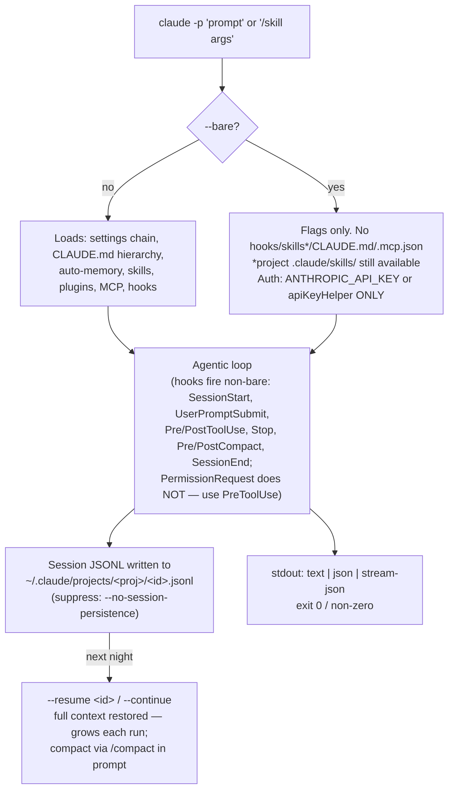
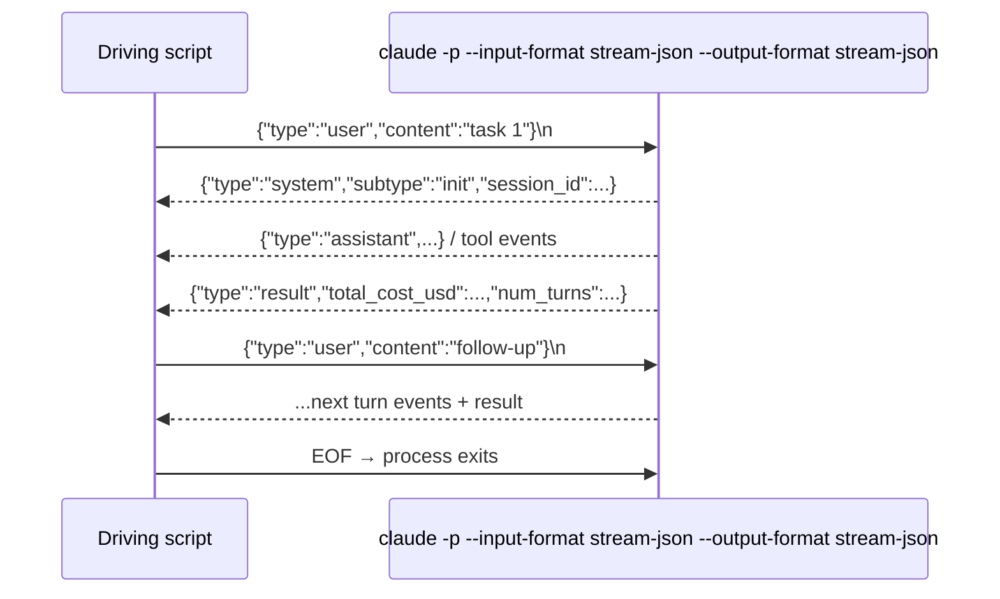

# Local Nightly Routines: `claude -p` Mechanics

Docs: [headless](https://code.claude.com/docs/en/headless.md), [cli-reference](https://code.claude.com/docs/en/cli-reference.md), [sessions](https://code.claude.com/docs/en/sessions.md), [auth](https://code.claude.com/docs/en/authentication.md), [settings](https://code.claude.com/docs/en/settings.md).

## Scheduling options (decision)

| Mechanism | Runs where | Survives sleep/app close | Min interval | Local files | Nightly fit |
|---|---|---|---|---|---|
| `/loop` (in-session) | open CLI session | no (unless backgrounded) | 1m, 7-day expiry, ≤30m jitter | yes | ✗ intra-session polling only |
| Desktop scheduled tasks | local, Desktop app | restart yes; needs app open + awake; 1 catch-up after wake | 1m | yes | ✓ if Desktop reliably open |
| **launchd + `claude -p`** | local, no app | yes | any | yes | ✓ true unattended |
| Cloud routines (`/schedule`) | Anthropic cloud | machine-independent | 1h | **no** | ✗ for local maintenance |

## `-p` run lifecycle



## Auth for headless

| Credential | Non-bare `-p` | `--bare` | launchd viability |
|---|---|---|---|
| Keychain OAuth (from `/login`) | works interactively | ignored | ✗ no keychain in launchd |
| `CLAUDE_CODE_OAUTH_TOKEN` (`claude setup-token`, 1-year) | **works** | **ignored** | ✓ best for subscription |
| `ANTHROPIC_API_KEY` | works | **required** | ✓ (API billing) |
| `apiKeyHelper` script (+`CLAUDE_CODE_API_KEY_HELPER_TTL_MS`) | works | works | ✓ vault-backed rotation |

Consequence: subscription-billed nightly jobs must run **non-bare** — which also gives you skills, hooks, and MCP.

## Key flags

| Flag | Use |
|---|---|
| `--output-format json` | result envelope: `session_id`, `total_cost_usd`, `usage`, `num_turns`, `structured_output` |
| `--json-schema <schema>` | enforced structured output |
| `--allowedTools` / `--disallowedTools` | tool allowlist (above settings rules, below managed) |
| `--permission-mode acceptEdits\|dontAsk\|bypassPermissions` | prompt-free baseline |
| `--permission-prompt-tool <mcp-tool>` | programmatic permission handler (v2.1.199+) — the headless answer to "ask" prompts |
| `--max-turns` / `--max-budget-usd` | depth cap / spend cap (both exit non-zero on hit) |
| `--fallback-model a,b` | ordered fallback on overload |
| `--resume <id>` / `--continue` | stateful jobs |
| `--input-format stream-json` + `--output-format stream-json` | multi-turn NDJSON protocol (below) |
| `--append-system-prompt-file` | inject routine instructions without touching CLAUDE.md |
| `--settings <file>` / `--mcp-config <file>` | per-routine config |

Permission precedence: managed settings > `--disallowedTools`/`--allowedTools` > `--permission-mode` > settings allow/deny/ask > default. Blocked tool ⇒ error fed back to Claude, run continues (no abort).

Skills: `claude -p "/skill args"` expands (v2.1.205+, skill needs `enable-model-invocation: true`).

## stream-json: local orchestration without the SDK



Envelope types: `system` (init, api_retry), `user`, `assistant`, `result`, `stream_event` (with `--include-partial-messages`, v2.1.205+). Full schema is **not officially documented** ([#24612](https://github.com/anthropics/claude-code/issues/24612) open) — pin the CLI version if you build on it.

## Robustness for launchd/cron

| Concern | Handling |
|---|---|
| Transient API errors (429/529/5xx) | auto-retried with backoff internally |
| Auth expiry | not retried — exits non-zero; 1-year `setup-token` minimizes |
| Exit codes | 0 / non-zero only, no per-error map; parse stderr + result subtype (`error_during_execution`, `error_max_turns`) |
| Run timeout | none built-in — wrap in `timeout(1)`; background-task grace via `CLAUDE_CODE_PRINT_BG_WAIT_CEILING_MS` (default 10m, v2.1.182+) |
| Overlap | `flock` wrapper |
| Cost | `--max-budget-usd` + log `total_cost_usd` per run via jq |
| Notification | ERR trap → terminal-notifier |
| launchd env | explicit PATH (`/opt/homebrew/bin`), HOME, no `~` expansion, StandardOut/ErrorPath logs, StartCalendarInterval |
| Stability | `DISABLE_AUTOUPDATER=1`, `DISABLE_TELEMETRY=1` |
| Isolation | `CLAUDE_CONFIG_DIR=/path/to/routine-home` — own settings, credentials, session store per routine |

## Template

```bash
#!/bin/zsh
export PATH="/opt/homebrew/bin:$PATH"
export CLAUDE_CODE_OAUTH_TOKEN="$(cat ~/.config/claude-routine/token)"
export CLAUDE_CONFIG_DIR="$HOME/.claude-nightly"
export DISABLE_AUTOUPDATER=1

exec flock -n /tmp/claude-nightly.lock timeout 3600 \
  claude -p "/smine --nightly" \
    --permission-mode acceptEdits \
    --max-budget-usd 5 \
    --output-format json \
  | jq -r '"\(.session_id) \(.total_cost_usd) \(.num_turns)"' \
  >> "$HOME/Library/Logs/claude-nightly.log"
```

launchd plist: `ProgramArguments` → this script, `StartCalendarInterval` Hour 3, log paths set. Non-bare deliberately: skills + subscription token need it.
