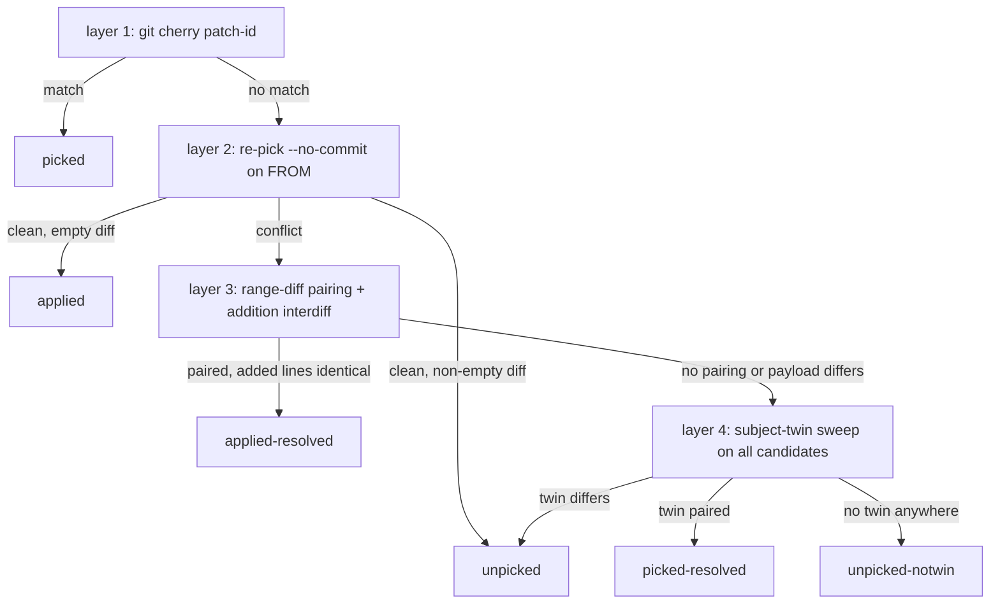

## file: cmd/worktrees/print_agent_worktrees_status.sh

#!/usr/bin/env bash
# [ACDSL-PROJECTION] 1 rule(s) govern this file — working-copy view, stripped before commit
# - [ACDSL-SHELL-002] Scripts launched by hooks or launchd run under macOS bash 3.2 — no declare -A, mapfile/readarray, case expansion, |&, or parameter transformation (the launchd lesson)

# State of every agent branch (claude/*, claude-routines/*) relative to the
# rest of the repo.
#
# Usage:
#   print_agent_worktrees_status.sh
#   print_agent_worktrees_status.sh <number|branch> <unpicked|ahead|behind>
#
# Without args, prints the overview table (each branch gets a #).
# With a row <number> or an agent branch name and a class, lists the
# individual commits for that branch.
#
# FROM      branch this one was created from, taken from the branch reflog
#           (remote-tracking origins show as e.g. origin/main). "unknown" when
#           the reflog records no resolvable origin — FROM is never guessed.
# DIRTY     modified files in the agent worktree ("-" = branch has no worktree)
# UNTRACKED untracked files in the agent worktree, excluding worktree
#           infrastructure and tool droppings (.idea/, .claude/,
#           .claude-worktree, .serena/, .DS_Store) — the same filter
#           remove_agent_worktrees.sh applies ("-" = no worktree)
# AHEAD     commits on the agent branch missing from FROM ("-" = FROM unknown)
# BEHIND    commits on FROM missing from the agent branch ("-" = FROM unknown)
# UNPICKED  ahead-commits whose patch is in NO non-claude branch AND whose
#           change neither the applied-probe (re-pick + range-diff on FROM)
#           nor the twin sweep (exact-subject commit paired by range-diff on
#           any candidate) could place — genuinely untransferred work
# VERDICTS  probe summary for commits missing from FROM by patch-id:
#           applied:<n> (clean empty re-pick on FROM), resolved:<n>
#           (conflicted re-pick on FROM paired by range-diff), and
#           picked-resolved:<n> (landed on a candidate as a subject twin with
#           manual conflict resolution — counted as picked, but a later merge
#           or re-pick of this branch will conflict against the resolved
#           version); "-" when nothing needed probing
# MERGED    the non-claude branch whose first-parent history contains a merge
#           commit that merged this branch's tip — an actual merge, never
#           containment; "-" when the tip was never merged (fast-forward or
#           cherry-pick transfers stay "-")
# IN        every non-claude branch that already contains ALL of this branch's
#           work (tip is an ancestor, or every ahead-commit is patch-present),
#           comma-separated, FROM first. A starred entry (X*) means
#           containment came from probe/twin verdicts (applied,
#           applied-resolved, picked-resolved) instead of exact patch-ids;
#           "-" = the work exists nowhere else
#
# Safe to remove: IN != "-" plus, when a worktree is checked out, DIRTY=0 and
# UNTRACKED=0. A branch without a worktree is judged on containment alone.
# (cmd/worktrees/remove_agent_worktrees.sh, internal/repos/status.go)
#
# Verdict cache: UNPICKED/VERDICTS/MERGED/IN are pure functions of the branch
# tip, its FROM, and the candidate tips — cached per branch under
# <git-common-dir>/agent-status-cache/, keyed by exactly those SHAs. DIRTY,
# UNTRACKED, AHEAD/BEHIND and LAST-COMMIT are always computed live.
# WORKTREE_STATUS_NO_CACHE=1 bypasses the cache (tests, diagnosis).

set -euo pipefail

source "$(dirname "$0")/_lib/verdict.sh"

# __row <num> is internal: one overview row, dispatched by the parent via
# xargs -P (requires WTS_WORKTREES and WTS_ROWDIR in the environment).
mode=overview
if [ "${1:-}" = "__row" ]; then
  mode=row
  row_num=${2:?__row needs a row number}
elif [ -n "${1:-}" ] && [ -n "${2:-}" ]; then
  mode=detail
  selected=$1
  selected_class=$2
fi

branches=()
while IFS= read -r b; do
  branches+=("$b")
done < <(git for-each-ref --format='%(refname:short)' \
  refs/heads/claude/ refs/heads/claude-routines/)

if [ ${#branches[@]} -eq 0 ]; then
  echo "No agent branches (claude/*, claude-routines/*) found."
  exit 0
fi

# All local branches that are not agent branches — the places where harvested
# work could live.
load_candidates

if [ ${#candidates[@]} -eq 0 ]; then
  echo "error: no non-claude branches found to compare against"
  exit 1
fi

# Prints the candidate branch whose first-parent history contains a merge
# commit with this branch's tip as a merged parent — an actual `git merge`,
# never mere containment (FROM first, then ref order). Fast-forwards and
# cherry-pick transfers leave no merge commit and print nothing.
merged_into() {
  local branch=$1 from=$2 tip i c
  tip=$(git rev-parse "$branch")
  while IFS= read -r i; do
    c=${candidates[$i]}
    if git rev-list --first-parent --merges --parents "$c" --not "$branch" |
        awk -v tip="$tip" 'BEGIN {found = 1}
          {for (i = 3; i <= NF; i++) if ($i == tip) found = 0}
          END {exit found}'; then
      echo "$c"
      return
    fi
  done < <(ordered_indices "$from")
}

if [ "$mode" = detail ]; then
  if [[ $selected == claude/* || $selected == claude-routines/* ]]; then
    branch=''
    for b in "${branches[@]}"; do
      if [ "$b" = "$selected" ]; then branch=$b; fi
    done
    if [ -z "$branch" ]; then
      echo "error: unknown branch $selected"
      exit 1
    fi
  else
    idx=$((selected - 1))
    if [ "$idx" -lt 0 ] || [ "$idx" -ge "${#branches[@]}" ]; then
      echo "error: #$selected is out of range (1-${#branches[@]})"
      exit 1
    fi
    branch=${branches[$idx]}
  fi
  from=$(resolve_from "$branch")

  case "$selected_class" in
    ahead | behind)
      if [ -z "$from" ]; then
        echo "error: origin of $branch is not recorded — FROM unknown, no $selected_class list"
        exit 1
      fi
      ;;
  esac

  case "$selected_class" in
    ahead)
      echo "Commits ahead on $branch vs $from:"
      git log --format='%h  %cd  %s' --date=format:'%Y-%m-%d %H:%M' "$from..$branch"
      ;;
    behind)
      echo "Commits behind on $branch vs $from:"
      git log --format='%h  %cd  %s' --date=format:'%Y-%m-%d %H:%M' "$branch..$from"
      ;;
    unpicked)
      echo "Commits on $branch found in no non-claude branch:"
      compute_cherry_sets "$branch"
      hashes=()
      while IFS= read -r hash; do
        hashes+=("$hash")
      done < <(unpicked_anywhere)

      if [ ${#hashes[@]} -eq 0 ]; then
        echo "(none)"
        exit 0
      fi

      # FROM unknown: no branch to probe cherry-picks against — plain list.
      if [ -z "$from" ]; then
        for hash in "${hashes[@]}"; do
          git log -1 --format='%h  %cd  %s' --date=format:'%Y-%m-%d %H:%M' "$hash"
        done
        exit 0
      fi

      # Verdict per hash from the shared lib; hashes patch-present on FROM
      # (not in its '+' set) are exact picks and need no probe.
      trap verdict_cleanup EXIT
      from_plus=$(git cherry "$from" "$branch" | sed -n 's/^+ //p')
      for hash in "${hashes[@]}"; do
        if ! printf '%s\n' "$from_plus" | grep -qx "$hash"; then
          git log -1 --format='%h  %cd  %s  (applied on '"$from"')' --date=format:'%Y-%m-%d %H:%M' "$hash"
          continue
        fi
        verdict_for "$hash" "$from"
        case "$verdict" in
          applied)
            git log -1 --format='%h  %cd  %s  (applied on '"$from"')' --date=format:'%Y-%m-%d %H:%M' "$hash" ;;
          applied-resolved)
            git log -1 --format='%h  %cd  %s  (applied on '"$from"', conflict resolved)' --date=format:'%Y-%m-%d %H:%M' "$hash" ;;
          picked-resolved)
            git log -1 --format='%h  %cd  %s  (picked on '"$verdict_candidate"' as '"$(git rev-parse --short "$verdict_twin")"', conflict resolved manually — not auto-reconcilable)' --date=format:'%Y-%m-%d %H:%M' "$hash" ;;
          unpicked)
            # A subject twin exists but range-diff refused to pair it: the
            # content genuinely differs from what landed there.
            git log -1 --format='%h  %cd  %s  (twin '"$(git rev-parse --short "$verdict_twin")"' on '"$verdict_candidate"' differs — content not transferred)' --date=format:'%Y-%m-%d %H:%M' "$hash" ;;
          unpicked-notwin)
            # Twin search exhausted: a transfer under a reworded subject, a
            # squash, or heavy modification is invisible to detection.
            git log -1 --format='%h  %cd  %s  (no twin on any local branch — reworded/squashed transfers are invisible; verify via git log --all --grep before treating as lost)' --date=format:'%Y-%m-%d %H:%M' "$hash" ;;
          *)
            git log -1 --format='%h  %cd  %s' --date=format:'%Y-%m-%d %H:%M' "$hash" ;;
        esac
      done
      ;;
    *)
      echo "error: unknown class '$selected_class' (use: unpicked, ahead, behind)"
      exit 1
      ;;
  esac
  exit 0
fi

# One overview row for branches[num-1], written to $WTS_ROWDIR/row-NNN so the
# parent can reassemble rows in branch order regardless of completion order.
print_row() {
  local num=$1 branch worktree dirty untracked porcelain raw_from from
  local ahead behind merged age tip from_tip cache_key cache_file cache_tmp
  branch=${branches[$((num - 1))]}
  worktree=$(awk -v b="refs/heads/$branch" \
    '/^worktree /{p=$2} $0=="branch "b{print p}' "$WTS_WORKTREES")

  dirty=-
  untracked=-
  if [ -n "$worktree" ]; then
    # printf '%s' (not '%s\n'): a clean worktree must feed grep zero lines,
    # not one empty line; grep still counts a final unterminated line.
    porcelain=$(git -C "$worktree" status --porcelain)
    dirty=$(printf '%s' "$porcelain" | grep -cv '^??' || true)
    untracked=$(printf '%s' "$porcelain" | filter_untracked)
  fi

  raw_from=$(resolve_from "$branch")
  if [ -n "$raw_from" ]; then
    from=$raw_from
    ahead=$(git rev-list --count "$from..$branch")
    behind=$(git rev-list --count "$branch..$from")
  else
    from=unknown
    ahead=-
    behind=-
  fi
  # Cache hit: the key line matches and the file is complete (5 lines) —
  # anything else recomputes and rewrites (a truncated file is a miss, and
  # the guarded read chain must never abort the child under set -e).
  tip=$(git rev-parse "$branch")
  from_tip=''
  [ -n "$raw_from" ] && from_tip=$(git rev-parse "$raw_from")
  cache_key="$tip|$raw_from|$from_tip|$WTS_CANDIDATES_DIGEST"
  cache_file="$WTS_CACHE_DIR/row-$(printf '%s' "$branch" | tr '/' '~')"
  if [ "${WORKTREE_STATUS_NO_CACHE:-0}" != 1 ] && [ -f "$cache_file" ] &&
      [ "$(head -1 "$cache_file")" = "$cache_key" ] &&
      [ "$(wc -l < "$cache_file")" -eq 5 ]; then
    { read -r _; read -r eval_unpicked; read -r eval_verdicts
      read -r eval_in; read -r merged; } < "$cache_file"
  else
    trap verdict_cleanup EXIT
    evaluate_branch "$branch" "$raw_from"
    merged=$(merged_into "$branch" "$raw_from")
    cache_tmp=$(mktemp "$WTS_CACHE_DIR/.tmp.XXXXXX")
    printf '%s\n%s\n%s\n%s\n%s\n' \
      "$cache_key" "$eval_unpicked" "$eval_verdicts" "$eval_in" "$merged" \
      > "$cache_tmp"
    mv -f -- "$cache_tmp" "$cache_file"
  fi
  if [ "${WORKTREE_STATUS_TRACE:-0}" = 1 ] && [ "$probe_count" -gt 0 ]; then
    echo "trace: $branch probes=$probe_count probe_ms=$probe_ms" >&2
  fi
  age=$(git log -1 --format='%cd' --date=format:'%Y-%m-%d %H:%M' "$branch")

  printf '%-4s %-36s %-16s %-6s %-9s %-6s %-7s %-9s %-20s %-16s %-24s %-16s %s\n' \
    "$num" "$branch" "$from" "$dirty" "$untracked" "$ahead" "$behind" "$eval_unpicked" \
    "$eval_verdicts" "${merged:--}" "${eval_in:--}" "$age" "${worktree:-–}" \
    > "$WTS_ROWDIR/row-$(printf '%03d' "$num")"
}

if [ "$mode" = row ]; then
  : "${WTS_WORKTREES:?__row is internal — run the script without args}"
  : "${WTS_ROWDIR:?__row is internal — run the script without args}"
  : "${WTS_CACHE_DIR:?__row is internal — run the script without args}"
  : "${WTS_CANDIDATES_DIGEST:?__row is internal — run the script without args}"
  print_row "$row_num"
  exit 0
fi

printf '%-4s %-36s %-16s %-6s %-9s %-6s %-7s %-9s %-20s %-16s %-24s %-16s %s\n' \
  '#' BRANCH FROM DIRTY UNTRACKED AHEAD BEHIND UNPICKED VERDICTS MERGED IN LAST-COMMIT WORKTREE

rowdir=$(mktemp -d)
trap 'rm -rf -- "$rowdir"' EXIT
git worktree list --porcelain > "$rowdir/worktrees"
export WTS_WORKTREES="$rowdir/worktrees"
export WTS_ROWDIR="$rowdir"

# Verdict-cache inputs shared with the row workers (see header). The digest
# covers every candidate (non-agent) tip so any candidate movement
# invalidates all rows.
cache_dir=$(git rev-parse --git-common-dir)/agent-status-cache
mkdir -p "$cache_dir"
export WTS_CACHE_DIR="$cache_dir"
WTS_CANDIDATES_DIGEST=$(git for-each-ref --format='%(refname:short) %(objectname)' refs/heads/ |
  awk '$1 !~ /^claude(-routines)?\//' | shasum | awk '{print $1}')
export WTS_CANDIDATES_DIGEST

# Prune rows of deleted branches ("~" is illegal in refnames, so the file
# name maps back to exactly one branch).
for cache_file in "$cache_dir"/row-*; do
  [ -e "$cache_file" ] || continue
  cached_branch=$(basename "$cache_file" | sed 's/^row-//' | tr '~' '/')
  git show-ref -q --verify "refs/heads/$cached_branch" || rm -f -- "$cache_file"
done

jobs=${WORKTREE_STATUS_JOBS:-$(getconf _NPROCESSORS_ONLN)}
seq 1 ${#branches[@]} | xargs -n1 -P "$jobs" "$0" __row

for f in "$rowdir"/row-*; do
  cat "$f"
done

## file: cmd/worktrees/remove_agent_worktrees.sh

#!/usr/bin/env bash
# [ACDSL-PROJECTION] 1 rule(s) govern this file — working-copy view, stripped before commit
# - [ACDSL-SHELL-002] Scripts launched by hooks or launchd run under macOS bash 3.2 — no declare -A, mapfile/readarray, case expansion, |&, or parameter transformation (the launchd lesson)

# Remove agent worktrees — claude/* and claude-routines/* branches (and stray
# .codex/worktrees checkouts).
#
# Usage:
#   remove_agent_worktrees.sh [--force] [--delete-branch] [claude/<branch> | claude-routines/<branch>]
#
# With a branch target only that branch's worktree is considered;
# the detached .codex/worktrees sweep runs only in the untargeted invocation.
# A target with no attached worktree is reported explicitly, never silently.
#
# Without --force a worktree is only removed when it is safe to lose:
#   - no modified or untracked files in the worktree, and
#   - all of its commits already live on some non-claude branch (tip is an
#     ancestor, every commit is patch-present via git cherry, or every commit
#     the branch's FROM is missing probes as applied/applied-resolved — the
#     same applied-probe the status overview's Safe column uses).
# Unsafe worktrees are skipped with the reason printed.
#
# Infrastructure entries written by worktree-sessionstart.sh (.idea/,
# .claude/, .claude-worktree sentinel) and per-tool droppings (.serena/,
# .DS_Store) never count as untracked work, and locks placed by that hook
# are lifted before removal.
#
# With --force everything is removed regardless of state.
#
# Without --delete-branch, branches are never deleted, only worktrees. With
# --delete-branch (requires a branch target) the branch itself is
# deleted afterwards, under the same safety rules: only when its worktree
# (if any) was removed and the work lives on a non-claude branch — or
# unconditionally with --force.

set -euo pipefail

source "$(dirname "$0")/_lib/verdict.sh"
trap verdict_cleanup EXIT

force=0
delete_branch=0
target=''
for arg in "$@"; do
  case "$arg" in
    --force) force=1 ;;
    --delete-branch) delete_branch=1 ;;
    claude/* | claude-routines/*) target="$arg" ;;
    *) echo "usage: $(basename "$0") [--force] [--delete-branch] [claude/<branch> | claude-routines/<branch>]"; exit 1 ;;
  esac
done

if [ "$delete_branch" -eq 1 ] && [ -z "$target" ]; then
  echo "usage: --delete-branch requires a branch target"
  exit 1
fi

# Normalize cwd to the main checkout: bare git commands below run against the
# cwd, and /close invokes this from inside the worktree being removed.
cd "$(git worktree list --porcelain | awk '/^worktree /{print $2; exit}')"

load_candidates

remove() {
  local path=$1
  git worktree unlock "$path" 2>/dev/null || true
  git worktree remove --force "$path"
  echo "removed: $path"
}

# count_untracked comes from _lib/verdict.sh — the same infrastructure filter
# (.idea/, .claude/, .claude-worktree, .serena/, .DS_Store) the status
# script's UNTRACKED column applies.

skipped=0
matched=0
target_skipped=0

# agent-branch worktrees (claude/*, claude-routines/*)
while IFS=$'\t' read -r path branch; do
  if [ -n "$target" ] && [ "$branch" != "$target" ]; then
    continue
  fi
  matched=1
  if [ "$force" -eq 1 ]; then
    remove "$path"
    continue
  fi

  modified=$(git -C "$path" status --porcelain | grep -cv '^??' || true)
  untracked=$(count_untracked "$path")
  # evaluate_branch, not $(...) — a subshell would leak the probe worktree
  # past verdict_cleanup and discard the verdict memo. eval_in is the same IN
  # list (containment plus applied-probe upgrade) the overview's Safe uses.
  evaluate_branch "$branch" "$(resolve_from "$branch")"
  in=$eval_in

  reasons=''
  [ "$modified" -gt 0 ] && reasons+="$modified modified file(s); "
  [ "$untracked" -gt 0 ] && reasons+="$untracked untracked file(s); "
  [ -z "$in" ] && reasons+='commits exist on no non-claude branch; '

  if [ -n "$reasons" ]; then
    echo "skipped: $path ($branch): ${reasons%; }"
    skipped=$((skipped + 1))
    if [ "$branch" = "$target" ]; then target_skipped=1; fi
  else
    remove "$path"
  fi
done < <(git worktree list --porcelain |
  awk '/^worktree /{path=$2} sub(/^branch refs\/heads\//, "", $0) && $0 ~ /^claude(-routines)?\//{print path "\t" $0}')

# A targeted run must never end silently — detached checkouts and
# already-removed worktrees would otherwise look like a display bug.
if [ -n "$target" ] && [ "$matched" -eq 0 ]; then
  echo "no worktree checked out for $target — nothing removed"
fi

# Branch deletion runs after the worktree pass so the branch is no longer
# checked out anywhere; same safety rules as removal unless forced.
if [ "$delete_branch" -eq 1 ]; then
  if [ "$force" -eq 1 ]; then
    git branch -D "$target"
    echo "deleted branch: $target"
  elif [ "$target_skipped" -eq 1 ]; then
    echo "skipped branch: $target: worktree kept (use --force)"
  elif { evaluate_branch "$target" "$(resolve_from "$target")"; [ -z "$eval_in" ]; }; then
    echo "skipped branch: $target: commits exist on no non-claude branch (use --force)"
  else
    git branch -D "$target"
    echo "deleted branch: $target"
  fi
fi

# detached .codex/worktrees checkouts (no branch to check work against);
# skipped entirely when a single branch is targeted
if [ -z "$target" ]; then
  while IFS= read -r path; do
    if [ "$force" -eq 1 ]; then
      remove "$path"
      continue
    fi
    changes=$(git -C "$path" status --porcelain | wc -l | tr -d ' ')
    if [ "$changes" -gt 0 ]; then
      echo "skipped: $path: $changes changed/untracked file(s) (codex worktree, use --force)"
      skipped=$((skipped + 1))
    else
      remove "$path"
    fi
  done < <(git worktree list --porcelain | awk '/^worktree .*\.codex\/worktrees/{print $2}')
fi

if [ "$skipped" -gt 0 ]; then
  echo
  echo "$skipped worktree(s) kept — rerun with --force to remove anyway."
fi

## file: internal/repos/status.go

// [ACDSL-PROJECTION] 5 rule(s) govern this file — working-copy view, stripped before commit
// - [ACDSL-GOLANG-ENUM-001] Every switch over a domain enum names all members (ACTION-IMPL-INTEG-005) — no default that silently swallows new ones
// - [ACDSL-GOLANG-EXEC-001] Child processes run under a context deadline via internal/shell.Run — a raw exec.Command has no timeout and can wedge the caller forever; routinewrap runs multi-hour children under its own backstop-deadline context (plans/windows_support raw.md D14)
// - [ACDSL-GOLANG-FMT-001] Every Go file is gofmt-formatted — run gofmt -w before committing; this gate replaces the raw Makefile gofmt line
// - [ACDSL-GOLANG-FUNC-001] Signatures follow RULE-GOLANG-FUNC-001 — ctx context.Context is the first parameter and is named ctx, error is the last return value, at most 3 return values
// - [ACDSL-GOLANG-STATE-001] context/context.json has exactly one producer — only cmd/rules may write it via the internal/contextdocs renderer; internal/server reads it for the coverage metric and internal/repos probes it for repo context detection; any other writer desyncs the generated context file

package repos

import (
	"context"
	"fmt"
	"path/filepath"
	"strconv"
	"strings"

	"github.com/kevinhorst/smine/internal/shell"
)

const (
	removeScript = "remove_agent_worktrees.sh"
	statusScript = "print_agent_worktrees_status.sh"
	syncScript   = "sync_worktrees.sh"
)

// noWorktreeDirty marks a branch without a checked-out worktree ("-" in the
// script's DIRTY column).
const noWorktreeDirty = -1

// unknownCount marks AHEAD/BEHIND when the branch's origin is unrecorded
// ("-" in the script; FROM is never guessed).
const unknownCount = -1

type Commit struct {
	Line string
	Sha  string
}

type WorktreeStatus struct {
	Ahead         int // unknownCount when From is "unknown"
	Behind        int // unknownCount when From is "unknown"
	Branch        string
	Dirty         int      // noWorktreeDirty when the branch has no worktree
	From          string   // "unknown" when the branch reflog records no origin
	In            []string // FROM first, probe/twin-upgraded entries keep their "*"; empty when the work exists nowhere else
	LastCommit    string
	MergedInto    string // actual merge commit target; empty when never merged
	ResolvedPicks int    // picked-resolved verdicts: transferred via manually conflict-resolved picks, not auto-reconcilable
	SafeToRemove  bool
	SafeViaProbe  bool     // an IN entry carries the "*" probe/twin marker
	UnsafeReasons []string // the conditions that made SafeToRemove false; empty when safe
	Unpicked      int
	Untracked     int    // noWorktreeDirty when the branch has no worktree
	Verdicts      string // probe summary (applied:n,resolved:n,picked-resolved:n); empty when "-"
	Worktree      string // empty when none
}

type CheckoutStatus struct {
	Branch string
	Dirty  int
}

// Checkout reports the main checkout's branch and uncommitted-change count
// (untracked excluded — the exact predicate merge_worktree.sh and
// cherry_pick_worktree.sh refuse on), so the UI flags a dirty checkout before
// an op runs instead of failing at execution.
func Checkout(ctx context.Context, repoPath string) (*CheckoutStatus, error) {
	branch, err := shell.Run(ctx, repoPath, "git", "rev-parse", "--abbrev-ref", "HEAD")
	if err != nil {
		return nil, fmt.Errorf("Checkout: %s: %w", strings.TrimSpace(branch), err)
	}

	output, err := shell.Run(ctx, repoPath, "git", "status", "--porcelain")
	if err != nil {
		return nil, fmt.Errorf("Checkout: %s: %w", strings.TrimSpace(output), err)
	}

	dirty := 0
	for line := range strings.Lines(output) {
		if line != "\n" && line != "" && !strings.HasPrefix(line, "??") {
			dirty++
		}
	}
	return &CheckoutStatus{Branch: strings.TrimSpace(branch), Dirty: dirty}, nil
}

// Commits lists one class (ahead|behind|unpicked) of commits for a branch via
// the status script's detail mode, addressed by branch name — one script run
// per drill-down (supersedes feature_extension_v2 D17).
func Commits(ctx context.Context, branch, class, repoPath, scriptsDir string) ([]Commit, error) {
	script := filepath.Join(scriptsDir, statusScript)
	output, err := shell.Run(ctx, repoPath, script, branch, class)
	if err != nil {
		return nil, fmt.Errorf("Commits: %s: %w", strings.TrimSpace(output), err)
	}

	return parseCommits(output), nil
}

// Status runs the overview table with cwd = repo path and parses it (D18).
func Status(ctx context.Context, repoPath, scriptsDir string) ([]WorktreeStatus, error) {
	script := filepath.Join(scriptsDir, statusScript)
	output, err := shell.Run(ctx, repoPath, script)
	if err != nil {
		return nil, fmt.Errorf("Status: %s: %w", strings.TrimSpace(output), err)
	}

	return parseStatus(output)
}

func isStatusHeader(fields []string) bool {
	return len(fields) == 0 || fields[0] == "#"
}

func parseCommits(output string) []Commit {
	lines := strings.Split(strings.TrimRight(output, "\n"), "\n")
	if len(lines) <= 1 {
		return nil
	}

	var commits []Commit
	// First line is the "Commits …:" heading.
	for _, line := range lines[1:] {
		isEmpty := line == "" || line == "(none)"
		if isEmpty {
			continue
		}
		fields := strings.Fields(line)
		commit := Commit{Line: line, Sha: fields[0]}
		commits = append(commits, commit)
	}
	return commits
}

func parseCount(field, column string) (int, error) {
	count, err := strconv.Atoi(field)
	if err != nil {
		return 0, fmt.Errorf("parseCount: Invalid %s value %q: %w", column, field, err)
	}
	return count, nil
}

func parseStatus(output string) ([]WorktreeStatus, error) {
	if strings.HasPrefix(output, "No agent branches") {
		return nil, nil
	}

	var result []WorktreeStatus
	for _, line := range strings.Split(strings.TrimRight(output, "\n"), "\n") {
		fields := strings.Fields(line)
		if isStatusHeader(fields) {
			continue
		}

		status, err := parseStatusRow(fields, line)
		if err != nil {
			return nil, err
		}
		result = append(result, *status)
	}
	return result, nil
}

// parseStatusRow maps one table row: 11 fixed fields, LAST-COMMIT as two
// tokens (date + time), the worktree path as the remainder. Any other shape
// is a hard error — never guess a field mapping (stop condition S8).
func parseStatusRow(fields []string, line string) (*WorktreeStatus, error) {
	if len(fields) < 14 {
		return nil, fmt.Errorf("parseStatusRow: Unparseable row: %q", line)
	}

	status := &WorktreeStatus{
		Branch:     fields[1],
		From:       fields[2],
		LastCommit: fields[11] + " " + fields[12],
	}

	// DIRTY/UNTRACKED: "-" = branch has no worktree checked out
	if fields[3] == "-" {
		status.Dirty = noWorktreeDirty
	} else {
		dirty, err := parseCount(fields[3], "DIRTY")
		if err != nil {
			return nil, err
		}
		status.Dirty = dirty
	}

	if fields[4] == "-" {
		status.Untracked = noWorktreeDirty
	} else {
		untracked, err := parseCount(fields[4], "UNTRACKED")
		if err != nil {
			return nil, err
		}
		status.Untracked = untracked
	}

	// AHEAD/BEHIND: "-" = FROM unknown, counts not computable
	if fields[5] == "-" {
		status.Ahead = unknownCount
	} else {
		ahead, err := parseCount(fields[5], "AHEAD")
		if err != nil {
			return nil, err
		}
		status.Ahead = ahead
	}

	if fields[6] == "-" {
		status.Behind = unknownCount
	} else {
		behind, err := parseCount(fields[6], "BEHIND")
		if err != nil {
			return nil, err
		}
		status.Behind = behind
	}

	unpicked, err := parseCount(fields[7], "UNPICKED")
	if err != nil {
		return nil, err
	}
	status.Unpicked = unpicked

	// VERDICTS: "-" = nothing needed probing
	if fields[8] != "-" {
		status.Verdicts = fields[8]
		for _, token := range strings.Split(status.Verdicts, ",") {
			count, found := strings.CutPrefix(token, "picked-resolved:")
			if !found {
				continue
			}
			resolved, err := parseCount(count, "VERDICTS")
			if err != nil {
				return nil, err
			}
			status.ResolvedPicks = resolved
		}
	}

	// MERGED: "-" = the tip was never target of an actual merge commit
	if fields[9] != "-" {
		status.MergedInto = fields[9]
	}

	// IN: comma-separated, FROM first; "-" = the work exists nowhere else
	if fields[10] != "-" {
		status.In = strings.Split(fields[10], ",")
	}

	// WORKTREE: en-dash = branch has no worktree (script prints '–')
	worktree := strings.Join(fields[13:], " ")
	if worktree != "–" {
		status.Worktree = worktree
	}

	// Script header contract: IN != "-" plus, when a worktree is checked out,
	// DIRTY=0 and UNTRACKED=0 => safe to remove. A branch without a worktree
	// (DIRTY "-") has no files to lose — containment alone decides. A "*" IN
	// entry means containment came from the probe/twin verdicts.
	contained := len(status.In) > 0
	if status.Dirty == noWorktreeDirty {
		status.SafeToRemove = contained
	} else {
		status.SafeToRemove = status.Dirty == 0 && status.Untracked == 0 && contained
	}
	for _, containing := range status.In {
		if strings.HasSuffix(containing, "*") {
			status.SafeViaProbe = true
		}
	}
	if !status.SafeToRemove {
		status.UnsafeReasons = unsafeReasons(status, contained)
	}
	return status, nil
}

// unsafeReasons names each condition that blocks removal, in the order the
// safety predicate checks them — the UI shows these instead of a generic ✗.
func unsafeReasons(status *WorktreeStatus, contained bool) []string {
	var reasons []string
	if status.Dirty > 0 {
		reasons = append(reasons, fmt.Sprintf("dirty(%d)", status.Dirty))
	}
	if status.Untracked > 0 {
		reasons = append(reasons, fmt.Sprintf("untracked(%d)", status.Untracked))
	}
	if !contained {
		if status.Unpicked > 0 {
			reasons = append(reasons, fmt.Sprintf("unpicked(%d)", status.Unpicked))
		} else {
			reasons = append(reasons, "work contained nowhere")
		}
		if status.Dirty == noWorktreeDirty {
			reasons = append(reasons, "no worktree")
		}
	}
	return reasons
}

## file: plans/applied-probe-safety/design/exploration.md

# Applied-Probe Safety for Agent-Worktree Branches — Exploration

mode: familiar (unattended eval re-run; assumptions under Open Questions)

## Context

- **Open question:** which mechanism proves "this commit's change already landed" when `git cherry` patch-id matching fails, and where the single safety-verdict source lives so the Overview, the drill-down, `remove_agent_worktrees.sh`, and the Go server never disagree.
- **Driver — incident:** `claude/railroad-review-workflow-f76262` — commit 8875782 was cherry-picked to main as 9a2098e with a resolved `docs/workflows.md` conflict; the resolution changed the patch-id and pinned the branch unsafe forever ([concept](../../archived/applied_probe_safety/concept/concept.md)).
- **Driver — drift:** the safety predicate historically existed in three copies (status script, `internal/repos/status.go`, remove script) that had already diverged (remove script: first-match only, no FROM notion).
- **Danger asymmetry:** a false-unsafe wastes a `--force`; a false-safe corrupts a deletion gate and loses work. Every heuristic layer must fail closed.
- **Checkout state:** this worktree contains a shipped implementation ([cmd/worktrees/_lib/verdict.sh](../../../cmd/worktrees/_lib/verdict.sh)); it is evaluated below as the realized candidate of its family, not pretended away. The archived design dir was not consulted (invocation constraint).

## Constraints

| ID | Constraint | Source (anchor/measurement) |
|---|---|---|
| C1 | bash 3.2 everywhere the verdict logic runs — no associative arrays, no mapfile | ACDSL-SHELL-002 header, [verdict.sh:3](../../../cmd/worktrees/_lib/verdict.sh#L3), both consumer scripts |
| C2 | Fail-closed: the verdict gates branch deletion; any ambiguity resolves to `unpicked` | [remove_agent_worktrees.sh:95-108](../../../cmd/worktrees/remove_agent_worktrees.sh#L95), concept decision rejecting `-X theirs` |
| C3 | Output contract locked: printf template, Go parser hard-errors under 14 fields, shell fixtures; VERDICTS token must survive `strings.Fields` (whitespace-free) | [status.go:167-170](../../../internal/repos/status.go#L167), [print_agent_worktrees_status.sh:282-283](../../../cmd/worktrees/print_agent_worktrees_status.sh#L282), [test:265,323](../../../cmd/tests/test_print_agent_worktrees_status.sh#L265) |
| C4 | FROM comes from the branch reflog, may be remote-tracking, is never guessed; candidates = local non-agent branches only — the candidates rule stays untouched, FROM upgrades ride an annotated IN entry | [verdict.sh:34-49](../../../cmd/worktrees/_lib/verdict.sh#L34), [verdict.sh:21-28](../../../cmd/worktrees/_lib/verdict.sh#L21), concept [USER] decision |
| C5 | Cost envelope: overview stays near plumbing-only; probes run only when the FROM cherry-`+` set is non-empty, so fully harvested branches pay nothing | concept Goals; early return at [verdict.sh:406-417](../../../cmd/worktrees/_lib/verdict.sh#L406) |
| C6 | Row workers run concurrently (`xargs -P`); shared state must be per-process or keyed by immutable inputs; macOS has no `flock(1)` — lock-free only | [print_agent_worktrees_status.sh:310](../../../cmd/worktrees/print_agent_worktrees_status.sh#L310) |
| C7 | Probe stdout hygiene: any git chatter (Auto-merging/CONFLICT) on stdout parses as commit rows in the UI | [verdict.sh:193-195](../../../cmd/worktrees/_lib/verdict.sh#L193), [test:100-102](../../../cmd/tests/test_print_agent_worktrees_status.sh#L100) |
| C8 | Verdict state flows through globals + one EXIT-trapped probe worktree; a `$(...)` subshell leaks the worktree past cleanup and discards the memo | [remove_agent_worktrees.sh:92-95](../../../cmd/worktrees/remove_agent_worktrees.sh#L92) |
| C9 | The Go side consumes verdicts by parsing script output only — no second derivation in Go, or the drift the concept kills returns | [status.go:101-109](../../../internal/repos/status.go#L101) |
| C10 | Concept [USER] decisions bind: layered verdicts, FROM-only probes, `verdict.sh` lib packaging, VERDICTS column after UNPICKED, no-cache MVP + trace hook, `applied-resolved` counts Safe with visible disclosure | [concept.md:121-128](../../archived/applied_probe_safety/concept/concept.md#L121) |

## Options

Two independent axes: **A** — the per-commit applied-proof mechanism (the layers); **B** — where the unified verdict source lives. **C** — cost handling — is secondary and follows from the concept's measurement-first decision.

### A1 — exact patch-id only (status quo ante)

- **Mechanism:** `git cherry` per candidate; intersection of `+` sets = UNPICKED; empty `+` set = contained.
- **Killed by** the driver incident: a resolved pick changes context lines, changes the patch-id, and pins the branch unsafe forever. False-unsafe, blocks Goal 1.

### A2 — re-pick probe (layer 2)

- **Mechanism:** `cherry-pick --no-commit <hash>` onto FROM in a lazy detached temp worktree; success with an empty staged diff = `applied`; success with a non-empty diff = genuinely absent = `unpicked`; `reset --hard` between hashes.
- **Groundedness:** this probe pre-existed as the detail-mode display; the exploration question was only whether to feed it into the verdict, not whether it works.
- **Binding constraints:** [C5](#c5) (lazy worktree only on non-empty `+` set), [C7](#c7) (full output silencing), [C8](#c8) (worktree reuse via globals).
- **Limit:** a conflicted re-pick is ambiguous — an already-applied change self-conflicts, but so does a competing change. Needs a disambiguation layer; alone it is incomplete, not wrong.

### A3 — `-X theirs` re-pick + empty-diff test

- **Mechanism:** retry the conflicted pick with `-X theirs`; empty result = applied.
- **Killed by** [C2](#c2): `-X theirs` silently discards genuinely unapplied hunks, so a competing unapplied change tests empty — a false-safe on a deletion gate. Rejected in the concept; stays rejected.

### A4 — raw range-diff pairing (`=`/`!` at default creation-factor)

- **Mechanism:** `git range-diff <merge-base>..FROM <hash>^..<hash>`; any pairing with a FROM commit = `applied-resolved`.
- **Killed by** implementation evidence (concept stop condition S7): a competing change to the same region also pairs at default creation-factor — false-safe. The pairing is a good *finder*, not an *acceptor*.

### A5 — range-diff pairing + addition-payload interdiff acceptance

- **Mechanism:** keep A4's pairing as the twin finder, then read the interdiff: accept `applied-resolved` only when the paired commits **add identical lines**. Removed/context-line drift is inherent to a legitimate resolved pick (it removes FROM's moved-on lines, not the base's) and does not block. Fail-closed guards: no pairing → `unpicked`; pure-deletion commit with differing removed lines → `unpicked`; any binary hunk → `unpicked`.
- **Groundedness:** plumbing-only (`range-diff` + awk over its output), no second worktree; realized at [verdict.sh:174-229](../../../cmd/worktrees/_lib/verdict.sh#L174).
- **Binding constraints:** [C2](#c2) (the guards are the point), [C5](#c5) (runs only after a layer-2 conflict), [C1](#c1) (awk, no bashisms).
- **Evidence:** separates the three ground-truth cases — real-incident resolved pick (accept), competing-edit-then-resolved-pick (accept), competing unapplied change (reject) — locked as shell fixtures ([test:272-334](../../../cmd/tests/test_print_agent_worktrees_status.sh#L272)).
- **Edge:** an empty `merge-base..FROM` range (FROM never advanced) has no possible pairing partner and would crash range-diff — guarded to `unpicked` ([verdict.sh:219-224](../../../cmd/worktrees/_lib/verdict.sh#L219)).

### A6 — candidate-wide subject-twin sweep (layer 4)

- **Mechanism:** when the FROM probe says `unpicked`, sweep all candidates for a commit with the **identical subject line** since the merge-base; a twin that range-diff pairs = `picked-resolved` (landed elsewhere with manual resolution). No twin anywhere = `unpicked-notwin` — a distinct exhausted verdict, because reworded/squashed transfers are invisible to any subject-keyed detector and the operator must verify manually.
- **Groundedness:** reuses the precomputed cherry `+` sets and the same range-diff pairing; realized at [verdict.sh:281-332](../../../cmd/worktrees/_lib/verdict.sh#L281).
- **Why it exists:** FROM-only probing ([C4](#c4)) misses work harvested to a non-FROM local branch with resolution; `git cherry` alone mis-reads exactly that as unpicked (the known patch-id containment failure).
- **Fail-closed:** a twin whose content range-diff refuses to pair stays `unpicked` with the differing twin named in the drill-down ([print script:189-196](../../../cmd/worktrees/print_agent_worktrees_status.sh#L189)).
- **Disclosure cost:** `picked-resolved` counts as transferred but is flagged not auto-reconcilable — a later merge of the branch will conflict against the resolved version; the VERDICTS column and drill-down carry that explicitly (Goal 4).

### A7 — content-presence search (pickaxe / `git log -S` per added hunk)

- **Mechanism:** check each added hunk's presence in FROM's blob state or history.
- **Killed:** no pairing evidence (moved or independently duplicated code false-passes — [C2](#c2)); O(hunks) history scans blow [C5](#c5); tells you the *text* exists, not that *this change* landed.

### A8 — custom context-free patch-id (hash added lines only)

- **Mechanism:** re-implement patch identity ignoring context lines, compare hashes.
- **Killed:** hand-rolled patch identity on a deletion gate ([C2](#c2)); no git plumbing carries it (against the prefer-platform-mechanisms doctrine); a pure-move or pure-deletion commit hashes empty and collides. High effort for a weaker guarantee than A5's interdiff.

### A9 — merge-commit ancestry only

- **Mechanism:** trust only an actual merge commit of the branch tip (the MERGED column's semantics).
- **Killed:** the harvest workflow is cherry-pick-first; fast-forwards and picks leave no merge commit — false-unsafe on the dominant transfer path. Survives as the auxiliary MERGED column ([print script:98-111](../../../cmd/worktrees/print_agent_worktrees_status.sh#L98)), never as the safety source.

### B1 — sourced shell lib (`cmd/worktrees/_lib/verdict.sh`) [USER decision]

- **Mechanism:** one sourced lib holds candidates, FROM resolution, cherry sets, all probe layers, the untracked filter, and `evaluate_branch`; both scripts source it; the remove script's own `contained_in()`/`count_untracked()` are deleted, not guarded around.
- **Groundedness:** follows the `routines/_lib/worktree.sh` precedent; both CLIs keep their interfaces.
- **Binding constraints:** [C1](#c1) (parallel indexed arrays), [C8](#c8) (globals + trap work naturally in a sourced lib — the decisive fit).
- **Go side:** stays a parser ([C9](#c9)) — Safe is re-derived only at the *presentation* level from the parsed IN column, per the script's documented header contract ([status.go:259-267](../../../internal/repos/status.go#L259)), which is a contract restatement, not a third predicate.

### B2 — standalone verdict executable

- **Mechanism:** a separate binary/script invoked per branch (or per commit) returning verdicts.
- **Killed:** the process boundary is exactly the subshell problem [C8](#c8) — probe-worktree reuse, the verdict memo, and trace counters die at each invocation unless a batch protocol is invented; the remove script gains a runtime dependency on a built artifact where today `sync` ships plain scripts. More concepts, no added safety.

### B3 — Go-native verdict engine, scripts as thin wrappers

- **Mechanism:** move cherry/probe/range-diff logic into `internal/repos`; scripts and server call the Go binary.
- **Killed:** inverts the repo's script-first architecture (the server deliberately shells out, [status.go:101-109](../../../internal/repos/status.go#L101)); the remove flow (`/close`) is shell-first; largest blast radius and effort of any family for zero verdict-quality gain. Would relax [C1](#c1) only by violating the nearest-in-repo pattern.

### B4 — output-as-protocol (remove script parses the status table)

- **Mechanism:** one derivation in the status script; the remove script greps its table instead of computing.
- **Killed:** string-couples the deletion gate to the display contract [C3](#c3) — every column change becomes a safety hazard; per-branch skip *reasons* still need the untracked filter locally; spawns the full overview (all branches) to remove one. Strictly weaker than B1.

### C-i — trace hook, no cache [USER MVP decision]

- **Mechanism:** `WORKTREE_STATUS_TRACE=1` emits per-row probe count + duration on stderr; stdout stays parser-clean. Steady state is probe-free by construction ([C5](#c5)); the only recurring cost is active branches with genuinely unpicked commits re-probing per load.

### C-ii — row-level verdict cache keyed by immutable inputs

- **Mechanism:** cache UNPICKED/VERDICTS/IN/MERGED per branch under `git-common-dir/agent-status-cache/`, keyed `tip|from|from-tip|candidates-digest`; any candidate movement invalidates all rows; atomic `mv` per row file — lock-free under [C6](#c6). Live fields (DIRTY/UNTRACKED/AHEAD/BEHIND) never cached.
- **Status:** shipped after measurement ([print script:52-56, 242-261](../../../cmd/worktrees/print_agent_worktrees_status.sh#L52), warm-run fixture [test:495-498](../../../cmd/tests/test_print_agent_worktrees_status.sh#L495)) — coarser than the concept's per-commit sidecar, which removes the GC and record-merge questions entirely; branch deletion prunes its row file.

### C-iii — per-commit sidecar `(commit_sha, candidate_tip_sha, verdict)`

- **Mechanism:** append-only records, immutable inputs, lookup-before-probe.
- **Deferred:** finer cross-branch reuse than C-ii, but reopens O_APPEND coordination and GC; only worth it if measurement shows C-ii's whole-row invalidation (any candidate moves) thrashing. Backlog, unchanged.

## Evaluation

| Option | Groundedness | Blast radius | Effort | Reversibility | Verdict |
|---|---|---|---|---|---|
| A1 patch-id only | rides existing plumbing | none | 0 | — | **rejected** — incident false-unsafe |
| A2 re-pick probe | existing detail-mode probe, factored | low | low | high | **accept** — layer 2 |
| A3 `-X theirs` | none | low | low | high | **rejected** — false-safe ([C2](#c2)) |
| A4 raw range-diff pairing | plumbing-only | low | low | high | **rejected** — S7 false-safe |
| A5 pairing + interdiff acceptance | extends A4, awk over plumbing output | low | medium | high | **accept** — layer 3 |
| A6 subject-twin sweep | reuses cherry sets + A5's pairing | medium | medium | high | **accept** — layer 4 |
| A7 pickaxe presence | none | medium | medium | medium | **rejected** — no pairing evidence |
| A8 custom patch-id | none | medium | high | low | **rejected** — hand-rolled identity on a gate |
| A9 merge-ancestry only | existing MERGED column | none | 0 | — | **rejected** as safety source; kept as column |
| B1 sourced lib | `routines/_lib/worktree.sh` precedent | low (deletes dupes) | ~1–1.5d | high | **accept** [USER] |
| B2 standalone executable | none | medium | medium | medium | **rejected** — [C8](#c8) boundary |
| B3 Go-native engine | against script-first pattern | high | high | low | **rejected** |
| B4 parse-the-table | parser exists | low | low | high | **rejected** — gate on display contract |
| C-i trace only | trivial | none | ~0.5d | high | **accept** — MVP |
| C-ii row cache | shipped, fixture-locked | low | ~1d | high | **accept** — post-measurement |
| C-iii commit sidecar | concept backlog design | low | ~2d | high | **defer** |

Per-scenario notes:

- **Work harvested to a non-FROM local branch with resolution:** only A6 places it; A2+A5 alone leave it `unpicked` — this scenario justifies the fourth layer despite FROM-only probing ([C4](#c4)).
- **Reworded-subject or squashed transfer:** invisible to every accepted family; A6's `unpicked-notwin` verdict names the limit and points to manual `git log --all --grep` verification instead of faking a verdict — fail-closed by design.
- **Pure-deletion commits:** A5's added-lines criterion degenerates; the removed-lines-must-match guard keeps the gate closed.
- **FROM unknown (no reflog origin):** no probe target exists; layers 2–3 skip, A6 still sweeps candidates; Safe falls back to plain containment.

## Recommendation

- **Mechanism (axis A):** the layered, strictest-first, short-circuiting pipeline **A2 → A5 → A6** on top of layer-1 `git cherry` — verdict vocabulary `picked | applied | applied-resolved | picked-resolved | unpicked | unpicked-notwin`, every ambiguity resolving to unsafe.
- **Verdict source (axis B):** **B1**, the sourced lib `cmd/worktrees/_lib/verdict.sh` — both scripts consume `evaluate_branch`; the Go server consumes parsed output only; the duplicate predicates are deleted.
- **Cost (axis C):** **C-i** first (measurement before caching, per the [USER] decision); **C-ii** as the cache when measurement demands one — its immutable-inputs row key preserves correctness without locks; C-iii stays backlog.
- **What fdesign imports:** the constraint table (C1–C10); the verdict vocabulary and its fail-closed guards (no pairing / binary / pure-deletion mismatch / no twin → unsafe); the three ground-truth cases as mandatory regression fixtures; the output-contract sweep set (printf template, Go parser ≥14 fields, both fixture suites move together); the annotated-IN mechanism for FROM upgrades so the candidates rule stays untouched.

## Rejected

- **A1 patch-id only** — the incident: conflict-resolved picks read unpicked forever (false-unsafe).
- **A3 `-X theirs` empty-diff** — discards genuinely unapplied hunks; false-safe on a deletion gate.
- **A4 raw range-diff pairing** — S7: a competing same-region change pairs at default creation-factor; false-safe.
- **A7 pickaxe content search** — proves text presence, not change identity; moved-code false positives.
- **A8 custom context-free patch-id** — hand-rolled patch identity on a safety gate; empty-hash collisions on move/delete commits.
- **A9 merge-ancestry only** — blind to cherry-pick and fast-forward transfers, the dominant harvest paths.
- **B2 standalone executable** — process boundary kills the probe-worktree/memo/trace state; adds a batch protocol for nothing.
- **B3 Go-native engine** — inverts script-first architecture; maximum blast radius, no verdict-quality gain.
- **B4 parse-the-table** — couples the deletion gate to the display string contract.

## Open Questions

Unattended-run assumptions, recorded per invocation:

- **Assumed** reading the shipped in-tree implementation is legitimate grounding — the invocation bans only the archived `design/` directory; the shipped code is evaluated as the realized candidate rather than ignored.
- **Assumed** the concept's `[USER]` decisions (layering, FROM-only, lib packaging, VERDICTS column, no-cache MVP) bind the space; this exploration's job was to verify no family was missed and to keep the refuted register, not to reopen decided items. No missed family surfaced that survives C2.
- **Assumed** `picked-resolved` counting toward Safe (starred IN entry) is the intended semantics despite its not-auto-reconcilable flag — consistent with the `applied-resolved`-counts-Safe decision and Goal 4's disclosure requirement; a stricter gate could demote it, at the cost of re-blocking the harvest workflow the concept exists to unblock.
- **Assumed** no fresh probe-cost measurement was required in this session — the trace hook exists and the steady-state-probe-free argument is structural; the C-ii cache verdict rests on its shipped, fixture-locked state, not on new numbers.

