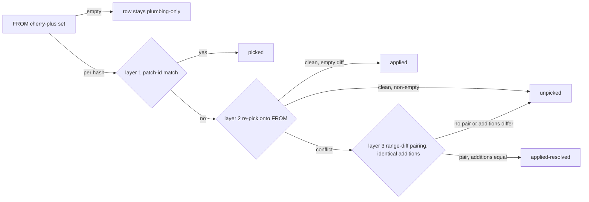

## file: plans/applied-probe-safety/design/exploration.md

# Applied-Probe Safety — Exploration

mode: `familiar` · concept: [plans/archived/applied_probe_safety/concept/concept.md](../../archived/applied_probe_safety/concept/concept.md) · sibling: [probe_pipeline.md](../../archived/applied_probe_safety/concept/probe_pipeline.md)

## Context

- **Open question:** which mechanism turns "this commit's change is present on FROM despite a differing patch-id" into a per-commit verdict a deletion gate can trust, and where the single copy of the safety predicate lives.
- **Drivers:** the `claude/railroad-review-workflow-f76262` incident (commit `8875782` picked as `9a2098e` with a resolved `docs/workflows.md` conflict) permanently pinned a fully harvested branch unsafe; the safe predicate exists in three drifting copies (status script, `status.go`, remove script) plus a fourth consumer (config-server batch remove) trusting one of them.
- **Grounding baseline:** commit `b1151f3` — the parent of the implementation commit. This eval worktree already contains the shipped feature; every anchor below cites the pre-implementation state (`path:line @ b1151f3`), and neither `cmd/worktrees/_lib/verdict.sh` nor anything under `plans/archived/applied_probe_safety/design/` was read.
- **Binding concept decisions taken as inputs:** probes target FROM only; `applied-resolved` counts Safe with distinct annotation; VERDICTS column after UNPICKED; no persistent cache in MVP (trace hook instead); verdict logic packaged as a sourced shell lib; `-X theirs` rejected; raw range-diff pairing rejected after the measured S7 false-pass.
- **Unattended run:** no user present — assumptions recorded under Open Questions. Decision references (decision 121…128) cite concept.md line numbers, since the concept does not number its decisions.

## Constraints

| ID | Constraint | Source (anchor / measurement) |
|---|---|---|
| C1 | bash 3.2 on macOS: no associative arrays, no `flock(1)`, BSD userland | comment "bash 3.2, so parallel indexed arrays" — cmd/worktrees/print_agent_worktrees_status.sh:109-112 @ b1151f3 |
| C2 | Overview rows are whitespace-split fixed columns parsed by Go (`strings.Fields`, ≥13 fields, hard error on any other shape)<br>a new column must be whitespace-free and moves printf template + parser + Go fixture + shell fixtures together | internal/repos/status.go:156-159 @ b1151f3<br>concept "Challenges" |
| C3 | Drill-down stdout must stay sha-prefixed commit rows<br>probe noise is test-locked out (`^[0-9a-f]{7,40}␣␣`), suffix strings asserted verbatim | cmd/worktrees/print_agent_worktrees_status.sh:228-229 @ b1151f3<br>cmd/tests/test_print_agent_worktrees_status.sh (test_unpicked_list_has_no_probe_noise) |
| C4 | Safe predicate is consumed in four places today — script header contract, `SafeToRemove` in Go, remove script gate, config-server batch remove (`data-safe`) — and the Goal is one verdict source | print_agent_worktrees_status.sh:32-33<br>status.go:231-233<br>remove_agent_worktrees.sh:104-119<br>ops.go:81 + repo_detail.html:83,160-162 — all @ b1151f3 |
| C5 | Probes run against FROM only<br>FROM may be a remote-tracking ref and is then **not** in the candidate set (candidates = `refs/heads/` non-claude only), so FROM verdicts cannot ride the existing IN machinery unannotated | resolve_from — print_agent_worktrees_status.sh:76-91<br>candidates :61-65 @ b1151f3<br>concept decision 2026-07-26 |
| C6 | Steady state stays plumbing-only: probes only for rows whose FROM cherry-`+` set is non-empty; a fully harvested branch pays nothing | concept Goal 2; probe_pipeline.md "Flows" |
| C7 | Fail-closed on ambiguity: a genuinely unapplied conflicting change must never read Safe — this is a deletion gate. Kills every acceptor that cannot separate "applied with resolution" from "competing change to the same region" | concept Challenge + measured S7 false-pass (decision 127, revised acceptance) |
| C8 | Heuristic upgrades stay visibly distinct from exact matches (`applied-resolved` never silently folded into `picked`) | concept Goal 4, decision 121 |
| C9 | Overview rows print in parallel (`xargs -P`, per-row output files); probe state must be row-local; temp worktrees lazy, reused per row, trap-removed | print_agent_worktrees_status.sh:255-316 @ b1151f3; probe_pipeline.md "Limits" |
| C10 | No persistent cache in MVP; probe cost made measurable via `WORKTREE_STATUS_TRACE=1` before any caching | concept decision 123 `[USER]` |
| C11 | Shell tests are release-gate first-class (`make audit-full` runs `cmd/tests/`)<br>Go fixture at status_test.go:17-40 is arithmetically impossible (UNPICKED=1, 4-entry IN, AHEAD=2) and gets replaced by captured output, not preserved | FACT-REPO-STACK-001<br>internal/repos/status_test.go:17-40 @ b1151f3<br>concept decision 125 |
| C12 | `git range-diff` is proven available (the revised layer-3 acceptance was implemented and measured per decision 127)<br>`git merge-tree --write-tree` (≥2.38) is **unverified** on this machine — in-session version probe was sandbox-blocked | concept decision 127<br>Open Questions Q2 |
| C13 | Harvest picks carry no provenance — the cherry-pick button runs plain `git cherry-pick` and aborts on conflict, so conflicted harvests are by definition manual and trailer-less | cmd/worktrees/cherry_pick_worktree.sh:30-34 @ b1151f3 |
| C14 | Remove script has no FROM notion and returns first-match only — its predicate already drifted from the status script's (two-pass `contained_in()`, copied `count_untracked()`) | remove_agent_worktrees.sh:56-71,84-87 @ b1151f3 |

## Options

### Detection families — how "applied" is established per commit

**P0 — patch-id equality (status quo).** `git cherry` per candidate; UNPICKED = intersection of `+` sets. Exact-transfer detector only: any context or payload drift changes the patch-id. Killed as sole mechanism by the driver incident; survives as the cheap first layer (its `-` verdict is exact and free). Anchor: print_agent_worktrees_status.sh:114-120,158-161 @ b1151f3.

**P1 — provenance trailers.** Add `-x` to `cherry_pick_worktree.sh`; verdict = source sha found via `git log --fixed-strings --grep "cherry picked from commit <sha>" <mb>..FROM`. Deterministic, plumbing-only, no heuristic. Binding constraints: forward-only (no existing pick carries a trailer — C13), and the button aborts on conflict, so exactly the incident class (conflict-resolved picks, done manually) never gets a trailer. Ownership: we own the pick tooling, so the change is ours to make — but it cannot satisfy the Goals alone.

**P2 — metadata pairing.** Find a subject-line twin in `<mb>..FROM`, then verify payload (range-diff/interdiff). Plumbing-only, no worktree. Binding constraints: subjects get reworded during harvest (false negatives), and C7 still forces the same payload gate as P4 — so P2 is P4 with a weaker pairing key. No in-repo precedent.

**P3 — re-pick probe.** `git cherry-pick --no-commit <hash>` onto FROM in a temp worktree; success with an empty staged diff = the change is semantically present. This is the existing detail-mode probe, today display-only — the option is factoring it out and feeding it into the verdict. Semantic 3-way merge: tolerant of context drift and of landing commits that squashed extra changes (regions only FROM changed merge clean). Blind spot: an already-applied change whose region was resolved with adjacent edits self-conflicts — the conflict outcome is ambiguous between "applied with resolution" and "never applied, competing change". Anchor: print_agent_worktrees_status.sh:222-243 @ b1151f3.

**P4 — range-diff pairing + addition-payload gate.** `git range-diff <mb>..FROM <hash>^..<hash>`; a `!`/`=` pairing names the FROM commit that landed the change; acceptance only when the interdiff shows **no added-line difference** (removed/context differences are inherent to a legitimate resolved pick). Fail-closed guards: no pairing → `unpicked`; pure-deletion commit with differing removals → `unpicked`; binary hunk → `unpicked`. Raw pairing without the gate is dead: the measured S7 case pairs a competing change to the same region (`!` marker) and would false-pass a deletion gate (decision 127). Textual, not semantic: a landing commit that squashed extra additions fails the gate — P4 must not judge shapes P3 already proves.

**P5 — `-X theirs` empty-diff re-pick.** Force-resolve toward the incoming commit, call empty diff "applied". Killed: silently discards genuinely unapplied conflicting hunks — false `applied` on a deletion gate (concept decision, C7).

### Composition — why layers, and in which order

No single family covers the ground truth. The blind-spot matrix over the shapes that occur in harvest histories:

| Shape | P0 cherry | P3 re-pick | P4 pairing+gate |
|---|---|---|---|
| exact pick, no drift | **picked** | (not reached) | (not reached) |
| applied, context drift only | `+` miss | **applied** (clean, empty) | would also accept |
| applied via squashed landing commit (extra changes in same commit) | `+` miss | **applied** (clean, empty) | false `unpicked` (additions differ) |
| applied via conflicted pick, additions verbatim | `+` miss | ambiguous (self-conflict) | **applied-resolved** (pairs, additions equal) |
| applied, resolution adapted the added lines | `+` miss | ambiguous (self-conflict) | `unpicked` — deliberate fail-closed trade |
| competing change, never landed | `+` miss | ambiguous (conflict) | **unpicked** (pairs per S7, additions differ → gate rejects) |
| never landed, no overlap | `+` miss | **unpicked** (clean, non-empty diff) | (not reached) |

- **Strictest-first, short-circuiting** follows: 1 `picked` (exact, free) → 2 `applied` (semantic, cheap) → 3 `applied-resolved` (heuristic, gated) → `unpicked`. Each verdict names the weakest evidence used — which is what C8's auditability asks for.
- P4 may never run before P3: it would misjudge the squashed-landing shape P3 proves cleanly.
- P3's ambiguous outcome (conflict) is exactly P4's input; P4's fail-closed rejections keep C7.



- **Probe set:** the layered probe needs the cherry `+` set **against FROM**, which the overview does not compute today (intersection runs over local candidates only, C5) — one extra `git cherry $from $branch` per row when FROM is known.
- **Layer-2 substrate (OPEN):** the concept MVP text fixes `cherry-pick --no-commit` in a lazy per-row temp worktree (`git worktree add --detach`, reset between hashes, trap-removed — the existing probe's shape, C9). `git merge-tree --write-tree --merge-base=<hash>^ FROM <hash>` computes the same 3-way result worktree-lessly (result tree == FROM tree ⇒ applied; conflict ⇒ layer 3): no filesystem lifecycle, no reset, trivially row-parallel. It is blocked only by C12 (git ≥2.38 unverified) and by having no in-repo precedent. Since the concept text names the temp worktree, substituting merge-tree is a concept-text deviation → surfaced as an OPEN decision for fdesign, not taken silently.
- **P1 as additive hardening (backlog):** `-x` on future button picks makes their verdicts exact and probe-free (helps C6's recurring-cost tail); it cannot help the incident class (C13).

### Verdict-source families — where the one predicate lives

**U-A — sourced shell lib `cmd/worktrees/_lib/verdict.sh`.** Both scripts source it; it owns `resolve_from`, cherry sets, the layer escalation, and the untracked filter; the remove script's `contained_in()`/`count_untracked()` are deleted, not guarded (C14 — note the lib must carry FROM resolution, which the remove script lacks entirely today). Go keeps parsing script output; `SafeToRemove` stays derived from IN (`len(In)>0`), with the FROM verdict entering IN as an annotated entry. Precedent: `routines/_lib/worktree.sh`, sourced by every routine wrapper (routines/_lib/worktree.sh:1-6 @ b1151f3). This is concept decision 126 `[USER]`; the exploration confirms nothing in the constraint set argues against it.

**U-B — Go as the verdict source.** `status.go` computes verdicts; scripts thin out or call the binary. Killed: inverts the repo architecture (the config server shells out to scripts rather than reimplementing them — FACT-REPO-ARCH-002), and the remove script must keep working standalone without a built Go artifact.

**U-C — status script as oracle.** The remove script consumes a machine mode of `print_agent_worktrees_status.sh` instead of computing. Killed: a targeted one-branch removal would pay the full overview; the human table becomes an internal API; and the remove script's `.codex/worktrees` sweep (remove_agent_worktrees.sh:145-160 @ b1151f3) has no status-script counterpart, so a third of its logic stays local anyway.

**U-D — keep the copies, add equivalence tests.** Killed by doctrine and by the concept's own Approach line: simplest design deletes the duplicate, it does not guard around it.

### Safe-semantics wiring (decided — recorded for completeness)

- **W-A (decided):** all-FROM-`+`-commits ending `picked`/`applied`/`applied-resolved` ⇒ FROM enters IN annotated (`origin/main*`); `len(In)>0` keeps carrying Safe in all consumers; the local-candidates rule is untouched.
- **W-B — add FROM to the candidate set:** killed — changes UNPICKED's intersection arithmetic and IN's per-candidate meaning (violates decision 122).
- **W-C — separate boolean SAFE column:** killed — breaks the "IN carries safety" invariant every consumer reads (status.go:231-233 @ b1151f3) for no gain; decision 128 keeps IN as the safety carrier and VERDICTS as the breakdown.

## Evaluation

| Option | Groundedness | Blast radius | Effort | Reversibility | Verdict |
|---|---|---|---|---|---|
| P0 cherry only (status quo) | total — it is the shipped code | none | 0 | — | fails the driver; survives only as layer 1 |
| **P1+P3+P4 layered probe** (cherry → re-pick → gated pairing) | high — layer 2 is the existing detail probe factored out; layer 1 unchanged | medium — VERDICTS column + parser + fixtures move together (C2), but that is decided independently (128) | ~2.5–3.5d (concept MVP) | high — layers are additive; cache retrofits lookup-before-probe without rework | **recommended** |
| merge-tree substrate for layer 2 | low — no in-repo precedent; capability unverified (C12) | small — internal to the lib | ~0.5d delta | trivial — drop-in swap behind the same verdict contract | OPEN (see Recommendation) |
| P4 range-diff as sole probe | low | small | ~1.5d | high | rejected — false `unpicked` on squashed landings; per-scenario: fine *only* for the conflict branch of layer 2 |
| P2 subject-line pairing | low — no in-repo pattern | small | ~1d | high | rejected — weaker pairing key than P4 with the same mandatory gate |
| P1 provenance `-x` | medium — one-line tooling change we own | tiny | ~0.25d | high | backlog hardening — forward-only, structurally misses the incident class (C13) |
| P5 `-X theirs` | — | — | — | — | killed (C7, concept-measured false-applied) |
| **U-A sourced verdict lib** | high — `routines/_lib/worktree.sh` precedent | medium — both scripts restructured, drift deleted | ~1–1.5d | medium | **recommended** (= decision 126) |
| U-B Go verdict source | low — inverts FACT-REPO-ARCH-002 | large | ~3d+ | low | killed |
| U-C status script as oracle | medium | medium | ~1d | low | killed (targeted-remove cost, `.codex` sweep uncovered) |
| U-D copies + equivalence tests | high | small | ~0.5d | high | killed by single-source doctrine |

Per-scenario notes:

- **Adapted-payload resolutions read `unpicked`.** A resolution that edited the agent's added lines stays unsafe under the addition-payload gate. That is the C7 bias working as intended: the agent's content is not what landed, so the branch keeps its warning; the drill-down suffix tells the operator why.
- **Pure-deletion and binary commits** never upgrade past layer 2 (fail-closed guards) — worst case is a false "unsafe", never a false "safe".
- **Recurring cost** concentrates on active branches with genuinely unpicked commits (re-probed per overview load). C10 says measure first (trace hook); the pre-designed sidecar cache keyed `(commit_sha, candidate_tip_sha)` retrofits without rework because verdict inputs are immutable.
- **Ground-truth separation** across the three shapes (incident accept / competing-edit resolved accept / competing change reject) was measured during the concept's decision 127 revision — the layered design with the gate is the only surveyed option separating all three.

## Recommendation

- **Detection:** the layered per-commit verdict, strictest-first, short-circuiting — `picked` (patch-id) → `applied` (re-pick onto FROM, empty staged diff) → `applied-resolved` (range-diff pairing accepted only on identical added lines, fail-closed guards) → `unpicked`. The blind-spot matrix shows the layers are complementary, and layer order is forced (P4 after P3).
- **Verdict source:** U-A — `cmd/worktrees/_lib/verdict.sh` sourced by both scripts.
  - Lib surface: `resolve_from` + cherry sets + layer escalation + untracked filter.
  - The remove script's own `contained_in()` and `count_untracked()` are deleted, not guarded.
  - Go stays a parser — Safe keeps flowing through the annotated FROM entry in IN (W-A), VERDICTS column per decision 128.
- **OPEN — layer-2 substrate:** temp worktree (concept text, existing pattern, zero capability risk) vs `git merge-tree --write-tree` (no worktree lifecycle, cleaner under row parallelism, needs git ≥2.38).
  - Within noise on effort, so no winner is faked.
  - The concept's MVP text names the temp worktree — the swap needs an explicit call, never a silent deviation.
  - Resolve with the one-line probe below before fdesign locks it; default to the temp worktree if unprobed.
- **What fdesign imports:**
  - Constraints C2/C3/C5/C7/C9 verbatim.
  - The blind-spot matrix as the layer contract.
  - The per-row FROM cherry run (C5) as a required change.
  - The lib surface incl. FROM resolution for the remove script (C14).
  - Fixture replacement (C11).
  - The three ground-truth shapes as `cmd/tests/` fixtures: resolved-pick accept (regression), context-drift accept (layer 2), competing-change reject (negative), zero probes on an empty `+` set (steady state).
- **Runnable probes to bind open facts** (sandbox-blocked in this unattended run):

```bash
git version                            # ≥2.38 unlocks the merge-tree substrate
git merge-tree --write-tree --merge-base=HEAD~1 HEAD HEAD~0 >/dev/null 2>&1; echo $?
```

## Rejected

- **P5 `-X theirs` empty-diff** — silently converts unapplied conflicting hunks into `applied`; false-safe on a deletion gate (concept-measured).
- **Raw range-diff `=`/`!` acceptance at default creation-factor** — measured S7 false-pass on a competing change to the same region; only survives with the identical-additions gate.
- **P4 as the sole probe** — false `unpicked` on squashed landing commits that layer 2 proves cleanly.
- **P2 subject-line pairing** — rewording false-negatives; adds nothing over content-based pairing once the payload gate is mandatory.
- **P1 provenance as primary** — forward-only; the conflicted (manual) picks that caused the incident structurally never carry the trailer.
- **U-B Go as verdict source** — inverts the scripts-are-truth architecture; remove script loses standalone operation.
- **U-C status script as removal oracle** — full-overview cost for targeted removal; human table as API; `.codex` sweep uncovered.
- **U-D duplicate predicates with equivalence tests** — guards the drift instead of deleting it.
- **W-B FROM into candidates / W-C separate SAFE column** — mutate the candidates rule / break the IN-carries-safety invariant; both foreclosed by decisions 122/128.
- **Probing all local candidates instead of FROM** — multiplies probe cost O(candidates), duplicates FROM once local main tracks origin (concept backlog).
- **Persistent probe cache in MVP** — retired by decision 123 `[USER]`; re-enters only on measured overview-latency regression, as the pre-designed `$GIT_DIR` sidecar.

## Open Questions

- **Q1 — grounding baseline.** The worktree already contains the shipped implementation; this exploration grounds at `b1151f3` (pre-implementation parent) and deliberately read neither the shipped `verdict.sh` nor `plans/archived/applied_probe_safety/design/`. Assumption: the artifact is to be written as of the concept's decision point.
- **Q2 — git capability.** `git version` / script execution were sandbox-gated in this unattended session; `merge-tree --write-tree` availability is unverified (range-diff availability is proven by the measured decision 127 work). The probe commands above bind this in seconds.
- **Q3 — live lab.** A three-scenario scratch-repo lab (resolved-pick accept / context-drift accept / competing-change reject, plus the merge-tree availability check) was written to `/tmp/applied_probe_lab/lab.sh` but could not execute unattended. Expected outcomes are recorded in the blind-spot matrix; running it (or landing the equivalent `cmd/tests/` fixtures) should precede fdesign's lock of the layer-2 substrate.
- **Q4 — effort figures.** Inherited from the concept's MVP estimates, not re-derived.


