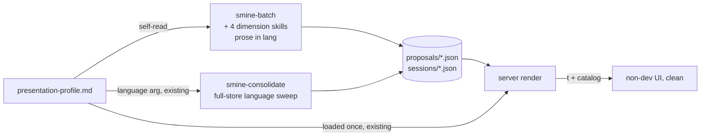

# Bootstrap englishness reduction (non-dev clean sweep) — Change Plan

route: `change`

## TLDR

- On the non-dev (German) install, bootstrap/nightly output is still largely English: proposal group headings ("New skills", "Workflows (skill-bundled scripts)"), proposal titles and change lines, batch themes/arcs, and several raw-rendered UI strings.
- Two root causes, both fixed:
  - **Producers are language-blind** — the five content-producing skills (smine-batch + the four dimension skills) have no language contract; only consolidate gets a `language` arg, and its rewording pass skips titles and group headings.
  - **The server renders store content raw** — kind headings, category/group/subgroup titles, tooltips, and a handful of literals bypass the `t`/`translate` overlay entirely.
- Fix: a presentation-profile language contract in every producer skill (prose fields in the profile language at authoring time), a full-store language sweep in consolidate (correction gate), and a render-side sweep with catalog entries for the fixed structural titles.
- Canonical group titles stay English **in the data** (smine-apply routes on them) and are translated at render time only.
- Developer machines (no profile): byte-identical behavior.
- Persisted post-approval as `plans/language_style_setting/design/change-englishness.md`.

## Context

- Base feature: [plans/language_style_setting/design/raw.md](plans/language_style_setting/design/raw.md) (shipped) — profile file, i18n catalog, reduced nav; bootstrap/orchestrate added by [plans/language_style_setting/design/change-nondev-automation.md](plans/language_style_setting/design/change-nondev-automation.md) (shipped).
- Problem: the profile's own contract ([settings/claude_code/presentation-profile.de.md](settings/claude_code/presentation-profile.de.md):8-13 — proposal titles, change lines, detail fields, evidence notes in German) is not honored by the pipeline that authors those fields.
- Cause anchors: skills/smine/smine-skills/SKILL.md:62 (hardcoded English group titles), internal/server/templates/proposals.html:54,60,79 (raw section titles, no `t`), skills/smine/smine-consolidate/SKILL.md:38 (group titles explicitly out of rewording scope).
- Constraint: dev machines and the store **schema** are untouched; only prose content and render-time overlay change.
- Constraint: subagent-run dimension skills do not receive the hook-injected profile directive — the contract must live in the skills themselves.

## Drivers

| ID | Observed | Wanted | Impact | Origin |
|---|---|---|---|---|
| DR1 | Proposal section headings render English on the de install: "New skills", "Edits to existing skills", "Workflows (skill-bundled scripts)", kind headings, category names | German headings on the non-dev surface | behavioral | user report ("New Skills / New Workflows, etc, a lot") |
| DR2 | Proposal prose (titles, change, fields, evidence titles, notes) authored in English by the dimension skills; consolidate rewording skips titles | User-visible store prose in the profile language | behavioral | user report ("Still too much English") |
| DR3 | Batch content on the Sitzungen pages (theme bullets, arc summaries, session notes) is English | Rendered batch JSON prose in the profile language | behavioral | same report, sweep clause |
| DR4 | Residual raw English in non-dev-visible chrome: "Everything applied, happy …!", "file(s) failed to load", "updated", vote tooltips, window filter labels, tile detail composites | Non-dev-visible chrome fully covered by the catalog | behavioral | user report ("the non-dev mode must be clean") |

## Scope

- **In:**
  - **producer language contract:** smine-batch, smine-skills, smine-routines, smine-context, smine-memory each gain a presentation-profile language directive (+ version bumps)
  - **consolidate full sweep:** language pass widened from "reworded prose" to every user-visible prose field of the mutable set (+ version bump)
  - **render sweep:** `t`/`translate` on all store-content headings and remaining literals of the non-dev-visible surface
  - **catalog:** entries for canonical group titles, kind/category names, tooltips and remaining format strings
  - **one-shot correction:** documented operator step — one `/smine-consolidate proposals language de` run on the target machine translates the already-seeded store
- **Out:**
  - **dev-only pages** (Skills/Context/Repos/Routines/Tools/Checklist/Config/Welcome) — stay English, gated behind `isDeveloperAudience` already
  - **schema changes** — prose language is content, not schema
  - **logs, results.jsonl, batch `.md` reports, commit messages, repo docs** — operator surfaces, stay English (concept constraint)
  - **retranslating voted/archived proposals** — the mutable-set invariant of consolidate stands
- **Not changed:**
  - **nightly/bootstrap wiring** — run.sh consolidate language threading and the bootstrap chain stay as-is; producers self-read the profile, so no caller changes
  - **smine-apply routing** — the group title "Workflows (skill-bundled scripts)" stays verbatim in data
  - **`translate()` mechanics** — identity fallback, catalog shape (raw.md D5) unchanged
- **Deferred findings:**
  - **filter badge labels from data** (proposals.html:44 `{{.Label}}`: target names like `fdesign` — technical identifiers, correctly untranslated; noted, no action)

## Assumptions

| Assumption | Reality | Location |
|---|---|---|
| User's "New Skills / New Workflows" are UI labels | They are store **content**: `groups[].title` authored by smine-skills and rendered raw — not template literals (grep for the literals in templates: zero hits) | skills/smine/smine-skills/SKILL.md:62, proposals.html:54-79 |
| The profile directive reaches every pipeline stage via the global-context hook | Dimension skills run as general-purpose **subagents** (smine SKILL.md:44); the UserPromptSubmit hook does not fire for subagent prompts — the directive text never reaches them; only the SKILL.md loaded by the Skill tool does | skills/smine/smine/SKILL.md:44 |
| Consolidate's `language` arg corrects drift | Its scope is "reworded prose" (`change`/`fields`), and group titles are explicitly out of scope — titles and headings stay English even with `language de` | skills/smine/smine-consolidate/SKILL.md:25,38,57 |

## Current state

Facts (cited by Decisions as F\<n\>):

| ID | Fact | Location |
|---|---|---|
| F1! | smine-skills mandates the English group titles "New skills", "Edits to existing skills", "Workflows (skill-bundled scripts)"; "Considered, not proposed" is the on-disk convention for the reroute group | skills/smine/smine-skills/SKILL.md:62, proposals/skills.json:307 |
| F2! | smine-apply routes on the exact group title "Workflows (skill-bundled scripts)" — group titles of the fixed set are machine-read keys | skills/smine/smine-apply/SKILL.md:31 |
| F3! | None of smine-batch / smine-skills / smine-routines / smine-context / smine-memory reference language, audience, or the profile; smine-orchestrate and smine-bootstrap already self-read the profile file (the in-repo pattern for profile awareness) | grep, this session; skills/smine/smine-orchestrate/SKILL.md:39, smine-bootstrap/SKILL.md:34 |
| F4! | proposals.html renders `{{.File.Kind}}` (:30), category `{{.Title}}` (:54), group `{{.Title}}` (:60), subgroup `{{.Title}}` (:79) raw; also raw literals "file(s) failed to load:" (:13), "Everything applied, happy …!" (:22), "updated" (:30) | internal/server/templates/proposals.html |
| F5! | proposals.go hardcodes English category names ("rules", "actions", "facts", "acdsl", :489-496) and vote tooltips ("%d of %d accepted" …, :450-453); the view-building path has no translation hook; `s.profile` is available on the Server | internal/server/proposals.go |
| F6 | The overview template already pipes `Label`/`Detail` through `t`; remaining composites are Go-composed (`signalDetail`, "%+d vs batch %d" delta, window filter labels rendered raw at overview.html:21) | internal/server/overview.go:229-302, overview.html:8-30 |
| F7 | sessions_batch.html renders theme bullets, arc summaries and batch body content raw from sessions JSON — content produced by smine-batch (schema: batch title, finding titles, notes) | internal/server/templates/sessions_batch.html:6-24, skills/smine/smine-batch/reference/schema.json:57-105 |
| F8 | context.json group titles are target-surface **paths**; memory groups are the same fact surfaces — technical identifiers the profile forbids translating | skills/smine/smine-context/SKILL.md:61, smine-memory/SKILL.md:31 |
| F9 | `translate(language, text)` with identity fallback + `t`/`langAttr`/`isDeveloperAudience` FuncMap closures exist; catalog keys double as English defaults | internal/server/i18n.go:65-73, server.go:161-174 |
| F10 | Every SKILL.md edit must bump both version surfaces (frontmatter + changelog.json[0]) — ACDSL-SKILL-001 gate, checked by `make audit` | acdsl projection on skills/ |
| F11 | Consolidate's mutable set = `status: "proposed"` and unvoted — voted/user-status entries are immutable including formatting | skills/smine/smine-consolidate/SKILL.md:29 |

## Target state

- **Principle — author in the reader's language, correct on cadence, translate structure at render.** Three layers, each with the platform mechanism that owns it:
  - prose is born in the profile language (skill contract, profile file as single source — the same self-read smine-orchestrate uses),
  - drift is corrected by the existing consolidate gate (its `language` arg, widened scope),
  - fixed structural keys are translated by the existing render overlay (`t` + catalog, identity fallback).
- No new mechanisms: no schema field, no new args, no caller changes.



## Behavior contract

- Must not change: developer machines (no profile) — every page byte-identical; English stores stay English.
- Must not change: proposals/sessions **schema**; canonical group titles in data (F2 routing); ids, targets, paths, code snippets, dates, status enums.
- Must not change: consolidate's mutable-set invariant (F11) — voted entries keep their language.
- Intentional: on non-en installs, newly authored store prose is in the profile language (DR2/DR3); existing unvoted store prose is translated by the next consolidate run; structural headings render translated (DR1); remaining chrome covered (DR4).

## Decisions

| ID | Problem | Facts | Decision | Why |
|---|---|---|---|---|
| <a id="d1"></a>D1 | Where do "New skills" etc. get German? | F1!, F2! | Canonical skills-group titles ("New skills", "Edits to existing skills", "Workflows (skill-bundled scripts)", "Considered, not proposed") stay **verbatim in JSON** and are translated **render-side only**: `{{t .Title}}` + catalog entries | smine-apply routes on the exact title (F2) — translating data breaks routing; the fixed enumerable set is exactly what a catalog is for; identity fallback keeps unknown titles safe |
| <a id="d2"></a>D2 | How does language reach the producers? | F3!, assumption row 2 | Each producer SKILL.md gains a **Language** contract: read `~/.claude/context/global/presentation-profile.md`; when `language:` is set and ≠ `en`, author user-visible prose fields in that language honoring the profile's glossary; never translate ids, targets, paths, code, dates, tags, schema keys, or the canonical group titles (D1). No arg threading, no caller changes | The profile file is the established single source (orchestrate/bootstrap pattern, F3); the SKILL.md is the only text guaranteed to reach a subagent (assumption row 2); an arg would touch smine, run.sh and bootstrap for no added control |
| <a id="d3"></a>D3 | Which fields count as "user-visible prose"? | F7, F8 | Proposals: `title` (the change-name part after `<target> — `), `change`, `fields[].label/text`, `evidence[].title`, `sessions[].note`, free-form group titles. Batches (sessions JSON): batch title, theme bullets, arc summaries, per-session summaries/notes, finding titles. Not: batch `.md` reports, ledgers, run reports (operator artifacts, never rendered) | The rendered-field set is exactly what the templates show (F4, F7); the `.md` report feeds dimension extraction and debugging — an operator surface per the concept constraint |
| <a id="d4"></a>D4 | Consolidate correction scope | F11, assumption row 3 | Widen §4 + the `language` arg: with `language <lang>`, translate **every** D3 prose field of every mutable entry not already in `<lang>` (not just reworded ones); free-form group titles included, canonical titles (D1) and technical identifiers verbatim; amend the grouping invariant accordingly | Consolidate is the designated correction gate (concept: prevention + correction); today's "reworded prose only" scope is why drift sticks (assumption row 3); mutable-set bound keeps voted entries stable (F11) |
| <a id="d5"></a>D5 | Render-side mechanics for store headings | F4!, F5!, F9 | proposals.html: wrap kind heading, category/group/subgroup titles and the three raw literals in `{{t}}`; proposals.go: category names and tooltip strings through `translate(s.profile.Language, …)` (format-string keys); overview: remaining Go-composed details via `translate` | Same FuncMap/catalog pattern as the base feature (F9) — no new plumbing; format-string keys ("%d of %d accepted") keep composites translatable without string surgery |
| <a id="d6"></a>D6 | Existing English store on the target machine | F11 | One documented operator step after deploy: run `/smine-consolidate proposals language de` once (or let the next nightly do it) — D4 translates the backlog; no migration code | The correction gate already covers it; a one-off migration script would duplicate the gate (single source of truth) |
| <a id="d7"></a>D7 | German renderings of canonical titles | F1 | Catalog: "New skills" → "Neue Funktionen", "Edits to existing skills" → "Änderungen an bestehenden Funktionen", "Workflows (skill-bundled scripts)" → "Abläufe (gebündelte Skripte)", "Considered, not proposed" → "Geprüft, nicht vorgeschlagen", "rules" → "Regeln", "actions" → "Arbeitsweisen", "facts" → "Fakten", "acdsl" → "Prüfregeln" | Consistent with the existing catalog register ("skills" → "Funktionen", "workflows" → "Abläufe"); decided inline — wording is fimplement-adjustable without structural impact |

## Baseline (verified)

N/A — change route.

## Exemplar & reuse

N/A — change route. (Reuse is named per phase: profile self-read mirrors smine-orchestrate/SKILL.md:39; catalog/`t` mirrors raw.md D5; version bumps mirror any prior skill edit.)

## Changes

### Phase P1 — Render sweep + catalog (server; shippable alone, fixes DR1/DR4 immediately)

location: `internal/server/templates/proposals.html`, `internal/server/proposals.go`, `internal/server/overview.go`, `internal/server/i18n.go`

```diff
-<h2>{{.File.Kind}}{{if or .File.Updated .File.Source}} <span class="meta">{{if .File.Updated}}updated {{.File.Updated}}{{end}}{{if and .File.Updated .File.Source}} · {{end}}{{.File.Source}}</span>{{end}}</h2>
+<h2>{{t .File.Kind}}{{if or .File.Updated .File.Source}} <span class="meta">{{if .File.Updated}}{{t "updated"}} {{.File.Updated}}{{end}}{{if and .File.Updated .File.Source}} · {{end}}{{.File.Source}}</span>{{end}}</h2>
```

```diff
 {{if eq .Tab "open"}}
-<div class="empty">Everything applied, happy {{.HappyWord}}!</div>
+<div class="empty">{{t "Everything applied, happy"}} {{.HappyWord}}!</div>
```

```diff
-    {{len .LoadErrors}} file(s) failed to load:
+    {{len .LoadErrors}} {{t "file(s) failed to load:"}}
```

- **Section titles:** `{{.Title}}` → `{{t .Title}}` at proposals.html:54 (category), :60 (group), :79 (subgroup) — identity fallback keeps free-form/path titles safe (D1, D5).
- **proposals.go tooltips** (:450-453): keys become catalog format strings, e.g.

```diff
-	accepted.Tooltip = fmt.Sprintf("%d of %d accepted", acceptedCount, total)
+	accepted.Tooltip = fmt.Sprintf(translate(s.profile.Language, "%d of %d accepted"), acceptedCount, total)
```

- **proposals.go category names** (:489-496): rendered through `{{t}}` via the section-title change above — the Go side stays untouched (names are keys).
- **overview.go**: remaining Go-composed non-dev-visible strings through `translate` — `signalDetail` fragments, the "%+d vs batch %d" delta (:282), window filter labels (overview.html:21 → `{{t .Label}}`).
- **i18n.go catalog additions** (grounded set; fimplement completes by sweeping the P1 files for every literal the non-dev sees — same map, no structural change; mirrors raw.md §4 sweep note):

```go
	"New skills":                        "Neue Funktionen",
	"Edits to existing skills":          "Änderungen an bestehenden Funktionen",
	"Workflows (skill-bundled scripts)": "Abläufe (gebündelte Skripte)",
	"Considered, not proposed":          "Geprüft, nicht vorgeschlagen",
	"context":                           "Wissen",
	"routines":                          "Automatiken",
	"rules":                             "Regeln",
	"actions":                           "Arbeitsweisen",
	"facts":                             "Fakten",
	"acdsl":                             "Prüfregeln",
	"updated":                           "aktualisiert",
	"Everything applied, happy":         "Alles umgesetzt, viel Freude",
	"file(s) failed to load:":           "Datei(en) konnten nicht geladen werden:",
	"%d of %d accepted":                 "%d von %d angenommen",
	"%d rejected":                       "%d abgelehnt",
	"%d postponed":                      "%d zurückgestellt",
	"%+d vs batch %d":                   "%+d ggü. Auswertung %d",
```

### Phase P2 — Producer language contract (5 SKILL.md edits; shippable alone, fixes DR2/DR3 at the source)

location: `skills/smine/smine-batch/SKILL.md`, `skills/smine/smine-skills/SKILL.md`, `skills/smine/smine-routines/SKILL.md`, `skills/smine/smine-context/SKILL.md`, `skills/smine/smine-memory/SKILL.md` (+ each skill's `changelog.json`, version bump per F10)

mirrors: the profile self-read in skills/smine/smine-orchestrate/SKILL.md:39

- Each SKILL.md gains one **Language** bullet in its output-contract section (wording adapted per skill's field set, D3):

```markdown
- **Language.** Read `~/.claude/context/global/presentation-profile.md` before writing output;
  when its `language:` is set and not `en`, author all user-visible prose fields
  (<skill's D3 field list>) in that language, following the profile body's register and
  glossary. Never translate: ids, targets, file paths, code, dates, tags, schema keys,
  status values, and the fixed group titles (they are machine-read keys, translated in
  the UI). Absent profile = English, unchanged.
```

- smine-skills additionally keeps its three mandated group titles explicitly flagged as verbatim keys (extends line 62).
- smine-batch's list covers the sessions-JSON fields (batch title, themes, arc summaries, session summaries/notes, finding titles); its `.md` report stays English (D3).
- smine-context/smine-memory: group titles are target-surface paths — excluded by the never-translate list (F8); their prose fields (change, evidence titles, notes) follow the contract.

### Phase P3 — Consolidate full-store language sweep (1 SKILL.md edit; shippable alone, fixes the backlog via D6)

location: `skills/smine/smine-consolidate/SKILL.md` (+ `changelog.json`, version bump)

```diff
-- `language <lang>`: write reworded prose in `<lang>` (default: keep the store's language).
+- `language <lang>`: all user-visible prose of the mutable set ends up in `<lang>` —
+  reworded entries are written in it, and untouched entries whose prose is not in `<lang>`
+  are translated in place (titles' change-name part, change, fields, evidence titles,
+  session notes, free-form group titles). Never translated: ids, targets, paths, code,
+  dates, tags, status values, and the fixed structural group titles (machine-read keys).
+  Default: keep the store's language.
```

```diff
-- Grouping stays the authored two-level shape (`groups[].title`); this skill never invents new group titles beyond the target kind's existing conventions.
+- Grouping stays the authored two-level shape (`groups[].title`); this skill never invents
+  new group titles beyond the target kind's existing conventions. With `language <lang>`,
+  free-form group titles are translated in place; fixed structural titles stay verbatim.
```

- §4 Presentation gains the matching sentence ("Apply `caveman`/`language` when given" → the full-sweep semantics above). Mutable set only (F11).

## Hot items

- **UI change (ACTION-CONCEPT-HOT-007):** screenshot of the REAL changed UI — the de-profile proposals page with a fixture store carrying the canonical English group titles — captured from the booted server at verification and presented in chat (browser pane is policy-blocked for localhost; capture per the repo's curl-first verification doctrine, screenshot from the operator browser as in the prior change plan). Saved under `plans/language_style_setting/design/ui/` with the persisted plan.
- No SQL, no concurrency, no new interfaces/generics, no anonymous structs, no generated formats, no guard changes. The only Go-logic change is threading existing `translate` calls (D5).

## Tests

| Location.Method | Cases | Comment |
|---|---|---|
| proposals tests `TestProposalsGroupTitlesNonDeveloper` | de profile + fixture store with "New skills"/"Workflows (skill-bundled scripts)" groups → body has "Neue Funktionen", "Abläufe (gebündelte Skripte)", lacks the English titles<br>kind heading "Funktionen"<br>free-form group title renders identity | via `/proposals` with fixture store, mirrors existing proposals handler tests |
| proposals tests `TestProposalsTooltipsGerman` | de profile → "1 von 3 angenommen" tooltip present | pins the format-string keys |
| proposals tests `TestProposalsDefaultEnglish` | no profile → "New skills", "1 of 3 accepted" verbatim | pins D2-invariant (dev machines byte-identical) |
| server_test.go existing suite | unchanged green | safety net: base-feature nav/lang tests pin the untouched surface |

- Not tested: the SKILL.md language contracts (LLM behavior) — covered by the verification runbook scenarios and the consolidate gate; consistent with the prior change plan's treatment of skill prose.

## Test runbook

Scenario index (verification tool is `curl` against the local configserver; no `runbook` arg):

- **group-titles-de** (DR1) — de-profile boot + fixture store; `curl localhost:6001/proposals` → "Neue Funktionen", no "New skills".
- **chrome-clean** (DR4) — same boot; grep the rendered `/`, `/sessions`, `/proposals` HTML for the DR4 literals → zero English hits on the non-dev surface.
- **default-unchanged** (behavior contract) — profile removed; `/proposals` byte-identical to a pre-change build; re-runs the existing base-plan curls.
- **consolidate-translate** (DR2, D4/D6) — scratch store with English proposed entries + one voted entry; `/smine-consolidate proposals language de` → unvoted prose German, voted entry untouched, canonical group titles verbatim.
- **producer-contract** (DR2/DR3) — spot: one dimension skill run on a scratch batch with the de profile present → new proposal prose German, ids/targets English.

## Contracts & sweeps

| Contract | Sides | Sweep |
|---|---|---|
| Canonical group titles verbatim in data | producer SKILL.mds (D2 never-translate) · smine-apply routing (F2) · consolidate keep-list (D4) · catalog keys (D7) | grep each exact title across skills/smine/ + internal/server/i18n.go — every surface names the identical string |
| Catalog keys = template/Go literals byte-exact | i18n.go · proposals.html · proposals.go · overview.go | rendered-HTML tests (Tests table) are the sweep; a mismatched key degrades to English, caught by TestProposalsGroupTitlesNonDeveloper |
| Profile front-matter (`language:`/`audience:`) readers | existing Go/sed readers · 5 producer skills (new prose readers) | grep `presentation-profile` — all readers name the same path and keys |
| Version surfaces per edited skill | SKILL.md frontmatter · changelog.json[0] | `make audit` (ACDSL-SKILL-001) is the sweep (F10) |
| D3 prose-field list | producer contracts · consolidate sweep scope · rendered fields in templates | the three name the same field set; checked once against proposals/schema.json + smine-batch/reference/schema.json during implementation |

## Verification

- [ ] Run `make audit` — green (Go tests, acdsl skill version gates, generate-check).
- [ ] Run `go test ./internal/server/` — new + existing tests green.
- [ ] Boot `./bin/configserver` with the de profile + a fixture store containing "New skills"/"Workflows (skill-bundled scripts)" groups; `curl -s localhost:6001/proposals` — expect "Neue Funktionen" and "Abläufe (gebündelte Skripte)", no English canonical titles, kind heading "Funktionen", German tooltips.
- [ ] Same boot, grep rendered `/`, `/sessions`, `/proposals` for "Everything applied", "file(s) failed", "updated ", " accepted" — expect zero hits.
- [ ] Capture and present the real-UI screenshot of the de proposals page (HOT-007).
- [ ] Boot without profile — `/proposals` output identical to a pre-change build (English titles, English tooltips).
- [ ] Degenerate: profile `language: fr` — English text everywhere (identity fallback), no error.
- [ ] Degenerate: empty store — empty-state strings render German with the de profile.
- [ ] Consolidate dry-run on a scratch store copy (English proposed + one voted entry): `/smine-consolidate proposals language de` — unvoted prose translated, voted entry byte-identical, canonical titles verbatim, `make audit` green after.
- [ ] Rollout note recorded in the report: on the target machine, run `/smine-consolidate proposals language de` once (or wait for the nightly) to translate the seeded backlog (D6).

## Stop conditions

| ID | Condition | Action |
|---|---|---|
| S1 | An approved contract can't hold (ACTION-IMPL-001) | stop, report |
| S2 | Second failed approach in a row (ACTION-IMPL-002) | stop, re-read state, re-plan |
| S3 | Missing prerequisite (ACTION-IMPL-003) | run the producing step; if infra is down, ask |
| S4 | Discovered work materially exceeds scope (ACTION-IMPL-004) | ask before continuing |
| S5 | Same bug class found twice (ACTION-IMPL-005) | fix all in-diff instances; report pre-existing |
| S6 | Structural obstacle tempts a new abstraction (ACTION-IMPL-006) | stop, report |
| S7 | A consumer beyond smine-apply is found matching on a **free-form** group title or other prose slated for translation | stop — the D1/D4 verbatim-key list must grow before any translation ships |
| S8 | A non-dev-visible string is only composable in Go in a way format-string catalog keys cannot express | leave English, record as deferred finding — no string-surgery refactor in this pass |

## Open questions

_None — empty at approval._

## Changelog

| Date | Trigger | What changed |
|---|---|---|
| 2026-08-27 | initial | change plan created |
