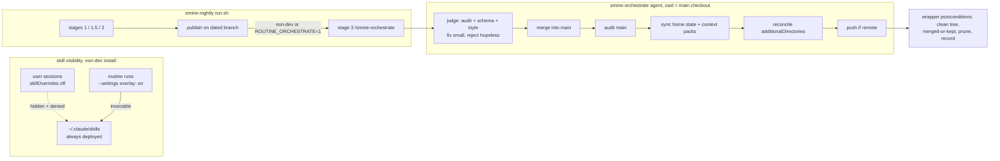

# Non-developer hardening: install robustness, skills hiding, Projects view, orchestrated pipeline — Change Plan

route: `change`

## TLDR

- Install robustness: EOF-guard the sync_hooks.sh prune prompt; run all sync scripts under a 10-minute `shell.RunSync` instead of the 60-second ceiling that killed the cold Windows install.
- Skills hiding via settings, not routes: every route stays open (the operator inspects the machine through the full UI). On non-dev installs the skill sync writes `skillOverrides: {<leaf>: "off"}` into the user settings — deployed but invisible and non-invocable in the user's own sessions — and routine runs get a generated `--settings` overlay flipping them back on, so the pipeline keeps working.
- Projects: the repos page renders for non-devs as "Projekte" — add/remove stays (localized), the dev columns (Path/Context/ACDSL/Worktrees) go, and the additionalDirectories opt-in is applied automatically on add.
- Automatic pipeline via an orchestrator agent: a new `smine-orchestrate` skill runs as nightly stage 3 on auto installs — judges and re-verifies the other stages' output, fixes or rejects, merges the run branch into main, re-syncs deployed state, syncs context packs into registered repos, reconciles `additionalDirectories`, prunes merged branches, pushes when a remote exists. The wrapper gates, invokes, and verifies hard postconditions.
- Developer machines change nothing: all new behavior gates on the profile's non-developer audience; env overrides win.

## Context

- After the base feature landed, the German machine surfaced: a flaky first install (diagnosed: unguarded `read` + 60s sync timeout), skills exposed to the user, and a pipeline that assumes a developer merges runs manually (routines/_lib/worktree.sh:17-19).
- Without merges, dated branches accumulate until `ROUTINE_MAX_OPEN_BRANCHES` makes the nightly silently skip forever (worktree.sh:149-154, run.sh:104-106) — the cleanup gap and the stall are one gap.
- [USER] A bare scripted merge was rejected: the merge-back must be an orchestrator agent that judges agent output, resolves conflicts, and owns syncing.
- [USER] Route blocking was rejected: all routes stay open for operator inspection; skills are hidden via settings while staying deployed; the Projects page keeps add/remove.
- Base plan: plans/language_style_setting/design/raw.md (shipped); this plan supersedes both earlier P2/P3 drafts.

## Drivers

| ID | Observed | Wanted | Impact | Origin |
|---|---|---|---|---|
| DR1 | First Windows install aborted in the sync stage (prune-prompt tail); server left stopped | Headless install survives stale hooks/skills and cold machines | behavioral | install failure, diagnosis this session |
| DR2 | All deployed skills are visible and invocable in the non-dev user's own Claude sessions | Skills stay deployed (pipeline needs them) but are hidden and non-invocable for the user; routes stay open | behavioral | user report + route-block rejection |
| DR3 | No merge-back, no push, no post-run sync, no cleanup, no reviewer of agent output | Orchestrator agent as judge/merger/syncer; wrapper-verified | behavioral | user report + shell-merge rejection |
| DR4 | Repos page is dev registry machinery | "Projekte" for non-devs: add/remove kept, dev columns abstracted away | behavioral | user report (revised) |
| DR5 | additionalDirectories opt-in is a manual checkbox; unticked repos are never mined | Non-dev adds always apply it; nightly reconciles registry ↔ settings | behavioral | user report |
| DR6 | Projects show only the directory basename | Projects carry a human-friendly label (registry field, shown in the Projekte view) | behavioral | user report (plan review) |
| DR7 | A fresh install starts empty — no seeded proposals/tuning until nightlies accumulate | `smine-bootstrap` skill: full pipeline over the machine's last n sessions with auto apply and an initial-setup-framed judge | behavioral | user report (plan review) |
| DR8 | The Directory (folder-picker) button on the repos add form is broken on Windows | Working picker on the target machine | behavioral | user report (plan review) |
| DR9 | Adding a non-git folder registers a project the roster and worktree machinery can't use | Added folders without .git get a local `git init` (no remote) | behavioral | user report (plan review) |
| DR10 | Bootstrap is CLI-only | Welcome page exposes a Bootstrap button (verify-button style): starts the run, prints started + the peek session id | behavioral | user report (plan review) |

## Scope

- **In:**
  - **hooks-guard:** `read -r answer || answer=n` on the sync_hooks.sh prune prompt
  - **sync-timeout:** `shell.RunSync` (10 min) at all four sync-script call sites
  - **skill-overrides:** non-dev sync writes per-leaf `skillOverrides: "off"` to user settings; routine overlay re-enables for pipeline runs
  - **projects-view:** non-dev repos_index variant (localized forms, no dev columns) + "Projects/Projekte" nav entry
  - **forced additional-dir:** non-dev repo add always applies additionalDirectories
  - **orchestrator:** `smine-orchestrate` skill + nightly stage 3 (gated) with shell postconditions; settings-edit capability
  - **project-labels:** optional `label` field on registry entries, add-form input, shown in the Projekte view
  - **bootstrap:** `smine-bootstrap` skill — operator-invoked initial-setup pipeline run
  - **windows-folder-picker:** evidence-first fix — a Windows implementation exists (`chooseFolderWindows`, PowerShell -STA WinForms, contextdocs/sync.go) and errors already render into the path fragment (repos.go:601-619); the failure mode is unknown without the machine. Work item: capture the configserver.log `shell: powershell` line and the fragment error on one button click, then fix per evidence — no speculative rewrite before that
- **Out:**
  - **route blocking:** explicitly rejected — every route stays reachable
  - **repos detail page redesign:** stays the dev page; reachable, linked from Projekte rows
  - **orchestrating developer machines:** stage 3 defaults off there
- **Not changed:**
  - **worktree chain semantics** — dated branches, chain sync, merge-tree gate, [failed] discard
  - **publish** — still commits on the dated branch, removes the worktree
  - **developer defaults** — `SMINE_AUTO_APPLY=never`, no stage 3, no skillOverrides, full UI
- **Deferred findings:**
  - **results.jsonl / sessions / votes-archive growth** — no retention policy; candidate future orchestrator duty
  - **non-git project dirs** — mining roster filters to git repos (run.sh:30-34); non-git projects stay unmined

## Assumptions

| Assumption | Reality | Location |
|---|---|---|
| "Skills are hidden via settings" is a supported mechanism | Confirmed: `skillOverrides: {"<name>": "off"}` hides a skill from the slash menu AND denies invocation — including headless `-p`; hence the routine `--settings` overlay re-enabling them is required for the pipeline | code.claude.com/docs/en/skills.md#override-skill-visibility-from-settings (guide agent, this session) |
| "No auto merge / no orchestrator / nothing cleans up" | Confirmed — manual local merge is the acceptance act; `routine_prune_merged` dead without merges | worktree.sh:17-19,106-114 |
| Diagnosis facts (EOF read, 60s ceiling) | Confirmed in source | sync_hooks.sh:5,33; shell.go:23 |

## Current state

- cmd/sync/sync_hooks.sh:28-41 — unguarded prune `read` under `set -euo pipefail`.
- internal/shell/shell.go — `Run` 60s (:23), `RunDialog` 10 min (:96); sync callers: install_windows.go:86,368, contextdocs/sync.go:62, skills/sync.go:23.
- internal/server/templates/repos_index.html — add form with `additional-dir` checkbox (:5-10), remove form (:14-24), Name/Path/Context/ACDSL/Worktrees table (:33-46); `handleRepoAdd` reads the checkbox (repos.go).
- sync_skills.sh — deploys every repo leaf to `~/.claude/skills` (and codex); knows the full leaf list (`skill_dirs`); no settings writes today.
- routines: `routine_run_claude` in routines/_lib/platform.sh is the single claude-invocation choke point for all stages incl. the chain-sync merge-resolve call; run.sh parses profile `language:` (139-146); `routine_allowed_tools` reads installed frontmatter (skill.sh).
- internal/contextdocs/sync.go:40-66 — sync_context.sh flags; per-target deploy options recorded in the target's docs/context.json.
- internal/config/config.go:27 — `AdditionalDirectories []string` in settings permissions.

## Target state



- **Principle — presentation splits by consumer, capability by settings scope:** one deployed skill tree; the user-scope settings hide it, a run-scoped `--settings` overlay re-enables it. Mechanism: Claude Code's `skillOverrides` + CLI `--settings`.
- **Principle — judgment in the agent, guarantees in the shell:** the skill owns review/conflicts/fix-vs-reject/sync choices; run.sh owns gate, invocation, and mechanically checkable postconditions.
- **Principle — one gate, one source of truth:** all automatic behavior derives from the profile's `audience:`; env overrides win. Mechanism: the existing `sed` front-matter parse.
- **Principle — fail static:** orchestrator failure leaves today's manual world — branch kept, reason recorded, nothing half-merged.

## Behavior contract

- Must not change: developer machines — UI, skill visibility, nightly semantics, apply default, no stage 3, no overrides written.
- Must not change: chain invariants; failed runs never merge; rejected branches survive; routes all remain reachable on every install.
- Intentional (non-dev): DR2 skills hidden in user sessions; DR3 stage 3 + auto apply; DR4 Projekte rendering; DR5 forced additional-dir + reconciliation.
- Intentional (all audiences): sync prompts never abort an install; prune still needs an explicit yes.

## Decisions

| ID | Problem | Facts | Decision | Why |
|---|---|---|---|---|
| <a id="c1"></a>C1 | Timeout fix shape | G2 | `shell.RunSync` (`SyncTimeout = 10 * time.Minute`) mirroring `RunDialog`; all four call sites switch | Sanctioned variant precedent; UI-triggered syncs share the failure |
| <a id="c2"></a>C2 | Hooks prompt guard | G1 | `read -r answer \|\| answer=n`, parity with sync_skills.sh:209 | EOF keeps meaning "never prune without explicit yes" |
| <a id="c3"></a>C3 | [USER] Skill hiding mechanism | A1 (assumption row 1), G16 | sync_skills.sh, when the installed profile is non-developer, writes `skillOverrides: {<leaf>: "off"}` for every deployed leaf into `~/.claude/settings.json` (jq merge, preserving foreign keys); developer installs write nothing and existing overrides are left alone | Settings are the supported hiding surface; the sync already owns the leaf list and runs on every install/update |
| <a id="c4"></a>C4 | Pipeline must still invoke hidden skills | A1 (revised by probes) | Probes proved: user-scope `"off"` spares prompt-start slashes but **denies Skill-tool loads**, and `--settings`-supplied skillOverrides are **ignored**; project/local scope `"on"` beats user `"off"` per key. Mechanism: sync_skills.sh writes the on-map overlay to `~/.config/claude-routine/skill-overrides.json` AND merges it into the repo's `.claude/settings.local.json`; run.sh copies the overlay into each routine worktree's `.claude/settings.local.json`; the file is repo-gitignored so publish never commits it | Evidence-backed replacement for the rejected `--settings` injection; same intent, working scope |
| <a id="c5"></a>C5 | [USER] Projects abstraction | G4 | Same route/handler; non-dev branch: `{{t "Projects"}}` heading, add/remove forms kept with `t`-localized labels, `additional-dir` checkbox hidden, table shows Name (linked) + Worktrees dropped along with Path/Context/ACDSL; nav shows Projekte | Add/remove is how projects get registered; dev columns are the internals to abstract; routes stay open so links stay |
| <a id="c6"></a>C6 | [USER] Forced additional-dir | G14 | `handleRepoAdd` treats the opt-in as set whenever the audience is non-developer (checkbox value ORed with `!isDeveloperAudience`) | The roster derives from additionalDirectories; a non-dev must not be able to register an unmined project |
| <a id="c7"></a>C7 | [USER] Merge-back mechanism | G5!,G6!,G7!,G8! | Orchestrator agent: `smine-orchestrate` skill invoked by run.sh stage 3 from the main checkout with the run branch as arg — judge, fix or reject, merge, re-verify, sync, reconcile, push. No shell merge path is built | Auto-applied output needs a judge; conflicts and context-pack syncing need an agent |
| <a id="c8"></a>C8 | Judge gate contents | G6 | Accept requires `make audit` green on the merged tree, schema-valid proposal/session JSON, prose conforming to the presentation profile; small defects fixed on the branch; else reject — branch kept, reason to `.orchestrate-report` | The checks Kevin performs manually; audit is the repo's own hard gate |
| <a id="c9"></a>C9 | Reject semantics | G7 | Reject = no merge, branch kept, reason recorded; repeated rejects hit the branch cap → nightly skips loudly | Operator-visible stall beats silent discard |
| <a id="c10"></a>C10 | Stage-3 shell postconditions | G5 | run.sh verifies: clean repo_root tree AND (branch ancestor of main → `routine_prune_merged`, or branch kept → log + report tail); violations mark the stage failed | Wrapper guarantees what it can check; the agent is not trusted for invariants |
| <a id="c11"></a>C11 | Sync duties | G13 | Orchestrator post-merge: sync_settings/hooks/skills; then per repos.json entry with a deployed pack, re-run sync_context.sh with the target's recorded options; per-repo failures reported, never fatal | Apply-stage changes are dead until deployed; per-repo options already live in the target's context.json |
| <a id="c12"></a>C12 | additionalDirectories reconciliation | G14 | Orchestrator duty (non-dev): append registry paths missing from `permissions.additionalDirectories`; never remove | Covers drift and pre-C6 registrations; append-only is non-destructive |
| <a id="c13"></a>C13 | Stage-3 gating + params | G10 | `ROUTINE_ORCHESTRATE` env, default on for non-developer audience; invocation mirrors the consolidate stage: `routine_run_claude 3600`, ROUTINE_MODEL default, `--effort medium`, manifest via `routine_allowed_tools smine-orchestrate` | Same source of truth as language threading; judging warrants medium effort |
| <a id="c14"></a>C14 | Apply default for non-devs | G9 | [USER] `decide` — and the orchestrator is the final arbiter: at stage 3 it re-judges auto-applied changes and may reject/revert them | Rules gate the apply, the judge gates the merge — two bounded layers |
| <a id="c15"></a>C15 | Old drafts disposal | — | Neither the shell merge function nor the route guard is built; all changes additive around existing mechanisms | No parallel mechanisms; rejected designs leave no residue |
| <a id="c16"></a>C16 | [USER] Project labels | G17 | `Repo` gains optional `Label string` (display-only, no validation beyond length, never the URL segment — Name stays the key); add form gains a label input (both audiences); Projekte rows and the dev Name column show label-falling-back-to-name | Name is load-bearing (URL, dedup, roster); a display field must not touch identity |
| <a id="c17"></a>C17 | [USER] Orchestrator settings edits | G12 | The manifest grants `Edit`/`Write` plus the Bash tools; settings mutations (additionalDirectories, and whatever setup requires) target `~/.claude/settings.json` directly; a headless permission probe is a hard verification item and S7-class stop | The user mandated the capability; edits outside cwd under acceptEdits are the known headless risk — probe before trust |
| <a id="c18"></a>C18 | [USER] Bootstrap shape | G18 | `smine-bootstrap <n>` (default 30) chains in one session: /smine --nightly scoped by prompt to the machine's most recent n sessions → /smine-consolidate (profile language) → /smine-apply (auto-apply: decide) → /smine-orchestrate bootstrap — a new orchestrate mode that judges the working tree with initial-setup framing (lenient seeding), commits directly (no branch/merge), syncs, reconciles | Mirrors the nightly stage order in-session; the orchestrate mode reuses the judge instead of minting a second judge skill |
| <a id="c19"></a>C19 | [USER] Git-init on add | G17, G14 | `handleReposAdd` op: when the cleaned path has no `.git` (dir or file), run `git init -b main` there (via internal/shell) before `registry.Add`; init failure fails the add; no remote ever configured | The roster filters to git repos and every worktree/merge mechanism assumes one; a project that can't be mined is a dead registration |
| <a id="c20"></a>C20 | [USER] Bootstrap button on Welcome | G19 | Welcome page gains a Bootstrap card mirroring the verify-token button (hx-post + confirm + indicator): `POST /welcome/bootstrap` spawns `claude -p "/smine-bootstrap"` detached (startPeek's spawn pattern, output to a log file), responds "started"; the result fragment polls a status endpoint that resolves the newest running session via the peek client and renders the session id + peek link. Welcome nav gating reverts to plain `{{if initWelcome}}` (audience condition dropped) — operator-facing either way | The verify button is the exact existing pattern for "server triggers a paid claude call from Welcome"; peek is the established watch surface |

## Baseline (verified)

Base: `claude/vigorous-mcnulty-f43ad0` (carries the shipped base feature).

| ID | Fact | Needed for | Location |
|---|---|---|---|
| <a id="g1"></a>G1! | Bare `read -r answer` under `set -euo pipefail`; skills sibling guarded | C2, §P1 | cmd/sync/sync_hooks.sh:5,33; sync_skills.sh:209 |
| <a id="g2"></a>G2! | `Run` 60s / `RunDialog` 10 min; sync callers ×4 | C1, §P1 | shell.go:23,94-107; install_windows.go:86,368; contextdocs/sync.go:62; skills/sync.go:23 |
| <a id="g16"></a>G16! | sync_skills.sh owns the deployed leaf list (`skill_dirs`) and runs on every install/update | C3, C4, §P2 | cmd/sync/sync_skills.sh:150-166 |
| <a id="g4"></a>G4! | Repos index: add form + `additional-dir` checkbox, remove form, 5-column table | C5, C6, §P2 | templates/repos_index.html:5-46 |
| <a id="g5"></a>G5! | Publish commits on dated branch, removes worktree; acceptance = manual local merge; no push | C7, C10 | worktree.sh:17-19,185-216 |
| <a id="g6"></a>G6! | Chain runs pre-sync with main, `merge-tree` gated — published runs mergeable as of run start | C7, C8 | worktree.sh:59-94,171-175 |
| <a id="g7"></a>G7! | Branch cap: create returns 3, nightly skips | C7, C9 | worktree.sh:149-154; run.sh:104-106 |
| <a id="g8"></a>G8! | `routine_prune_merged` only fires on merged branches | C7, C10 | worktree.sh:106-114 |
| <a id="g9"></a>G9 | Apply modes never/decide/always + dimensions exist | C14 | run.sh:20-21,185-190 |
| <a id="g10"></a>G10 | run.sh parses profile front matter via `sed` | C13 | run.sh:139-146 |
| <a id="g11"></a>G11 | Installed repo: `init -b main`, deliberately no remote | push guard | ensure_git_repo.sh:4,16,28 |
| <a id="g12"></a>G12 | `routine_allowed_tools` reads installed SKILL.md frontmatter; `routine_run_claude` (platform.sh) is the single claude choke point for all stages | C4, C13 | routines/_lib/skill.sh; routines/_lib/platform.sh |
| <a id="g13"></a>G13 | sync_context.sh takes explicit deploy flags; per-target options in the target's docs/context.json | C11 | contextdocs/sync.go:40-66 |
| <a id="g14"></a>G14 | `AdditionalDirectories []string` in settings permissions; roster filters it to git repos | C6, C12 | config.go:27; run.sh:30-34 |
| <a id="g15"></a>G15 | Shell suite has a routine-worktree harness | §tests | cmd/tests/test_routine_worktree.sh |
| <a id="g17"></a>G17 | `Repo{Name,Path}` — Name is the URL segment and dedup key; add handler builds `Repo{Name: filepath.Base(path), Path: path}`, transactional additionalDirectories grant exists | C16, C6 | internal/repos/registry.go:26-39; internal/server/repos.go:553-583 |
| <a id="g18"></a>G18 | /smine chains mine + dimension routing in one session (`--nightly`, caps, scopes, agents args); no last-n arg exists — recency scoping is prompt-level to smine-batch | C18 | skills/smine/smine/SKILL.md:31-44 |
| <a id="g19"></a>G19 | Welcome verify-token button: hx-post + hx-confirm + indicator in _welcome_checks.html:12-17, handler `handleWelcomeVerifyToken`; detached-child spawn precedent `startPeek` (cmd.Start + logged pid, no wait); `Server.peekClient` exists for session lookup | C20 | templates/_welcome_checks.html; server.go:320-322; main.go:210-237 |

## Exemplar & reuse

| Existing | Used for |
|---|---|
| `RunDialog` shape (shell.go:96-107) | `RunSync` |
| `read … \|\| answer=n` (sync_skills.sh:209) | hooks guard |
| sync_skills.sh jq usage + profile front-matter `sed` parse | overrides writer + audience detection in the sync |
| consolidate stage block (run.sh:135-164) | stage-3 invocation |
| smine-consolidate SKILL.md + changelog.json | `smine-orchestrate` skill files |
| cmd/tests/test_routine_worktree.sh harness | stage-3 postcondition test |

- Without exemplar: the `--settings` overlay injection in `routine_run_claude` — no prior overlay exists; risk contained by the overlay being additive and absent on dev machines.

## Changes

### Phase P1 — Install robustness (DR1)

location: `cmd/sync/sync_hooks.sh`, `internal/shell/shell.go`, `cmd/configserver/install_windows.go`, `internal/contextdocs/sync.go`, `internal/skills/sync.go`

```diff
     printf "prune %s (not in repo)? [y/N]: " "$installed"
-    read -r answer
+    # EOF (no stdin) answers "n": never prune without an explicit yes.
+    read -r answer || answer=n
```

```go
// SyncTimeout bounds the sync scripts — sync_skills spawns hundreds of
// processes under Windows Git Bash; the 60s Run ceiling killed cold installs.
const SyncTimeout = 10 * time.Minute

// RunSync is Run with the sync-script deadline; sync_* scripts and
// ensure_git_repo.sh are the only sanctioned callers.
func RunSync(ctx context.Context, dir, name string, args ...string) (string, error) {
	runCtx, cancel := context.WithTimeout(ctx, SyncTimeout)
	defer cancel()

	name, args = platformArgv(name, args)
	cmd := exec.CommandContext(runCtx, name, args...)
	cmd.Dir = dir
	HideWindow(cmd)
	cmd.WaitDelay = time.Second
	start := time.Now()
	output, err := cmd.CombinedOutput()
	log.Printf("shell: %s dur=%dms err=%v", filepath.Base(name), time.Since(start).Milliseconds(), err != nil)
	if err != nil {
		return string(output), fmt.Errorf("RunSync: %s in %s: %w", name, dir, err)
	}

	return string(output), nil
}
```

- Sweep: 4 call sites to `RunSync`; grep `shell.Run(` × `sync_`/`ensure_git_repo` to zero.

### Phase P2 — Skill hiding via settings (DR2)

location: `cmd/sync/sync_skills.sh`, `routines/_lib/platform.sh`

- **sync_skills.sh**, after the deploy loops: read `~/.claude/context/global/presentation-profile.md`'s `audience:`; when `non-developer`:
  - jq-merge `{"skillOverrides": {"<leaf>": "off", …}}` for every deployed leaf into `~/.claude/settings.json` (existing foreign keys and non-leaf overrides preserved).
  - write the routine overlay `~/.config/claude-routine/skill-overrides.json` with the same leaves `"on"`:

```json
{
  "skillOverrides": {
    "smine": "on",
    "smine-apply": "on"
  }
}
```

  - developer audience: remove only the leaf entries this sync previously wrote is NOT attempted — instead the overlay file is deleted and leaf overrides are dropped from settings via jq `del` over the current leaf list (idempotent flip when a machine changes profile).
- **platform.sh `routine_run_claude`**: when `~/.config/claude-routine/skill-overrides.json` exists, append `--settings <that file>` to the claude argv — one choke point covers all stages including the chain-sync merge-resolve run.

### Phase P3 — Projects view + forced additional-dir (DR4, DR5)

location: `internal/server/templates/repos_index.html`, `internal/server/templates/layout.html`, `internal/server/repos.go`, `internal/server/i18n.go`

- layout.html: non-dev nav gains `<a href="/repos">{{t "Projects"}}</a>` after Vorschläge (dev block keeps Repos).
- repos_index.html: heading branches to `{{t "Projects"}}`; add/remove forms stay with `{{t}}`-wrapped labels ("add"/"remove"/"Add"/"Remove" + confirm text); the `additional-dir` checkbox renders only `{{if isDeveloperAudience}}`; non-dev table: Name column (linked) only.
- repos.go `handleReposAdd`: the additional-dir opt-in applies when the form value is set **or** the audience is non-developer (C6) — OR against `s.profile.isDeveloperAudience()`; reads the new `label` form value into the entry.
- **Git-init on add (C19)** — inside the add op, before `registry.Add`:

```go
// A project the roster can't mine is a dead registration — a folder
// without a repo gets a local one (no remote, C19).
if _, err := os.Stat(filepath.Join(path, ".git")); err != nil {
	if output, err := shell.Run(ctx, path, "git", "init", "-b", "main"); err != nil {
		return "", fmt.Errorf("handleReposAdd: git init failed: %w\n%s", err, output)
	}
}
```
- **Labels (C16)** — internal/repos/registry.go:

```diff
 type Repo struct {
+	Label string `json:"label,omitempty"`
 	Name string `json:"name"`
 	Path string `json:"path"`
 }
```

  - Validate: Label optional, length-capped (≤80), never validated as a name; a `DisplayName()`-free approach — templates render `{{if .Repo.Label}}{{.Repo.Label}}{{else}}{{nameWrap .Repo.Name}}{{end}}`.
  - add form: `<input type="text" name="label" placeholder="{{t "label (optional)"}}">` next to the path input (both audiences).
- i18n.go: `"Projects": "Projekte"`, `"add": "hinzufügen"`, `"remove": "entfernen"`, `"Add": "Hinzufügen"`, `"Remove": "Entfernen"`, `"label (optional)": "Bezeichnung (optional)"`, confirm string, `"No repos registered.": "Noch keine Projekte."`.

### Phase P4 — Orchestrated pipeline (DR3, DR5)

location: `skills/smine/smine-orchestrate/SKILL.md` (new, + changelog.json), `routines/smine-nightly/run.sh`

- **Skill** — mirrors smine-consolidate layout; frontmatter `argument-hint: "<branch> | bootstrap"`, `allowed-tools: Read, Write, Edit, Bash(git *), Bash(jq *), Bash(make audit *), Bash(go run ./cmd/acdsl *), Bash(bash cmd/sync/*), ToolSearch` — Edit/Write cover the settings edits the duties require (C17); the headless-permission probe is a verification gate. Modes: `<branch>` (nightly stage 3, below) and `bootstrap` (C18: judge the working tree with initial-setup framing — lenient on seeding volume, strict on schema/audit/style — commit directly, no branch/merge; duties 3–7 identical). Steps (the contract):
  1. **Judge** `main..<branch>`: schema-valid sessions/proposals JSON; `make audit` green on the branch tree; prose spot-check against the installed presentation profile. Auto-applied changes are re-judged individually (C14): a bad one is reverted on the branch and its proposal entry set to rejected with the reason, so it never re-applies. Small defects → fix + commit on the branch. Hopeless run → **reject**: no merge, reason to `.orchestrate-report`, stop.
  2. **Merge** into main (verify checkout is main first); conflicts via merge-resolve doctrine (cache → reset → reapply); `make audit` on main after — red reverts the merge and rejects.
  3. **Sync deployed state**: `bash cmd/sync/sync_settings.sh`, `sync_hooks.sh`, `sync_skills.sh`.
  4. **Context packs**: per repos.json entry whose target carries docs/context.json, re-run sync_context.sh with the recorded options; per-repo outcomes reported.
  5. **Reconcile additionalDirectories**: append registry paths missing from settings permissions (jq); never remove.
  6. **Push** `origin main` only when a remote exists.
  7. **Report** one line per duty; the final message is the machine-read result.
- **run.sh**: profile parse gains `audience:` (block moves above stage 1); `run_branch` captured after create; gates + stage 3 + postconditions:

```diff
+orchestrate="${ROUTINE_ORCHESTRATE:-}"
+[[ -z "$orchestrate" && "$profile_audience" == "non-developer" ]] && orchestrate=1
+if [[ -z "${SMINE_AUTO_APPLY:-}" && "$profile_audience" == "non-developer" ]]; then
+  auto_apply=decide   # C14 [USER]
+fi
```

```diff
+# ---- Stage 3: orchestrate (judge, merge, sync, reconcile) ----
+if [[ "$orchestrate" == "1" && "$exit_status" -eq 0 && "$publish_status" -eq 0 ]]; then
+  orchestrate_status=0
+  orchestrate_tools="$(routine_allowed_tools smine-orchestrate)"
+  orchestrate_flags=()
+  [[ -n "$orchestrate_tools" ]] && orchestrate_flags=(--allowedTools "$orchestrate_tools")
+  orchestrate_output=$(cd "$repo_root" && routine_run_claude 3600 claude -p "/smine-orchestrate $run_branch" \
+    ${orchestrate_flags[@]+"${orchestrate_flags[@]}"} \
+    --model "${ROUTINE_MODEL:-claude-opus-4-8[1m]}" \
+    --effort medium \
+    --permission-mode "${ROUTINE_PERMISSION_MODE:-acceptEdits}" \
+    --max-budget-usd "${ROUTINE_MAX_BUDGET_USD:-15}" \
+    --output-format json) || orchestrate_status=$?
+  printf '%s' "$orchestrate_output" | append_result "$orchestrate_status" orchestrate
+
+  # Hard postconditions the wrapper owns (C10): clean tree, merged-or-kept.
+  if [[ -n "$(git -C "$repo_root" status --porcelain)" ]]; then
+    echo "orchestrate left the checkout dirty" >&2
+    [[ "$orchestrate_status" -eq 0 ]] && orchestrate_status=70
+  fi
+  if git -C "$repo_root" merge-base --is-ancestor "$run_branch" main 2>/dev/null; then
+    routine_prune_merged
+  else
+    echo "run branch not merged (rejected or failed): $run_branch" >&2
+    [[ -f "$repo_root/.orchestrate-report" ]] && cat "$repo_root/.orchestrate-report" >&2
+  fi
+  rm -f "$repo_root/.orchestrate-report"
+  [[ "$exit_status" -eq 0 ]] && exit_status=$orchestrate_status
+fi
 exit "$exit_status"
```

### Phase P5 — Bootstrap skill (DR7)

location: `skills/smine/smine-bootstrap/SKILL.md` (new, + changelog.json)

- mirrors: smine-consolidate layout; frontmatter `argument-hint: "[n]"` (default 30), allowed-tools = union of the chained stages' needs (Skill tool driven — the skill invokes the stage skills, which carry their own contracts).
- Steps: 1) read the presentation profile (language/audience); 2) invoke /smine --nightly with the recency instruction ("mine only the machine's most recent n sessions") and the standard caps; 3) /smine-consolidate proposals with the profile language; 4) /smine-apply with `(auto-apply: decide; rules-file: …)` on an empty votes file (the D9 contract shape from run.sh); 5) /smine-orchestrate bootstrap — the initial-setup judge finalizes: verify, commit, sync, reconcile; 6) report a setup summary.
- Invocation: operator-run — the Welcome Bootstrap button (below) or `claude -p "/smine-bootstrap 30"`; not wired into the installer (an operator/admin installs and triggers it, per [USER]).
- **Welcome Bootstrap button (C20)** — location: `internal/server/templates/welcome.html`, `internal/server/welcome.go`, `internal/server/server.go`, `internal/server/templates/layout.html`:
  - welcome.html: a Bootstrap card mirroring the verify-token control (_welcome_checks.html:12-17): `hx-post="/welcome/bootstrap"`, `hx-confirm` (paid, long-running), indicator, result div polling `GET /welcome/bootstrap/status` while running.
  - welcome.go: `handleWelcomeBootstrap` — refuse a second concurrent run (repoLocks-style key), spawn `claude -p "/smine-bootstrap"` from the repo root detached (mirrors `startPeek`: `cmd.Start`, output to a log under the routine logs dir, logged pid), respond "bootstrap started (pid N) — watching for the session id…". `handleWelcomeBootstrapStatus` — resolve the newest running claude session via `s.peekClient`, render session id + peek link when it appears, else "starting…".
  - server.go: register both routes next to the existing welcome routes (:320-322).
  - layout.html: Welcome nav gating reverts to `{{if initWelcome}}` (drop the audience condition from the base feature).

### Phase P6 — Windows folder picker (DR8)

location: to be determined by evidence (candidates: internal/contextdocs/sync.go chooseFolderWindows, internal/shell RunDialog attrs)

- Evidence capture on the target machine: one button click, then `%LOCALAPPDATA%\claude-routine\logs\configserver.log`'s `shell: powershell dur=… err=…` line + the error text rendered into the path fragment.
- Fix follows the evidence; no speculative rewrite. The diagnosis-then-fix travels with this plan as its last phase, blocked-not-skipped without machine access (S9).

## Hot items

- **Guard logic (ACTION-CONCEPT-HOT-005):** the stage-3 postcondition block and the `handleRepoAdd` forced opt-in are written out above; the hooks guard preserves explicit-yes pruning. No existing validation is weakened; the settings overrides writer is additive and idempotent.
- **UI change (ACTION-CONCEPT-HOT-007):** Projekte page — screenshot of the REAL changed UI (booted de-profile server) captured and presented at verification; no mockups.
- The orchestrator skill is prose; its hard invariants live in the wrapper postconditions (C10).

## Tests

| Location.Method | Cases | Comment |
|---|---|---|
| repos tests `TestReposNonDeveloperProjects` | body has `Projekte`, add/remove forms, repo name link<br>lacks additional-dir checkbox, Path/ACDSL headers | fixture registry + de profile |
| repos tests `TestRepoAddNonDeveloperForcesAdditionalDir` | POST /repos/add without checkbox → settings permissions gains the path | mirrors existing repos handler tests |
| repos tests `TestRepoAddDeveloperUnchanged` | POST without checkbox → no permissions change | pins dev behavior |
| registry tests `TestRepoLabel` | label roundtrips through Add/Reload<br>over-length label rejected<br>absent label omitted from JSON | mirrors registry_test.go cases |
| repos tests `TestRepoAddWithLabel` | POST with label → row renders label, not basename | |
| repos tests `TestRepoAddInitsGit` | add a non-git temp dir → `.git` exists after, repo registered<br>git dir untouched when present | git available in test env |
| welcome tests `TestWelcomeBootstrapConcurrent` | second POST while running → conflict response | spawn stubbed/guarded; the spawn itself is not unit-tested |
| server_test.go `TestNavNonDeveloper` (extended) | gains `>Projekte</a>`; dev routes still render when curled | route openness pinned |
| cmd/tests `test_sync_skills_overrides.sh` (new, mirrors test_sync_skills_variant.sh) | non-dev profile → settings gains per-leaf `"off"` + overlay written with `"on"`<br>dev profile → overrides dropped, overlay deleted<br>foreign settings keys preserved | temp HOME harness |
| cmd/tests `test_routine_worktree.sh` extension | merged branch → prune removes it; unmerged survives | postcondition plumbing |
| shell manual (verification) | hooks-eof; overlay injection visible in routine argv (platform.sh dry log) | no harness for platform.sh argv |

- Safety net: base-feature tests stay green.
- Not tested: the orchestrator agent behavior (LLM) — covered by the orchestrate-dry runbook scenario + wrapper postconditions; push-if-remote (no remote in harness).

## Test runbook

- **projects-page** — de-profile boot; /repos shows Projekte with localized add/remove, name-only table; screenshot captured.
- **routes-open** — de-profile boot; curl /context, /scripts/skills, /routines → 200 (operator inspection preserved).
- **overrides** — temp-HOME sync run with de profile: settings.json shows leaves `"off"`, overlay file has `"on"`; interactive `claude` in a scratch dir does not list /smine; `claude -p --settings <overlay> "/smine-batch --help"`-style probe still resolves the skill.
- **hooks-eof** — temp HOME, stale hook, `</dev/null` → exit 0, `kept:`.
- **stage3-postconditions** — extended worktree shell test green.
- **orchestrate-dry** — scratch clone with fabricated run branch: clean branch merged + pruned; audit-red branch rejected, kept, report surfaced.

## Contracts & sweeps

| Contract | Sides | Sweep |
|---|---|---|
| `skillOverrides` per-leaf writes | sync_skills.sh writer · Claude Code settings schema · overlay file · platform.sh `--settings` | leaf list is the single source (sync's `skill_dirs`); overrides and overlay generated in one pass |
| `--settings` overlay accepted by claude CLI | platform.sh · claude CLI | verified by the overrides runbook probe before first nightly (ACTION-REVIEW-VERIFY-006: the consuming tool must accept it) |
| `RunSync` for sync scripts | shell.go · 4 call sites | grep to zero |
| Profile `audience:` key | server Go parser · run.sh sed · sync_skills.sh sed | one file drives all readers |
| `/smine-orchestrate <branch>` invocation | run.sh · SKILL.md argument-hint · allowed-tools manifest | manifest covers every prescribed step's tools |
| `.orchestrate-report` reject artifact | skill writes · wrapper tails + removes | named in both; wrapper always cleans up |
| additionalDirectories append-only | handleRepoAdd force · orchestrator reconcile · config schema | both writers append, never remove |

## Verification

- [ ] Run `make audit` — green (repos/nav tests included).
- [ ] Run `make audit-full` — green (new + extended shell tests).
- [ ] Run `shellcheck cmd/sync/sync_hooks.sh cmd/sync/sync_skills.sh routines/_lib/platform.sh routines/smine-nightly/run.sh` — no findings.
- [ ] Boot with de profile; /repos shows Projekte (forms localized, no checkbox, name-only table); capture and present the real-UI screenshot (HOT-007).
- [ ] Curl /context, /scripts/skills, /routines with de profile — 200, dev pages intact (routes open).
- [ ] Temp-HOME sync_skills run with de profile — settings leaves `"off"`, overlay `"on"`, foreign keys untouched; second run idempotent.
- [ ] Probe: `claude --settings <overlay> -p` invocation resolves a hidden skill; without the overlay the skill is denied — record both outputs.
- [ ] POST /repos/add as non-dev without checkbox — path lands in additionalDirectories.
- [ ] Temp-HOME hooks-eof — exit 0, `kept:`.
- [ ] `GOOS=windows GOARCH=amd64 go build ./cmd/configserver` — compiles.
- [ ] Degenerate: de profile + `ROUTINE_ORCHESTRATE=0` — stage 3 skipped with log.
- [ ] Orchestrate-dry on a scratch clone — clean branch merged + pruned; audit-red rejected + kept + report.
- [ ] Re-run base-plan de-boot curls — no regression.
- [ ] Add a project with a label via the form — Projekte row shows the label; repos.json carries it.
- [ ] Bootstrap dry-run on a scratch install (few sessions): `/smine-bootstrap 5` seeds proposals, orchestrate-bootstrap commits, syncs, reconciles — manual, before rollout.
- [ ] Add a non-git folder via the form — `.git` created (`git -C <dir> rev-parse --git-dir` succeeds), project registered and on the roster.
- [ ] Welcome Bootstrap button: click → "started" + pid; status fragment shows the peek session id within ~30s; second click while running → conflict message.
- [ ] Headless settings-edit probe: an orchestrate-manifest `claude -p` run edits a scratch `~/.claude/settings.json` copy without a permission prompt — S7/S8 gate.
- [ ] P6: capture the target machine's picker evidence (log line + fragment error) before any picker code change.

## Stop conditions

| ID | Condition | Action |
|---|---|---|
| S1 | Approved contract can't hold (ACTION-IMPL-001) | stop, report |
| S2 | Second failed approach (ACTION-IMPL-002) | stop, re-read, re-plan |
| S3 | Missing prerequisite (ACTION-IMPL-003) | run producing step / ask |
| S4 | Work exceeds scope (ACTION-IMPL-004) | ask |
| S5 | Same bug class twice (ACTION-IMPL-005) | fix in-diff, report pre-existing |
| S6 | Structural obstacle (ACTION-IMPL-006) | stop, report |
| S7 | The `--settings` overlay probe fails to re-enable a hidden skill | stop — the hiding design collapses without it; report before any overrides are written |
| S8 | The orchestrator skill needs a tool its manifest can't grant headlessly | stop — manifest and skill change together |
| S9 | DR8 evidence (target-machine log + fragment error) unavailable | block phase P6, ship the rest — never guess the picker fix |

## Open questions

_None — Q1 answered ([C14](#c14): `decide`, orchestrator as final arbiter)._

## Changelog

| Date | Trigger | What changed |
|---|---|---|
| 2026-08-26 | initial | change plan created |
| 2026-08-26 | refine: shell merge rejected | P3→orchestrator agent (judge/merge/sync/reconcile), wrapper postconditions, skill spec |
| 2026-08-26 | refine: route blocking rejected | audienceGuard dropped (routes stay open); skill hiding via settings `skillOverrides` + routine `--settings` overlay; Projects keeps add/remove with forced additional-dir |
| 2026-08-26 | Q: apply default | C14 → [USER] `decide`; orchestrator re-judges auto-applied changes and may revert them (skill step 1 extended) |
| 2026-08-26 | local: labels, bootstrap, settings edits, picker | DR6-DR8, C16-C18, P5 bootstrap skill, P6 evidence-first picker fix, orchestrate bootstrap mode + settings-edit grant |
| 2026-08-26 | local: git-init on add, welcome bootstrap button | DR9/DR10, C19/C20; welcome nav gate reverts to initWelcome-only; status endpoint with peek id |
| 2026-08-27 | adjust: target-machine defects | picker owner form now shown+activated (unshown owner opened behind), Projekte rows unlinked (repo management not reachable from the non-dev list), bootstrap spawns claude through bash with the routine token (server PATH lacks the shim — the verify-token asymmetry) |
| 2026-08-26 | adjust: overlay probes (S7 fired) | C4 rebuilt on evidence: `--settings` skillOverrides ignored by the CLI; "off" denies Skill-tool loads but not prompt-start slashes; project/local `"on"` beats user `"off"` — overlay now lands as `.claude/settings.local.json` (repo + worktrees, gitignored), platform.sh injection dropped |
