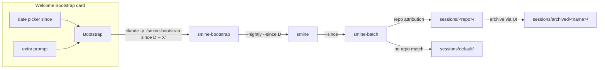

# Bootstrap & Profile Improvements — Change Plan

route: `change`

## TLDR

- **Bootstrap button** gets a form: a date picker ("mine sessions since …") and an Extra prompt field — both travel as skill args in the `claude -p '/smine-bootstrap …'` prompt string; a new `--since` filter threads through smine → smine-batch and filters on the peek `last_active` timestamp.
- **Rename** the `non-developer` audience to **Casual** — canonical front-matter value `casual`, one-time in-place migration of existing profile files, all Go/shell comparison sites, installer label, and the German profile template updated.
- **Casual lockout**: on a casual install the pipeline must never propose (or apply) edits to skills the user does not own; ownership = `origin: user` front-matter stamped on every skill the pipeline creates from the user's own proposals; enforced at extraction (smine-skills), apply (smine-apply, hard gate), and the orchestrate judge.
- **Kill the work/personal scope concept**: mining routes each session into `sessions/<repo-name>/` by the existing repo attribution, and into `sessions/default/` when no repo matches; `--scopes` is retired; folders get archive (active tab), an Archive tab with unarchive and the only delete, and add-time naming-collision handling in the config-server UI.
- **Reload button removed**: the sessions store rescans on every page request — which also fixes the fresh-install bug where sessions never appear because the empty state renders no reload control.
- Existing `sessions/personal/` and `sessions/work/` are not force-migrated — they stop growing and can be archived via the new UI; dedup is safe because session selection unions all folder ledgers, archived included.

## Context

- The Welcome Bootstrap button hardcodes `claude -p '/smine-bootstrap'` ([bootstrap.go:75](internal/server/bootstrap.go)) — no way to exclude dev sessions; the last run mined too much.
- The `non-developer` audience ([presentation.go:17](internal/server/presentation.go)) gates UI, skill visibility, and pipeline defaults, but nothing stops the pipeline from proposing edits to the shipped skills on such an install.
- Scopes (work/personal) are bare directories under `sessions/` — an opinionated second partitioning axis next to the repo roster; the two must collapse into one: the repo.
- Routine runs already have the operator-extension exemplar: `ROUTINE_EXTRA_PROMPT` env → prompt suffix ([run.sh:60-61](routines/smine-nightly/run.sh)) and the configure widget ([routines.go:39](internal/server/routines.go)).
- Constraint: headless `claude -p` skills read args, not env vars — every bootstrap parameter must travel inside the prompt string.

## Drivers

| ID | Observed | Wanted | Impact | Origin |
|---|---|---|---|---|
| DR1 | Bootstrap mined all recent sessions incl. dev sessions; no UI control | Date picker (+ extra prompt) on the Bootstrap button limiting how far back mining goes | behavioral | user request (bootstrap run mined too much) |
| DR2 | Audience label/value is `non-developer` | Mode is named **Casual** everywhere (value, labels, prose) | contract-touching | user request |
| DR3 | Casual installs can receive skill-edit proposals against shipped skills | Casual mode never proposes or applies edits to skills not from the user | behavioral | user request |
| DR4 | Mining partitions by hand-made work/personal scope dirs, output never per repo | One folder per connected repo + a default folder for repo-less sessions; archive/unarchive/delete/collision handling in the UI | contract-touching | user request ("work/personal is one concept too much") |
| DR5 | Sessions store scans once at startup; the only rescan is a button the empty state never renders — a fresh install can never see its sessions | No Reload button at all: the store rescans on every sessions-page request | behavioral | user bug report during plan review |

## Scope

- **In:**
  - **bootstrap-form:** date picker + extra-prompt field on the Welcome Bootstrap card, handler parsing, prompt assembly.
  - **since-filter:** `since <YYYY-MM-DD>` arg on smine-bootstrap, `--since` on smine and smine-batch, filtering on peek `last_active`.
  - **casual-rename:** value `casual`, Go/shell/test/installer/template surfaces, one-time profile-file migration.
  - **casual-lockout:** `origin: user` stamp + gates in smine-skills, smine-apply, smine-orchestrate.
  - **repo-folders:** smine-batch routing per repo attribution, `default` folder, ledger union, `--scopes` retirement, dimension-skill glob exclusion of `archived/`.
  - **folder-ui:** sessions-page archive per folder, Archive tab with unarchive + delete, `sessions/archived/` exclusion in the store, repo-add editable name + reserved-name validation.
  - **reload removal:** Reload button, `POST /sessions/reload`, and the HX-Trigger wiring deleted; rescan-per-request in the sessions and overview handlers.
- **Out:**
  - **proposals layout:** `proposals/*.json` stays global with `repo:<name>` tags — the driver is about mining output, not the proposal store.
  - **peek-mcp:** no peek changes — `last_active` already exists; filtering happens in the miner.
  - **historical docs:** plans/, concept docs, archived plans keep their "non-dev" wording — immutable records.
- **Not changed:**
  - **skill visibility mechanism:** `skillOverrides` hiding for casual installs stays as-is (only the compared value changes).
  - **batch/schema shape:** `reference/schema.json` keeps `batch.scope` — the folder name simply becomes a repo name or `default`.
  - **nightly wrapper roster:** `--repos` assembly from `additionalDirectories` unchanged.
- **Deferred findings:**
  - **ledger doc drift:** smine-batch SKILL.md §0 names `sessions/analyzed-sessions.txt` while the real ledgers are per-scope — fixed in passing by the repo-folders rewrite of that section (noted here because it is a live doc bug found during grounding).
  - **`analyzed-summarize.txt`:** legacy ledger in `sessions/work/` — untouched, dies with the folder when archived.

## Assumptions

| Assumption | Reality | Location |
|---|---|---|
| "Bootstrap … env vars" implies env-var plumbing | Headless skills cannot read env; the nightly's env mechanism works only because run.sh translates env→flags — bootstrap parameters must travel as prompt args (see [D2](#decisions)) | [run.sh:55-61](routines/smine-nightly/run.sh) |
| A count (`n`) controls mining depth | `n` is only a prose instruction with default 30; the UI passes nothing at all today | [smine-bootstrap/SKILL.md:30,35](skills/smine/smine-bootstrap/SKILL.md) |
| Sessions carry a usable timestamp | peek `session_list` returns `last_active` per session | [peek.go:172](internal/peek/peek.go) |
| Repo attribution exists | smine-batch `--repos` does longest-prefix cwd matching; unmatched = `[external]` | [smine-batch/SKILL.md:32](skills/smine/smine-batch/SKILL.md) |

## Current state

| ID | Fact | Location |
|---|---|---|
| C1! | Bootstrap POSTs an empty body; handler hardcodes the prompt `claude -p '/smine-bootstrap'`, auth via token file, detached 6h-deadline child | [bootstrap.go:47-104](internal/server/bootstrap.go) |
| C2! | `audienceNonDeveloper = "non-developer"` is compared in Go (`isDeveloperAudience`), and as a shell literal in sync_skills.sh:261 and run.sh:39-40 | [presentation.go:17-28](internal/server/presentation.go), [sync_skills.sh:261](cmd/sync/sync_skills.sh), [run.sh:39](routines/smine-nightly/run.sh) |
| C3! | The profile file is per-install state (`~/.claude/context/global/presentation-profile.md`), written only at install time from `settings/claude_code/presentation-profile.de.md` | [presentation.go:71-77](internal/server/presentation.go), [install.sh:64-68](install.sh) |
| C4! | Skills have no provenance field — every repo skill reads `author: Kevin Horst`; pipeline-created skills are indistinguishable from shipped ones | skills/*/*/SKILL.md front-matter |
| C5! | A scope is a bare directory under `sessions/`; `batch.scope` carries the dir name; `--scopes` restricts runs; dimension skills glob `sessions/*/*batch-*.md` | [smine-batch/SKILL.md:33](skills/smine/smine-batch/SKILL.md), [smine-skills/SKILL.md:35](skills/smine/smine-skills/SKILL.md) |
| C6! | Ledgers are per scope on disk (`sessions/<scope>/analyzed-*.txt`); the miner's skip-list is consulted at Select | sessions/personal/, sessions/work/ (on disk), [smine-batch/SKILL.md:39](skills/smine/smine-batch/SKILL.md) |
| C7! | The sessions store enumerates every directory under `sessions/` as a scope; the UI serves `/sessions/{scope}/{batch}` | [sessions.go:131-192](internal/sessions/sessions.go), [server.go:317-319](internal/server/server.go) |
| C8! | Repo names: `filepath.Base(path)`, `^[A-Za-z0-9._-]+$`, duplicates rejected (no rename/suffix path); add form has no name input | [registry.go:30,125-144](internal/repos/registry.go), [repos.go:558](internal/server/repos.go), [repos_index.html:5-13](internal/server/templates/repos_index.html) |
| C9 | Routine ops widget is the number-input + hx-post form exemplar; `ROUTINE_EXTRA_PROMPT` is the extra-prompt exemplar | [_routine_ops.html:25-38](internal/server/templates/_routine_ops.html), [routines.go:39](internal/server/routines.go) |
| C10 | smine-nightly assembles `--repos` from git-dir entries of `additionalDirectories`; it never passes `--scopes` | [run.sh:47-58](routines/smine-nightly/run.sh) |
| C11 | Casual pipeline gating exists: audience flips orchestrate on and auto-apply to `decide`; bootstrap reads the profile in step 1 | [run.sh:39-42](routines/smine-nightly/run.sh), [smine-bootstrap/SKILL.md:34](skills/smine/smine-bootstrap/SKILL.md) |
| C12 | German i18n catalog covers user-visible labels; casual UI hides dev surfaces via `isDeveloperAudience` template func | [i18n.go](internal/server/i18n.go), [layout.html:29-33](internal/server/templates/layout.html) |

## Target state



- **Principle — one partitioning axis:** the repo roster is the single source of routing truth; the folder name is the repo name (mechanism: existing longest-prefix cwd attribution).
- **Principle — parameters as args:** every bootstrap parameter is part of the skill invocation string, because that is the only channel a headless skill reads (mechanism: form → handler → prompt assembly).
- **Principle — provenance at creation:** ownership is stamped once, where a skill is born (`origin: user` front-matter), never inferred later.

## Behavior contract

- **Must not change:** bootstrap run mechanics (detached child, token auth, 6h deadline, status polling); dev-audience UI; skill visibility overrides; proposal store shape; batch JSON schema fields; nightly `--repos` assembly; registry file format (`{repos:[{name,path,label}]}`).
- **Intentional changes (per driver):**
  - DR1: bootstrap prompt now carries `since`/extra args; mining selection excludes sessions older than `since`.
  - DR2: on-disk audience value becomes `casual` (migrated in place); user-visible label "Casual".
  - DR3: casual runs drop/refuse skill-edit proposals whose target lacks `origin: user`.
  - DR4: new batches land under repo-named folders or `default`; `--scopes` disappears from smine/smine-batch; sessions UI gains folder archive (active tab) and an Archive tab with unarchive + the only delete; `/sessions/personal|work` keep working until the user archives them.
  - DR5: the Reload button and `POST /sessions/reload` are gone; sessions pages and the overview rescan the store on every GET — a batch written while the server runs appears on the next page load.

## Decisions

| ID | Problem | Facts | Decision | Why |
|---|---|---|---|---|
| D1 | How the mining window is expressed | [C1](#current-state), [C6](#current-state) | A `since` date (inclusive, `YYYY-MM-DD`, filter on `last_active`); `n` stays as fallback default (30) when no `since` is given | [USER] "a timestamp is probably best"; count survives for operator headless runs — controllable (user steers the window), debuggable (one visible arg in the prompt/log) |
| D2 | Transport for date + extra prompt | [C1](#current-state), [C9](#current-state) | Form fields → handler → args inside the `claude -p` prompt string; no env vars | Headless skills read args, not env (the nightly needs run.sh to translate env→flags; bootstrap has no wrapper) — reliable: cannot silently not-arrive |
| D3 | Date input widget | [C9](#current-state) | Native `<input type="date">`, prefilled with today−30d; no JS date-picker lib | Zero dependencies; the browser renders a real picker; mirrors the number-input pattern of the routine ops form |
| D4 | Canonical casual value + migration | [C2](#current-state), [C3](#current-state) | Value `casual`; sync_skills.sh migrates the profile file in place (one `sed`) before reading; loaders compare only `casual`; template/installer write `casual` | Replace means the old value is gone (no read-side alias in 3 readers forever); sync runs on every deploy on every install, so migration hits before any comparison flips behavior |
| D5 | Go identifier surface for the rename | [C2](#current-state), [C12](#current-state) | `audienceCasual = "casual"`; predicate stays `isDeveloperAudience()` (templates unchanged in polarity) | Minimal diff: 11 template call sites keep their meaning; the two poles are developer vs casual |
| D6 | Ownership marker for DR3 | [C4](#current-state) | New front-matter key `origin: user`, stamped by smine-apply (and skillroutine-create when driven by a proposal) on every skill it creates; absence = not the user's | Single source of truth at creation; grep-able; no manifest to desync |
| D7 | Lockout enforcement points | [C11](#current-state) | smine-skills: casual → skill-edit/workflow-edit candidates against non-`origin: user` targets are dropped (listed in run report); smine-apply: hard refuse + disposition `casual-locked`; smine-orchestrate judge: reject any surviving violation | Prompt-layer gates are soft — the apply stage is the hard gate before code changes; extraction gate keeps the proposal UI clean ("it must never be proposed") |
| D8 | Folder identity & routing | [C5](#current-state), [C10](#current-state) | Folder = roster repo name from the existing `--repos` attribution; unmatched sessions → `sessions/default/`; batches are per folder (a batch never spans folders) | One axis (repo), zero new matching logic; per-folder batches keep `batch.scope`, ledger cursors, and the sessions UI working unchanged |
| D9 | `--scopes` retirement | [C5](#current-state) | Remove the flag from smine and smine-batch (args, prose, schema description); nightly never passed it | Replace, not deprecate — a dead flag kept "just in case" is the forbidden parallel mechanism |
| D10 | Dedup across folder changes | [C6](#current-state) | Session-selection skip-list = union of `sessions/*/analyzed-sessions.txt` **and** `sessions/archived/*/analyzed-sessions.txt`; per-folder dimension ledgers stay per folder | A session mined under the old scope layout (or an archived folder) must never re-mine; union makes migration free |
| D11 | Existing work/personal dirs | [C6](#current-state), [C7](#current-state) | No automatic migration — they stay as ordinary folders (receiving no new batches) until the user archives/deletes them via the new UI | Forced moves break deep links and destroy nothing-wrong data; the user asked for archive handling via UI, so give the user the lever |
| D12 | Archive semantics | [C7](#current-state) | Archive = move `sessions/<name>` → `sessions/archived/<name>`; mining and dimension globs exclude `archived/`; ledgers inside remain consulted for dedup (D10); unarchive moves it back (error when a live folder of that name meanwhile exists); delete removes an **archived** folder only, after a confirm that names the re-mining consequence | Disk-visible state, deterministic boundary; archive-then-delete is a two-step guard — a live folder can never be deleted directly |
| D13 | Naming collisions | [C8](#current-state) | Repo-add form gets an editable Name field prefilled by the picker (basename); `default` and `archived` become reserved names rejected by `Repo.Validate`; duplicate names keep being rejected with the existing error — the user resolves by editing the name | UI-resolvable collisions without silent auto-suffixing (identity should be chosen, not invented); reserved names protect the two structural folders |
| D14 | Registry delete vs folder | [C8](#current-state) | Removing a repo from the registry leaves its sessions folder untouched (orphan folder remains manageable via archive/delete UI) | Matches the existing "repository on disk is untouched" semantics; no destructive surprise |
| D15 | Batch numbering per folder | [C5](#current-state) | Batch numbers are per folder (existing per-scope behavior), starting at 01 in a fresh folder | Zero change to number resolution, UI sorting, or ledger cursor format |
| D16 | Where the folder controls live | [C7](#current-state) | [USER] Sessions index: the active folder tab carries "Archive folder"; a trailing **Archive tab** lists archived folders and holds unarchive and the only delete button | The folder is what the user is looking at there; delete lives one deliberate step away, behind archive — safety and a cleaner main view |
| D17 | Reload-from-disk button | [C7](#current-state) | [USER] Remove the button, the `POST /sessions/reload` endpoint, and the `sessions-reload` HX-Trigger wiring; the store rescans (`Reload()`) at the start of every sessions-page GET (index, scope, batch) and the overview handler | The scan is a cheap local read; startup-only load caused the fresh-install invisibility bug — request-time rescan removes the button and the bug with one mechanism |

## Open questions

- None — all decisions closed ([D16](#decisions), [D17](#decisions) answered during review).

## Baseline (verified)

N/A — new route.

## Exemplar & reuse

N/A — new route (mirrors live on the Changes entries).

## Changes

### Phase A — Bootstrap parameterization (DR1)

#### A1. Bootstrap card form (modified)

location: `internal/server/templates/welcome.html`
mirrors: `internal/server/templates/_routine_ops.html` (form → hx-post pattern)
ui: screenshot at verification (config server UI; see Hot items)

```diff
 <h2>bootstrap</h2>
 <div class="card">
-  <div class="check-row">
-    <span class="check-name">Bootstrap</span>
-    <span class="check-detail">seed this install from the machine's recent sessions — mine, consolidate, auto-apply, orchestrate in one run</span>
-    <button class="verify-button" hx-post="/welcome/bootstrap" hx-target="#bootstrap-result" hx-swap="innerHTML"
-            hx-disabled-elt="this"
-            hx-confirm="Runs the full smine pipeline over the machine's recent sessions — a long, paid claude run. Continue?">Bootstrap</button>
-  </div>
+  <form class="check-row" hx-post="/welcome/bootstrap" hx-target="#bootstrap-result" hx-swap="innerHTML"
+        hx-disabled-elt="find button"
+        hx-confirm="Runs the full smine pipeline over the machine's recent sessions — a long, paid claude run. Continue?">
+    <span class="check-name">Bootstrap</span>
+    <span class="check-detail">seed this install from the machine's sessions — mine, consolidate, auto-apply, orchestrate in one run</span>
+    <label class="meta">mine sessions since
+      <input type="date" name="since" value="{{.BootstrapSinceDefault}}" max="{{.BootstrapToday}}">
+    </label>
+    <input type="text" name="extra-prompt" maxlength="500" placeholder="extra prompt (optional)">
+    <button type="submit" class="verify-button">Bootstrap</button>
+  </form>
   <div id="bootstrap-result" hx-preserve="true"></div>
 </div>
```

- `BootstrapSinceDefault` / `BootstrapToday` are computed in the welcome page handler (today−30d / today, `2006-01-02`); added to the existing welcome page view struct in `internal/server/welcome.go`.

#### A2. Bootstrap handler parses the form (modified)

location: `internal/server/bootstrap.go`

```diff
 func (s *Server) handleWelcomeBootstrap(w http.ResponseWriter, r *http.Request) {
 	s.bootstrap.mu.Lock()
 	defer s.bootstrap.mu.Unlock()
 	if s.bootstrap.running {
 		respond.WithConflict("a bootstrap run is already in progress", w)
 		return
 	}
+
+	skillArgs, err := bootstrapSkillArgs(r.FormValue("since"), r.FormValue("extra-prompt"))
+	if err != nil {
+		respond.WithBadRequest(err.Error(), w)
+		return
+	}
 	// ...
-	script := verifyPathPrefix + `CLAUDE_CODE_OAUTH_TOKEN="$(tr -d '[:space:]' < "$1")" exec claude -p '/smine-bootstrap'`
+	script := verifyPathPrefix + `CLAUDE_CODE_OAUTH_TOKEN="$(tr -d '[:space:]' < "$1")" exec claude -p "$2"`
 	runCtx, cancel := context.WithTimeout(context.Background(), bootstrapDeadline)
-	cmd := exec.CommandContext(runCtx, bashPath, "-c", script, "bash", tokenPath)
+	cmd := exec.CommandContext(runCtx, bashPath, "-c", script, "bash", tokenPath, "/smine-bootstrap"+skillArgs)
```

New helper (complete unit):

```go
// bootstrapSkillArgs turns the form inputs into the skill-arg suffix of the
// headless prompt — args are the only channel a headless skill reads (D2).
func bootstrapSkillArgs(since string, extraPrompt string) (string, error) {
	args := ""

	// since
	since = strings.TrimSpace(since)
	if since != "" {
		if _, err := time.Parse("2006-01-02", since); err != nil {
			return "", fmt.Errorf("bootstrapSkillArgs: Invalid field since: %q", since)
		}
		args += " since " + since
	}

	// extra-prompt
	extraPrompt = strings.TrimSpace(extraPrompt)
	if strings.ContainsAny(extraPrompt, "\"'\n") {
		return "", errors.New("bootstrapSkillArgs: Invalid field extra-prompt: Quotes and newlines are not allowed")
	}
	if extraPrompt != "" {
		args += " -- " + extraPrompt
	}
	return args, nil
}
```

- The prompt now passes through `"$2"` (a bash positional, exactly like the token path `$1`) — no shell-quoting of user text into the script string; the quote/newline rejection keeps the prompt a single safe word for `claude -p`.

#### A3. smine-bootstrap skill gains `since` + extra prompt (modified)

location: `skills/smine/smine-bootstrap/SKILL.md`, `skills/smine/smine-bootstrap/changelog.json`

```diff
-argument-hint: "[n]"
+argument-hint: "[n] [since YYYY-MM-DD] [-- extra instruction]"
 ...
 ## Args

-- n: positional, default 30 — how many of the machine's most recent sessions to mine.
+- n: positional, default 30 — how many of the machine's most recent sessions to mine; ignored when `since` is given.
+- since <YYYY-MM-DD>: mine only sessions last active on or after this date (inclusive); wins over n.
+- -- <extra instruction>: free-text operator instruction appended verbatim to the mine-stage invocation.
 ...
-2. **Mine** — invoke the Skill tool with skill="smine" and args="--nightly", prefixed by the scoping instruction: mine only the machine's most recent n sessions (state n explicitly); follow the loaded skill exactly and treat its STOP-for-review as finish-and-return.
+2. **Mine** — invoke the Skill tool with skill="smine" and args="--nightly" plus `--since <date>` when given, prefixed by the scoping instruction (with `since`: mine only sessions last active on or after the date; without: mine only the machine's most recent n sessions, state n explicitly) and by the extra instruction verbatim when given; follow the loaded skill exactly and treat its STOP-for-review as finish-and-return.
```

- Frontmatter version bump + changelog entry (ACDSL-SKILL-001).

#### A4. smine pipeline passes `--since` through (modified)

location: `skills/smine/smine/SKILL.md`, `skills/smine/smine/changelog.json`, `skills/smine/smine/workflows/session-mine.js`

```diff
 ## Args
 ...
+- `--since <YYYY-MM-DD>`: mine only sessions last active on or after this date. Passed through verbatim to smine-batch. Absent → no date floor.
```

- `argument-hint` and description Args summary updated; §1 Resolve parses `since`; §2 Run adds `--since` to the smine-batch invocation; the workflow script forwards `args.since` the same way it forwards `agents`.

#### A5. smine-batch applies the date floor (modified)

location: `skills/smine/smine-batch/SKILL.md`, `skills/smine/smine-batch/changelog.json`

```diff
 ## Args
 ...
+- `--since <YYYY-MM-DD>`: only sessions whose `last_active` (from `session_list`) is on or after this date qualify; older sessions are excluded before batching — never listed as skipped.
 ...
 ## 1. Select

 - `session_list` once per agent in `--agents` (`agent: claude` / `agent: codex`). Exclude the current session. Merge newest → oldest across agents.
-- Order newest → oldest unless a range is given.
+- With `--since`, drop sessions whose `last_active` is before the date, then order newest → oldest.
 - Batch size: 10 (or user-given).
```

### Phase B — Casual rename (DR2)

#### B1. Presentation profile model (modified)

location: `internal/server/presentation.go`

```diff
 const (
-	audienceNonDeveloper = "non-developer"
-	languageEnglish      = "en"
+	audienceCasual  = "casual"
+	languageEnglish = "en"
 )
 ...
 func (p *presentationProfile) isDeveloperAudience() bool {
-	return p.Audience != audienceNonDeveloper
+	return p.Audience != audienceCasual
 }
```

#### B2. sync_skills.sh — migration + comparison (modified)

location: `cmd/sync/sync_skills.sh`

```diff
 PRESENTATION_PROFILE="$HOME/.claude/context/global/presentation-profile.md"
 SETTINGS_FILE="$HOME/.claude/settings.json"
 OVERLAY_FILE="$HOME/.config/claude-routine/skill-overrides.json"
 profile_audience=""
 if [ -f "$PRESENTATION_PROFILE" ]; then
+  # One-time migration: the audience value was renamed non-developer -> casual (D4).
+  if grep -q '^audience:[[:space:]]*non-developer' "$PRESENTATION_PROFILE"; then
+    sed 's/^audience:[[:space:]]*non-developer/audience: casual/' "$PRESENTATION_PROFILE" > "$PRESENTATION_PROFILE.tmp" \
+      && mv "$PRESENTATION_PROFILE.tmp" "$PRESENTATION_PROFILE"
+  fi
   profile_audience="$(sed -n 's/^audience:[[:space:]]*//p' "$PRESENTATION_PROFILE" | head -1)"
 fi
 ...
-if [ "$profile_audience" = "non-developer" ]; then
+if [ "$profile_audience" = "casual" ]; then
```

- Comment block above ("Non-developer installs hide…") rewords to "Casual installs…".

#### B3. Nightly wrapper comparison (modified)

location: `routines/smine-nightly/run.sh`

```diff
-[[ -z "$orchestrate" && "$profile_audience" == "non-developer" ]] && orchestrate=1
-if [[ -z "${SMINE_AUTO_APPLY:-}" && "$profile_audience" == "non-developer" ]]; then
+[[ -z "$orchestrate" && "$profile_audience" == "casual" ]] && orchestrate=1
+if [[ -z "${SMINE_AUTO_APPLY:-}" && "$profile_audience" == "casual" ]]; then
```

- run.sh runs after sync_skills.sh on every deployed install (sync is part of install/update and the nightly repo sync), so the migration in B2 lands first; as a belt-and-braces the comparison is the only other reader and a not-yet-migrated file simply behaves as developer for that one night.

#### B4. Profile template + installer label (modified)

location: `settings/claude_code/presentation-profile.de.md`, `installer/windows/smine.iss`

```diff
 ---
 language: de
-audience: non-developer
+audience: casual
 ---
 # Presentation profile (injected into every session on this machine)

-This machine belongs to a German-speaking non-developer. For everything this
+This machine belongs to a German-speaking casual user. For everything this
```

```diff
-  ProfilePage.Add('Deutsch - nicht-technisch (German, non-developer)');
+  ProfilePage.Add('Deutsch - nicht-technisch (German, casual)');
```

#### B5. Rename sweep — tests, prose, docs (modified)

location: `internal/server/presentation_test.go`, `internal/server/overview_test.go`, `internal/server/repos_test.go`, `internal/server/server_test.go`, `cmd/tests/test_sync_skills_overrides.sh`, `skills/smine/smine-bootstrap/SKILL.md`, `skills/smine/smine-orchestrate/SKILL.md`, `settings/claude_code/CLAUDE.md`, `internal/server/repos.go` (comment), `internal/server/overview.go` (comment)

- Test fixtures writing `audience: non-developer` → `audience: casual`; test names `*NonDeveloper*` → `*Casual*` (e.g. `TestNavCasual`).
- Skill/doc prose: "non-developer" → "casual" where it names the mode (not where historical plans quote it).
- Grep-to-zero criterion in Contracts & sweeps.

### Phase C — Casual skill-edit lockout (DR3)

#### C1. Provenance stamp on pipeline-created skills (modified)

location: `skills/smine/smine-apply/SKILL.md`, `skills/skillroutine/skillroutine-create/SKILL.md` (+ both changelog.json)

```diff
+- Every skill created from a proposal carries `origin: user` in its SKILL.md frontmatter (one line, after `author:`) — the provenance marker the casual lockout keys on (D6). Never add it to shipped skills; never remove it.
```

- smine-apply Implementations section (skills kind) and skillroutine-create's skill-route format both state the stamp.

#### C2. Extraction gate in smine-skills (modified)

location: `skills/smine/smine-skills/SKILL.md`, `skills/smine/smine-skills/changelog.json`

```diff
 ## 2. Inventory check

 - Read the live `skills/` inventory (this repo). A candidate an existing skill already covers becomes an **edit** to that skill or is marked covered — never a duplicate proposal.
+- **Casual lockout** — read `~/.claude/context/global/presentation-profile.md` first; when `audience: casual`, an edit (skill or workflow) may target only a skill whose SKILL.md frontmatter carries `origin: user`. Any other edit candidate is dropped and listed in the run report (`dropped: casual lockout — <target>`); it is never written to `skills.json`. New-skill proposals stay allowed — smine-apply stamps them `origin: user` at creation.
```

#### C3. Hard gate in smine-apply (modified)

location: `skills/smine/smine-apply/SKILL.md`, `skills/smine/smine-apply/changelog.json`

```diff
+- **Casual lockout (hard gate)** — when the profile audience is `casual`: before implementing a skills-kind proposal targeting an existing skill, read the target's frontmatter; without `origin: user`, do not touch the skill — set the proposal's disposition to `casual-locked` with a one-line note, regardless of vote or auto-apply mode.
```

#### C4. Orchestrate judge check (modified)

location: `skills/smine/smine-orchestrate/SKILL.md`, `skills/smine/smine-orchestrate/changelog.json`

```diff
+- On a casual install, reject any commit in the run branch that modifies a `skills/*/*/SKILL.md` (or its bundled files) lacking `origin: user` — the casual lockout is a hard invariant, a violation fails the stage.
```

### Phase D — Per-repo mining folders (DR4)

#### D-1. smine-batch routing rewrite (modified)

location: `skills/smine/smine-batch/SKILL.md`, `skills/smine/smine-batch/changelog.json`, `skills/smine/smine-batch/reference/schema.json`

```diff
 ## Args
 ...
-- `--scopes <name,…>`: restrict the run to these scope directories under `sessions/`. Absent → all discovered scope dirs (every directory under `sessions/`). The scope directory name is the scope's identity — `.batch.scope` in the emitted JSON carries it verbatim (see `reference/schema.json`); a scope is created by creating its directory.
+- (removed — folder routing is derived from `--repos` attribution; there is no scope flag.)
 ...
 ## 0. Setup

-- Output dir: `sessions/` under the cwd; per-batch JSON to `sessions/<scope>/json/<batch-stem>.json` (§4), against `reference/schema.json`.
-- Ledger: `sessions/analyzed-sessions.txt`, one full session ID per line. Skip listed sessions on re-runs; append after each batch.
+- Output routing: one folder per session, derived from `--repos` attribution — the matched roster name, or `default` when no roster entry matches (or no roster is given). Folder = `sessions/<name>/`, created on first use; `archived` and `default` are reserved (`archived/` is never a mining target). Per-batch JSON to `sessions/<name>/json/<batch-stem>.json` (§4), against `reference/schema.json`; `.batch.scope` carries the folder name.
+- Ledger: `sessions/<name>/analyzed-sessions.txt`, one full session ID per line, appended after each batch. The skip-list consulted at Select is the union of every `sessions/*/analyzed-sessions.txt` and `sessions/archived/*/analyzed-sessions.txt` — a session mined into any folder, live or archived, never re-mines (D10).
 ...
 ## 1. Select

 - `session_list` once per agent in `--agents` (`agent: claude` / `agent: codex`). Exclude the current session. Merge newest → oldest across agents.
 - With `--since`, drop sessions whose `last_active` is before the date, then order newest → oldest.
-- Batch size: 10 (or user-given).
+- Group the qualifying sessions by target folder (attribution above); a batch never spans folders. Batch size: 10 per folder (or user-given); batch numbers continue per folder (a fresh folder starts at 01).
```

- schema.json `batch.scope` description: "folder name under sessions/ — the attributed repo's roster name, or `default`" (field kept, semantics narrowed).

#### D-2. smine pipeline — scope flag out, folder enumeration in (modified)

location: `skills/smine/smine/SKILL.md`, `skills/smine/smine/changelog.json`, `skills/smine/smine/workflows/session-mine.js`

- Remove `--scopes` from description, argument-hint, Args, §1 Resolve, §2 Run, and the workflow args object.
- §1 `--no-batch` cursor resolution: "All scope dirs under `sessions/`" → "every folder under `sessions/` except `archived/`".

#### D-3. Dimension skills — glob excludes archived (modified)

location: `skills/smine/smine-skills/SKILL.md`, `skills/smine/smine-context/SKILL.md`, `skills/smine/smine-routines/SKILL.md`, `skills/smine/smine-memory/SKILL.md` (+ changelogs)

```diff
-- Input: batch reports `sessions/*/*batch-*.md` — every scope directory under `sessions/` except `proposals/` (both naming schemes: `sessions-batch-NN.md`, `session-analysis-batch-NN.md`).
+- Input: batch reports `sessions/*/*batch-*.md` — every folder under `sessions/` except `archived/` (both naming schemes: `sessions-batch-NN.md`, `session-analysis-batch-NN.md`).
```

#### D-4. Sessions store excludes archived (modified)

location: `internal/sessions/sessions.go`

```diff
 	for _, scopeDir := range scopeDirs {
 		if !scopeDir.IsDir() {
 			continue
 		}
+		// sessions/archived/ holds folders archived via the UI — out of the
+		// store, still consulted by the miner's ledger union (plan D12).
+		if scopeDir.Name() == "archived" {
+			continue
+		}
```

#### D-5. Folder archive/unarchive/delete handlers + request-time rescan (modified + new)

location: `internal/server/sessions.go`, `internal/server/server.go` (routes)

```diff
 	mux.HandleFunc("GET /sessions/{scope}", s.handleSessionsScope)
 	mux.HandleFunc("GET /sessions/{scope}/{batch}", s.handleSessionsBatch)
-	mux.HandleFunc("POST /sessions/reload", s.handleSessionsReload)
+	mux.HandleFunc("GET /sessions/archive", s.handleSessionsArchiveTab)
+	mux.HandleFunc("POST /sessions/{scope}/archive", s.handleSessionsScopeArchive)
+	mux.HandleFunc("POST /sessions/archive/{name}/unarchive", s.handleSessionsScopeUnarchive)
+	mux.HandleFunc("POST /sessions/archive/{name}/delete", s.handleSessionsScopeDelete)
```

- The literal `GET /sessions/archive` wins over the `GET /sessions/{scope}` pattern (Go 1.22 mux precedence) — `archive` is a reserved folder name (D13), so no live scope can shadow it.
- `handleSessionsReload` and its test are deleted (D17); instead every sessions GET handler (`handleSessionsIndex`, `handleSessionsScope`, `handleSessionsBatch`, `handleSessionsArchiveTab`) and `handleOverview` call `s.sessions.Reload()` first (error → the existing serving-empty log pattern, page still renders).

```go
func (s *Server) handleSessionsScopeArchive(w http.ResponseWriter, r *http.Request) {
	result := opResult{Page: pageSessions, Subject: "archive " + r.PathValue("scope")}
	if err := s.sessions.ArchiveScope(r.PathValue("scope")); err != nil {
		result.Error = err.Error()
	}
	w.Header().Set("HX-Redirect", "/sessions")
	s.renderFragment(w, tmplOpResult, result)
}

func (s *Server) handleSessionsScopeUnarchive(w http.ResponseWriter, r *http.Request) {
	result := opResult{Page: pageSessions, Subject: "unarchive " + r.PathValue("name")}
	if err := s.sessions.UnarchiveScope(r.PathValue("name")); err != nil {
		result.Error = err.Error()
	}
	w.Header().Set("HX-Redirect", "/sessions/archive")
	s.renderFragment(w, tmplOpResult, result)
}

func (s *Server) handleSessionsScopeDelete(w http.ResponseWriter, r *http.Request) {
	result := opResult{Page: pageSessions, Subject: "delete " + r.PathValue("name")}
	if err := s.sessions.DeleteScope(r.PathValue("name")); err != nil {
		result.Error = err.Error()
	}
	w.Header().Set("HX-Redirect", "/sessions/archive")
	s.renderFragment(w, tmplOpResult, result)
}
```

- No explicit store reload inside the ops: the redirect's GET rescans (D17) — one mechanism.
- `handleSessionsArchiveTab` renders the archive tab from `Store.ArchivedFolders()` (D-6) with the live scope names for the tab row.

#### D-6. Store archive/unarchive/delete operations (new)

location: `internal/sessions/sessions.go`

```go
type ArchivedFolder struct {
	MdReports int
	Name      string
}

// ArchiveScope moves sessions/<name> to sessions/archived/<name>; the folder
// leaves the store but its ledgers stay consulted by the miner (plan D10/D12).
func (s *Store) ArchiveScope(name string) error {
	if err := validateScopeName(name); err != nil {
		return fmt.Errorf("Store.ArchiveScope: %w", err)
	}

	archivedDir := filepath.Join(s.dir, "archived")
	if err := os.MkdirAll(archivedDir, 0o755); err != nil {
		return fmt.Errorf("Store.ArchiveScope: Failed to create %s: %w", archivedDir, err)
	}

	target := filepath.Join(archivedDir, name)
	if _, err := os.Stat(target); err == nil {
		return fmt.Errorf("Store.ArchiveScope: %s already archived", name)
	}
	if err := os.Rename(filepath.Join(s.dir, name), target); err != nil {
		return fmt.Errorf("Store.ArchiveScope: Failed to move %s: %w", name, err)
	}
	return nil
}

// ArchivedFolders lists sessions/archived/* with their report counts — the
// archive tab's data; a missing archived/ dir is an empty list.
func (s *Store) ArchivedFolders() []ArchivedFolder

// UnarchiveScope moves sessions/archived/<name> back to sessions/<name>; a
// live folder of that name (repo re-registered and mined meanwhile) is an
// error, never a merge.
func (s *Store) UnarchiveScope(name string) error {
	if err := validateScopeName(name); err != nil {
		return fmt.Errorf("Store.UnarchiveScope: %w", err)
	}

	target := filepath.Join(s.dir, name)
	if _, err := os.Stat(target); err == nil {
		return fmt.Errorf("Store.UnarchiveScope: %s already exists as a live folder", name)
	}
	if err := os.Rename(filepath.Join(s.dir, "archived", name), target); err != nil {
		return fmt.Errorf("Store.UnarchiveScope: Failed to move %s: %w", name, err)
	}
	return nil
}

// DeleteScope removes sessions/archived/<name> permanently — batches and
// ledgers; only archived folders are deletable (plan D12), and the UI confirm
// names the consequence (still-indexed sessions may re-mine).
func (s *Store) DeleteScope(name string) error {
	if err := validateScopeName(name); err != nil {
		return fmt.Errorf("Store.DeleteScope: %w", err)
	}

	target := filepath.Join(s.dir, "archived", name)
	if _, err := os.Stat(target); err != nil {
		return fmt.Errorf("Store.DeleteScope: %s is not archived: %w", name, err)
	}
	if err := os.RemoveAll(target); err != nil {
		return fmt.Errorf("Store.DeleteScope: Failed to remove %s: %w", name, err)
	}
	return nil
}

// validateScopeName rejects path traversal and the archive container itself;
// "default" stays archivable — it is an ordinary mining folder.
func validateScopeName(name string) error {
	// name (also a path segment: never traversal, never the archive container)
	isUnsafe := name == "" || name == "archived" || name == "." || name == ".." || name != filepath.Base(name)
	if isUnsafe || strings.ContainsAny(name, `/\`) {
		return fmt.Errorf("Invalid scope name %q", name)
	}
	return nil
}
```

- `ArchivedFolders` body mirrors the Reload dir walk (ReadDir + md-report count) — elided here as covered boilerplate of that exemplar.

#### D-7. Sessions index — archive control, Archive tab, reload removal (modified + new)

location: `internal/server/templates/sessions_index.html`, `internal/server/templates/sessions_archive.html` (new)
mirrors: `repos_index.html` remove form (confirm + hx-post)
ui: screenshot at verification (see Hot items)

```diff
 <div class="tabs">
   {{$active := .Scope.Name}}
   {{range .ScopeNames}}
   <a href="/sessions/{{.}}" {{if eq . $active}}class="active"{{end}}>{{.}}</a>
   {{end}}
+  <a href="/sessions/archive">{{t "archive"}}</a>
 </div>
-<form hx-post="/sessions/reload" hx-target="#op-result" class="reload-form">
-  <button type="submit" class="small">{{t "Reload from disk"}}</button>
-</form>
+<form class="reload-form" hx-post="/sessions/{{.Scope.Name}}/archive" hx-target="#op-result"
+      hx-confirm="{{t "Archive this folder? Its analyses disappear from this page; nothing is re-mined."}}">
+  <button type="submit" class="small">{{t "Archive folder"}}</button>
+</form>
 <div id="op-result"></div>
-{{/* Reload changes the batch set, so the list re-pulls itself when the
-     reload op fires HX-Trigger: sessions-reload. */}}
 <h2>{{t "batches"}}</h2>
-<div id="batch-list-wrap" hx-get="/sessions/{{.Scope.Name}}" hx-trigger="sessions-reload from:body"
-     hx-select="#batch-list-wrap" hx-swap="outerHTML" hx-disinherit="*">
+<div id="batch-list-wrap">
 {{template "_batch_list.html" .}}
 </div>
```

New `sessions_archive.html` (complete page body between the shared head/nav/foot):

```html
{{template "head" .}}
{{template "nav" .}}
<h1>{{t "Sessions"}}</h1>
<div class="tabs">
  {{range .ScopeNames}}
  <a href="/sessions/{{.}}">{{.}}</a>
  {{end}}
  <a href="/sessions/archive" class="active">{{t "archive"}}</a>
</div>
<div id="op-result"></div>
{{if .Archived}}
<table class="md-body checklist-table">
  <tbody>
    {{range .Archived}}
    <tr>
      <td>{{.Name}}</td>
      <td>{{.MdReports}} {{t "batches"}}</td>
      <td>
        <form hx-post="/sessions/archive/{{pathEscape .Name}}/unarchive" hx-target="#op-result">
          <button type="submit" class="small">{{t "Unarchive"}}</button>
        </form>
      </td>
      <td>
        <form hx-post="/sessions/archive/{{pathEscape .Name}}/delete" hx-target="#op-result"
              hx-confirm="{{t "Delete this folder permanently? Analyses and ledgers are removed; its sessions may be mined again."}}">
          <button type="submit" class="small">{{t "Delete"}}</button>
        </form>
      </td>
    </tr>
    {{end}}
  </tbody>
</table>
{{else}}
<div class="empty">{{t "No archived folders."}}</div>
{{end}}
{{template "foot" .}}
```

- The empty-state branch of `sessions_index.html` also gains the tabs row (archive tab only) — the fresh-install page is no longer a dead end.
- Removed with the button: `handleSessionsReload`, the `POST /sessions/reload` route, the `sessions-reload` HX-Trigger test, and the "Reload from disk" German catalog entry; new label strings ("archive", "Archive folder", "Unarchive", "Delete", "No archived folders.", both confirm texts) added to `germanCatalog` in `internal/server/i18n.go`.

#### D-8. Repo add — editable name + reserved names (modified)

location: `internal/server/repos.go`, `internal/repos/registry.go`, `internal/server/templates/repos_index.html`

```diff
 func (s *Server) handleReposAdd(w http.ResponseWriter, r *http.Request) {
 	path := strings.TrimSpace(r.FormValue("path"))
 	if path == "" {
 		respond.WithBadRequest("path must not be empty", w)
 		return
 	}

 	// Clean strips the picker's trailing slash so Base is the folder name.
 	path = filepath.Clean(path)
+	name := strings.TrimSpace(r.FormValue("name"))
+	if name == "" {
+		name = filepath.Base(path)
+	}
 	grantAccess := r.FormValue("additional-dir") == "on" || !s.profile.isDeveloperAudience()
 	label := strings.TrimSpace(r.FormValue("label"))
-	repo := repos.Repo{Label: label, Name: filepath.Base(path), Path: path}
+	repo := repos.Repo{Label: label, Name: name, Path: path}
```

```diff
 func (r *Repo) Validate() error {
 	// ...
 	// Name (also the URL segment; add/delete/choose-folder/prune-jetbrains are
 	// shadowed for POST by the literal /repos/* routes)
 	if !namePattern.MatchString(r.Name) {
 		return fmt.Errorf("Repo.Validate: Invalid field Name: %q", r.Name)
 	}
+	// The name is also the repo's sessions folder — the two structural folder
+	// names cannot be repo identities (plan D13).
+	if r.Name == "default" || r.Name == "archived" {
+		return fmt.Errorf("Repo.Validate: Invalid field Name: %q is reserved", r.Name)
+	}
```

```diff
     {{template "_repo_path.html" .AddPath}}
+    <input type="text" name="name" maxlength="80" placeholder="{{t "name (default: folder name)"}}"
+           title="registry name — also the mining folder under sessions/; edit to resolve a name collision">
     <input type="text" name="label" maxlength="80" placeholder="{{t "label (optional)"}}">
```

#### D-9. Nightly / bootstrap prose — scope mentions (modified)

location: `routines/smine-nightly/run.sh` (comments only), `skills/smine/smine-orchestrate/SKILL.md`, `README.md`

- Comments/prose naming "scope dirs" or work/personal updated to folder wording; README's sessions-layout description (`sessions/<scope>/`) re-explained as repo folders + `default` + `archived`.
- Grep sweep in Contracts & sweeps catches the full list.

## Hot items

- **Guard logic (ACTION-CONCEPT-HOT-005):** the two new validations are written out above in full — `bootstrapSkillArgs` (A2: date format, quote/newline rejection) and `validateScopeName` / reserved repo names (D-6/D-8). No validation is weakened anywhere; the casual lockout only adds gates.
- **UI changes (ACTION-CONCEPT-HOT-007 / RULE-PLAN-069):** three touched surfaces — Bootstrap card (A1), Sessions index controls (D-7), repo add form (D-8). The config-server UI is verified via curl and real screenshots are captured from the running server at verification time and filed under `plans/bootstrap_profile_improvements/design/ui/` (no mockups — the UI exists; screenshots of the changed UI are a verification deliverable, per repo practice the browser pane cannot reach 127.0.0.1).
- **No CTEs, no concurrency primitives, no new interfaces/generics, no anonymous structs** in any change.

## Tests

| Location.Method | Cases | Comment |
|---|---|---|
| internal/server/bootstrap_test.go `TestBootstrapSkillArgs` | empty inputs → ""<br>valid since → " since 2026-08-01"<br>bad date → error<br>extra prompt appended after " -- "<br>quote/newline in extra → error | new unit test, table-driven |
| internal/server/presentation_test.go | fixtures write `audience: casual`<br>legacy value `non-developer` no longer matches (developer behavior) | updated |
| internal/server/server_test.go `TestNavCasual` | nav gating unchanged under `casual` | renamed + value swap |
| internal/server/overview_test.go / repos_test.go | `*Casual*` renames, value swap<br>repos_test: add with custom name<br>add with reserved name `default`/`archived` → rejected | updated |
| internal/repos/registry_test.go `TestRepoValidate` | reserved names rejected<br>existing name rules still pass | extend existing validate cases |
| internal/sessions/sessions_test.go `TestStoreReload` | `archived/` dir excluded from scopes | extend |
| internal/sessions/sessions_test.go `TestStoreArchiveScope` / `TestStoreUnarchiveScope` / `TestStoreDeleteScope` | archive moves dir under archived/<br>archive of already-archived name → error<br>unarchive restores the dir<br>unarchive with live same-name folder → error<br>delete removes an archived dir<br>delete of a non-archived name → error<br>traversal / `archived` name → error | new |
| internal/server/sessions_test.go | reload endpoint test deleted<br>GET /sessions picks up a batch JSON written after store construction (rescan-per-request)<br>archive tab renders `ArchivedFolders` with unarchive/delete forms | replaces the HX-Trigger test |
| cmd/tests/test_sync_skills_overrides.sh | profile fixture `casual`<br>migration: legacy `non-developer` file is rewritten in place before branching | shell suite |

- Existing tests are the safety net for: bootstrap run mechanics (handler tests keep passing with an empty form → unchanged prompt semantics), sessions batch pages, repos add/delete transactionality.
- Not tested: skill prose gates (C2–C4, A3–A5, D-1–D-3) — SKILL.md files have no executable harness; they are covered by the smine eval framework out of scope here and by the orchestrate judge at run time.

## Test runbook

- N/A — no externally callable surface beyond the config-server UI; scenario index for manual smoke:
  - bootstrap-form: POST `/welcome/bootstrap` with `since` + `extra-prompt` via curl, assert log line shows the assembled prompt.
  - folder-archive: POST `/sessions/work/archive`, assert dir moved and scope gone from `/sessions`.
  - repo-add-collision: POST `/repos/add` with duplicate/reserved name, assert 4xx with message.

## Contracts & sweeps

| Contract | Sides | Sweep |
|---|---|---|
| audience value `casual` | profile file ↔ presentation.go ↔ sync_skills.sh ↔ run.sh ↔ de.md template ↔ installer ↔ tests | `grep -rn "non-developer"` → zero outside plans/, sessions/, evals/, .claude/worktrees/ (historical artifacts excluded per repo sweep rule) |
| `/smine-bootstrap` arg contract | bootstrap.go prompt ↔ smine-bootstrap SKILL args | grep `smine-bootstrap` in internal/server + skills; both name `since` and `--` |
| `--since` flag | smine SKILL ↔ smine-batch SKILL ↔ session-mine.js | grep `--since` across skills/smine — three surfaces, one spelling |
| `--scopes` retirement | smine SKILL ↔ smine-batch SKILL ↔ session-mine.js ↔ schema.json ↔ README | `grep -rn "scopes" skills/smine internal README.md` → zero flag mentions (scope-as-folder prose allowed) |
| folder names reserved | registry.Validate ↔ sessions store ↔ smine-batch SKILL | grep `archived` / `default` in the three surfaces — same reserved set |
| `origin: user` marker | smine-apply ↔ skillroutine-create ↔ smine-skills ↔ smine-orchestrate | grep `origin: user` — four skills, identical key spelling |
| `batch.scope` semantics | smine-batch schema.json ↔ internal/sessions BatchSummary ↔ proposals evidence links | field name unchanged; description-only change — build + existing tests |

## Verification

- [ ] Run `make audit` — green (build, vet, acdsl gates, tests).
- [ ] Run `bash cmd/tests/test_sync_skills_overrides.sh` — green incl. the migration case.
- [ ] Start the config server locally; `curl -s localhost:<port>/welcome | grep 'name="since"'` — date input present with prefilled default.
- [ ] POST `/welcome/bootstrap` with `since=2026-08-01&extra-prompt=skip dev sessions` (token file present) — log shows `claude -p "/smine-bootstrap since 2026-08-01 -- skip dev sessions"`.
- [ ] POST with `since=banana` — 400, no run started.
- [ ] Empty form POST — prompt is bare `/smine-bootstrap` (n=30 default preserved).
- [ ] Write a profile file with `audience: non-developer`, run sync_skills.sh — file now reads `audience: casual` and overrides are applied.
- [ ] `curl /sessions` with a `sessions/archived/x/` fixture — `x` absent from scope tabs, present on `/sessions/archive`.
- [ ] Fresh-install path: start the server with an empty `sessions/`, then write a batch JSON — the next `curl /sessions` shows it without a restart or any reload control.
- [ ] `curl /sessions` — no "Reload from disk" markup; `POST /sessions/reload` returns 404.
- [ ] POST `/sessions/<scope>/archive` on a fixture scope — dir at `sessions/archived/<scope>/`, tabs updated.
- [ ] POST `/sessions/archive/<scope>/unarchive` — dir back under `sessions/`, tab reappears; repeat with a live same-name folder present — error, nothing moved.
- [ ] POST `/sessions/archive/<name>/delete` on a live (non-archived) name — error; on an archived name — dir gone.
- [ ] POST `/repos/add` with `name=default` — rejected with the reserved-name message.
- [ ] POST `/repos/add` twice with the same custom name — second rejected with duplicate message; editing the name in the form succeeds.
- [ ] Degenerate: `sessions/` empty → Sessions page shows the empty state; bootstrap with no profile file → developer defaults (English), no migration attempted.
- [ ] Capture screenshots of the three changed UI surfaces from the running server → `plans/bootstrap_profile_improvements/design/ui/`.
- [ ] Per driver, observe the changed behavior in a real run: DR1 — a bootstrap invocation carries the date and the miner's report names the date floor; DR2 — casual machine renders unchanged German UI; DR3 — a seeded skill-edit proposal against a shipped skill is dropped/refused with `casual-locked`; DR4 — a fresh `/smine` run writes into `sessions/<repo>/` and `sessions/default/`.

## Stop conditions

| ID | Condition | Action |
|---|---|---|
| S1 | An approved signature/contract cannot hold as planned | Stop, report (ACTION-IMPL-001) |
| S2 | Second failed approach in a row on one unit | Stop, re-read state, write a plan (ACTION-IMPL-002) |
| S3 | Discovered work materially exceeds this scope | Stop, ask (ACTION-IMPL-004) |
| S4 | A validation/guard must be weakened to proceed | Stop, ask (ACTION-IMPL-INTEG-007) |
| S5 | Same bug class found twice | Fix all in-diff instances; ask before sweeping (ACTION-IMPL-005) |
| S6 | Structural obstacle tempts a new abstraction | Stop, report (ACTION-IMPL-006) |
| S7 | The `sed` migration would touch a profile file whose audience is neither value | Leave the file, report — never guess a third value |
| S8 | Archiving/deleting a sessions folder in tests touches anything outside `sessions/` | Stop — path handling bug, never widen |
| S9 | A skill-prose gate needs schema.json field changes beyond the description | Stop, ask — the batch schema is a consumer contract |

## Changelog

| Date | Trigger | What changed |
|---|---|---|
| — | initial | plan created |
| 2026-08-27 | Q: folder-controls anchor | Q1 → D16 [USER]: Sessions index + Archive tab holding unarchive and the only delete; mockups A/B presented, A chosen with archive-tab variant |
| 2026-08-27 | local: reload button | New driver DR5 + D17 [USER]: Reload button/endpoint removed, store rescans per GET (fixes fresh-install invisibility); D12 delete narrowed to archived folders; unarchive added |
| 2026-08-27 | adjust: verification finding | Repo add now validates the name before the op — the pre-existing order ran git init on a folder even when the registry would reject the name (surfaced by the reserved-name check against the running server) |
