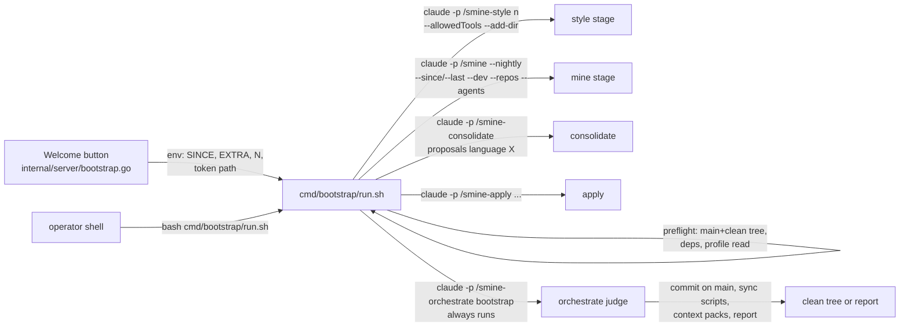

# Smine Bootstrap Improvements — Change Plan

route: `change`

## TLDR

- The Welcome-button bootstrap is rebuilt from a single agent-orchestrated headless session into a wrapper-orchestrated stage script — the proven smine-nightly pattern: each stage is its own `claude -p` with the installed skill's `allowed-tools` manifest passed as `--allowedTools`.
- This structurally fixes four observed failures at once: missing permissions (headless ignores frontmatter allowed-tools), the dead Skill/Workflow tool in headless sessions, the ignored `since` date (now a deterministic `--since` flag, not relayed prose), and the stranded finalization (sync scripts and the style-profile write now run with real permissions; `--add-dir` grants the global context dir).
- The `/smine-bootstrap` skill is deleted — the wrapper script is the single mechanism; the launcher in the config server spawns it.
- Self-mining stops: smine-batch excludes sessions from the smine repo itself and routine-branch sessions by default; only a new profile **Dev Mode** setting (forced off for casual audience) re-enables them, threaded as a `--dev` flag by both wrappers (bootstrap + nightly).
- Presentation gets contracts: the style profile is written in the profile language; casual proposals carry no file paths, rule IDs, or schema jargon in user-visible prose — enforced at authoring (dimension skills), sweep (consolidate), and gate (orchestrate judge).

## Context

- **Problem:** the first real bootstrap run on a fresh Windows install (Ruben's machine) died in the presentation pass with nothing committed; sub-stages ran permission-denied fallbacks throughout; it mined the smine pipeline's own sessions; it ignored the since date; it could not run the sync scripts or install the style profile; proposals shipped with mixed English/German and exposed `context/facts/...` paths and FACT/ACDSL IDs to a casual user.
- **Root cause:** [bootstrap.go:83-85](internal/server/bootstrap.go) launches one bare `claude -p "/smine-bootstrap"` — no `--allowedTools` (headless ignores skill frontmatter allowed-tools, known CLI issue #14956), no `--add-dir`, no `MSYS_NO_PATHCONV`; the skill's Steps assume a mid-session Skill tool that headless `claude -p` does not have.
- **Design:** mirror [routines/smine-nightly/run.sh](routines/smine-nightly/run.sh) — the wrapper owns sequencing, permissions, env→flag translation, and mechanical postconditions; agents own judgment per stage.
- **Originating plan:** [plans/bootstrap_profile_improvements/design/change-bootstrap-profile.md](plans/bootstrap_profile_improvements/design/change-bootstrap-profile.md) — its constraint "every bootstrap parameter must travel inside the prompt string" dissolves here: the wrapper translates env→flags exactly like the nightly.
- **Constraint:** all shell runs under macOS bash 3.2 and Windows Git-bash (ACDSL-SHELL-002); the script must be launchable by the config server on both.

## Drivers

| ID | Observed | Wanted | Impact | Origin |
|---|---|---|---|---|
| DR1 | Headless bootstrap ran without `--allowedTools`; sub-stages hit Bash/Read denials, validation skipped, presentation-profile unreadable | Every stage runs with its skill's manifest as `--allowedTools`, profile values threaded as args | behavioral | failed run 2026-08-26/27 (session c288b8d9, 235f614a) |
| DR2 | The skill instructs Skill-tool invocation; headless has no Skill/Workflow tool — every stage fell back to manual SKILL.md reading, and the run died mid-pass with no terminal state | Wrapper-orchestrated stages, prompt-start slash per stage, guaranteed terminal stage (orchestrate bootstrap always runs) | contract-touching | same run; feedback "it does not know it runs headless" |
| DR3 | The run mined the smine bootstrap/test sessions themselves | smine/routine sessions never mined unless Dev Mode is on (profile setting; casual forces off; default off) | behavioral | user feedback "must never be a smine batch unless the env var is set" |
| DR4 | The since date traveled as relayed prose in the skill prompt and was ignored | `--since` passed deterministically by the wrapper into `/smine`; judge cross-checks | behavioral | user feedback "it ignored the date completely" |
| DR5 | Sync scripts and the style-profile copy failed on permissions; style profile stranded in a staging file | Orchestrate stage runs `cmd/sync/*` under its manifest; style stage writes `~/.claude/context/global/` directly via `--add-dir` | behavioral | failed run, "4 Handgriffe bleiben offen" |
| DR6 | Style profile written in English about German; proposals mixed languages and exposed file paths / FACT-IDs / taxonomy jargon in user-visible text | Style profile written in the profile language; casual user-visible prose free of paths/IDs/jargon, enforced at three points | behavioral | user feedback + proposal-UI screenshot |

## Scope

- **In:**
  - **bootstrap-wrapper:** new `cmd/bootstrap/run.sh` — preflight, profile read, 5 stages, postconditions, dry-run mode.
  - **launcher:** [bootstrap.go](internal/server/bootstrap.go) spawns the script with env instead of building the claude call inline.
  - **skill-retirement:** delete `skills/smine/smine-bootstrap/`; sweep references.
  - **dev-mode:** profile frontmatter key + Profile-page toggle + `--dev` threading in both wrappers.
  - **self-mining-exclusion:** smine-batch Select rule (default-deny) + `--dev` and `--last n` flags; smine pass-through.
  - **presentation-contracts:** smine-style language rule; casual jargon rule in the four dimension skills, consolidate §4, orchestrate gate.
  - **preflight-deps:** shellcheck check in wrapper preflight and installers (warn-only).
- **Out:**
  - **peek-mcp changes:** no new session-filtering mechanism in peek — exclusion is instruction-level in smine-batch, per the user's "for now telling the agent to ignore them is hopefully enough".
  - **nightly restructure:** smine-nightly keeps its worktree/publish flow; it only gains the `--dev` threading.
  - **proposal schema:** no new JSON fields — the jargon rule redistributes content across existing fields.
- **Not changed:**
  - **token/model resolution:** `verifyTokenPath`, `ROUTINE_MODEL`/`ROUTINE_TOKEN` semantics stay.
  - **orchestrate bootstrap mode:** judge/commit-on-main behavior stays; gates only tightened.
  - **casual lockout, repo folders, votes flow:** untouched.
- **Deferred findings:**
  - **counter inflation:** double `skill_invoked` events for one invocation (batch finding) — analytics defect, separate fix.
  - **`.gitattributes` / CRLF preflight:** already present at repo root; no action.
  - **non-interactive git-push credentials on Windows:** orchestrate reports "no remote / push failed" — out of scope here.

## Assumptions

| Assumption | Reality | Location |
|---|---|---|
| Feedback: bootstrap "lacked permissions" as a settings gap | The launcher passes no `--allowedTools` at all; headless ignores frontmatter allowed-tools (#14956) — the nightly wrapper already solves this via `routine_allowed_tools` | [bootstrap.go:83](internal/server/bootstrap.go), [skill.sh:10](routines/_lib/skill.sh) |
| Feedback: skill "does not know" it is headless | `/smine` v1.14 already documents the no-Workflow constraint; only `/smine-bootstrap` still mandates Skill-tool chaining | [smine/SKILL.md:51](skills/smine/smine/SKILL.md), [smine-bootstrap/SKILL.md:37-41](skills/smine/smine-bootstrap/SKILL.md) |
| `claude -p` supports directory grants | `--add-dir <directories...>` exists (probed live this session) | CLI `--help` |
| Routine sessions are identifiable | Routine branches are `claude-routines/<group>-<day>`; peek `session_list` meta carries `git_branch` and `cwd` | [worktree.sh:19](routines/_lib/worktree.sh) |
| `since` filter needs new mechanics | `--since` is already mechanical in smine-batch (drop before batching); only the delivery path was prose | [smine-batch/SKILL.md:26](skills/smine/smine-batch/SKILL.md) |

## Current state

- [internal/server/bootstrap.go](internal/server/bootstrap.go) — spawns one detached `claude -p "/smine-bootstrap"+args`; `bootstrapSkillArgs` validates `since`/`extra-prompt` and appends them as prose skill args; status via pid + peek.
- [skills/smine/smine-bootstrap/SKILL.md](skills/smine/smine-bootstrap/SKILL.md) — orchestrates 5 stages via the Skill tool; clean-tree gate as prose precondition; only consumer paths are the Welcome button and an operator `claude -p`.
- [routines/smine-nightly/run.sh](routines/smine-nightly/run.sh) — the exemplar: per-stage `claude -p` + `--allowedTools` from `routine_allowed_tools`, profile read via `sed`, env→flag translation, wrapper-owned postconditions, casual skill-overlay copy.
- [internal/server/presentation.go](internal/server/presentation.go) — profile frontmatter `language`/`audience` only; [profilesettings.go](internal/server/profilesettings.go) saves them; [templates/profile.html](internal/server/templates/profile.html) renders the form.
- [skills/smine/smine-batch/SKILL.md](skills/smine/smine-batch/SKILL.md) §1 Select — excludes only the current session; no repo-of-origin or routine exclusion, no count cap.
- [skills/smine/smine-style/SKILL.md](skills/smine/smine-style/SKILL.md) — writes `~/.claude/context/global/style-profile.md`; no language rule for the directives themselves.

## Target state



- **Principle:** single orchestration mechanism (wrapper), single source of truth for permissions (installed skill manifests), deterministic parameter delivery (flags, not relayed prose). Mechanism: the repo's existing routine-wrapper library (`routines/_lib/{platform,skill}.sh`), reused unchanged.
- **Dev mode:** one boolean, stored in the presentation profile, surfaced on the Profile page, consumed by both wrappers as `--dev`; smine-batch is default-deny — absence of the flag always excludes smine/routine sessions, so a forgotten flag can never cause self-mining.

## Behavior contract

- **Unchanged:** nightly worktree/publish/drain flow; orchestrate branch mode; votes semantics; `since`/`extra-prompt` form validation rules; bootstrap status polling (pid + peek session resolution); casual skill-visibility overlay behavior.
- **Intentional changes** (map to drivers): bootstrap runs as N headless sessions instead of 1 (DR1/DR2); `/smine-bootstrap` slash command ceases to exist (DR2); mining output on any install excludes smine-repo and routine sessions unless Dev Mode (DR3 — this also changes the nightly on Kevin's dev machine: he must enable Dev Mode once, see Verification); style profile language (DR6); proposal prose constraints (DR6).

## Decisions

| ID | Problem | Facts | Decision | Why |
|---|---|---|---|---|
| D1 | Headless orchestration mechanism | headless has no Skill/Workflow tool; nightly wrapper is proven | [USER] Wrapper-orchestrated stages, one `claude -p` per stage ("wrapper must orchestrate fan-out" — standing feedback) | Controllable (env→flag), debuggable (per-stage envelope + exit), reliable (a dead stage never strands the run) |
| D2 | Fate of `/smine-bootstrap` skill | Both trigger paths go through the wrapper; keeping the skill leaves two parallel mechanisms | Delete `skills/smine/smine-bootstrap/`; operator entry is `bash cmd/bootstrap/run.sh` | Single source of truth; dead modes get deleted, not guarded |
| D3 | Where Dev Mode lives | Profile frontmatter already carries language/audience; wrappers already read it via `sed` | `dev-mode: true|false` in the presentation profile; Profile-page toggle; casual audience forces off; absent ⇒ off | One store, one read path; default-off satisfies "never unless set" |
| D4 | Self-mining exclusion point | Only smine-batch selects sessions; peek changes are out of scope | smine-batch Select: without `--dev`, drop sessions whose cwd is inside the run's repo root (incl. `.claude/worktrees/`) or whose `git_branch` starts with `claude-routines/`; report one count line | Default-deny at the single selection point; instruction-level per user's "for now" |
| D5 | Date/count delivery | `--since` already mechanical in smine-batch; `n` was prose-only | Wrapper passes `--since <d>` XOR `--last <n>` into `/smine`; new `--last` flag threads to smine-batch (keep newest n after merge); orchestrate bootstrap prompt carries `(since: <d>)` and the judge flags older mined sessions | Deterministic flags survive where relayed prose died (DR4) |
| D6 | Outside-repo writes | Style profile and presentation profile live under `~/.claude/context/global`; `--add-dir` probed live; `~/.claude/settings.json` stays CLI-guarded | Every stage gets `--add-dir "$HOME/.claude/context/global"`; settings.json reconciliation stays wrapper-owned (nightly precedent, unchanged for bootstrap: fresh installs get it from the installer) | Direct writes where safe, wrapper-owned where guarded; no staging-file limbo |
| D7 | Terminal-state guarantee | Failed run died mid-pass, nothing committed; old skill said "failed stage stops the run" — that produced the stranding | Stages style→mine→consolidate→apply are best-effort (log + continue); orchestrate bootstrap ALWAYS runs as terminal judge (commit-or-report); wrapper postcondition: report dirty tree as failure | Judge owns accept/fix/reject; every run ends in an explicit state |
| D8 | Jargon enforcement point(s) | User-visible fields enumerated in consolidate Args; orchestrate already gates "no engine jargon" vaguely | Three points: authoring line in each of the 4 dimension skills, concrete sweep rule in consolidate §4, concrete checklist in the orchestrate gate | Prevention at source, correction in sweep, rejection at gate — the sweep alone ran too late in the failed run |
| D9 | Script location + testability | `routines/` implies a scheduled routine (plist contract); `cmd/sync/` holds operational scripts | `cmd/bootstrap/run.sh`, sourcing `routines/_lib/{platform,skill}.sh`; `BOOTSTRAP_DRY_RUN=1` prints stage commands without executing | One-shot ≠ routine; dry-run makes prompt assembly shell-testable |
| D10 | MSYS path mangling | `/smine-bootstrap` arg was converted to `C:/Program Files/Git/smine-bootstrap` on Windows | `export MSYS_NO_PATHCONV=1` and `MSYS2_ARG_CONV_EXCL='*'` at the top of run.sh | Fixes the launcher-pathconv defect at the single new entry point |

## Open questions

None — all decisions closed above.

## Baseline (verified)

N/A — change route (facts live in Current state and per-entry locations).

## Exemplar & reuse

N/A — change route (mirrors on the Changes entries: `run.sh` mirrors `routines/smine-nightly/run.sh`; reuse: `routines/_lib/platform.sh` `routine_run_claude`, `routines/_lib/skill.sh` `routine_allowed_tools`, `verifyTokenPath`, `verifyBashPath`, `verifyPathPrefix`).

## Changes

### Phase 1 — Wrapper script, launcher, skill retirement, pipeline flags (DR1, DR2, DR4, DR5)

#### Bootstrap wrapper script (new)

location: `cmd/bootstrap/run.sh`
mirrors: `routines/smine-nightly/run.sh` (stage runner, profile read, allowed-tools, envelope logging)

```bash
#!/usr/bin/env bash
# One-shot smine bootstrap orchestrator — Welcome button (internal/server/
# bootstrap.go) or an operator's `bash cmd/bootstrap/run.sh`.
# Headless claude -p has no Skill/Workflow tool and ignores frontmatter
# allowed-tools, so this wrapper owns sequencing, permissions (installed
# skill manifests as --allowedTools), and the terminal state; the stage
# agents own judgment. Runs on the main checkout, main branch, clean tree;
# /smine-orchestrate bootstrap commits the result on main.
# Env: BOOTSTRAP_TOKEN_FILE (required), BOOTSTRAP_SINCE, BOOTSTRAP_N
# (default 30, ignored with SINCE), BOOTSTRAP_EXTRA_PROMPT,
# BOOTSTRAP_DRY_RUN=1 (print stage commands, run nothing).

set -uo pipefail
export MSYS_NO_PATHCONV=1
export MSYS2_ARG_CONV_EXCL='*'
[ -d /opt/homebrew/bin ] && export PATH="/opt/homebrew/bin:$PATH"
export DISABLE_AUTOUPDATER=1
export DISABLE_TELEMETRY=1

script_dir="$(cd "$(dirname "$0")" && pwd)"
repo_root="$(cd "$script_dir/../.." && pwd)"
cd "$repo_root"
results="${TMPDIR:-/tmp}/smine-bootstrap-results.jsonl"
dry_run="${BOOTSTRAP_DRY_RUN:-0}"

source "$repo_root/routines/_lib/platform.sh"
source "$repo_root/routines/_lib/skill.sh"

# ---- Preflight (the old skill's clean-tree gate, now deterministic) ----
branch="$(git symbolic-ref --short HEAD 2>/dev/null || echo '')"
if [ "$branch" != "main" ]; then
  echo "bootstrap requires the main checkout on main (found: ${branch:-detached})" >&2
  exit 64
fi
if [ -n "$(git status --porcelain)" ]; then
  echo "bootstrap requires a clean tree — commit or clean first (orchestrate commits the whole tree)" >&2
  exit 64
fi
for dep in jq shellcheck; do
  command -v "$dep" >/dev/null 2>&1 || echo "missing dependency: $dep (acdsl gates will report it; install it before the next run)" >&2
done

if [ "$dry_run" != "1" ]; then
  if [ ! -s "${BOOTSTRAP_TOKEN_FILE:-}" ]; then
    echo "token file missing or empty: ${BOOTSTRAP_TOKEN_FILE:-<unset>}" >&2
    exit 78
  fi
  export CLAUDE_CODE_OAUTH_TOKEN="$(tr -d '[:space:]' < "$BOOTSTRAP_TOKEN_FILE")"
fi

# ---- Presentation profile → stage parameters (nightly pattern) ----
presentation_profile="$HOME/.claude/context/global/presentation-profile.md"
profile_language=""
profile_audience=""
profile_dev_mode=""
if [ -f "$presentation_profile" ]; then
  profile_language=$(sed -n 's/^language:[[:space:]]*//p' "$presentation_profile" | head -1)
  profile_audience=$(sed -n 's/^audience:[[:space:]]*//p' "$presentation_profile" | head -1)
  profile_dev_mode=$(sed -n 's/^dev-mode:[[:space:]]*//p' "$presentation_profile" | head -1)
fi
dev_mode="${SMINE_DEV_MODE:-}"
[ -z "$dev_mode" ] && [ "$profile_dev_mode" = "true" ] && dev_mode=1
[ "$profile_audience" = "casual" ] && dev_mode=""

# Casual installs hide skills via user-settings skillOverrides "off"; the
# project-scope overlay re-enables them for this run (nightly precedent,
# gitignored so the orchestrate commit never picks it up).
skill_overlay="$HOME/.config/claude-routine/skill-overrides.json"
if [ -f "$skill_overlay" ] && [ "$dry_run" != "1" ]; then
  mkdir -p "$repo_root/.claude"
  cp "$skill_overlay" "$repo_root/.claude/settings.local.json"
fi

# Working-repo roster from the deployed permission config (nightly pattern).
repos_arg=""
settings_file="$HOME/.claude/settings.json"
if [ -s "$settings_file" ]; then
  while IFS= read -r dir; do
    [ -d "$dir/.git" ] || [ -f "$dir/.git" ] || continue
    repos_arg="${repos_arg:+$repos_arg,}$(basename "$dir")=$dir"
  done < <(jq -r '.permissions.additionalDirectories // [] | .[]' "$settings_file")
fi

# ---- Stage prompts ----
n="${BOOTSTRAP_N:-30}"
since="${BOOTSTRAP_SINCE:-}"

mine_prompt="/smine --nightly"
if [ -n "$since" ]; then
  mine_prompt="$mine_prompt --since $since"
else
  mine_prompt="$mine_prompt --last $n"
fi
[ -n "$dev_mode" ] && mine_prompt="$mine_prompt --dev"
[ -n "$repos_arg" ] && mine_prompt="$mine_prompt --repos $repos_arg"
mine_prompt="$mine_prompt --agents ${SMINE_AGENTS:-claude,codex}"
[ -n "${BOOTSTRAP_EXTRA_PROMPT:-}" ] && mine_prompt="$mine_prompt ${BOOTSTRAP_EXTRA_PROMPT}"

consolidate_prompt="/smine-consolidate proposals"
if [ -n "$profile_language" ] && [ "$profile_language" != "en" ]; then
  consolidate_prompt="/smine-consolidate proposals language $profile_language"
fi

apply_name="votes-processing-$(date -u +%Y%m%dT%H%M%SZ).jsonl"
apply_prompt="/smine-apply proposals/$apply_name (implementation cap: ${SMINE_APPLY_CAP:-3}) (auto-apply: decide; rules-file: skills/smine/smine-apply/assets/auto-apply-rules.md)"

orchestrate_prompt="/smine-orchestrate bootstrap"
[ -n "$since" ] && orchestrate_prompt="$orchestrate_prompt (since: $since)"

# ---- Stage runner ----
# run_stage <skill-name> <timeout_s> <effort> <prompt>
# Logs the claude JSON envelope + exit status per stage; never aborts the
# run — the orchestrate judge is the terminal arbiter (plan D7).
overall_status=0
run_stage() {
  local skill_name="$1" timeout_s="$2" effort="$3" prompt="$4"
  local tools flags status output
  tools="$(routine_allowed_tools "$skill_name")"
  flags=()
  if [ -n "$tools" ]; then
    flags=(--allowedTools "$tools")
  else
    echo "no allowed-tools manifest for $skill_name; running without --allowedTools" >&2
  fi
  if [ "$dry_run" = "1" ]; then
    echo "DRY: claude -p \"$prompt\" [skill=$skill_name timeout=${timeout_s}s effort=$effort tools=${tools:-none}]"
    return 0
  fi
  status=0
  output=$(routine_run_claude "$timeout_s" claude -p "$prompt" \
    ${flags[@]+"${flags[@]}"} \
    --add-dir "$HOME/.claude/context/global" \
    --model "${ROUTINE_MODEL:-claude-opus-4-8[1m]}" \
    --effort "$effort" \
    --permission-mode "${ROUTINE_PERMISSION_MODE:-acceptEdits}" \
    --max-budget-usd "${ROUTINE_MAX_BUDGET_USD:-15}" \
    --output-format json) || status=$?
  printf '%s' "$output" | jq -cn \
    --arg ts "$(date -u +%Y-%m-%dT%H:%M:%SZ)" \
    --argjson exit "$status" \
    --arg stage "$skill_name" \
    'input? // {} | {timestamp: $ts, stage: $stage, exit_status: $exit, session_id: .session_id, is_error: .is_error, subtype: .subtype, result: ((.result // "") | tostring | .[0:300])}' \
    >> "$results"
  [ "$status" -ne 0 ] && echo "stage $skill_name exited $status (continuing — orchestrate judges the result)" >&2
  [ "$overall_status" -eq 0 ] && overall_status=$status
  return 0
}

run_stage smine-style 3600 medium "/smine-style $n"
run_stage smine 10800 medium "$mine_prompt"
run_stage smine-consolidate 3600 low "$consolidate_prompt"
if [ "$dry_run" != "1" ]; then
  : > "$repo_root/proposals/$apply_name"
fi
run_stage smine-apply 3600 medium "$apply_prompt"
run_stage smine-orchestrate 3600 medium "$orchestrate_prompt"

# ---- Postconditions (wrapper-owned, nightly stage-3 pattern) ----
if [ "$dry_run" = "1" ]; then
  exit 0
fi
if [ -n "$(git status --porcelain)" ]; then
  echo "bootstrap ended with a dirty tree — orchestrate did not reach a terminal commit; see $results and .orchestrate-report" >&2
  [ -f "$repo_root/.orchestrate-report" ] && cat "$repo_root/.orchestrate-report" >&2
  exit 70
fi
rm -f "$repo_root/.orchestrate-report"
echo "bootstrap complete (stages logged to $results)"
exit "$overall_status"
```

- **bash 3.2 discipline:** no heredocs in `$()`, `${flags[@]+...}` guard for empty arrays under `set -u`, expected-failure checks as `if`/`||` — matches ACDSL-SHELL-002 and ACTION-IMPL-EXEC-002.
- **shellcheck** the script before commit (repo gate).

#### Launcher rewire (modified)

location: `internal/server/bootstrap.go`

```diff
 func (s *Server) handleWelcomeBootstrap(w http.ResponseWriter, r *http.Request) {
 	// ...
-	skillArgs, err := bootstrapSkillArgs(r.FormValue("since"), r.FormValue("extra-prompt"))
+	env, err := bootstrapEnv(r.FormValue("since"), r.FormValue("extra-prompt"))
 	if err != nil {
 		respond.WithBadRequest(err.Error(), w)
 		return
 	}
 	// ... token / bash / log resolution unchanged ...
 
 	// Multi-hour child under its own backstop deadline (the routinewrap
 	// pattern): bounded at 6h, far above any real bootstrap run.
-	script := verifyPathPrefix + `CLAUDE_CODE_OAUTH_TOKEN="$(tr -d '[:space:]' < "$1")" exec claude -p "$2"`
+	script := verifyPathPrefix + `exec bash "$1"`
 	runCtx, cancel := context.WithTimeout(context.Background(), bootstrapDeadline)
-	cmd := exec.CommandContext(runCtx, bashPath, "-c", script, "bash", tokenPath, "/smine-bootstrap"+skillArgs)
+	cmd := exec.CommandContext(runCtx, bashPath, "-c", script, "bash", filepath.Join("cmd", "bootstrap", "run.sh"))
+	cmd.Env = append(os.Environ(), env...)
+	cmd.Env = append(cmd.Env, "BOOTSTRAP_TOKEN_FILE="+tokenPath)
 	cmd.Stdout, cmd.Stderr = logFile, logFile
```

```go
// bootstrapEnv turns the form inputs into the wrapper's environment — the
// wrapper translates them into deterministic stage flags (env→flag, the
// nightly pattern; relayed prose args are retired).
func bootstrapEnv(since string, extraPrompt string) ([]string, error) {
	env := make([]string, 0)

	// since
	since = strings.TrimSpace(since)
	if since != "" {
		if _, err := time.Parse("2006-01-02", since); err != nil {
			return nil, fmt.Errorf("bootstrapEnv: Invalid field since: %q", since)
		}
		env = append(env, "BOOTSTRAP_SINCE="+since)
	}

	// extra-prompt
	extraPrompt = strings.TrimSpace(extraPrompt)
	if strings.ContainsAny(extraPrompt, "\"'\n") {
		return nil, errors.New("bootstrapEnv: Invalid field extra-prompt: Quotes and newlines are not allowed")
	}
	if extraPrompt != "" {
		env = append(env, "BOOTSTRAP_EXTRA_PROMPT="+extraPrompt)
	}
	return env, nil
}
```

- `bootstrapSkillArgs` is deleted; [bootstrap_test.go](internal/server/bootstrap_test.go) cases migrate to `bootstrapEnv` (same validation, env-slice assertions).
- The ROUTINE_MODEL/ROUTINE_TOKEN pick order for bootstrap stays as today (token via `verifyTokenPath`; model resolved inside run.sh from `ROUTINE_MODEL` env when the config server exports it — follow `styleTestTarget`'s routine-env read and export `ROUTINE_MODEL`/`ROUTINE_TOKEN`-derived values into `cmd.Env` the same way).

#### Skill retirement (deleted)

location: `skills/smine/smine-bootstrap/` (SKILL.md, changelog.json)

- Delete the directory; `sync_skills.sh` removes the deployed copy on next sync.
- Sweep `smine-bootstrap` references (excluding `.claude/worktrees/`, `plans/archived/`, `sessions/`): README skill map, `docs/`, comments in `bootstrap.go` (reworded to name the wrapper), any skills-index tests.
- Operator entry documented in `cmd/bootstrap/run.sh` header + README: `bash cmd/bootstrap/run.sh` with `BOOTSTRAP_*` env.

#### Pipeline flags (modified skills)

location: `skills/smine/smine/SKILL.md`, `skills/smine/smine-batch/SKILL.md` (+ both `changelog.json`, version bumps)

- **smine:** Args gain `--last <n>` (mine only the machine's n most recent qualifying sessions; mutually exclusive with `--since`, `--since` wins) and `--dev` (include smine-repo and routine sessions — see Phase 2); both pass through verbatim to smine-batch. §1 Resolve parses them into the flag set.
- **smine-batch:** Args gain `--last <n>` — applied at Select after the merge/exclusion steps: keep the newest n, drop the rest silently (never listed as skipped) — and `--dev` (Phase 2 below defines its exclusion counterpart).

### Phase 2 — Dev Mode + self-mining exclusion (DR3)

#### Presentation profile dev-mode (modified)

location: `internal/server/presentation.go`

```diff
 type presentationProfile struct {
 	Audience string
+	DevMode  bool
 	Language string
 }
```

```diff
 func loadPresentationProfile(path string) *presentationProfile {
 	// ...
 		if value, ok := strings.CutPrefix(trimmed, "audience:"); ok {
 			profile.Audience = strings.TrimSpace(value)
 		}
+		if value, ok := strings.CutPrefix(trimmed, "dev-mode:"); ok {
+			profile.DevMode = strings.TrimSpace(value) == "true"
+		}
 	}
```

```diff
-func (st *presentationStore) saveProfileSelection(audience, language string) error {
-	if audience == "" && language == languageEnglish {
+func (st *presentationStore) saveProfileSelection(audience, language string, devMode bool) error {
+	if audience == "" && language == languageEnglish && !devMode {
 		// ... delete path unchanged ...
 	}
 	// ...
-	content := fmt.Sprintf("---\nlanguage: %s\naudience: %s\n---\n%s", language, audience, body)
+	content := fmt.Sprintf("---\nlanguage: %s\naudience: %s\ndev-mode: %t\n---\n%s", language, audience, devMode, body)
```

- Add accessor `func (st *presentationStore) isDevMode() bool` (RLock read, like `audience()`).
- Casual force-off lives in the handler (below), not the store — the store persists what it is told.

location: `internal/server/profilesettings.go`

```diff
 	// language
 	language := r.PostForm.Get("language")
 	if language != languageEnglish && language != languageGerman {
 		respond.WithBadRequest(fmt.Sprintf("unsupported language %q", language), w)
 		return
 	}
 
+	// dev-mode — casual audience forces it off (self-mining stays locked)
+	devMode := r.PostForm.Get("dev_mode") == "on" && audience != audienceCasual
+
 	audienceChanged := (audience == "") != s.presentation.isDeveloperAudience()
-	if err := s.presentation.saveProfileSelection(audience, language); err != nil {
+	if err := s.presentation.saveProfileSelection(audience, language, devMode); err != nil {
```

location: `internal/server/templates/profile.html` (+ `profilePage` struct field `DevMode`)
ui: checkbox "Dev mode — include smine and routine sessions in mining" under the audience selector; disabled when audience is casual. Screenshot of the real changed page captured at verification (per repo feedback: real UI only, no mockups) and stored under `plans/bootstrap_profile_improvements/design/ui/`.

#### Self-mining exclusion (modified skill)

location: `skills/smine/smine-batch/SKILL.md` §1 Select (+ version/changelog bump)

- New rule after the current-session exclusion:
  - Without `--dev`: drop every session whose cwd (from `session_list` meta) resolves inside the run's repo root — including `.claude/worktrees/` — and every session whose `git_branch` starts with `claude-routines/`. These are the pipeline's own runs; mining them is self-referential waste.
  - Dropped sessions are never listed per-ID: the report states one line, `excluded N smine/routine sessions (dev mode off)`.
  - With `--dev`: they qualify normally.
- Default-deny by construction: the flag's absence excludes — a wrapper that forgets the flag cannot self-mine.

#### Nightly threading (modified)

location: `routines/smine-nightly/run.sh`

```diff
 if [[ -f "$presentation_profile" ]]; then
   profile_language=$(sed -n 's/^language:[[:space:]]*//p' "$presentation_profile" | head -1)
   profile_audience=$(sed -n 's/^audience:[[:space:]]*//p' "$presentation_profile" | head -1)
+  profile_dev_mode=$(sed -n 's/^dev-mode:[[:space:]]*//p' "$presentation_profile" | head -1)
 fi
+dev_mode="${SMINE_DEV_MODE:-}"
+[[ -z "$dev_mode" && "$profile_dev_mode" == "true" ]] && dev_mode=1
+[[ "$profile_audience" == "casual" ]] && dev_mode=""
 
 PROMPT='/smine --nightly'
+[[ -n "$dev_mode" ]] && PROMPT+=" --dev"
```

(`profile_dev_mode=""` initialized with the other profile vars.)

### Phase 3 — Presentation & language contracts (DR6)

#### Style profile language (modified skill)

location: `skills/smine/smine-style/SKILL.md` (+ version/changelog bump)

- Step 4 gains: the directive lines are written **in the presentation-profile language** (absent profile: the dominant language of the sampled user turns); the file must itself exemplify the register it prescribes — an English guide describing German usage is a defect.
- Hard invariants gain: a write failure on the target path is a stage failure to report — never silently stage the file elsewhere (the wrapper grants the directory via `--add-dir`).

#### Casual jargon rule (modified skills)

location: `skills/smine/smine-context/SKILL.md`, `smine-memory/SKILL.md`, `smine-routines/SKILL.md`, `smine-skills/SKILL.md` (one authoring line each, in the existing presentation/authoring section; version/changelog bumps)

- The line: when the presentation profile audience is casual, user-visible prose (title's change-name, `change`, `fields[].label/text`, `evidence[].title`, `sessions[].note`) contains no file paths, no rule/FACT/ACDSL IDs, no schema or taxonomy jargon ("Scope registrieren", "Location-Bullet") — say what changes for the user; technical anchors belong in `target`/`anchor`/`code`/snippet fields.

location: `skills/smine/smine-consolidate/SKILL.md` §4 Presentation (+ bump)

- Add the same rule as a sweep: on casual installs, mutable entries whose user-visible prose still carries paths/IDs/jargon are reworded — content moved to the technical fields, never deleted.

location: `skills/smine/smine-orchestrate/SKILL.md` §1 Judge gates (+ bump)

- Replace the vague "no engine jargon in user-visible fields" with the concrete field list + forbidden classes above; add: with `(since: <date>)` in the invocation, any mined session with `last_active` before the date is a finding (reject or fix the batch).

### Phase 4 — Installer dependency check

location: `install.sh`, `install.ps1` (and `install.bat` if it carries dep checks)

- Add `shellcheck` next to the existing `jq` presence check — warn-only with the install hint (`brew install shellcheck` / `winget install koalaman.shellcheck`); the acdsl gate is the enforcement, the installer is the early warning.

## Hot items

- **Wrapper script guard logic** (clean-tree/branch preflight, default-deny dev-mode derivation) is the plan's validation-class change — the complete script above is the approved example implementation (ACTION-CONCEPT-HOT-005).
- **UI change** (profile.html checkbox): trivial form addition; real-UI screenshot captured at verification (curl-rendered page / browser), stored under `plans/bootstrap_profile_improvements/design/ui/` — per standing feedback no fabricated mockups in the plan.
- No CTEs, no concurrency primitives, no new interfaces/generics, no anonymous structs.

## Tests

| Location.Method | Cases | Comment |
|---|---|---|
| internal/server/bootstrap_test.go `TestBootstrapEnv` | valid since → `BOOTSTRAP_SINCE` entry<br>invalid since → error<br>extra prompt with quote/newline → error<br>both empty → empty slice | migrates the existing `bootstrapSkillArgs` cases |
| internal/server/presentation_test.go `TestLoadPresentationProfile` | `dev-mode: true` → DevMode true<br>absent key → false<br>garbage value → false | extend existing table |
| internal/server/presentation_test.go `TestSaveProfileSelection` | devMode true persists `dev-mode: true`<br>all-default + devMode false → file removed | extend existing cases with the new param |
| internal/server/profilesettings_test.go `TestHandleProfileSave` | `dev_mode=on` + casual → saved false<br>`dev_mode=on` + developer → saved true | casual force-off |
| cmd/tests `test_bootstrap_wrapper.sh` (new) | dry-run, no profile → `--last 30`, no `--dev`<br>dry-run + BOOTSTRAP_SINCE → `--since`, no `--last`, orchestrate carries `(since:)`<br>dry-run + dev-mode profile → `--dev` present<br>dry-run + casual+dev-mode profile → no `--dev`<br>dirty tree → exit 64 | asserts on `BOOTSTRAP_DRY_RUN=1` output; fixture repo + fake `$HOME`; no `seq|head` pipelines |
| not tested: live claude stage execution | — | paid API; covered by the runbook smoke and the dry-run assertions |

## Test runbook

- **dry-run assembly:** `BOOTSTRAP_DRY_RUN=1 BOOTSTRAP_SINCE=2026-08-01 bash cmd/bootstrap/run.sh` — 5 DRY lines with correct flags (re-verifies DR4 delivery).
- **launcher smoke:** Welcome page → Bootstrap with a since date on a dev checkout — log shows the wrapper preflight (clean-tree message when dirty).
- **profile toggle:** save Dev Mode on/off on `/profile` via curl, re-read the profile file frontmatter (behavior-preserving for language/audience; existing profile-save flows re-verified).
- **nightly threading:** run `routines/smine-nightly/run.sh` prompt assembly with a `dev-mode: true` fixture profile (existing routine matrix test style).

## Contracts & sweeps

| Contract | Sides | Sweep |
|---|---|---|
| `/smine-bootstrap` slash command (deleted) | Welcome launcher, docs, README skill map, skills index | grep `smine-bootstrap` to zero outside `cmd/bootstrap/`, `.claude/worktrees/`, `plans/archived/`, `sessions/`, `proposals/archive` (historical records keep it) |
| `saveProfileSelection` signature (+devMode) | profilesettings.go handler, presentation tests | build proves the sweep (RULE-GOLANG-FUNC-003, no `*V2` sibling) |
| Profile frontmatter `dev-mode` | presentation.go writer, both wrapper `sed` readers | one key spelling, `true`/`false` literals only |
| `--dev` / `--last` flags | smine SKILL.md ↔ smine-batch SKILL.md ↔ both wrappers | flag names verbatim in all four files |
| `BOOTSTRAP_*` env | bootstrap.go writer ↔ run.sh reader | names verbatim; run.sh header documents them |
| Skill versions | every edited SKILL.md ↔ its changelog.json[0] | ACDSL-SKILL-001 gate (`make audit`) |

## Verification

- [ ] Run `make audit` — green (acdsl skill gates, rules, tests).
- [ ] Run `shellcheck cmd/bootstrap/run.sh routines/smine-nightly/run.sh` — clean.
- [ ] Run `BOOTSTRAP_DRY_RUN=1 bash cmd/bootstrap/run.sh` on a clean tree — expect 5 DRY stage lines, `--last 30`, allowed-tools echoed per stage.
- [ ] Run `BOOTSTRAP_DRY_RUN=1 BOOTSTRAP_SINCE=2026-08-01 bash cmd/bootstrap/run.sh` — expect `--since 2026-08-01` in mine, `(since: 2026-08-01)` in orchestrate, no `--last`.
- [ ] Dirty the tree, run the wrapper — expect exit 64 with the clean-tree message (degenerate case).
- [ ] Delete the token env, non-dry run — expect exit 78 token message (degenerate case).
- [ ] Start the config server, save Dev Mode on `/profile` (curl), re-read `~/.claude/context/global/presentation-profile.md` — expect `dev-mode: true`; save casual audience — expect `dev-mode: false`.
- [ ] Capture the real `/profile` page screenshot with the toggle → `plans/bootstrap_profile_improvements/design/ui/` (hard reload — CSS is cached 24h).
- [ ] Run `go test ./internal/server/` — new cases green.
- [ ] Run the new `cmd/tests/test_bootstrap_wrapper.sh` via the suite target — green.
- [ ] Deploy note (ACTION-REVIEW-DEPLOY-001): after merge + `sync_skills.sh`, Kevin's dev machine must enable Dev Mode on `/profile` once, or the nightly stops mining claude-configs sessions.

## Stop conditions

| ID | Condition | Action |
|---|---|---|
| S1 | An approved signature/contract can't hold as planned | Stop and report (ACTION-IMPL-001) |
| S2 | Second failed approach in a row on one unit | Stop, re-read disk state, write a plan (ACTION-IMPL-002) |
| S3 | Missing prerequisite (generated file, running infra) | Run the producing step; if infra is down, ask (ACTION-IMPL-003) |
| S4 | Discovered work materially exceeds this scope | Ask before continuing (ACTION-IMPL-004) |
| S5 | Same bug class found twice | Fix all in-diff instances; pre-existing outside the diff: report and ask (ACTION-IMPL-005) |
| S6 | Structural obstacle tempts a new abstraction | Stop and report; relocate, don't indirect (ACTION-IMPL-006) |
| S7 | `smine-bootstrap` referenced by a mechanism the sweep didn't anticipate (hook, routine, external doc) | Stop — deletion may need a shim decision from the user |
| S8 | `--add-dir` behaves differently than the probe suggested (grant refused headless) | Stop and report; do not fall back to staging files silently |
| S9 | bash 3.2 / Git-bash incompatibility found in the wrapper | Fix per ACDSL-SHELL-002 idioms, never platform-fork the script |

## Changelog

| Date | Trigger | What changed |
|---|---|---|
| — | initial | plan created |
