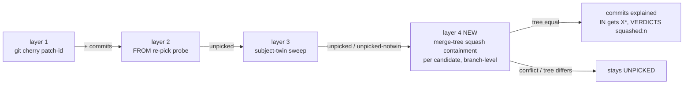

# Repos script and Routines UI improvements — Change Plan

route: `change`

## TLDR

- **Squash detection:** the worktree status script's containment logic (patch-id → applied-probe → twin sweep) cannot see a squash-merge; a branch whose two commits landed as one squashed commit reads unpicked/unsafe. A fourth, branch-level layer is added: `git merge-tree --write-tree` — a conflict-free merge whose result tree equals the candidate's tree proves full content containment.
- **Optimistic delete vs cache:** worktree removal hides rows optimistically but never touches the server-side `statusCache`; any plain `/status` load re-serves the deleted rows. The delete handlers now drop the removed branches from the cached entry immediately.
- **Worktrees column:** the repos index shows one bare total; it becomes per-kind lines — `claude:3`, `claude-routines:5` — one per line, growing downward.
- **Run history weekly bands:** the routine detail's run history table gets client-side week grouping — collapsible band header rows per ISO week, oriented on the session batch bands.
- **Status placement:** on the routine detail the status table moves above the configure widget — status directly below the routine block, configure above the run history.

## Context

- The repos page's worktree status and safety gate come from `cmd/worktrees/print_agent_worktrees_status.sh` + `cmd/worktrees/_lib/verdict.sh`, parsed by [status.go](internal/repos/status.go) and cached per repo in [statuscache.go](internal/server/statuscache.go).
- The squash blind spot is documented in the code itself: [verdict.sh:276-278](cmd/worktrees/_lib/verdict.sh:276) ("a squash … is invisible to this detector").
- The Routines detail page ([routine_detail.html](internal/server/templates/routine_detail.html)) renders the run history as one flat server-rendered table; the session pages group batches into collapsible bands (`batchBands`, [sessions.go:171](internal/server/sessions.go:171), [_batch_list.html:18](internal/server/templates/_batch_list.html:18)) — the visual pattern to orient on.
- Constraint: shell scripts run under macOS bash 3.2 (ACDSL-SHELL-002); the local git is 2.50 (`merge-tree --write-tree` needs ≥ 2.38).
- Constraint: `style.css` is served with `max-age=86400` — CSS changes need a hard reload to verify.

## Drivers

| ID | Observed | Wanted | Impact | Origin |
|---|---|---|---|---|
| DR1 | Two commits cherry-picked + squashed into one commit on the target branch still count UNPICKED; branch reads unsafe (screenshots: `claude/dod-report-apple-sso-v2-46527c` vs `feature/apple-sso-email-migration-v2`) | Squash-transferred work is recognized as applied/contained | behavioral | user request 2026-08-27 + git-log screenshots |
| DR2 | Optimistic delete hides the row, but it comes back from the status cache after the deletion finishes (plain `/status` loads serve the stale entry) | Removed worktrees leave the cache immediately | behavioral | user request 2026-08-27 |
| DR3 | Repos index Worktrees column shows one bare total (screenshot: `claude-configs … 1`) | Per-kind lines with labels, e.g. `claude-routines:5`, one per line, growing downward | behavioral (display) | user request 2026-08-27 + repos-index screenshot |
| DR4 | Routine run history is one flat table (screenshot: run-history table) | Rows grouped client-side into per-week batches, like the session batch bands | behavioral (display) | user request 2026-08-27 + run-history screenshot |
| DR5 | "Move Status below routine, above run history" — the template already orders header → ops → tokens → status → run history, so the observed misplacement needs pinning | Status section sits below the routine block, directly above run history | behavioral (display) | user request 2026-08-27 — interpretation OPEN, see [D6](#decisions) |

## Scope

- **In:**
  - **squash-layer:** new branch-level containment layer in `verdict.sh` + summary token, cache-key bump, detail-mode annotation, column tooltip.
  - **cache-drop:** `statusCache.DropBranches` / `Delete` + calls from the remove and registry-delete handlers.
  - **worktrees-column:** `CountWorktrees` → per-prefix `WorktreeCounts`, index template cell.
  - **week-bands:** `data-stamp` on history rows, inline grouping script, `.run-band` CSS.
  - **status-placement:** routine detail template reorder per D6.
- **Out:**
  - **remove-script UX:** no changes to `remove_agent_worktrees.sh` beyond what it inherits by sourcing `verdict.sh` (its gate uses the same `evaluate_branch`).
  - **server-side history grouping:** the user asked for client-side grouping; no Go band structs for run history.
  - **routines index:** untouched except where D6 lands.
- **Not changed:**
  - **verdict layers 1–3:** patch-id, applied-probe, twin sweep stay exactly as they are; the squash layer only runs after them.
  - **plain-load cache semantics:** `?refresh=1` vs plain load behavior stays; only delete now mutates the cache.
- **Deferred findings:**
  - **`handleRepoRemove` single-branch route** ([repos.go:415](internal/server/repos.go:415)) is reachable but no template posts to it (forms use `remove-selected`); it gets the same cache drop for consistency, but whether it should be deleted outright is left to a separate cleanup decision.

## Assumptions

| Assumption | Reality | Location |
|---|---|---|
| User: "two cherry picks + squash is still applied" — the squashed commit's content equals the branch's cumulative delta | Holds for the screenshot case (subject of one source commit reused; combined patch); when the squash was edited further, the merge-tree check correctly stays conservative (no containment) | screenshots, [verdict.sh:276](cmd/worktrees/_lib/verdict.sh:276) |
| User: run-history batching "client side" | Feasible: rows are server-rendered with RFC3339 timestamps available (`RunResult.Timestamp`); only a `data-stamp` attribute must be added — grouping itself stays in the browser | [routines.go](internal/routines/routines.go:120), [routine_detail.html:33](internal/server/templates/routine_detail.html:33) |
| User: "orient on the session batches" | Session bands are server-side Go (`batchBands`) rendered as `<details class="section">`; a table cannot wrap `<tr>`s in `<details>`, so the visual pattern (label + count + date range, collapsible) is mirrored with clickable band header rows | [sessions.go:171](internal/server/sessions.go:171), [_batch_list.html:18](internal/server/templates/_batch_list.html:18) |
| User: Status is misplaced on the Routines UI | The template already renders status between the routine block and run history — the literal reading is a no-op, so the driver must target either the configure widget inside the status section or the ops/tokens cards | [routine_detail.html:11-26](internal/server/templates/routine_detail.html:11) |

## Current state

Facts are `C<n>` rows; pivotal ones carry `!`.

| ID | Fact | Location |
|---|---|---|
| C1! | Containment layers: `git cherry` patch-id sets, FROM re-pick probe (`probe_verdict`), subject-twin sweep (`twin_sweep`); a squash has a combined patch and (partly) different subject — all three miss it, `unpicked-notwin` is the documented dead end | [verdict.sh:71-332](cmd/worktrees/_lib/verdict.sh:71) |
| C2! | `evaluate_branch` computes `eval_unpicked` / `eval_verdicts` / `eval_in`; `candidate_fully_explained` upgrades a candidate to a starred IN entry when every `+` commit is explained; `remove_agent_worktrees.sh` derives its safety gate from the same function | [verdict.sh:372-474](cmd/worktrees/_lib/verdict.sh:372) |
| C3! | Row cache: UNPICKED/VERDICTS/MERGED/IN cached per branch under `<git-common-dir>/agent-status-cache/`, key `tip\|FROM\|from_tip\|candidates-digest` — the key does not encode the script version, so a logic change would serve stale verdicts for unchanged SHAs | [print_agent_worktrees_status.sh:242-261](cmd/worktrees/print_agent_worktrees_status.sh:242) |
| C4! | `statusCache` has only `Get`/`Store`; no delete/invalidate. Plain `/status` loads serve the cached entry; only `?refresh=1` re-scans | [statuscache.go:36-49](internal/server/statuscache.go:36), [repos.go:334-345](internal/server/repos.go:334) |
| C5! | Batch remove (`handleRepoRemoveSelected`): rows hidden on `htmx:beforeRequest`; clean run sends no trigger (hidden rows are "the truth" — but only in the DOM, the cache still holds them); error/skip fires `repo-op` → fragment re-pull with `?refresh=1` | [repos.go:454-506](internal/server/repos.go:454), [repo_detail.html:78-86](internal/server/templates/repo_detail.html:78), [_worktree_status.html:7](internal/server/templates/_worktree_status.html:7) |
| C6 | `handleReposDelete` removes a repo from the registry, leaving its `statusCache` entry orphaned | [repos.go:590](internal/server/repos.go:590) |
| C7! | `CountWorktrees` returns one `int` summed over `branchPrefixes` (`claude/`, `claude-routines/`), read from `git worktree list --porcelain`; single caller `handleReposIndex`; cell renders `{{.Worktrees}}` | [registry.go:389-408](internal/repos/registry.go:389), [repos.go:527-539](internal/server/repos.go:527), [repos_index.html:46](internal/server/templates/repos_index.html:46) |
| C8! | Run history: `{{range .History}}` over `routines.RunResult` (RFC3339 `Timestamp` string), newest first; cells show `stampDate`/`stampTime` (UTC); the raw stamp is not in the DOM | [routine_detail.html:27-56](internal/server/templates/routine_detail.html:27), [routines.go:120-134](internal/routines/routines.go:120) |
| C9 | JS convention: inline IIFE `<script>` in the template, delegation + `htmx:afterSwap` re-apply; nearest precedent the name-chip filter | [routines_index.html:29-53](internal/server/templates/routines_index.html:29) |
| C10! | Routine detail order: h1/label/dir → `_routine_ops` → `_routine_tokens` → `#op-result` → h2 "status" (`.routines-layout`: `#routine-configure` above the one-row status table) → history error card → h2 "Run history" | [routine_detail.html:1-26](internal/server/templates/routine_detail.html:1) |
| C11 | Go parser passes VERDICTS through as a string and only extracts `picked-resolved:<n>`; unknown tokens are display-only — a new token needs no parser change | [status.go:227-240](internal/repos/status.go:227) |
| C12 | Local git is 2.50; `git merge-tree --write-tree` (≥ 2.38) exits 0 with the tree OID on line 1 for a clean merge, non-zero on conflict | `git --version` |

## Target state

Structural change is limited to the status script's verdict pipeline:



- **Principle:** decide containment on content, not commit identity — the branch's cumulative delta merged into the candidate must be a no-op. Mechanism: `git merge-tree --write-tree` (plumbing, in-memory, no worktree) compared against `candidate^{tree}`.
- Everything else is local: a cache mutator, a widened count type, a template script, a template reorder.

## Behavior contract

- **Must not change:**
  - Verdicts for branches the existing layers already place (`picked`, `applied`, `applied-resolved`, `picked-resolved`) — layer 4 runs only on candidates with unexplained commits left.
  - The safety predicate's shape: `IN != ∅` plus clean worktree; layer 4 only adds a *proof* of containment, it never weakens a check (a conflicting or tree-differing merge stays unsafe).
  - `?refresh=1` semantics, scan timing, `Reload` button, filter chips.
  - Run-history row content, order (newest first), and the Result/Session cells; grouping is presentation only.
  - Repos index counts: the per-kind numbers sum to today's total.
- **Intentional changes (per driver):**
  - DR1: a fully squash-transferred branch flips UNPICKED→0, gains a starred IN entry and `squashed:<n>` in VERDICTS, and becomes safe to remove — including for `remove_agent_worktrees.sh`, which shares `evaluate_branch`.
  - DR2: after a clean remove, plain `/status` loads no longer show the removed rows; registry delete drops the repo's entry.
  - DR3: the Worktrees cell becomes multi-line.
  - DR4: run-history rows are foldable per week; older weeks start collapsed.

## Decisions

| ID | Problem | Facts | Decision | Why |
|---|---|---|---|---|
| D1 | How to detect a squash transfer | [C1](#current-state), [C12](#current-state) | Branch-level `git merge-tree --write-tree <candidate> <branch>`; containment iff exit 0 and result tree == `candidate^{tree}`. Runs per candidate, only when unexplained `+` commits remain | Content-based: catches squashes, rewordings, and combined picks in one primitive. Reliable — a conservative equality check can't false-positive into the deletion gate; debuggable — one git command reproduces any verdict by hand |
| D2 | Where layer 4 reports | [C2](#current-state), [C11](#current-state) | Squash-explained commits leave UNPICKED, VERDICTS gains `squashed:<n>` (distinct intersection commits explained only by layer 4), IN stars come free via `candidate_fully_explained`; Go parser untouched | The existing explained-pairs machinery already turns explanations into IN stars and safety; a new summary token is display-only ([C11](#current-state)) |
| D3 | Stale row cache after the logic change | [C3](#current-state) | Append a literal version salt to the cache key: `…\|$WTS_CANDIDATES_DIGEST\|v2` | Same SHAs would otherwise keep serving pre-squash-layer verdicts forever; a key mismatch is the cache's own recompute path |
| D4 | How delete reaches the cache | [C4](#current-state), [C5](#current-state), [C6](#current-state) | `statusCache` gains `DropBranches(repoName, branches)` and `Delete(repoName)`. `handleRepoRemoveSelected` drops the requested branches when the run was clean (no error, no skip markers); error/skip keeps today's `repo-op` → `?refresh=1` re-scan as the corrector. `handleRepoRemove` drops its branch on success; `handleReposDelete` deletes the entry | Drop-on-clean matches the optimistic UI exactly (hidden rows == cache rows); the dirty paths already have a stronger corrector (full re-scan). Entries are rebuilt as new slices — the "stored slices immutable" contract holds |
| D5 | Week grouping mechanics | [C8](#current-state), [C9](#current-state) | Client-side per user's ask: rows get `data-stamp="{{.Timestamp}}"`; an inline IIFE groups consecutive rows by ISO week (Monday start, UTC — matches the UTC stamps), inserts a clickable `.run-band` header row (colspan 6) per week showing `Week <start> – <end> (<n>)`; newest band expanded, older collapsed | Follows the explicit "client side" instruction; header-row toggling is the only way to band `<tr>`s (no `<details>` in tables); consecutive grouping is sound because history is sorted newest-first ([C8](#current-state)) |
| D6 | DR5 target order — the template already renders status above run history ([C10](#current-state)), so the misplacement had to be pinned | [C10](#current-state) | [USER] Within `.routines-layout` the order flips: the status table renders first (directly below the routine block), `#routine-configure` moves below it — configure sits above the run history | User answer on the OPEN row: status below routine, configure above run history — the configure form no longer opens between the "status" heading and the status table |
| D7 | Worktrees cell shape | [C7](#current-state) | `CountWorktrees` is replaced by `WorktreeCounts` returning `[]repos.WorktreeKindCount{Count, Label}` (label = prefix minus `/`, zero-count kinds omitted, prefix order); cell renders one `<div>label:count</div>` per kind, `0` when empty | Signature change over a parallel variant (RULE-GOLANG-FUNC-003, single caller); named type — no anonymous structs (RULE-GOLANG-STRUCT-006) |
| D8 | Detail-mode (`unpicked` commit list) after layer 4 | [C1](#current-state) | The unpicked listing computes the squash-containing candidates once per branch and annotates `unpicked`/`unpicked-notwin` lines with `(content contained in <candidates> via squash — see IN*)` when applicable | The drill-down must not contradict the overview row it explains |

## Open questions

None — [D6](#decisions) answered at presentation.

## Baseline (verified)

N/A — new route.

## Exemplar & reuse

N/A — new route (change-route mirrors are on the Changes entries; the week-band script mirrors the name-chip filter IIFE [routines_index.html:29](internal/server/templates/routines_index.html:29), the band look mirrors [_batch_list.html:18](internal/server/templates/_batch_list.html:18)).

## Changes

Each phase is independently shippable.

### Phase 1 — squash containment layer (DR1)

location: `cmd/worktrees/_lib/verdict.sh`, `cmd/worktrees/print_agent_worktrees_status.sh`, `internal/server/templates/_worktree_status.html`

New functions in `verdict.sh` (after `contained_in`):

```bash
# Layer 4 — branch-level squash containment: a 3-way merge of the branch
# into the candidate that is conflict-free AND leaves the candidate's tree
# byte-identical proves every line of the branch's work is already there —
# exactly what a squash-merge or reworded transfer leaves behind, which the
# per-commit layers cannot see. Plumbing only (git >= 2.38): no worktree,
# no index, no side effects.
squash_contained() {
  local candidate=$1 branch=$2 merged_tree
  merged_tree=$(git merge-tree --write-tree "$candidate" "$branch" 2>/dev/null) || return 1
  merged_tree=$(printf '%s\n' "$merged_tree" | head -1)
  [ "$merged_tree" = "$(git rev-parse "$candidate^{tree}")" ]
}

# True when any explanation pair carries this hash (any candidate).
hash_explained_anywhere() {
  local hash=$1 p
  for p in ${explained_pairs[@]+"${explained_pairs[@]}"}; do
    case "$p" in *" $hash") return 0 ;; esac
  done
  return 1
}
```

`evaluate_branch` — layer-4 sweep between the per-commit loop and the UNPICKED recount, and the recount reclassifies squash-explained commits:

```diff
 evaluate_branch() {
-  local branch=$1 from=$2 hash from_plus candidate_branch index
+  local branch=$1 from=$2 hash from_plus candidate_branch index squashed_n=0
   local applied_n=0 resolved_n=0 picked_resolved_n=0 unpicked_n=0
   # ...
   while IFS= read -r hash; do
     verdict_for "$hash" "$from"
     # ...
   done <<< "$from_plus"

+  # Layer 4: squash containment — only for candidates the per-commit layers
+  # left partially unexplained; a hit explains every remaining '+' commit of
+  # that candidate at once.
+  while IFS= read -r index; do
+    candidate_branch=${candidates[$index]}
+    [ -z "${cherry_plus[$index]}" ] && continue
+    candidate_fully_explained "$index" && continue
+    if squash_contained "$candidate_branch" "$branch"; then
+      while IFS= read -r hash; do
+        [ -z "$hash" ] && continue
+        is_explained "$index" "$hash" || mark_explained "$index" "$hash"
+      done <<< "${cherry_plus[$index]}"
+    fi
+  done < <(ordered_indices "$from")
+
   # UNPICKED: intersection commits neither the probe nor the twin sweep
-  # explained. ...
+  # explained; a commit layer 4 explained counts squashed, not unpicked.
   while IFS= read -r hash; do
     [ -z "$hash" ] && continue
     if printf '%s\n' "$from_plus" | grep -qx "$hash"; then
       verdict_for "$hash" "$from"
       case "$verdict" in
-        unpicked | unpicked-notwin) unpicked_n=$((unpicked_n + 1)) ;;
+        unpicked | unpicked-notwin)
+          if hash_explained_anywhere "$hash"; then
+            squashed_n=$((squashed_n + 1))
+          else
+            unpicked_n=$((unpicked_n + 1))
+          fi
+          ;;
       esac
     fi
   done < <(unpicked_anywhere)
   eval_unpicked=$unpicked_n

   local summary=''
   [ "$applied_n" -gt 0 ] && summary="applied:$applied_n"
   [ "$resolved_n" -gt 0 ] && summary="${summary:+$summary,}resolved:$resolved_n"
   [ "$picked_resolved_n" -gt 0 ] && summary="${summary:+$summary,}picked-resolved:$picked_resolved_n"
+  [ "$squashed_n" -gt 0 ] && summary="${summary:+$summary,}squashed:$squashed_n"
   eval_verdicts=${summary:--}
```

- **FROM upgrade:** the remote-tracking-FROM prepend (`$from*` when `all_transferred`) additionally accepts `squash_contained "$from" "$branch"` as transfer proof (a squash landed directly on a remote-tracking FROM is otherwise invisible there):

```diff
-  if [ "$all_transferred" -eq 1 ]; then
+  if [ "$all_transferred" -eq 1 ] || squash_contained "$from" "$branch"; then
     for candidate_branch in "${candidates[@]}"; do
```

  (guarded: only reached when `from` is set; the `is_candidate` check below it stays.)

- `print_agent_worktrees_status.sh`:
  - cache-key version salt ([D3](#decisions)):

```diff
-  cache_key="$tip|$raw_from|$from_tip|$WTS_CANDIDATES_DIGEST"
+  cache_key="$tip|$raw_from|$from_tip|$WTS_CANDIDATES_DIGEST|v2"
```

  - header docs: UNPICKED/VERDICTS/IN paragraphs mention the squash layer and the `squashed:<n>` token.
  - detail mode (`unpicked` class), per [D8](#decisions): before the per-hash loop compute `squash_in` once (comma list of candidates where `squash_contained` holds); in the `unpicked` and `unpicked-notwin` cases append `(content contained in $squash_in via squash — see IN*)` when non-empty.
- `_worktree_status.html`: Verdicts `<th title="…">` gains `squashed:n (branch content fully contained in a candidate via merge-tree — squash or reworded transfer)`; the Counts tooltip's "unpicked" wording stays valid.

### Phase 2 — cache drop on delete (DR2)

location: `internal/server/statuscache.go`, `internal/server/repos.go`

New methods (full units):

```go
// Delete drops a repo's entry entirely (registry removal).
func (c *statusCache) Delete(repoName string) {
	c.mu.Lock()
	defer c.mu.Unlock()
	delete(c.entries, repoName)
}

// DropBranches removes the given branches' rows from the cached entry so
// plain loads agree with an optimistic removal immediately. The entry is
// replaced with a freshly built slice (stored slices stay immutable);
// ScannedAt is kept — it is still the last scan, minus removed rows.
func (c *statusCache) DropBranches(repoName string, branches []string) {
	c.mu.Lock()
	defer c.mu.Unlock()
	entry, ok := c.entries[repoName]
	if !ok {
		return
	}
	kept := make([]repos.WorktreeStatus, 0, len(entry.Statuses))
	for _, status := range entry.Statuses {
		if !slices.Contains(branches, status.Branch) {
			kept = append(kept, status)
		}
	}
	entry.Statuses = kept
	c.entries[repoName] = entry
}
```

Handler wiring (per [D4](#decisions)):

```diff
 func (s *Server) handleRepoRemoveSelected(w http.ResponseWriter, r *http.Request) {
 	// ...
 	if opErr != nil {
 		result.Error = opErr.Error()
 	}
 	if opErr != nil || removalNeedsRefresh(output) {
 		w.Header().Set("HX-Trigger", "repo-op")
+	} else {
+		// Clean run: the optimistic UI keeps the rows hidden and no re-scan
+		// fires — drop them from the cache so plain loads agree (DR2).
+		s.statusCache.DropBranches(repo.Name, branches)
 	}
 	s.renderFragment(w, tmplOpResult, result)
 }
```

```diff
 func (s *Server) handleRepoRemove(w http.ResponseWriter, r *http.Request) {
 	// ...
 	op := func(ctx context.Context) (string, error) {
-		return repos.Remove(ctx, branch, force, deleteBranch, repo.Path, s.worktreeScripts)
+		output, err := repos.Remove(ctx, branch, force, deleteBranch, repo.Path, s.worktreeScripts)
+		if err == nil && !removalNeedsRefresh(output) {
+			s.statusCache.DropBranches(repo.Name, []string{branch})
+		}
+		return output, err
 	}
 	s.runRepoOp(repo.Name, "repo-op", op, w, r)
 }
```

```diff
 func (s *Server) handleReposDelete(w http.ResponseWriter, r *http.Request) {
 	// ...
 	op := func(ctx context.Context) (string, error) {
 		if err := s.repoRegistry.Remove(name); err != nil {
 			return "", err
 		}
+		s.statusCache.Delete(name)
 		return "removed " + name, nil
 	}
```

### Phase 3 — per-kind Worktrees column (DR3)

location: `internal/repos/registry.go`, `internal/server/repos.go`, `internal/server/templates/repos_index.html`

`CountWorktrees` is replaced (signature change, single caller — [D7](#decisions)):

```go
// WorktreeKindCount is one branch-prefix bucket of a repo's agent worktrees
// (label = prefix minus the trailing slash: "claude", "claude-routines").
type WorktreeKindCount struct {
	Count int
	Label string
}

// WorktreeCounts counts the repo's checked-out agent worktrees per branch
// prefix, read from git worktree list — routine worktrees live outside the
// repo, so a pool-directory scan cannot see them. Zero-count prefixes are
// omitted; errors degrade to nil.
func WorktreeCounts(ctx context.Context, repoPath string, branchPrefixes []string) []WorktreeKindCount {
	output, err := shell.Run(ctx, repoPath, "git", "worktree", "list", "--porcelain")
	if err != nil {
		return nil
	}
	counts := make([]int, len(branchPrefixes))
	for _, line := range strings.Split(output, "\n") {
		branch, isBranchLine := strings.CutPrefix(line, "branch refs/heads/")
		if !isBranchLine {
			continue
		}
		for index, prefix := range branchPrefixes {
			if strings.HasPrefix(branch, prefix) {
				counts[index]++
				break
			}
		}
	}
	var result []WorktreeKindCount
	for index, prefix := range branchPrefixes {
		if counts[index] == 0 {
			continue
		}
		bucket := WorktreeKindCount{Count: counts[index], Label: strings.TrimSuffix(prefix, "/")}
		result = append(result, bucket)
	}
	return result
}
```

`repos.go`: `repoRow.Worktrees` becomes `[]repos.WorktreeKindCount`; `handleReposIndex` calls `repos.WorktreeCounts(...)`. The doc comment on `CountPoolWorktrees` ([registry.go:366](internal/repos/registry.go:366)) is updated to name `WorktreeCounts`.

`repos_index.html:46`:

```diff
-      <td>{{.Worktrees}}</td>
+      <td class="wt-kinds">{{if .Worktrees}}{{range .Worktrees}}<div>{{.Label}}:{{.Count}}</div>{{end}}{{else}}0{{end}}</td>
```

ui: repos-index screenshot in the request (Worktrees column, bare `1`); post-change screenshot at verification.

### Phase 4 — run-history week bands (DR4)

location: `internal/server/templates/routine_detail.html`, `internal/server/assets/style.css`

mirrors: the name-chip filter IIFE ([routines_index.html:29](internal/server/templates/routines_index.html:29)) for script shape; the batch band summary ([_batch_list.html:18](internal/server/templates/_batch_list.html:18)) for the band look (label + count + range, collapsible).

Template: table gets `id="run-history"`, each row a raw stamp:

```diff
-<table class="md-body checklist-table">
+<table class="md-body checklist-table" id="run-history">
   <thead>
   ...
     {{range .History}}
-    <tr>
+    <tr data-stamp="{{.Timestamp}}">
```

Inline script after the table (complete unit, per [D5](#decisions)):

```html
<script>
(function () {
  var body = document.querySelector('#run-history tbody');
  if (!body) return;
  function weekStart(stamp) {
    var date = new Date(stamp);
    if (isNaN(date)) return null;
    var day = (date.getUTCDay() + 6) % 7; // Monday = 0, matches the UTC stamps
    date.setUTCHours(0, 0, 0, 0);
    date.setUTCDate(date.getUTCDate() - day);
    return date;
  }
  function iso(date) { return date.toISOString().slice(0, 10); }
  var bands = [], current = null;
  Array.prototype.slice.call(body.querySelectorAll('tr[data-stamp]')).forEach(function (row) {
    var start = weekStart(row.dataset.stamp);
    var key = start ? iso(start) : 'unknown';
    if (!current || current.key !== key) {
      current = { key: key, start: start, rows: [] };
      bands.push(current);
    }
    current.rows.push(row);
  });
  bands.forEach(function (band, index) {
    var header = document.createElement('tr');
    header.className = 'run-band';
    var cell = document.createElement('td');
    cell.colSpan = 6;
    var label = 'unknown date';
    if (band.start) {
      var end = new Date(band.start);
      end.setUTCDate(end.getUTCDate() + 6);
      label = 'Week ' + iso(band.start) + ' – ' + iso(end);
    }
    cell.textContent = label + ' (' + band.rows.length + ')';
    header.appendChild(cell);
    body.insertBefore(header, band.rows[0]);
    var collapsed = index > 0; // newest week open, older collapsed
    function apply() {
      band.rows.forEach(function (row) { row.hidden = collapsed; });
      header.classList.toggle('collapsed', collapsed);
    }
    header.addEventListener('click', function () { collapsed = !collapsed; apply(); });
    apply();
  });
})();
</script>
```

CSS (`style.css`, next to the `.run-cell` rule):

```css
.run-band td { cursor: pointer; user-select: none; color: var(--text-3); font-size: 0.8125rem; }
.run-band td::before { content: "▾ "; }
.run-band.collapsed td::before { content: "▸ "; }
```

(token names verified against the existing sheet at implementation; 24h CSS cache — hard reload to verify.)

ui: run-history screenshot in the request; post-change screenshot at verification.

### Phase 5 — status placement (DR5, per D6)

location: `internal/server/templates/routine_detail.html`

Inside `.routines-layout` the status table moves above `#routine-configure`: status sits directly below the routine block, configure below it and above Run history:

```diff
 <h2>status</h2>
 <div class="routines-layout">
-<div id="routine-configure"></div>
 <table class="md-body checklist-table">
   <thead>
     <tr><th></th><th>State</th><th>Name</th><th>Schedule</th><th>Last run</th><th>Session</th><th>Next run</th></tr>
   </thead>
   <tbody>
     {{template "_routine_row.html" .Row}}
   </tbody>
 </table>
+<div id="routine-configure"></div>
 </div>
```

(`.routines-layout` is a column flex, `#routine-configure { width: 100%; }` is an id rule — both unaffected by the swap; the routines index keeps its own placement.)

ui: no request screenshot shows this section; post-change screenshot at verification.

## Hot items

- **Safety-gate change (ACTION-CONCEPT-HOT-005):** layer 4 feeds the removal gate (`remove_agent_worktrees.sh` shares `evaluate_branch`). The full example implementation is written out in Phase 1 (`squash_contained` + the `evaluate_branch` diff); the condition is strictly a proof-of-containment (tree equality) and can only mark *more* branches safe when their content is verifiably present — it never weakens dirty/untracked checks.
- **UI screenshots (ACTION-CONCEPT-HOT-007 / RULE-PLAN-069):** the UI under change is captured in the user's request screenshots (repos index Worktrees column; routine run-history table). This session runs in plan mode without a running server; real screenshots of the changed UI are produced at implementation verification (config-server verification itself goes through curl; screenshots via the running server UI).

## Tests

| Location.Method | Cases | Comment |
|---|---|---|
| internal/server/statuscache_test.go TestDropBranches | drops named branches, keeps others<br>unknown repo is a no-op<br>ScannedAt preserved | mirrors existing statuscache tests |
| internal/server/statuscache_test.go TestDelete | entry removed<br>unknown repo is a no-op | |
| internal/server/repos_test.go TestRemoveSelectedDropsCache | clean removal drops the branches from a seeded cache entry<br>skip output leaves cache untouched (refresh corrects) | mirrors existing handler tests in repos_test.go |
| internal/repos/registry_test.go TestWorktreeCounts | per-prefix buckets over a fixture with claude/ + claude-routines/ worktrees<br>zero-count prefix omitted<br>no worktrees → nil | replaces TestCountWorktrees ([registry_test.go:152](internal/repos/registry_test.go:152)) |
| internal/server/routines_test.go TestRoutineDetailRunHistory (extend) | body contains `data-stamp` with the RFC3339 stamp<br>body contains the `run-band` script marker | template-render assertions, existing style |
| cmd/tests/test_print_agent_worktrees_status.sh | squash case: two commits on an agent branch, squash-merged (`git merge --squash`) into main → UNPICKED 0, VERDICTS contains `squashed:2`, IN `main*`<br>edited-squash case: squash then extra edit on the squashed hunk → stays UNPICKED | fixture repo pattern of the existing suite |
| cmd/tests/test_remove_agent_worktrees.sh | squash-contained branch passes the safety gate | gate inherits layer 4 |
| not tested | week-band JS interaction (collapse toggle) | no JS test harness in the repo; covered by the template-marker assertions + manual verification |

## Test runbook

Scenario index (no runbook arg; smoke tool here is curl against the local server + the shell suite):

- squash-status: repo with a squash-transferred agent branch → `GET /repos/{name}/status?refresh=1` shows UNPICKED 0, `squashed:n`, starred IN (data: fixture repo from the shell test).
- optimistic-delete: remove a safe worktree via `POST /repos/{name}/remove-selected`, then plain `GET /repos/{name}/status` → removed row absent without `refresh=1`.
- worktrees-column: `GET /repos` → per-kind `label:count` lines (data: local claude-configs registry).
- week-bands: `GET /routines/{name}` for a routine with multi-week history → `data-stamp` attrs present; visual fold check in the browser (data: smine-nightly results.jsonl).

## Contracts & sweeps

| Contract | Sides | Sweep |
|---|---|---|
| Status table row format (14+ columns) | print_agent_worktrees_status.sh ↔ status.go parseStatusRow | unchanged — layer 4 changes cell *values* only; `make audit` + shell suite |
| VERDICTS token list | verdict.sh ↔ status.go (ResolvedPicks), _worktree_status.html tooltip, script header docs | grep `picked-resolved:`/`applied:`/`resolved:` consumers; new `squashed:` token added to docs + tooltip; parser pass-through verified by test |
| evaluate_branch outputs (eval_unpicked/eval_verdicts/eval_in) | verdict.sh ↔ print_agent_worktrees_status.sh ↔ remove_agent_worktrees.sh | grep `eval_unpicked\|eval_verdicts\|eval_in` in cmd/worktrees — confirm the remove script only consumes IN/unpicked, not the token list |
| Row-cache file format (5 lines, key first) | print_row writer ↔ reader | format unchanged, key salted `v2` — old files become misses, pruning path untouched |
| CountWorktrees signature | registry.go ↔ repos.go, registry_test.go | build-verified sweep (RULE-GOLANG-FUNC-003); grep `CountWorktrees` to zero (CountPoolWorktrees comment updated) |
| RunResult.Timestamp RFC3339 | routines.go ↔ routine_detail.html data-stamp ↔ band script | `stampDate`/`stampTime` untouched; script tolerates unparseable stamps (unknown band) |

## Verification

Per phase, against the running server (`make serve`, port 6001; curl first, screenshots for the UI drivers):

- [ ] Phase 1: run `cmd/tests/test_print_agent_worktrees_status.sh` — squash fixture reports UNPICKED 0, `squashed:2`, `main*`; edited-squash stays unpicked.
- [ ] Phase 1: on the real repo from the screenshots (tvapp checkout with `claude/dod-report-apple-sso-v2-46527c`), run the status script — the branch shows IN `feature/apple-sso-email-migration-v2*` and UNPICKED 0.
- [ ] Phase 1: re-run the script twice — second run serves the v2-salted cache (same output, faster), old cache files ignored.
- [ ] Phase 2: `go test ./internal/server -run 'DropBranches|Delete|RemoveSelected'` green; manual: remove a worktree in the UI, then plain-reload the detail page — the row does not come back without Reload.
- [ ] Phase 3: `GET /repos` shows `claude:<n>` / `claude-routines:<m>` on separate lines summing to the old total; repo with zero worktrees shows `0`.
- [ ] Phase 4: open a routine with multi-week history — band headers per week, newest expanded, older collapsed, click toggles; hard reload for the CSS (24h cache).
- [ ] Phase 5: routine detail renders header → ops → tokens → op-result → status table → configure → run history in the running UI (open Configure and confirm the form appears below the status table, above run history).
- [ ] Degenerate: repo with no agent branches → status table renders "No agent branches" unchanged; routine with empty history → "No runs recorded", script exits without inserting bands.
- [ ] Capture post-change screenshots of the repos index Worktrees column, the banded run history, and the routine detail order; store under the feature's `plans/` design/ui dir at implementation.
- [ ] `make audit` green (vet, acdsl gates, tests); `make audit-full` before handoff (race + shell suite).

## Stop conditions

| ID | Condition | Action |
|---|---|---|
| S1 | An approved signature or contract can't hold as planned (ACTION-IMPL-001) | Stop, report, no mid-edit architecture |
| S2 | Second failed approach in a row (ACTION-IMPL-002) | Stop, re-read disk state, write a plan |
| S3 | Missing prerequisite (ACTION-IMPL-003) | Run the producing step; if infra is down, ask |
| S4 | Discovered work materially exceeds approved scope (ACTION-IMPL-004) | Ask before continuing |
| S5 | Same bug class found twice (ACTION-IMPL-005) | Fix all in-diff instances; report pre-existing ones |
| S6 | Structural obstacle tempts a new abstraction (ACTION-IMPL-006) | Stop and report; relocate, don't indirect |
| S7 | `git merge-tree --write-tree` unavailable or behaves differently on a target machine (< 2.38) | Stop — do not fall back to a working-tree merge probe inside the row workers |
| S8 | A status row stops parsing (column drift from Phase 1 edits) | Hard error per parseStatusRow's contract — fix the script, never loosen the parser |
| S9 | The squash fixture in the shell test cannot reproduce the screenshot verdict | Stop and re-diagnose against the real tvapp branches before shipping the layer |

## Changelog

| Date | Trigger | What changed |
|---|---|---|
| — | initial | plan created |
| 2026-08-27 | Q: DR5 target order | D6 answered [USER]: status table above configure; configure stays above run history |
