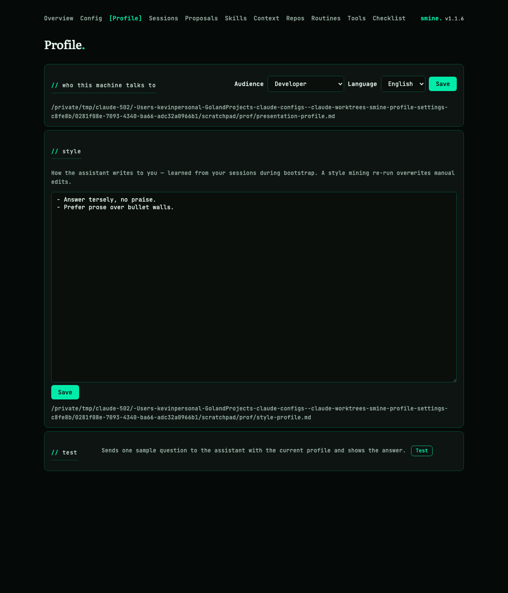
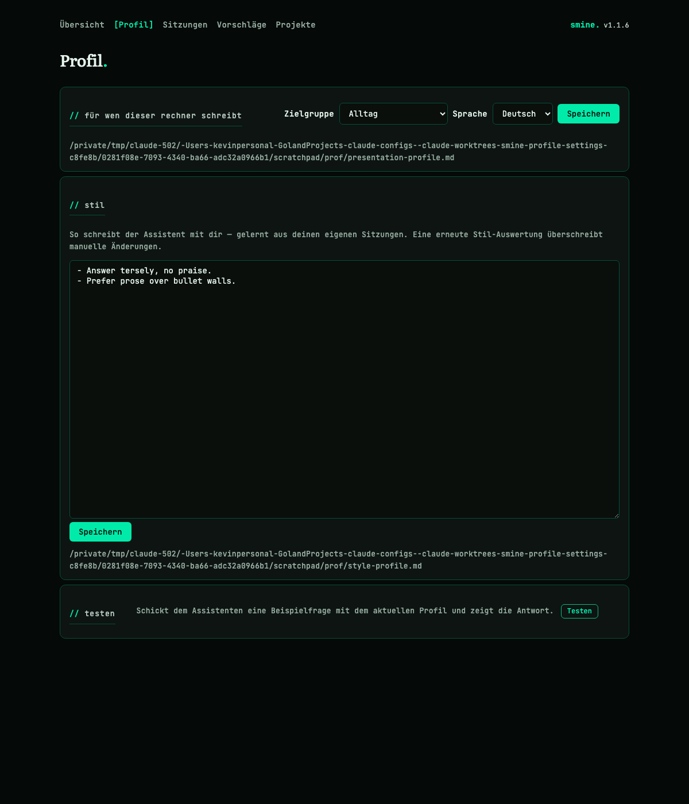

# SMine Profile Settings — Implementation Plan

## TLDR

- smine learns how the user talks with agents: a new leaf skill mines the last n sessions' user messages via peek-mcp and writes a **style profile** (`~/.claude/context/global/style-profile.md`) that every session on the machine picks up through the existing global-context hook.
- Style mining becomes a stage of `/smine-bootstrap`, so a fresh install gets a learned voice out of the box.
- A new config-server **Profile page** (`/profile`) makes the whole thing operable: pick the initial profile (audience: developer / casual non-developer / business-later, plus UI language), edit the style file in a textarea, and **test** the current profile with a one-shot `claude -p` call — the same pattern as the token test — so the style can be adjusted on the fly.
- The declared profile (`presentation-profile.md`) and the learned style (`style-profile.md`) stay two files: install/templates own the first, mining and the editor own the second — a reinstall never clobbers the learned voice.
- Motivating failure: pipeline output like the Cook example — dense developer jargon a casual user cannot read. The style profile is the standing counter-directive in every session.

## Context

- **Problem:** smine prose reaches the user in the register the model defaults to (English, dense, developer jargon) — unreadable for a non-developer install; there is no learned per-user voice and no way to adjust or test one.
- **Cause:** the presentation profile ([internal/server/presentation.go:33](../../../../internal/server/presentation.go)) carries only declared audience/language; nothing mines *how the user actually talks*, and the profile is not editable or testable from the UI (edit page was explicit backlog in [language_style_setting concept](../../language_style_setting/concept/concept.md), Decisions).
- **Design being implemented:** the user's request (this plan's source): style mining in bootstrap, initial profile as capability/UI-language/context setting, style file editable from a settings page, testable via a one-time `claude -p` invocation like the token test.
- **Constraint:** the injection mechanism already exists — `cmd/hooks/global-context.sh` cats every `*.md` under `~/.claude/context/global/` into every session (interactive and headless alike); this plan adds no new injection plumbing.
- **Constraint:** repo/operator artifacts stay English; the style profile governs user-visible prose only, and mining never flips the declared audience/language.

## Drivers

N/A — new route.

## Scope

- **In:**
  - **smine-style skill:** new leaf `skills/smine/smine-style` — mine user messages from the last n sessions, write `style-profile.md`.
  - **bootstrap stage:** `/smine-bootstrap` gains a Style stage invoking it.
  - **profile page:** new `/profile` config-server page — audience/language selector, style textarea, test button.
  - **live profile:** server-side profile becomes a mutex-guarded store so audience/language edits take effect without restart.
  - **skill-visibility follow-up:** audience change re-runs the skills sync (which owns the skillOverrides flip).
- **Out (explicit non-goals):**
  - **business audience behavior:** the option renders disabled ("later") — no third audience semantics ship.
  - **nightly style refresh:** style re-mining stays manual (`/smine-style` or re-bootstrap); no schedule change.
  - **style enforcement gate:** verifying pipeline output against the style file (the consolidate-as-gate path) is untouched.
  - **i18n expansion:** only the new page's strings enter the German catalog; no new locales.
- **Not changed:**
  - **injection hook:** `cmd/hooks/global-context.sh` — already globs the new file.
  - **install provisioning:** `install.sh` / Windows installer profile copy.
  - **nightly routine** and its wrapper.
- **Deferred findings:**
  - **profile reload vs. other cached state:** `handleOverview`'s coverage metric and other startup-cached data stay startup-cached; only the profile becomes live.
  - **welcome tutorial register:** the tutorial text itself is still developer-voiced (old concept backlog).

## Assumptions

| Assumption | Reality | Location |
|---|---|---|
| "like the token test" = one paid headless call with the routine token, result rendered inline | Exact mechanism exists: `handleWelcomeVerifyToken` runs `claude -p … --max-turns 1 --output-format json` through bash + token file | [welcome.go:309](../../../../internal/server/welcome.go) |
| Style directives reach a `claude -p` test run | SessionStart hooks fire in headless runs — the nightly pipeline depends on exactly this injection path ("smine skill runs and interactive Claude sessions alike") | [concept.md:29](../../language_style_setting/concept/concept.md) |
| "style.md or whatever we end up calling it" | Free naming; sibling-consistent name chosen: `style-profile.md` ([D2](#decisions)) | — |
| Bootstrap can invoke a new stage skill | smine-bootstrap already chains four stage skills via the Skill tool in a headless run | [skills/smine/smine-bootstrap/SKILL.md:33](../../../skills/smine/smine-bootstrap/SKILL.md) |

## Current state

N/A — new route.

## Target state

N/A — new route.

## Behavior contract

N/A — new route.

## Decisions

| ID | Problem | Facts | Decision | Why |
|---|---|---|---|---|
| D1 | Where does the learned style live — inside `presentation-profile.md` or its own file? | [F1!](#baseline-verified), [F2!](#baseline-verified), [F11!](#baseline-verified) | Two files: `presentation-profile.md` = declared settings (frontmatter audience/language + audience directives, template-provisioned); **`~/.claude/context/global/style-profile.md`** = learned voice (mined + hand-edited) | Reinstall copies the template over the profile (F11) — a mined style inside it would be clobbered; the hook injects every `*.md` in the dir (F2), so the second file costs no new mechanism; each file has exactly one owner (controllable, debuggable) |
| D2 | Style file name and format | F2 | `style-profile.md`, plain markdown, no frontmatter; first line is a marker comment naming the generator and warning that a mining re-run rewrites the file wholesale | Sibling-consistent with `presentation-profile.md`; no consumer parses it (verbatim injection only), so structure would be dead weight |
| D3 | Server profile is loaded once at startup; template funcs close over it — UI edits would need a restart | [F3!](#baseline-verified) | Replace the bare pointer with a mutex-guarded `presentationStore` in `presentation.go`; save = atomic file write (`fsx.ReplaceFile`, the `saveAutoApplyRules` discipline) + in-memory swap; template funcs read through the store | "Adjust on the fly" is a stated requirement — it reverses the old plan's read-only D10; the atomic-write pattern is the repo's existing one (F5) |
| D4 | UI surface | [F5!](#baseline-verified), [F9](#baseline-verified) | One new page `/profile`, visible in **both** audience modes, i18n'd labels; hosts the audience/language selector, the style textarea, and the test button; the Welcome setup tab links to it above the Bootstrap button | The profile is the one page a casual user must reach (it is about them); splitting selector and editor across pages would put one concern in two places |
| D5 | Audience option set | F1 | Selector: `developer` (default), `non-developer` ("casual"), and a **disabled** `business` option labeled as coming later; only the two existing values are ever written | A live third enum value with no behavior is a dead mode; the disabled option records the roadmap without shipping unreachable semantics |
| D6 | What saving the selector writes | F1, [F11!](#baseline-verified) | developer+en → **delete** the profile file (absence = default, matching install behavior); non-developer+de → seed from the repo template `settings/claude_code/presentation-profile.de.md` when no profile exists, else rewrite only the frontmatter and keep the body; any other combo → write frontmatter, keep (or create empty) body | Absence-as-default is the established install contract ("a default install never plants a profile"); frontmatter-only rewrite preserves hand-tuned directive bodies |
| D7 | Audience change must reach skill visibility (skillOverrides) | [F10](#baseline-verified) | After a save that changed the audience, run the skills sync via the existing `skills.Sync(ctx, prune=false, s.syncScripts)` op under the same repo-op lock the Skills page uses | `sync_skills.sh` owns the skillOverrides flip; re-running the owner beats duplicating its jq logic in Go |
| D8 | Style test mechanics | [F4!](#baseline-verified), F8 | `POST /profile/test` mirrors `handleWelcomeVerifyToken`: fixed sample prompt constant, `claude -p '<prompt>' --max-turns 1 --output-format json` via bash + routine token, render the `result` text in a fragment; button carries `hx-confirm` (paid call) | The test run's SessionStart hook injects the just-saved files (F2, F8) — it exercises the real injection path end-to-end, not a simulation; one turn caps cost like the token test |
| D9 | Sample prompt content | — | A fixed English constant asking for a short user-facing summary of a nightly run ("Summarize for me in 3–4 sentences: last night 12 of my work sessions were reviewed and 3 improvement suggestions came out.") | Exercises exactly the surfaces the profile governs — language choice, register, jargon handling — and the answer's style is judgeable at a glance |
| D10 | Style mining: skill vs. inline bootstrap prose | [F6](#baseline-verified), [F7](#baseline-verified) | New leaf skill `skills/smine/smine-style` with n arg; bootstrap invokes it as a stage | Every other bootstrap stage is a skill; a leaf is independently re-runnable ("adjust on the fly" includes re-mining) and deploys via the existing leaf scan |
| D11 | Mining guardrails | F7 | The skill reads user messages only (last n sessions via peek-mcp), distills ≤30 directive lines (language mix, register, formality, sentence length, directness, jargon tolerance, recurring phrasings); never quotes messages verbatim, never includes PII/secrets/profanity, never contradicts or rewrites the declared audience/language — the presentation profile stays authoritative for those | Verbatim quotes leak private prompt content into every future session; declared settings must stay user-controlled, not inference-overwritten |
| D12 | Bootstrap stage position and failure semantics | F6 | Style becomes step 2 (after Profile, before Mine); a red stage stops the run per the skill's existing hard invariant | Style depends only on transcripts, not on mined batches; keeping the one existing invariant beats a per-stage exception |
| D13 | Handler/file layout in `internal/server` | F5 | New `profilesettings.go` (page + save/style/test handlers) + `templates/profile.html` + `templates/_profile_test.html`; store stays in `presentation.go` | One file per concern (RULE-GOLANG-FILE-002); mirrors the welcome.go / bootstrap.go split |
| D14 | Style textarea size cap | F5 | 64 KiB, same constant discipline as the auto-apply editor | An injected file is paid context in every session; the exemplar's cap is already sized for "hand-edited markdown" |

## Open questions

None — all decisions carry a recommendation and are approvable as-is.

## Baseline (verified)

Base branch: `main` (worktree `claude/smine-profile-settings-c8fe8b`).

| ID | Fact | Needed for | Location |
|---|---|---|---|
| F1! | Presentation profile = `---` frontmatter (`language:`, `audience:`) + directive body; parsed by `loadPresentationProfile`, `sed` in sync_skills.sh; body injected verbatim | [D1](#decisions), [D5](#decisions), [D6](#decisions) | [presentation.go:33](../../../../internal/server/presentation.go), [sync_skills.sh:249](../../../../cmd/sync/sync_skills.sh), [presentation-profile.de.md](../../../../settings/claude_code/presentation-profile.de.md) |
| F2! | `global-context.sh` cats **every** `*.md` under `$HOME/.claude/context/global/` into every session (SessionStart + SubagentStart) | [D1](#decisions), [D2](#decisions), [D8](#decisions) | [cmd/hooks/global-context.sh:26](../../../../cmd/hooks/global-context.sh) |
| F3! | Server loads the profile once in `New`; `t`/`isDeveloperAudience` template funcs close over that pointer | [D3](#decisions) | [server.go:93](../../../../internal/server/server.go), server.go:158–169 |
| F4! | Token-test exemplar: bash resolves `claude`, token file sourced by bash (Go never reads it), `--max-turns 1 --output-format json`, envelope `claudeVerifyResult`, fragment render, `hx-confirm` on the button | [D8](#decisions), § profile handlers | [welcome.go:309](../../../../internal/server/welcome.go), welcome.go:353–389 |
| F5! | Editable-file exemplar: textarea posts content, `saveAutoApplyRules` writes tmp + `fsx.ReplaceFile`, 64 KiB cap | [D3](#decisions), [D13](#decisions), [D14](#decisions) | [autoapplyrules.go:22](../../../../internal/server/autoapplyrules.go), [routines.go:433](../../../../internal/server/routines.go), [_routine_configure.html:65](../../../internal/server/templates/_routine_configure.html) |
| F6 | Bootstrap = detached `claude -p '/smine-bootstrap'`; the skill chains stage skills via the Skill tool, step 1 reads the profile, hard invariant: red stage stops the run | [D10](#decisions), [D12](#decisions) | [bootstrap.go:75](../../../internal/server/bootstrap.go), [smine-bootstrap/SKILL.md:33](../../../skills/smine/smine-bootstrap/SKILL.md) |
| F7 | Transcript access pattern: `mcp__Peek_MCP__session_list/session_events/session_full` in allowed-tools; transcripts are never read from disk | [D10](#decisions), [D11](#decisions) | [smine-batch/SKILL.md:7,30](../../../skills/smine/smine-batch/SKILL.md) |
| F8 | The injection covers headless runs — the concept's stated contract and the nightly pipeline's working dependency | [D8](#decisions) | [concept.md:29](../../language_style_setting/concept/concept.md) |
| F9 | i18n: `t` overlays `germanCatalog` on English source strings; nav is audience-gated in `layout.html` | [D4](#decisions), § layout/i18n changes | [i18n.go:58](../../../internal/server/i18n.go), [layout.html:27](../../../internal/server/templates/layout.html) |
| F10 | Non-developer audience: sync_skills.sh sets every leaf `skillOverrides: off` in user settings + writes the routine overlay; developer flips it back — audience changes are applied by re-running the sync | [D7](#decisions) | [sync_skills.sh:249](../../../cmd/sync/sync_skills.sh) |
| F11! | Install provisioning copies `settings/claude_code/presentation-profile.<id>.md` **over** the live profile (macOS install.sh and Windows Go installer) | [D1](#decisions), [D6](#decisions) | [install.sh:67](../../../install.sh), [install_windows.go:345](../../../cmd/configserver/install_windows.go) |
| F12 | Skills sync is invocable from Go: `skills.Sync(ctx, prune, s.syncScripts)` under the repo-op lock | [D7](#decisions) | [skills.go:180](../../../internal/server/skills.go) |
| F13 | New-leaf deployment is automatic: sync scans level-1 dirs with SKILL.md under each group | § smine-style change | [cmd/sync/sync_skills.sh](../../../cmd/sync/sync_skills.sh) |

## Exemplar & reuse

| Existing | Used for |
|---|---|
| `shell.Run` + bash/token plumbing (`verifyBashPath`, `verifyTokenPath`, `verifyPathPrefix`) | the style test call |
| `fsx.ReplaceFile` atomic write | profile + style saves |
| `skills.Sync` repo-op | audience-change follow-up |
| `t` / `germanCatalog` | page labels |
| `renderFragment` + htmx fragment templates | all new UI |
| ACDSL gates on the touched files: EXEC-001 (child processes via shell.Run), FUNC-001, FMT-001, ENUM-001, STATE-001; SKILL-001…005 on the SKILL.md files | recorded per Changes entry |

- Every change has a named exemplar except the **smine-style SKILL.md content** itself — its *format* mirrors smine-batch, but the mining instructions are new ground; that is the plan's main risk and is written out in full below.

## Changes

### 1. Style mining skill (new)

location: `skills/smine/smine-style/SKILL.md`, `skills/smine/smine-style/changelog.json`
mirrors: `skills/smine/smine-batch/SKILL.md` (frontmatter shape, peek-mcp tooling), `skills/smine/smine-bootstrap/SKILL.md` (stage brevity)

Full SKILL.md (governed by ACDSL-SKILL-001…005 — version synced with changelog.json[0]):

````markdown
---
name: smine-style
description: Learn the user's voice from recent session transcripts and write the machine-global style profile the global-context hook injects into every session. Trigger on /smine-style [n], or as the Style stage of /smine-bootstrap. Args — n: how many recent sessions to sample (default 30).
author: Kevin Horst
version: 1.0
argument-hint: "[n]"
allowed-tools: mcp__Peek_MCP__session_list, mcp__Peek_MCP__session_full, ToolSearch, Read, Write, Bash(jq *)
---

# smine: learn the user's style

Sample how the user actually talks with agents and distill it into `~/.claude/context/global/style-profile.md` — the standing directive that makes every session answer in the user's own register instead of the model's default developer prose.

## When to use

**Use when:** seeding or refreshing the machine's style profile — the Style stage of /smine-bootstrap, or a manual /smine-style after the user's writing habits shifted.
**Don't use when:** changing the declared audience or UI language — that is the presentation profile (Profile page / install). Mining actionable retrospective items — /smine.
**Preconditions:** peek-mcp available (session_list, session_full).
**Workflow position:** install → smine-bootstrap (Style stage) → nightly takes over; re-runnable any time.

## Steps

1. **Declared profile** — read `~/.claude/context/global/presentation-profile.md` (language, audience); absent means English/developer. The declared values are binding: this skill never contradicts or rewrites them.
2. **Sample** — via peek-mcp, list the machine's most recent n sessions (default 30) and read their transcripts; extract only the USER messages. Skip sessions with fewer than 2 user turns.
3. **Distill** — derive the user's voice along: language mix (e.g. German with English technical terms), formality (du/Sie, first names), register (terse vs. elaborate, direct vs. hedged), sentence length, technical depth they use themselves, recurring phrasings and preferences (e.g. hates bullet walls, asks for examples). Capability signal (developer vs. casual vocabulary) tunes register depth only — never the audience value.
4. **Write** — rewrite `~/.claude/context/global/style-profile.md` wholesale:
   - First line: `<!-- generated by /smine-style — a mining re-run rewrites this file; edit freely until then (Profile page or any editor) -->`
   - Then ≤30 directive lines ("Answer in …", "Match …", "Avoid …") an agent can follow without any other context.
   - Directives complement the presentation profile; on conflict the presentation profile wins and the conflicting line is dropped.
5. **Report** — sessions sampled, user turns read, the written file's line count; then STOP.

## Hard invariants

- Never quote user messages verbatim; never include names, addresses, credentials, file contents, or any PII from transcripts.
- Never mimic profanity or hostility — describe register neutrally ("very direct, no praise") instead.
- Output file only — this skill writes `style-profile.md` and nothing else.

## Model

- Suggested: frontier / medium
- Reason: reading many transcripts and abstracting voice without copying content
- Tested unviable: — (none yet)
````

changelog.json mirrors the sibling leaves: one entry, version `1.0`, date, "initial version".

### 2. Bootstrap gains the Style stage (modified)

location: `skills/smine/smine-bootstrap/SKILL.md`, `skills/smine/smine-bootstrap/changelog.json`

```diff
 ## Steps

 1. **Profile** — read `~/.claude/context/global/presentation-profile.md` (language, audience); absent means English/developer defaults.
-2. **Mine** — invoke the Skill tool with skill="smine" and args="--nightly", …
+2. **Style** — invoke the Skill tool with skill="smine-style" and args="<n>" (the same n as this run): learn the user's voice from the sessions about to be mined and write the style profile.
+3. **Mine** — invoke the Skill tool with skill="smine" and args="--nightly", …
```

- Renumber the remaining steps (Consolidate → 4, Apply → 5, Orchestrate → 6, Report → 7); version bump to 1.1 in frontmatter **and** changelog.json[0] (ACDSL-SKILL-001).

### 3. Presentation store (modified)

location: `internal/server/presentation.go`
mirrors: `saveAutoApplyRules` write discipline ([autoapplyrules.go:22](../../../internal/server/autoapplyrules.go))

- `loadPresentationProfile` and the `presentationProfile` struct stay as-is; a store wraps them:

```go
const maxStyleProfileBytes = 65536

type presentationStore struct {
	mu sync.RWMutex

	path      string
	profile   *presentationProfile
	stylePath string
}

func newPresentationStore(path, stylePath string) *presentationStore {
	store := &presentationStore{
		path:      path,
		profile:   loadPresentationProfile(path),
		stylePath: stylePath,
	}
	return store
}

func (st *presentationStore) isDeveloperAudience() bool {
	st.mu.RLock()
	defer st.mu.RUnlock()
	return st.profile.isDeveloperAudience()
}

func (st *presentationStore) language() string {
	st.mu.RLock()
	defer st.mu.RUnlock()
	return st.profile.Language
}

// reload re-reads the profile file after a save so the running server and
// the file never diverge (the file is the source of truth, plan D3).
func (st *presentationStore) reload() {
	profile := loadPresentationProfile(st.path)
	st.mu.Lock()
	st.profile = profile
	st.mu.Unlock()
}
```

- `DefaultStylePath()` next to `DefaultPresentationPath()`, returning `~/.claude/context/global/style-profile.md`.
- Frontmatter save ([D6](#decisions)) — full unit:

```go
// saveProfileSelection persists the declared audience/language: absence is
// the developer/English default (delete), the de non-developer combo seeds
// from the repo template on first activation, anything else rewrites only
// the frontmatter and keeps the body (plan D6).
func (st *presentationStore) saveProfileSelection(audience, language string) error {
	if audience == "" && language == languageEnglish {
		if err := os.Remove(st.path); err != nil && !os.IsNotExist(err) {
			return fmt.Errorf("presentationStore.saveProfileSelection: Failed to remove %s: %w", st.path, err)
		}
		st.reload()
		return nil
	}

	body := profileBody(st.path)
	if body == "" && audience == audienceNonDeveloper && language == "de" {
		if template, err := os.ReadFile(filepath.Join("settings", "claude_code", "presentation-profile.de.md")); err == nil {
			body = stripFrontMatter(string(template))
		}
	}

	content := fmt.Sprintf("---\nlanguage: %s\naudience: %s\n---\n%s", language, audience, body)
	if err := writeFileAtomic(st.path, content); err != nil {
		return fmt.Errorf("presentationStore.saveProfileSelection: %w", err)
	}

	st.reload()
	return nil
}
```

- Helpers `profileBody(path)` / `stripFrontMatter(content)` (read the existing file's post-frontmatter body; empty on absence) and `writeFileAtomic(path, content)` (mkdir-p the parent, tmp write + `fsx.ReplaceFile` — the saveAutoApplyRules body, factored because profile and style saves both need it).
- Style file accessors:

```go
func (st *presentationStore) styleContent() (string, error) {
	content, err := os.ReadFile(st.stylePath)
	if os.IsNotExist(err) {
		return "", nil
	}
	if err != nil {
		return "", fmt.Errorf("presentationStore.styleContent: %w", err)
	}
	return string(content), nil
}

func (st *presentationStore) saveStyle(content string) error {
	if err := writeFileAtomic(st.stylePath, content); err != nil {
		return fmt.Errorf("presentationStore.saveStyle: %w", err)
	}
	return nil
}
```

### 4. Profile page handlers (new)

location: `internal/server/profilesettings.go`
mirrors: `welcome.go` (test call + fragment pattern), `routines.go` params post (form validation)
ui: page does not exist yet — real screenshots at verification (see [Hot items](#hot-items))

- Constants: `pageProfile = "profile"`, `tmplProfile = "profile.html"`, `tmplProfileTest = "_profile_test.html"`, and the sample prompt ([D9](#decisions)):

```go
// styleTestPrompt is the fixed sample the test button sends: it forces the
// answer through every surface the profile governs — language, register,
// jargon handling (plan D9).
const styleTestPrompt = "Summarize for me in 3-4 sentences: last night 12 of my work sessions were reviewed and 3 improvement suggestions came out."
```

- View + page handler:

```go
type profilePage struct {
	Audience     string
	Language     string
	Page         string
	ProfilePath  string
	StyleContent string
	StyleError   string
	StylePath    string
	Title        string
}

func (s *Server) handleProfilePage(w http.ResponseWriter, r *http.Request) {
	s.renderFragment(w, tmplProfile, s.profilePageData())
}
```

  (`profilePageData()` fills the struct from the store; factored so the save handler re-renders the same page.)
- `POST /profile` — selection save with validation (hot item, full code):

```go
func (s *Server) handleProfileSave(w http.ResponseWriter, r *http.Request) {
	if err := r.ParseForm(); err != nil {
		respond.WithBadRequest("invalid form", w)
		return
	}

	// audience
	audience := r.PostForm.Get("audience")
	if audience != "" && audience != audienceNonDeveloper {
		respond.WithBadRequest(fmt.Sprintf("unknown audience %q", audience), w)
		return
	}

	// language
	language := r.PostForm.Get("language")
	if language != languageEnglish && language != "de" {
		respond.WithBadRequest(fmt.Sprintf("unsupported language %q", language), w)
		return
	}

	audienceChanged := (audience == audienceNonDeveloper) != !s.presentation.isDeveloperAudience()
	if err := s.presentation.saveProfileSelection(audience, language); err != nil {
		respond.WithInternalServerError(err, w)
		return
	}

	if audienceChanged {
		op := func(ctx context.Context) (string, error) {
			return skills.Sync(ctx, false, s.syncScripts)
		}
		s.runRepoOp(skillsSyncLockKey, "repo-op", op, w, r)
		return
	}
	s.renderFragment(w, tmplProfile, s.profilePageData())
}
```

  (form values: `audience` is `""` for developer / `non-developer` for casual — the disabled business option posts nothing.)
- `POST /profile/style` — textarea save: 64 KiB cap ([D14](#decisions)), `s.presentation.saveStyle`, re-render page.
- `POST /profile/test` — the one-shot test, mirroring `handleWelcomeVerifyToken` byte-for-byte in structure: resolve `verifyTokenPath`/`verifyBashPath`, then

```go
script := verifyPathPrefix + `CLAUDE_CODE_OAUTH_TOKEN="$(tr -d '[:space:]' < "$1")" claude -p "$2" --max-turns 1 --output-format json`
output, err := shell.Run(r.Context(), "", bashPath, "-c", script, "bash", tokenPath, styleTestPrompt)
```

  parse the `claudeVerifyResult` envelope (reused type), render `_profile_test.html` with the answer text (or the tail of the error output via `tailLines`).

### 5. Templates (new + modified)

location: `internal/server/templates/profile.html`, `internal/server/templates/_profile_test.html`, `internal/server/templates/layout.html`, `internal/server/templates/welcome.html`

- `profile.html`: three sections —
  - **Profile**: two selects (audience: `{{t "Developer"}}` / `{{t "Casual"}}` / disabled `{{t "Business (later)"}}`; language: English / Deutsch), current file path shown, save button posting `/profile`.
  - **Style**: `<textarea name="style_content" rows="24">` with the file content, path shown, hint line ("written by style mining during bootstrap — a re-run overwrites manual edits"), save button posting `/profile/style`.
  - **Test**: button posting `/profile/test` into `#profile-test-result`, `hx-confirm="{{t "Runs one paid claude call with the current profile. Continue?"}}"`; `_profile_test.html` renders the returned answer as a quoted block (or the failure detail).
- `layout.html` nav — one line, visible in both branches of the audience gate:

```diff
   {{if isDeveloperAudience}}<a href="/config/claude" …>Config</a>{{end}}
+  <a href="/profile" {{if eq .Page "profile"}}class="active"{{end}}>{{t "Profile"}}</a>
   <a href="/sessions" …>
```

- `welcome.html` setup tab, directly above the bootstrap block: one line linking the page — `<p><a href="/profile">{{t "Profile"}}</a> — set who this machine talks to before bootstrapping.` (bootstrap's Profile and Style stages read what this page wrote).

### 6. Server wiring (modified)

location: `internal/server/server.go`, `cmd/configserver/main.go`

```diff
 type Options struct {
 	…
 	PresentationPath   string
+	StylePath          string
```

```diff
-	profile := loadPresentationProfile(opts.PresentationPath)
+	presentation := newPresentationStore(opts.PresentationPath, opts.StylePath)
```

- The `Server` field becomes `presentation *presentationStore`; the template funcs delegate: `"t": func(text string) string { return translate(presentation.language(), text) }`, `"lang": presentation.language`, `"isDeveloperAudience": presentation.isDeveloperAudience`.
- Routes:

```diff
 	mux.HandleFunc("GET /welcome", s.handleWelcome)
+	mux.HandleFunc("GET /profile", s.handleProfilePage)
+	mux.HandleFunc("POST /profile", s.handleProfileSave)
+	mux.HandleFunc("POST /profile/style", s.handleProfileStyleSave)
+	mux.HandleFunc("POST /profile/test", s.handleProfileTest)
```

- `main.go`: `-style` flag defaulting to `server.DefaultStylePath()`, threaded into `Options.StylePath` exactly like `-presentation`.

### 7. i18n catalog (modified)

location: `internal/server/i18n.go`

- Add the new page's strings to `germanCatalog`: "Profile" → "Profil", "Developer" → "Entwickler", "Casual" → "Alltag", "Business (later)" → "Business (später)", the test-confirm string, the section labels and hints. Final list assembled at implementation from the template's `t` calls (i18n test asserts catalog completeness per existing pattern in `i18n_test.go`).

## Hot items

- **Validation logic** (ACTION-CONCEPT-HOT-005): the only new validation is `handleProfileSave`'s audience/language whitelist — written out in full in [Changes §4](#changes).
- **User-facing UI** (ACTION-CONCEPT-HOT-007 / RULE-PLAN-069): the page did not exist at plan time; real screenshots were captured from the running server at verification:

  

  
- No SQL, no concurrency primitives beyond the store's mutex (guarding a swapped pointer — the disabledHookStore precedent), no new interfaces or generics, no anonymous structs.

## Tests

| Location.Method | Cases | Comment |
|---|---|---|
| presentation_test.go `TestPresentationStore_SaveProfileSelection` | developer+en deletes the file<br>developer+en with no file is a no-op<br>de+non-developer seeds the template body<br>frontmatter rewrite keeps an existing body<br>store reflects the save without reload from caller | table-driven over a `t.TempDir()` profile path; template read falls back to empty body when the repo file is absent from the test cwd |
| presentation_test.go `TestPresentationStore_SaveStyle` | write + read-back roundtrip<br>missing file reads as empty | direct test |
| profilesettings_test.go `TestServer_HandleProfileSave` | pass-valid-developer<br>pass-valid-non-developer<br>fail-unknown-audience<br>fail-unsupported-language | httptest against the mux, `_shouldPass` pattern |
| profilesettings_test.go `TestServer_HandleProfileStyleSave` | saves content<br>rejects >64 KiB | mirrors the auto-apply cap test |
| i18n_test.go (existing) | new strings present in the catalog | extend the existing completeness check |
| — | not tested: `handleProfileTest` end-to-end | spawns a paid claude call; the envelope parsing it shares with the token verify is already covered by `welcome_test.go` |

## Test runbook

Scenario index (default — no runbook arg):

- **profile-page** — `curl localhost:<port>/profile` — page renders with current audience/language and style content.
- **profile-save** — `curl -X POST -d 'audience=non-developer&language=de' localhost:<port>/profile` — file written, nav flips to reduced mode on next page load.
- **profile-save-default** — `curl -X POST -d 'audience=&language=en' localhost:<port>/profile` — profile file removed.
- **style-save** — `curl -X POST --data-urlencode 'style_content=…' localhost:<port>/profile/style` — `~/.claude/context/global/style-profile.md` updated.
- **style-test** — Test button in the browser (needs the stored routine token) — answer text renders in the fragment.
- **bootstrap-style-stage** — `claude -p '/smine-style 5'` on a machine with sessions — style file written with the marker line.

## Contracts & sweeps

| Contract | Sides | Sweep |
|---|---|---|
| presentation-profile.md frontmatter (`language:`/`audience:` lines) | writer: `saveProfileSelection` (new) · readers: `loadPresentationProfile`, `sed` in sync_skills.sh, install templates, smine-bootstrap step 1 | grep `presentation-profile` repo-wide (excluding worktrees/plans archives); the new writer emits exactly the template's line shape |
| style-profile.md | writer: smine-style skill + `/profile/style` editor · reader: global-context.sh glob (format-free) | grep `style-profile` — hook needs no change (glob), install scripts must NOT touch it |
| `/profile` routes ↔ templates | profilesettings.go ↔ profile.html/_profile_test.html hx attributes | template-parse test suite already fails on missing templates; manual hx-target check at verification |
| skill leaf format | smine-style SKILL.md ↔ sync scanner + ACDSL SKILL gates | `go run ./cmd/acdsl check`; `make audit` |
| bootstrap stage numbering | smine-bootstrap SKILL.md steps ↔ nothing parses numbers (prose contract) | read-through only |

## Verification

- [ ] Run `make audit` — green (build, vet, acdsl gates, tests).
- [ ] Start the config server, open `/profile` — page shows current state; with no profile file the selector shows Developer/English.
- [ ] Save Casual + Deutsch — `~/.claude/context/global/presentation-profile.md` contains `language: de` / `audience: non-developer` + the template body; skills sync ran; nav shows the reduced set **without server restart**.
- [ ] Save Developer + English — the profile file is gone; full nav returns.
- [ ] Edit the style textarea, save — file content matches byte-for-byte; empty textarea saves an empty file (degenerate case).
- [ ] Click Test with a stored routine token — an answer renders; with the de profile + a German style file the answer is German and jargon-free.
- [ ] Click Test with no token — the fragment shows "no token file to verify — save one first", no 500 (degenerate case).
- [ ] Run `claude -p '/smine-style 5'` — style-profile.md written, ≤30 directives + marker line, no verbatim transcript quotes.
- [ ] Start a fresh interactive session — the injected global context block contains both profile files.
- [ ] Capture screenshots of `/profile` (both audiences) + nav into `plans/smine_profile_settings/design/ui/`.

## Stop conditions

| ID | Condition | Action |
|---|---|---|
| S1 | An approved signature or contract can't hold as planned | Stop and report (ACTION-IMPL-001) |
| S2 | Second failed approach in a row | Stop, re-read disk state, write a plan (ACTION-IMPL-002) |
| S3 | Missing prerequisite infrastructure (peek down, no token) | Run the producing step; if infra is down, ask (ACTION-IMPL-003) |
| S4 | Discovered work materially exceeds this scope | Ask before continuing (ACTION-IMPL-004) |
| S5 | Same bug class found twice | Fix all in-diff instances; report pre-existing ones (ACTION-IMPL-005) |
| S6 | Structural obstacle tempts a new abstraction | Stop and report; relocate, don't indirect (ACTION-IMPL-006) |
| S7 | The frontmatter the new writer emits fails the `sed` extraction in sync_skills.sh | Stop — the write format is a cross-script contract, not a Go-side choice |
| S8 | Template-func refactor (store delegation) breaks any existing page render | Stop — the t/lang/audience funcs are load-bearing for every template |

## Changelog

| Date | Trigger | What changed |
|---|---|---|
| — | initial | plan created |
| 2026-08-27 | local: acdsl plan-format gate | Open questions moved directly after Decisions (canonical section order) |
| 2026-08-27 | adjust: implementation | Save handlers use POST-redirect-GET and the audience-change sync acquires the skills-sync lock directly instead of riding runRepoOp (the op-result fragment does not fit a full-page form); style form carries the configure-form class for full-width layout; verification screenshots embedded in Hot items |
