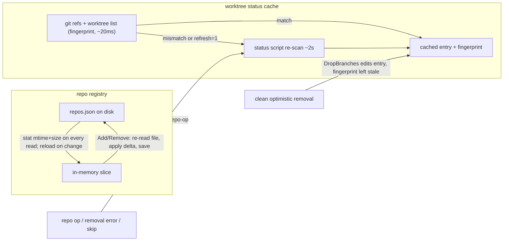

# Repo cache & deletion — Change Plan

route: `change`

## TLDR

- The repos UI has three stale-state mechanisms that disagree: an in-memory repo registry loaded once at boot, a worktree status cache with no expiry, and an optimistic row-hiding layer that edits the cache by hand.
- Fix 1 — the registry becomes a read-through of `repos.json`: reads stat the file and reload on change; Add/Remove re-read the file before applying their delta. A deleted repo can no longer be resurrected by a stale in-memory slice (second server instance, hand edit, dev run), and hand edits appear without a restart.
- Fix 2 — the status cache gets deterministic invalidation: every plain load computes a cheap git fingerprint (agent branch tips + worktree set, ~20ms); mismatch → full re-scan. New worktrees and deletions show up on the next page load; "when does it reload" gets a one-sentence answer: whenever the branch/worktree set actually changed, or on explicit Reload.
- Fix 3 — the optimistic delete stays exactly as it is (instant hide, silent clean run); the fingerprint is what stops the cache from later re-serving rows that no longer match reality. The only removal-path change: the dead, UI-unreachable single-branch remove endpoint is deleted.
- Result: the file and git are the only sources of truth; the cache is a pure performance layer that can be explained in one sentence.

## Context

- **Problem:** deleted repos and removed worktrees reappear in the UI; new worktrees don't appear; cache reload timing is opaque ([drivers](#drivers)).
- **Cause 1:** `Registry.Reload()` runs exactly once, at server startup ([server.go:224](internal/server/server.go)); `Add`/`Remove` write the whole in-memory slice back to `repos.json` ([registry.go:170](internal/repos/registry.go)) — any writer holding stale state resurrects deleted entries, and external edits are invisible until restart yet clobbered by the next UI mutation.
- **Cause 2:** `statusCache` has no TTL and no invalidation ([statuscache.go:26](internal/server/statuscache.go)); plain fragment loads serve the last scan forever ([repos.go:334](internal/server/repos.go)) — only the Reload button and repo-op events carry `?refresh=1`.
- **Cause 3:** after a clean optimistic removal, the never-expiring cache keeps re-serving its stale entry on later loads; the moment any re-scan or stale entry disagrees with the hidden rows, removed worktrees "come back". The optimistic delete itself is correct and stays ([D4](#decisions), [USER]).
- **Originating plan:** [plans/archived/repos-page-performance/design/change_plan.md](plans/archived/repos-page-performance/design/change_plan.md) (decisions D3–D8); this plan deliberately reverses its D4/D5/D6 — see [D4](#decisions).

## Drivers

| ID | Observed | Wanted | Impact | Origin |
|---|---|---|---|---|
| DR1 | Repo deleted via the UI reappears in the registry/index later | Deleted stays deleted, across instances and restarts | behavioral | user report ("repo deletion still buggy") |
| DR2 | Removed worktree's row reappears after the next refresh | Optimistic delete stays instant; the cache never re-serves rows that no longer match reality | behavioral | user report ("comes back after deletion"); errata: keep the optimistic delete — the cache reapplying stale rows was the issue |
| DR3 | No discernible rule for when the worktree table reloads | Deterministic, explainable reload trigger | behavioral | user report ("when does it actually think to reload") |
| DR4 | Newly added worktrees don't show up | Visible on the next page load without pressing Reload | behavioral | user report |

## Scope

- **In:**
  - **registry read-through:** stat-based auto-reload on read; read-modify-write on `Add`/`Remove`
  - **cache fingerprint:** git-derived invalidation for the worktree status cache
  - **dead code:** delete the UI-unwired single-branch remove endpoint and route
- **Out:**
  - **status script:** `print_agent_worktrees_status.sh` semantics unchanged (branch-enumerating; exit-0-on-skip contract kept for CLI callers)
  - **index/overview counts:** `WorktreeCounts` / `CountPoolWorktrees` already read live — untouched
  - **non-claude worktrees:** worktrees whose branch is outside `claude/*` / `claude-routines/*` remain unlisted (status-script contract, not a cache issue)
- **Not changed:**
  - **optimistic delete:** instant row hide, silent clean run, `DropBranches`, skip markers, conditional trigger — all kept verbatim ([D4](#decisions), [USER])
  - **sync/merge/cherry-pick flows:** untouched, still `runRepoOp` + `repo-op`
  - **remove script:** `remove_agent_worktrees.sh` untouched
- **Deferred findings:**
  - **grant asymmetry:** `handleReposAdd` grants `permissions.additionalDirectories`, but `handleReposDelete` never revokes it ([repos.go:594,615](internal/server/repos.go)) — deleted repos keep their grant
  - **dirty-count staleness:** file edits inside a worktree change DIRTY/UNTRACKED without changing the fingerprint; cached counts can lag until Reload or a structural change (accepted, [D7](#decisions))

## Assumptions

| Assumption | Reality | Location |
|---|---|---|
| "Repo comes back" is a server bug in the delete path | Single-instance in-process delete is consistent (Remove persists, cache dropped, index re-pulls). No other writer of `repos.json` exists in the repo (sync excludes it, nightly only reads it). The only resurrection vectors are a second running configserver holding a pre-delete slice (dev build beside the launchd daemon — historically real, install.sh boots out legacy agents) and hand edits reverted by the next UI write. [D1](#decisions) closes both. | [registry.go:170](internal/repos/registry.go), cmd/sync/sync_public.sh:76, routines/smine-nightly/run.sh:301 |
| "Worktree comes back" is a failed removal | Removal succeeds; the never-invalidated cache and later re-scans disagree with the optimistically edited state, so removed rows resurface. The optimistic delete is kept ([USER]); the fingerprint makes every later load converge to scan truth. | [statuscache.go:26](internal/server/statuscache.go), cmd/worktrees/print_agent_worktrees_status.sh:79 |
| The cache reloads "sometimes" | It never reloads on its own: entries are written only by `?refresh=1` scans (Reload button, repo-op re-pull) and live forever otherwise | [repos.go:329-345](internal/server/repos.go), internal/server/templates/_worktree_status.html:7 |

## Current state

- [internal/repos/registry.go](internal/repos/registry.go) (421 lines)
  - `Registry`: path + `mu` + in-memory `[]Repo`; `Reload` (startup only), `Add`/`Remove` (persist in-memory slice wholesale), `save` (tmp+rename)
- [internal/server/statuscache.go](internal/server/statuscache.go) (79 lines)
  - `statusCache`: repo→`{ScannedAt, Statuses}`; `Get`/`Store`/`Delete`/`DropBranches`; no expiry, no invalidation
- [internal/server/repos.go](internal/server/repos.go) (636 lines)
  - `handleRepoWorktreeStatus`: cache-or-scan on `refresh` flag; `handleRepoRemove` (dead — no template posts to it); `handleRepoRemoveSelected` (optimistic path: conditional trigger + `removalSkipMarkers`/`removalNeedsRefresh` + `DropBranches`)
- [internal/server/templates/repo_detail.html](internal/server/templates/repo_detail.html)
  - optimistic row-hiding on `htmx:beforeRequest` for remove forms (lines 75–86)

## Target state

- One invalidation story, three layers, each with a single source of truth:



- **Principle (registry):** the file is authoritative; memory is a cache validated by file identity (mtime+size stat) on every read. Go mechanism: `os.Stat` guard + `sync.RWMutex`, read-modify-write under the existing lock.
- **Principle (status cache):** cache validity is derived from the data it summarizes, not from time or from hand-edits. Go mechanism: two `shell.Run` git reads composed into a fingerprint string stored beside the entry.
- **Principle (removal):** the optimistic delete stays the instant-feedback layer ([USER]); convergence is the fingerprint's job — a clean removal changes the real worktree/ref set, so the stale-fingerprinted entry re-scans on the next plain load and lands on scan truth.

## Behavior contract

- **Must not change:**
  - remove/status script invocation, arguments, and exit-code contracts
  - sync/merge/cherry-pick handler behavior; op locking (`repoLocks`); 409 on concurrent ops
  - repos index and overview tiles (already live reads)
  - `?refresh=1` always forces a re-scan; Reload button unchanged
- **Must not change (cont.):** optimistic removal UX — instant row hide, silent clean run, error/skip restore via `repo-op` ([USER])
- **Intentional changes (per driver):**
  - DR1: registry reads reflect external file changes without restart; UI writes can no longer clobber concurrent external edits with stale state
  - DR2: after a clean optimistic removal, every later plain load re-scans (the removal changed the fingerprint) — the cache can never re-serve the pre-removal rows; a worktree-only removal's branch row returns as branch-with-"–" because the branch really still exists (scan truth, not cache replay)
  - DR3/DR4: a plain fragment load re-scans iff the fingerprint changed; otherwise serves cache and says so (`Cached` marker unchanged)
  - `POST /repos/{name}/branches/{branch}/remove` is removed (was unreachable from the UI)

## Decisions

| ID | Problem | Facts | Decision | Why |
|---|---|---|---|---|
| D1 | Deleted repos resurrected by stale in-memory registry state | [Assumptions](#assumptions) row 1 | Registry becomes read-through: reads stat+reload on file-identity change; `Add`/`Remove` re-read the file under lock, apply their delta, save | Controllable and debuggable: the file is the one truth, every writer's delta survives; closes both resurrection vectors without inter-process coordination |
| D2 | Auto-reload hits a malformed `repos.json` mid-flight | Reload today fails loudly at startup ([registry.go:97](internal/repos/registry.go)) | Read-path reload failure keeps the last good state and logs; startup `Reload` stays loud | A bad hand edit must not 500 every page; degrade like the peek column does; the log line locates it |
| D3 | When should the status cache re-scan? | Scan ~2s (status script with probes); `git for-each-ref` + `git worktree list` ~20ms; cache today never expires | Fingerprint invalidation: plain loads compute refs+worktree-set fingerprint; mismatch (or fingerprint error, [D6](#decisions)) → re-scan; match → cached. No TTL. | Deterministic (answers DR3 verbatim), precise (DR4: a new worktree changes the fingerprint), cheap; a TTL is a guess that is both stale within and wasteful after |
| D4 | Removed rows resurface later (DR2) — is the optimistic delete or the cache at fault? | Clean removal edits the cached entry via `DropBranches` but nothing ever invalidates the entry afterwards; the entry's fingerprint predates the removal | [USER] Keep the optimistic delete exactly as-is ("it must just work — the cache reapplying it was the issue"). Fix is [D3](#decisions): `DropBranches` leaves the entry's pre-removal fingerprint in place, so the next plain load's fingerprint mismatch forces a re-scan and the cache converges to scan truth | The optimistic layer gives correct instant feedback; only its persistence was broken — invalidation, not deletion, is the fix |
| D5 | `handleRepoRemove` + its route are dead (templates only post to remove-selected; JS never rewires remove forms — [repo_detail.html:31](internal/server/templates/repo_detail.html)) | route [server.go:381](internal/server/server.go) | Delete handler + route; keep `repos.Remove` (used by the batch loop) | Dead mode; deleting beats guarding |
| D6 | Fingerprint computation can fail (repo path not a git repo, git missing) | `Fingerprint` degrades like other git reads | Error → treat as changed: re-scan | Degrade toward correctness, never toward stale rows |
| D7 | Dirty/untracked counts change without ref/worktree changes | Fingerprint sees refs + worktree set only | Accepted staleness; Reload button covers it (matches originating plan's DR2 "accepted staleness") | A dirty-aware fingerprint would need `git status` per worktree — that IS the expensive scan |

## Open questions

None — all decisions closed.

## Baseline (verified)

N/A — new route section; change-route evidence lives in [Current state](#current-state) and [Assumptions](#assumptions).

## Exemplar & reuse

N/A — new route. Mirrors are on the Changes entries; cross-cutting reuse: `shell.Run` for all git reads (existing pattern, [registry.go:402](internal/repos/registry.go)), `fsx.ReplaceFile` for atomic saves (unchanged).

## Changes

### Phase 1 — registry read-through (DR1, shippable alone)

#### Registry snapshot loading (modified)

location: `internal/repos/registry.go`

- Governing gates (acdsl project): EXEC-001 (shell.Run only), STATE-001, FMT-001, FUNC-001 (≤3 returns — hence the snapshot struct), ENUM-001.
- `Registry` gains the loaded file identity; a snapshot type bundles content + identity (keeps `readRegistrySnapshot` at 2 return values):

```go
type Registry struct {
	path string

	// mu guards the loaded state below for concurrent request reads vs. reload.
	mu            sync.RWMutex
	loadedModTime time.Time
	loadedSize    int64
	repos         []Repo
}

// registrySnapshot is one parsed read of the registry file plus the file
// identity (mtime+size) it was read at; the zero value is a missing file.
type registrySnapshot struct {
	modTime time.Time
	repos   []Repo
	size    int64
}
```

- `readRegistrySnapshot` replaces the parse body of `Reload` (stat BEFORE read, so a write racing the read is re-detected on the next stat rather than missed):

```go
// readRegistrySnapshot reads and validates the registry file. A missing file
// is an empty registry (bootstrapping, sessions-store pattern); an invalid
// entry fails the read loudly — the registry is a small user-authored file.
func readRegistrySnapshot(path string) (*registrySnapshot, error) {
	info, err := os.Stat(path)
	if err != nil {
		if os.IsNotExist(err) {
			return &registrySnapshot{}, nil
		}
		return nil, fmt.Errorf("readRegistrySnapshot: Failed to stat %s: %w", path, err)
	}

	data, err := os.ReadFile(path)
	if err != nil {
		return nil, fmt.Errorf("readRegistrySnapshot: Failed to read %s: %w", path, err)
	}

	var file registryFile
	if err := json.Unmarshal(data, &file); err != nil {
		return nil, fmt.Errorf("readRegistrySnapshot: Failed to parse %s: %w", path, err)
	}

	seen := make(map[string]bool)
	for _, repo := range file.Repos {
		if err := repo.Validate(); err != nil {
			return nil, fmt.Errorf("readRegistrySnapshot: %w", err)
		}
		if seen[repo.Name] {
			return nil, fmt.Errorf("readRegistrySnapshot: Duplicate repo name %s", repo.Name)
		}
		seen[repo.Name] = true
	}

	snapshot := &registrySnapshot{modTime: info.ModTime(), repos: file.Repos, size: info.Size()}
	return snapshot, nil
}
```

- `Reload` and the removed `swap` collapse onto the snapshot (`apply` is called under `mu`):

```go
func (r *Registry) apply(snapshot *registrySnapshot) {
	r.loadedModTime = snapshot.modTime
	r.loadedSize = snapshot.size
	r.repos = snapshot.repos
}

// Reload re-reads the registry file and swaps it in.
func (r *Registry) Reload() error {
	snapshot, err := readRegistrySnapshot(r.path)
	if err != nil {
		return fmt.Errorf("Registry.Reload: %w", err)
	}

	r.mu.Lock()
	r.apply(snapshot)
	r.mu.Unlock()
	return nil
}

// refreshIfChanged reloads when the file identity (mtime+size) differs from
// the loaded state — reads track external edits and other writers without a
// restart (D1). A failed re-read keeps the last good state and logs; only
// startup fails loudly (D2).
func (r *Registry) refreshIfChanged() {
	r.mu.RLock()
	modTime, size := r.loadedModTime, r.loadedSize
	r.mu.RUnlock()

	info, err := os.Stat(r.path)
	isMissingAndUnloaded := os.IsNotExist(err) && size == 0 && modTime.IsZero()
	if isMissingAndUnloaded {
		return
	}
	if err == nil && info.ModTime().Equal(modTime) && info.Size() == size {
		return
	}

	if err := r.Reload(); err != nil {
		log.Printf("Registry.refreshIfChanged: Keeping last good state: %v", err)
	}
}
```

- `Find` and `Repos` call `r.refreshIfChanged()` as their first line (before taking the read lock); bodies unchanged.

#### Registry writes become read-modify-write (modified)

location: `internal/repos/registry.go`

- `Add`/`Remove` re-read the file under the write lock, apply their delta to the fresh state, and save — a stale in-memory slice can never be written back ([D1](#decisions)). `save` records the new identity so a self-write does not trigger a spurious reload:

```diff
 func (r *Registry) Add(repo Repo) error {
 	if err := repo.Validate(); err != nil {
 		return fmt.Errorf("Registry.Add: %w", err)
 	}

 	r.mu.Lock()
 	defer r.mu.Unlock()
-	for i := range r.repos {
-		if r.repos[i].Name == repo.Name {
+	snapshot, err := readRegistrySnapshot(r.path)
+	if err != nil {
+		return fmt.Errorf("Registry.Add: %w", err)
+	}
+	for i := range snapshot.repos {
+		if snapshot.repos[i].Name == repo.Name {
 			return fmt.Errorf("Registry.Add: Duplicate repo name %s", repo.Name)
 		}
 	}

-	repos := append(slices.Clone(r.repos), repo)
+	repos := append(snapshot.repos, repo)
 	if err := r.save(repos); err != nil {
 		return fmt.Errorf("Registry.Add: %w", err)
 	}
-	r.repos = repos
 	return nil
 }
```

```diff
 func (r *Registry) Remove(name string) error {
 	r.mu.Lock()
 	defer r.mu.Unlock()
-	index := slices.IndexFunc(r.repos, func(repo Repo) bool { return repo.Name == name })
+	snapshot, err := readRegistrySnapshot(r.path)
+	if err != nil {
+		return fmt.Errorf("Registry.Remove: %w", err)
+	}
+	index := slices.IndexFunc(snapshot.repos, func(repo Repo) bool { return repo.Name == name })
 	if index < 0 {
 		return fmt.Errorf("Registry.Remove: Unknown repo name %s", name)
 	}

-	repos := slices.Delete(slices.Clone(r.repos), index, index+1)
+	repos := slices.Delete(snapshot.repos, index, index+1)
 	if err := r.save(repos); err != nil {
 		return fmt.Errorf("Registry.Remove: %w", err)
 	}
-	r.repos = repos
 	return nil
 }
```

```diff
 // save writes the registry file atomically (tmp + rename, config.Save
-// pattern). Callers hold r.mu.
+// pattern) and records the written state + file identity. Callers hold r.mu.
 func (r *Registry) save(repos []Repo) error {
 	// ...
 	if err := fsx.ReplaceFile(tmp, r.path); err != nil {
 		os.Remove(tmp)
 		return fmt.Errorf("save: %w", err)
 	}
+
+	info, err := os.Stat(r.path)
+	if err != nil {
+		return fmt.Errorf("save: Failed to stat after write: %w", err)
+	}
+	r.apply(&registrySnapshot{modTime: info.ModTime(), repos: repos, size: info.Size()})
 	return nil
 }
```

- Note: a stat-identity guard (mtime+size) can miss a same-second same-size rewrite; every mutation still re-reads the file, so the miss window affects only read staleness, never write correctness.

### Phase 2 — status-cache fingerprint (DR3/DR4, shippable alone)

#### Fingerprint function (new)

location: `internal/repos/registry.go`
mirrors: `WorktreeCounts` ([registry.go:401](internal/repos/registry.go)) — same shell.Run/git shape, same errors-degrade posture

```go
// Fingerprint captures the state the worktree status table derives from:
// agent branch tips plus the checked-out worktree set. Two fast git reads —
// the status cache serves its entry only while this matches (D3); dirty
// counts are invisible to it (accepted staleness, D7).
func Fingerprint(ctx context.Context, repoPath string) (string, error) {
	refs, err := shell.Run(ctx, repoPath, "git", "for-each-ref", "--format=%(refname) %(objectname)", "refs/heads/claude/", "refs/heads/claude-routines/")
	if err != nil {
		return "", fmt.Errorf("Fingerprint: %s: %w", strings.TrimSpace(refs), err)
	}

	worktrees, err := shell.Run(ctx, repoPath, "git", "worktree", "list", "--porcelain")
	if err != nil {
		return "", fmt.Errorf("Fingerprint: %s: %w", strings.TrimSpace(worktrees), err)
	}
	return refs + "\n" + worktrees, nil
}
```

#### Cache entry carries the fingerprint (modified)

location: `internal/server/statuscache.go`

```diff
 type statusEntry struct {
+	Fingerprint string
 	ScannedAt time.Time
 	Statuses  []repos.WorktreeStatus
 }
```

```diff
-func (c *statusCache) Store(repoName string, statuses []repos.WorktreeStatus) statusEntry {
-	entry := statusEntry{ScannedAt: time.Now(), Statuses: statuses}
+func (c *statusCache) Store(repoName, fingerprint string, statuses []repos.WorktreeStatus) statusEntry {
+	entry := statusEntry{Fingerprint: fingerprint, ScannedAt: time.Now(), Statuses: statuses}
 	c.mu.Lock()
 	defer c.mu.Unlock()
 	c.entries[repoName] = entry
 	return entry
 }
```

- `DropBranches` stays and needs no code change: it copies the entry and replaces only `Statuses`, so the entry keeps its **pre-removal** fingerprint — exactly right, because the removal changed the real ref/worktree set and the next plain load's mismatch forces the convergence re-scan ([D4](#decisions)).

#### Handler serves cache only on fingerprint match (modified)

location: `internal/server/repos.go` (`handleRepoWorktreeStatus`)

```diff
 func (s *Server) handleRepoWorktreeStatus(w http.ResponseWriter, r *http.Request) {
 	// ...
 	// A plain load serves the last scan only while the fingerprint (branch
 	// tips + worktree set) still matches it; any structural change — and
 	// ?refresh=1 (Reload button, repo-op re-pull) — re-scans, so mutations
 	// and new worktrees never linger or hide (D3/D6, DR3/DR4).
 	var statuses []repos.WorktreeStatus
 	var err error
 	var statusMs int64
-	entry, cached := s.statusCache.Get(repo.Name)
-	data.Cached = cached && !refresh
+	start := time.Now()
+	fingerprint, fingerprintErr := repos.Fingerprint(r.Context(), repo.Path)
+	entry, cached := s.statusCache.Get(repo.Name)
+	data.Cached = cached && !refresh && fingerprintErr == nil && fingerprint == entry.Fingerprint
 	if data.Cached {
 		statuses = entry.Statuses
 	} else {
-		start := time.Now()
 		statuses, err = repos.Status(r.Context(), repo.Path, s.worktreeScripts)
-		statusMs = time.Since(start).Milliseconds()
 		if err == nil {
-			entry = s.statusCache.Store(repo.Name, statuses)
+			entry = s.statusCache.Store(repo.Name, fingerprint, statuses)
 		}
 	}
+	statusMs = time.Since(start).Milliseconds()
 	wg.Wait()
 	data.ScannedAt = entry.ScannedAt
```

- The timing line's `status=` now includes the fingerprint cost (~20ms) on cached serves — the cached path is no longer 0ms, which is truthful.
- A fingerprint error (non-git path, git missing) makes `Cached` false → fresh scan whose own error lands in `StatusErr` as today ([D6](#decisions)).

### Phase 3 — dead endpoint removal (cleanup, shippable alone)

#### Dead route and handler removed (modified)

location: `internal/server/server.go`, `internal/server/repos.go`

- No template posts to the single-branch remove endpoint (remove forms carry a fixed `hx-post` to remove-selected; the JS action-rewiring skips `data-op="remove"` — [repo_detail.html:31](internal/server/templates/repo_detail.html)):

```diff
 	mux.HandleFunc("POST /repos/{name}/branches/{branch}/merge", s.handleRepoMerge)
-	mux.HandleFunc("POST /repos/{name}/branches/{branch}/remove", s.handleRepoRemove)
 	mux.HandleFunc("POST /repos/{name}/remove-selected", s.handleRepoRemoveSelected)
```

- Delete `handleRepoRemove` ([repos.go:415](internal/server/repos.go)); `repos.Remove`, `removalSkipMarkers`, `removalNeedsRefresh`, `DropBranches`, the optimistic-hide JS, and `handleRepoRemoveSelected` all stay untouched ([D4](#decisions), [USER]).

## Hot items

- **Concurrency (ACTION-CONCEPT-HOT-002):** the registry's `mu` usage changes shape — `refreshIfChanged` does an RLock'd identity read, then (rarely) a full `Reload` under Lock. The example implementation is written out in full in [Changes — Phase 1](#changes); note the benign race: two concurrent `refreshIfChanged` calls may both call `Reload` — idempotent, last apply wins, both snapshots are fresh reads.
- **Guard logic (ACTION-CONCEPT-HOT-005):** no validation, transaction, or guard is weakened or removed — removal safety (`remove_agent_worktrees.sh`), skip markers, and `removalNeedsRefresh` all stay; the fingerprint check only ever *adds* re-scans, never suppresses one (`?refresh=1` and error paths force scans as today).
- **UI (ACTION-CONCEPT-HOT-007):** no template or JS changes at all in the final scope — the UI is untouched; screenshots of the real UI accompany verification ([Verification](#verification)).

## Tests

| Location.Method | Cases | Comment |
|---|---|---|
| internal/repos/registry_test.go TestRegistryRefreshOnExternalEdit (new) | external write after load → `Repos()` sees it<br>external delete of an entry → `Find` misses it<br>file unchanged → no reload (entries identical) | drives `refreshIfChanged` via `Find`/`Repos`; bump mtime explicitly with `os.Chtimes` — same-second writes are invisible to a bare write |
| internal/repos/registry_test.go TestRegistryAddPreservesExternalEdit (new) | external add + in-process `Add` → file holds both<br>external remove + in-process `Add` → removed entry stays gone | the DR1 resurrection regression test |
| internal/repos/registry_test.go TestRegistryRemoveAfterExternalEdit (new) | remove an entry that only exists on disk (never loaded) → removed | proves Remove operates on fresh file state |
| internal/repos/registry_test.go TestRefreshKeepsLastGoodStateOnParseError (new) | corrupt the file after load → `Repos()` still serves last good | D2 |
| internal/repos/registry_test.go TestRegistryAdd / TestRegistryRemove (updated) | unchanged cases | signatures unchanged; assert file content after op as today |
| internal/repos/registry_test.go TestFingerprint (new) | temp git repo, claude/ branch → non-empty, stable across calls<br>new branch → fingerprint changes<br>worktree added → fingerprint changes<br>non-git dir → error | mirrors TestWorktreeCounts fixture (real git in t.TempDir) |
| internal/server/statuscache_test.go TestStatusCache (updated) | Store carries fingerprint; Get returns it | TestStatusCacheDropBranches gains: dropped entry keeps its fingerprint |
| internal/server/repos_test.go TestWorktreeStatusFragmentServesCache (updated) | matching fingerprint → cached serve, no script run<br>changed fingerprint (new branch committed between loads) → re-scan | fixture repo must be git-init'd with a claude/ branch so Fingerprint succeeds |
| internal/server/repos_test.go TestRepoRemoveSelected (kept) | existing cases unchanged (optimistic path untouched) + fixture git-init if Fingerprint runs in the flow | [D4](#decisions) |
| internal/server/repos_test.go TestReposDelete (updated) | unchanged + repo stays deleted after a second registry instance (fresh `NewRegistry` on same path) writes | cross-instance regression |
| internal/server/repos_test.go (single-remove handler tests, if any) | deleted with `handleRepoRemove` | route removed |

- Not tested: two OS processes racing `save` (tmp+rename last-writer-wins on the same delta base) — needs multi-process orchestration; the per-write re-read bounds the damage to the losing write's delta, not resurrection.

## Test runbook

- Scenario index (no `runbook` arg; the repos UI has no Bruno collection — verification is curl/localhost per repo convention):
  - **stale-instance delete:** delete a repo via `POST /repos/delete` while a second registry holds pre-delete state, then add via the second — deleted repo must not reappear in `GET /repos`
  - **new worktree pickup:** create a claude/ branch worktree in a registered repo, plain `GET /repos/{name}/status` — row present without `refresh=1`
  - **cached serve:** two consecutive plain status loads with no repo change — second shows the cached marker
  - **worktree-only removal:** remove worktree without delete-branch — row remains with worktree "–" after the re-scan settles
- DR1/DR2 are behavioral: covered by the requests above; DR3/DR4 re-verify via the cached-serve + pickup scenarios.

## Contracts & sweeps

| Contract | Sides | Sweep |
|---|---|---|
| `statusCache.Store` signature (+fingerprint param) | statuscache.go ↔ repos.go handler, statuscache_test.go, repos_test.go | build proves; grep `statusCache.Store` to zero old-arity calls |
| `handleRepoRemove` + route removal | server.go ↔ repos.go, templates, repos_test.go | grep `branches/{branch}/remove` and `handleRepoRemove\b` to zero (excluding RemoveSelected) |
| remove/status script output & exit codes | cmd/worktrees scripts ↔ server parsing | untouched scripts; `parseStatus` unchanged — no sweep |
| `repos.json` file format | registry.go ↔ hand edits, smine-nightly run.sh jq read | format unchanged; no sweep |

- Sweep scope excludes `.claude/worktrees/`, `examples/`, `plans/archived/`, `sessions/` (snapshot false positives).

## Verification

- [ ] Run `make audit` — green (build, vet, acdsl gates, tests).
- [ ] Phase 1: start the server, `jq` an entry out of `repos.json` by hand — reload `GET /repos`: entry gone without restart; add a repo via UI — hand edit still absent from the file.
- [ ] Phase 1 (DR1): simulate the stale writer — with the server running, restore a pre-delete `repos.json` copy externally, delete a repo via UI, restore the copy again, delete another repo via UI — first deleted repo must remain absent in the file and the index.
- [ ] Phase 2 (DR4): in a registered repo, `git worktree add .claude/worktrees/probe-x -b claude/probe-x`, plain-load the repo detail page — the `claude/probe-x` row appears without pressing Reload; timing log shows a re-scan, next plain load shows cached.
- [ ] Phase 2 (DR3): two plain loads with no repo change — second serves cache (Cached marker, `status=` ~20ms in the timing log line).
- [ ] Phase 2 (DR2): remove that probe worktree with delete-branch via the UI — rows hide instantly (optimistic path unchanged), then reload the page (plain load) — the removed rows do NOT come back (fingerprint mismatch re-scanned; branch gone).
- [ ] Phase 2 (DR2, worktree-only): remove a worktree without delete-branch, reload the page — the branch row shows worktree "–" (branch truly still exists), not the old checked-out row.
- [ ] Edge: remove a dirty worktree without force — op output shows `skipped:`, repo-op restore brings the row back as today.
- [ ] Phase 3: `POST /repos/{name}/branches/{branch}/remove` returns 404; all remove flows in the UI still work.
- [ ] Degenerate: delete `repos.json` entirely while running — pages render the empty registry, no 500; restore file — repos back on next load.
- [ ] Screenshots of the real UI (repos index after delete; detail table after worktree removal) captured at verification — curl/browser hard-reload per the CSS-cache rule if styling looks stale.

## Stop conditions

| ID | Condition | Action |
|---|---|---|
| S1 | An approved signature/contract can't hold as planned | Stop, report (ACTION-IMPL-001) |
| S2 | Second failed approach in a row on one unit | Stop, re-read disk state, write a plan (ACTION-IMPL-002) |
| S3 | Missing prerequisite (generated code, infra) | Run the producing step; if infra down, ask (ACTION-IMPL-003) |
| S4 | Discovered work materially exceeds this scope | Ask before continuing (ACTION-IMPL-004) |
| S5 | Same bug class found a second time outside the diff | Report, ask before sweeping (ACTION-IMPL-005) |
| S6 | Structural obstacle tempts a new abstraction | Stop, report — relocate, don't wrap (ACTION-IMPL-006) |
| S7 | A repo deletion still resurrects after Phase 1 in live verification | Stop — the vector is outside the registry (report findings, no further guessing patches) |
| S8 | Fingerprint cost on plain loads exceeds ~100ms on a real repo | Stop and report before shipping Phase 2 — the cache's point is latency |

## Changelog

| Date | Trigger | What changed |
|---|---|---|
| — | initial | plan created |
| 2026-08-30 | local: keep the optimistic delete | D4 reversed by user errata — optimistic hide/DropBranches/skip markers kept verbatim; DR2 fix moves entirely to the fingerprint (D3); Phase 3 shrank to the dead-endpoint removal |
