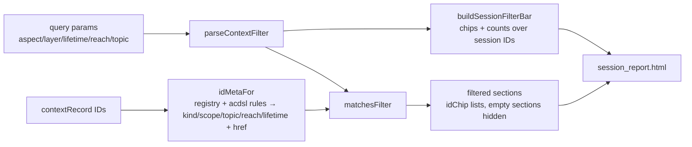
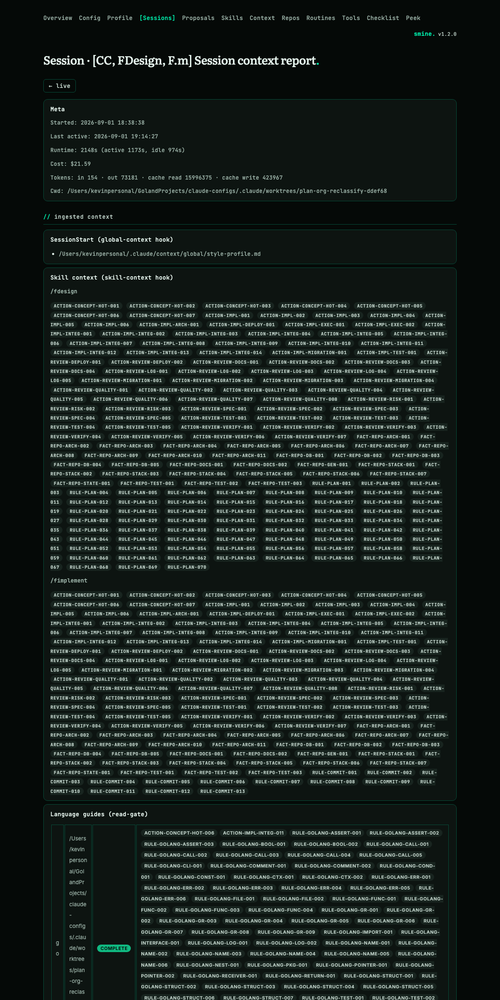

# Session Context Report — Context Filter System — Change Plan

route: `change`

## TLDR
- The report's context sections currently render inert ID chip lists — no navigation, no filtering; that helps nobody.
- This change replicates the context page's complete filter system on the session report: reach, layer (acdsl / action / rule / fact), lifetime, scope, and topic — the same server-side query-param chips, minus every management control (reach picker, set-reach, add/remove scope).
- Entry bodies are never shown on the report: every live ID becomes a link to its context page detail (`/context/entry/{id}` or `/context/rule/{id}`), and the filter card carries one "open in context" link with the active filter applied.
- The context page's `contextFilter` machinery is reused directly; its URL builder gains a base-path parameter so both pages share one chip-link builder.

## Context
- **Problem:** all seven ID-bearing sections of the report render `<span class="badge badge-dim">{{.}}</span>` — flat text (session_report.html:38,53,66,73,87).
- **Cause:** the initial plan ([raw.md](../claude-configs/.claude/worktrees/plan-org-reclassify-ddef68/plans/session-context-report/design/raw.md) §7) specified "plain text chips — no links, the identifiers are the payload"; usage showed the opposite is needed.
- **Reference implementation:** the context page filter system — `contextFilter` + chips ([contextdocs.go:65-135,510-622](internal/server/contextdocs.go)), `_aspect_bar.html`.
- **Constraint:** management features are explicitly excluded [USER]; filtering is 100% server-side `<a href>` chips, no htmx, no new JS.

## Drivers
| ID | Observed | Wanted | Impact | Origin |
|---|---|---|---|---|
| DR1 | Context sections are flat, unlinked ID chip lists | The context page's filter system (reach/layer/lifetime/scope/topic) filters the session's IDs; each live ID links to its context page detail; no entry bodies on the report | behavioral | user review of the implemented report (this session) |

## Scope
- **In:**
  - **filter card:** new `_session_filter_bar.html` on the report — reach, layer, lifetime, scope rows (+ topic row when a scope is active), counts computed over this session's ID set, plus an "open in context" link.
  - **ID links:** every ingested ID resolved against the registry + discovered ACDSL rules; live IDs link to `/context/entry/{id}` / `/context/rule/{id}`, stale ones render as plain code.
  - **filtering:** query params on `/sessions/live/{id}` filter the IDs in all seven mechanism sections; empty ID sections hide while a filter is active.
  - **URL builder refactor:** `contextFilter.URL()` → `URL(base string)` so report chips reuse the one builder.
- **Out:**
  - **management UI:** reach picker, set-reach, add/remove scope, bulk forms, fixtures — excluded [USER].
  - **entry bodies:** no statement/why text on the report — links only [USER].
  - **htmx/JS filtering:** chips are plain links, matching the context page; the existing "+N" topic-overflow toggle in layout.html is reused as-is if chip rows overflow, no new JS.
- **Not changed:**
  - **context page behavior:** identical rendering; only the URL-builder signature changes.
  - **meta card, invoked skills, touched files, live list, degraded banners:** untouched.
  - **contextRecord JSON contract / context_record.sh:** untouched.
- **Deferred findings:** none.

## Assumptions
| Assumption | Reality | Location |
|---|---|---|
| The context page's filter axes are query-param driven and reusable | Confirmed: `contextFilter` with aspect/layer/lifetime/reach/topic, `with()`/`URL()` builders, `parseContextFilter` reads the request | [contextdocs.go:65-135](internal/server/contextdocs.go) |
| Every ingested ID can be mapped to scope/topic | Prose IDs carry explicit Scope/Topic in the registry; ACDSL and unknown IDs derive them by segment (`ruleScope`/`ruleTopic`) | [acdsl.go:37-53](internal/server/acdsl.go), contextdocs.go:203-213 |
| `reach.Names("")` yields no chips (unknown reach matches only "all") | To verify at implementation start — if it yields chips, `matchesFilter` guards unknown reach explicitly (stop S7) | internal/reach |

## Current state
- [internal/server/templates/session_report.html](internal/server/templates/session_report.html)
  - Lines 38, 53, 66, 73, 87: five identical inert chip renderings `{{range .Ids}}<span class="badge badge-dim">{{.}}</span>{{end}}` (skill, lang, acdsl-file, plan-rules, subagent).
  - No filter UI; sections always render with "—" placeholders.
- [internal/server/sessionreport.go](internal/server/sessionreport.go)
  - `contextRecord` and sub-structs (:31-88) expose raw `[]string` ID lists straight to the template.
  - `handleSessionReport` (:108-146) reads no query parameters.
- Context page filter machinery (reused, one signature change):
  - `contextFilter` type + `Active`/`URL`/`with`/`parseContextFilter` — [contextdocs.go:65-135](internal/server/contextdocs.go).
  - `allChip`/`axisChips` (:510-526), `reachChips`/`reachMatches` (:449-468), `reachBarEntries` (:472-506), `aspectBarEntry` (:176-185).
  - `ruleScope`/`ruleTopic` — [acdsl.go:37-53](internal/server/acdsl.go); `loadRegistryEntries` (contextdocs.go:432-444); `acdsl.DiscoverRules(ctx, ".")` (acdsl.go:135).
  - `_aspect_bar.html` — four chip rows; management controls interleaved (reach picker :12-13, remove/add scope :46-57).
  - 11 `.URL()` call sites (acdsl.go:133,190,192; contextdocs.go:376,378,512,522,576,602,618,736).

## Target state

- **Principle:** single source of truth — the context page's filter vocabulary (`contextFilter`, axis semantics, chip markup) is reused, not copied; the report adds only the per-session ID resolution. Mechanism: Go template partial + shared package-private helpers in `package server`.

## Behavior contract
- **Must not change:** context page rendering and filtering (the `URL(base)` refactor is behavior-preserving — existing context tests pin it); report meta card, invoked skills, touched files; live list; all degraded modes; unfiltered report shows every ID.
- **Intentional changes (DR1):** IDs render as links when live; filter card appears above the context sections; with an active filter, non-matching IDs disappear and ID sections left empty hide; path-only content (SessionStart file list, pack reads, subagent paths) is never filtered by ID axes.

## Decisions
| ID | Problem | Facts | Decision | Why |
|---|---|---|---|---|
| D1 | Filter mechanism on the report | [Current state](#current-state) | Same five query axes on `/sessions/live/{id}`, parsed by the existing `parseContextFilter`; chips are plain links | Identical mental model to the context page; server-side is debuggable, no client state |
| D2 | How chips build their URLs | 11 `.URL()` sites | Refactor `contextFilter.URL()` → `URL(base string)`; update every caller (`"/context"`); `allChip`/`axisChips` gain the base parameter | One builder for both pages — no parallel variant (signature change over sibling function) |
| D3 | ID → axes resolution | [Assumptions](#assumptions) | Registry entries give prose IDs kind/scope/topic/reach + entry link; discovered ACDSL rules give reach/lifetime + rule link with `ruleScope`/`ruleTopic`; IDs in neither derive kind from prefix and scope/topic from segments, unlinked | Mirrors the context page's live-link vs plain-code treatment (`coverLink`); stale IDs stay visible and filterable |
| D4 | Axis semantics for session IDs | context page semantics | Lifetime narrows only ACDSL IDs (prose unaffected — same as context page); unknown reach/lifetime matches only that axis's "all" chip | Parity with the reference implementation; predictable degradation for retired IDs |
| D5 | Where topic chips live | report has no scope groups | A topics row appears in the filter card when a scope is selected, listing topics present in the session's IDs under that scope | The context page hangs topics on scope groups; the report's sections are mechanisms, so the card is the only stable host |
| D6 | Section behavior under filter | DR1 | ID lists filtered per section; a section whose ID list empties under an active filter is hidden; SessionStart/pack-reads path sections always render | The filter is about identifiers; hiding noise is the point of filtering |
| D7 | Linking to context | DR1 [USER] | Per-ID: `/context/rule/{id}` (ACDSL) / `/context/entry/{id}` (prose), pathEscaped, live only; filter card ends with "open in context" → `/context?<active axes>` | "Don't show the whole context, but a link to the context page" — detail per ID, filtered overview per card |
| D8 | Management controls | [USER] | None replicated: no reach picker, set-reach, add/remove scope, bulk form | Explicitly excluded in the request |
| D9 | Chip counts | context page shows (rules/entries) | Scope and reach chips show `(ruleCount/entryCount)` computed over this session's ID set, under the active reach (scope row) — mirroring `buildAspectBar`'s counting rules | Counts must describe the page they filter, not the global registry |

## Open questions
None.

## Current state (facts index)
Change-route fact rows cited by Decisions live inline in [Current state](#current-state) and [Assumptions](#assumptions) above.

## Baseline (verified)
N/A — change route (facts in Current state / Assumptions).

## Exemplar & reuse
N/A — change route (the reference implementation is the context page filter system, named per change in [Changes](#changes)).

## Changes

### Phase C1 — URL builder takes a base path (behavior-preserving)
location: `internal/server/contextdocs.go`, `internal/server/acdsl.go`

```diff
-// URL renders /context under this filter — the single builder behind every
-// chip link (plan D6).
-func (f contextFilter) URL() string {
+// URL renders base under this filter — the single builder behind every chip
+// link on the context page and the session report.
+func (f contextFilter) URL(base string) string {
 	query := url.Values{}
 	// ...
 	if len(query) == 0 {
-		return "/context"
+		return base
 	}
-	return "/context?" + query.Encode()
+	return base + "?" + query.Encode()
 }
```

```diff
-func allChip(filter contextFilter, axis, active string) aspectBarEntry {
+func allChip(base string, filter contextFilter, axis, active string) aspectBarEntry {
 	chip := aspectBarEntry{Active: active == "", Name: "all", Registered: true}
-	chip.URL = filter.with(axis, "").URL()
+	chip.URL = filter.with(axis, "").URL(base)
 	return chip
 }

-func axisChips(filter contextFilter, axis, active string, values []string) []aspectBarEntry {
-	chips := []aspectBarEntry{allChip(filter, axis, active)}
+func axisChips(base string, filter contextFilter, axis, active string, values []string) []aspectBarEntry {
+	chips := []aspectBarEntry{allChip(base, filter, axis, active)}
 	for _, value := range values {
 		chip := aspectBarEntry{Active: active == value, Name: value, Registered: true}
-		chip.URL = filter.with(axis, value).URL()
+		chip.URL = filter.with(axis, value).URL(base)
 		chips = append(chips, chip)
 	}
 	return chips
 }
```

- **Callers updated mechanically** (compiler-driven, all pass `"/context"`): acdsl.go:133 (becomes `filter.URL("/context/acdsl/fixtures/run")`, dropping the `TrimPrefix` dance), acdsl.go:190, acdsl.go:192, contextdocs.go:376, 378, 512, 522, 576, 602, 618, 736.
- Gate: build green + existing context page tests green before Phase C2.

### Phase C2 — ID resolution, filtering and filter bar (Go)
location: `internal/server/sessionreport.go`
mirrors: `buildAspectBar` counting rules ([contextdocs.go:534-622](internal/server/contextdocs.go)) for the bar; `coverLink` ([acdsl.go:260-263](internal/server/acdsl.go)) for live-vs-stale links

ACDSL (project -plan, unchanged from raw.md): ACDSL-GOLANG-EXEC-001, -STATE-001, -FMT-001, -FUNC-001, -ENUM-001.

New types (template-facing, in the file's alphabetical type order):

```go
// idChip is one ingested identifier on the report: linked to its context
// page detail when the id resolves to a live registry entry or acdsl rule.
type idChip struct {
	Id   string
	Href string
}

// idGroup is one labeled id list (a skill, an acdsl-projected file, a
// subagent prompt); Paths is used by the subagent section only.
type idGroup struct {
	Ids   []idChip
	Label string
	Paths []string
}

// idMeta carries one id's filter axes; zero values mean unknown (D3/D4).
type idMeta struct {
	Href     string
	Kind     string
	Lifetime string
	Reach    string
	Scope    string
	Topic    string
}

type langRow struct {
	Coverage string
	Guide    string
	Ids      []idChip
	Lang     string
}

// reportSections is the filtered projection of a contextRecord (D6).
type reportSections struct {
	AcdslFiles     []idGroup
	LangRows       []langRow
	PlanIds        []idChip
	SkillGroups    []idGroup
	SubagentGroups []idGroup
}

// sessionFilterBar backs _session_filter_bar.html — the context page's
// filter axes over this session's id set, without management controls (D8).
type sessionFilterBar struct {
	Aspects    []aspectBarEntry
	ContextURL string
	Layers     []aspectBarEntry
	Lifetimes  []aspectBarEntry
	Reaches    []aspectBarEntry
	Topics     []aspectBarEntry
}
```

`sessionReportPage` gains the projection and the bar:

```diff
 type sessionReportPage struct {
+	reportSections
+
 	ContextErr string
 	Events     *peek.SessionEvents
 	EventsErr  string
+	Filter     sessionFilterBar
+	HasFilter  bool
 	Page       string
 	Record     *contextRecord
 	Session    peek.Session
 	Title      string
 }
```

New functions (complete units):

```go
// buildSessionIdIndex resolves ingested ids against the registry and the
// discovered acdsl rules; a discovery failure degrades to registry-only
// resolution (acdsl ids stay unlinked) and is logged.
func (s *Server) buildSessionIdIndex(ctx context.Context) map[string]idMeta {
	index := map[string]idMeta{}
	for _, entry := range s.loadRegistryEntries() {
		index[entry.Id] = idMeta{
			Href:  "/context/entry/" + url.PathEscape(entry.Id),
			Kind:  entry.Kind,
			Reach: entry.Reach,
			Scope: entry.Scope,
			Topic: entry.Topic,
		}
	}

	discovery, err := acdsl.DiscoverRules(ctx, ".")
	if err != nil {
		log.Printf("Server.buildSessionIdIndex: Acdsl discovery failed, rule ids stay unlinked: %v", err)
		return index
	}
	for _, rule := range discovery.Rules {
		index[rule.Id] = idMeta{
			Href:     "/context/rule/" + url.PathEscape(rule.Id),
			Kind:     layerAcdsl,
			Lifetime: rule.Lifetime,
			Reach:    rule.Reach,
			Scope:    ruleScope(rule.Id),
			Topic:    ruleTopic(rule.Id),
		}
	}
	return index
}

// idMetaFor falls back to segment-derived axes for ids in neither source —
// retired or foreign ids stay filterable but unlinked (D3).
func idMetaFor(id string, index map[string]idMeta) idMeta {
	if meta, ok := index[id]; ok {
		return meta
	}

	meta := idMeta{Scope: ruleScope(id), Topic: ruleTopic(id)}
	switch {
	case strings.HasPrefix(id, "ACDSL-"):
		meta.Kind = layerAcdsl
	case strings.HasPrefix(id, "ACTION-"):
		meta.Kind = contextdocs.RuleKindAction
	case strings.HasPrefix(id, "RULE-"):
		meta.Kind = contextdocs.RuleKindRule
	case strings.HasPrefix(id, "FACT-"):
		meta.Kind = contextdocs.RuleKindFact
	}
	return meta
}

// matchesFilter applies the context page's axis semantics to one id (D4):
// lifetime narrows only acdsl ids; unknown reach/lifetime match only "all".
func matchesFilter(filter contextFilter, meta idMeta) bool {
	if filter.Layer != "" && meta.Kind != filter.Layer {
		return false
	}
	if filter.Aspect != "" && meta.Scope != filter.Aspect {
		return false
	}
	if filter.Topic != "" && meta.Topic != filter.Topic {
		return false
	}
	if !reachMatches(meta.Reach, filter.Reach) {
		return false
	}

	lifetimeApplies := filter.Lifetime != "" && meta.Kind == layerAcdsl
	if lifetimeApplies && meta.Lifetime != filter.Lifetime {
		return false
	}
	return true
}

// filterIds projects raw id strings to chips, dropping non-matching ids.
func filterIds(filter contextFilter, ids []string, index map[string]idMeta) []idChip {
	var chips []idChip
	for _, id := range ids {
		meta := idMetaFor(id, index)
		if !matchesFilter(filter, meta) {
			continue
		}
		chips = append(chips, idChip{Id: id, Href: meta.Href})
	}
	return chips
}
```

`buildReportSections` maps each record field through `filterIds` (skill → `SkillGroups`, lang → `LangRows`, acdsl_rules → `AcdslFiles`, plan_rules → `PlanIds`, subagent → `SubagentGroups`; groups whose `Ids` empty under an active filter are dropped, subagent groups keep their Paths only while their Ids survive). Straightforward loops, one per field, no conditionals beyond the drop check.

`buildSessionFilterBar` (mirrors `buildAspectBar`'s counting under active reach; base is the report URL):

```go
// buildSessionFilterBar renders the filter axes over this session's ids:
// counts describe the page, not the registry (D9); topics appear only under
// a selected scope (D5).
func buildSessionFilterBar(base string, filter contextFilter, ids []string, index map[string]idMeta) sessionFilterBar {
	bar := sessionFilterBar{ContextURL: filter.URL("/context")}
	bar.Layers = axisChips(base, filter, "layer", filter.Layer,
		[]string{layerAcdsl, contextdocs.RuleKindAction, contextdocs.RuleKindRule, contextdocs.RuleKindFact})
	bar.Lifetimes = axisChips(base, filter, "lifetime", filter.Lifetime,
		[]string{acdsl.LifetimeTask, acdsl.LifetimeDoctrine})

	ruleCounts := map[string]int{}
	entryCounts := map[string]int{}
	reachRuleCounts := map[string]int{}
	reachEntryCounts := map[string]int{}
	topicCounts := map[string]int{}
	for _, id := range ids {
		meta := idMetaFor(id, index)
		isRule := meta.Kind == layerAcdsl
		for _, chip := range reachChips(meta.Reach) {
			if isRule {
				reachRuleCounts[chip]++
			} else {
				reachEntryCounts[chip]++
			}
		}
		if !reachMatches(meta.Reach, filter.Reach) {
			continue
		}
		if meta.Scope == "" {
			continue
		}
		if isRule {
			ruleCounts[meta.Scope]++
		} else {
			entryCounts[meta.Scope]++
		}
		if meta.Scope == filter.Aspect {
			topicCounts[meta.Topic]++
		}
	}

	bar.Reaches = append([]aspectBarEntry{allChip(base, filter, "reach", filter.Reach)},
		reachBarEntries(reachRuleCounts, reachEntryCounts)...)
	for index := range bar.Reaches {
		if bar.Reaches[index].Name == "all" {
			continue
		}
		bar.Reaches[index].Active = bar.Reaches[index].Name == filter.Reach
		bar.Reaches[index].URL = filter.with("reach", bar.Reaches[index].Name).URL(base)
	}

	bar.Aspects = append(bar.Aspects, allChip(base, filter, "aspect", filter.Aspect))
	for _, scope := range slices.Sorted(maps.Keys(mergedKeys(ruleCounts, entryCounts))) {
		bar.Aspects = append(bar.Aspects, aspectBarEntry{
			Active:     scope == filter.Aspect,
			Counts:     true,
			EntryCount: entryCounts[scope],
			Name:       scope,
			Registered: true,
			RuleCount:  ruleCounts[scope],
			URL:        filter.with("aspect", scope).URL(base),
		})
	}

	if filter.Aspect != "" {
		bar.Topics = append(bar.Topics, allChip(base, filter, "topic", filter.Topic))
		for _, topic := range slices.Sorted(maps.Keys(topicCounts)) {
			if topic == "" {
				continue
			}
			bar.Topics = append(bar.Topics, aspectBarEntry{
				Active:     topic == filter.Topic,
				Counts:     true,
				EntryCount: topicCounts[topic],
				Name:       topic,
				Registered: true,
				URL:        filter.with("topic", topic).URL(base),
			})
		}
	}
	return bar
}
```
(`mergedKeys` is a two-line set-union helper over the two count maps; exact literal layout follows the style gate at implementation. The composite literals inside `append` are bound to named variables at implementation per the return/argument-literal rules — shown inline here for readability only.)

`handleSessionReport` wiring:

```diff
 	data := sessionReportPage{
 		Page:    pageSessions,
 		Session: session,
 		Title:   "Session — " + shortId(id),
 	}
+	filter := parseContextFilter(r)
+	data.HasFilter = filter.Active()
 	// ... events + record unchanged ...
 	data.Record = record
+	if record != nil {
+		index := s.buildSessionIdIndex(r.Context())
+		base := "/sessions/live/" + url.PathEscape(id)
+		data.Filter = buildSessionFilterBar(base, filter, record.allIds(), index)
+		data.reportSections = buildReportSections(filter, index, record)
+	}
 	s.renderFragment(w, tmplSessionReport, data)
```
`contextRecord.allIds()` concatenates every ID list of the record (skill, lang, acdsl, plan, subagent) — the bar's population.

### Phase C3 — Templates
location: `internal/server/templates/_session_filter_bar.html` (new), `internal/server/templates/session_report.html` (modified)
mirrors: `_aspect_bar.html` (chip rows, classes) — management controls omitted
ui: current state `plans/session-context-report/design/ui/session_report.png`; filtered-state screenshot captured at verification (see Hot items)

Complete new partial:

```html
{{define "_session_filter_bar.html"}}
<div class="card card-filter">
  <div class="card-row">
    <span class="section-label">reach</span>
    {{range .Reaches}}
    <a class="badge {{if .Active}}badge-ok{{else}}badge-dim{{end}}"
       href="{{.URL}}">{{.Name}}{{if .Counts}} ({{.RuleCount}}/{{.EntryCount}}){{end}}</a>
    {{end}}
  </div>
  <hr class="filter-divider">
  <div class="card-row">
    <span class="section-label">layer</span>
    {{range .Layers}}
    <a class="badge {{if .Active}}badge-ok{{else}}badge-dim{{end}}"
       title="{{if eq .Name "acdsl"}}the executable gate system{{else if ne .Name "all"}}prose {{.Name}} entries{{end}}"
       href="{{.URL}}">{{.Name}}</a>
    {{end}}
  </div>
  <hr class="filter-divider">
  <div class="card-row">
    <span class="section-label">lifetime</span>
    {{range .Lifetimes}}
    <a class="badge {{if .Active}}badge-ok{{else}}badge-dim{{end}}"
       href="{{.URL}}">{{.Name}}</a>
    {{end}}
  </div>
  <hr class="filter-divider">
  <div class="card-row">
    <span class="section-label">scope</span>
    {{range .Aspects}}
    <a class="badge {{if .Active}}badge-ok{{else}}badge-dim{{end}}"
       href="{{.URL}}">{{.Name}}{{if .Counts}} ({{.RuleCount}}/{{.EntryCount}}){{end}}</a>
    {{end}}
  </div>
  {{if .Topics}}
  <hr class="filter-divider">
  <div class="card-row">
    <span class="section-label">topic</span>
    {{range .Topics}}
    <a class="badge {{if .Active}}badge-ok{{else}}badge-dim{{end}}"
       href="{{.URL}}">{{.Name}}{{if .Counts}} ({{.EntryCount}}){{end}}</a>
    {{end}}
  </div>
  {{end}}
  <hr class="filter-divider">
  <div class="card-row">
    <a class="meta" href="{{.ContextURL}}">open in context page →</a>
  </div>
</div>
{{end}}
```

`session_report.html` changes:
- The bar renders directly under the `Ingested context` heading: `{{template "_session_filter_bar.html" .Filter}}` (before the `{{with .Record}}` block; sections below switch from `.Record` fields to the filtered page fields).
- The canonical ID-chip markup, applied in all five ID spots (skill groups, lang rows, acdsl files, plan rules, subagent groups):

```html
{{range .Ids}}{{if .Href}}<a class="badge badge-dim" href="{{.Href}}">{{.Id}}</a>{{else}}<span class="badge badge-dim">{{.Id}}</span>{{end}} {{end}}
```

- Section sources change from record fields to the filtered projections — representative diff (skill section; lang/acdsl/plan/subagent follow identically from `.LangRows`/`.AcdslFiles`/`.PlanIds`/`.SubagentGroups`):

```diff
 <div class="card card-column">
   <span class="label">{{t "Skill context (skill-context hook)"}}</span>
-  {{if .Injected.Skill}}
-  {{range .Injected.Skill}}
-  <span class="meta"><b>/{{.Skill}}</b></span>
-  <div>{{range .Ids}}<span class="badge badge-dim">{{.}}</span> {{end}}</div>
+  {{if $.SkillGroups}}
+  {{range $.SkillGroups}}
+  <span class="meta"><b>/{{.Label}}</b></span>
+  <div>{{range .Ids}}{{if .Href}}<a class="badge badge-dim" href="{{.Href}}">{{.Id}}</a>{{else}}<span class="badge badge-dim">{{.Id}}</span>{{end}} {{end}}</div>
   {{end}}
-  {{else}}<span class="meta">—</span>{{end}}
+  {{else if not $.HasFilter}}<span class="meta">—</span>{{end}}
 </div>
```

- Section-hiding: each ID section's card wraps in `{{if or <list> (not $.HasFilter)}} … {{end}}` — with an active filter an empty section disappears instead of showing "—"; SessionStart and Context-pack-reads cards stay unconditional (D6).

### Phase C4 — Tests
location: `internal/server/sessionreport_test.go` (extended)
mirrors: existing `TestTranscriptPath` table style in the same file

- Table tests for `matchesFilter`, `idMetaFor`, `filterIds` (cases in [Tests](#tests)).
- Existing context page tests are the C1 safety net (they exercise chip URLs through the handlers).

## Hot items
- **UI (ACTION-CONCEPT-HOT-007 / RULE-PLAN-069):** the UI under change exists — current state:
  - 
  - Filtered-state screenshots (bar + filtered sections) are captured from the running server at verification into `plans/session-context-report/design/ui/` (`session_report_filtered.png`), per the no-fabricated-mockups rule.
- No SQL, no concurrency, no new interface/generic, no anonymous structs (all template data is named types above), no guard changes.

## Tests
| Location.Method | Cases | Comment |
|---|---|---|
| sessionreport_test.go TestMatchesFilter | no filter matches all<br>layer acdsl vs prose kinds<br>aspect match/mismatch<br>topic match/mismatch<br>unknown reach matches only all-chip<br>lifetime narrows acdsl only, prose passes<br>lifetime mismatch drops acdsl id | table per repo skeleton |
| sessionreport_test.go TestIdMetaFor | registry hit wins over derivation<br>ACDSL-* fallback: kind acdsl, scope/topic segments<br>RULE-PLAN-001 fallback: kind rule, scope PLAN, no topic<br>unknown prefix: empty kind | pure function |
| sessionreport_test.go TestFilterIds | live id gets href<br>stale id no href<br>non-matching id dropped | pure function |
| existing context page tests | pin C1 refactor | safety net — chip URLs unchanged |
| not tested: buildSessionFilterBar end-to-end | — | covered by the runbook scenarios (rendered chips checked via curl) |

## Test runbook
Scenario index (curl against the local config server; behavioral driver DR1):
- **report-unfiltered:** `curl /sessions/live/<id>` — all IDs render, live ones as `<a href="/context/entry/…">`/`/context/rule/…`.
- **report-layer-acdsl:** `curl '/sessions/live/<id>?layer=acdsl'` — only ACDSL-* chips remain; prose sections hidden.
- **report-scope-topic:** `curl '/sessions/live/<id>?aspect=GOLANG'` — topics row appears; adding `&topic=ERR` narrows further.
- **report-lifetime:** `curl '/sessions/live/<id>?lifetime=doctrine'` — prose IDs unaffected, acdsl narrowed.
- **context-unchanged:** `curl '/context?aspect=PLAN&layer=rule'` — same chips/sections as before C1 (compare against pre-change output).
- **open-in-context:** the card's context link carries the active axes (`/context?layer=acdsl&aspect=GOLANG`).

## Contracts & sweeps
| Contract | Sides | Sweep |
|---|---|---|
| `contextFilter.URL(base)` signature | contextdocs.go/acdsl.go callers ↔ sessionreport.go | compiler-driven: build enumerates all 11 sites; grep `.URL()` to zero |
| ID link shape `/context/entry/{id}`, `/context/rule/{id}` | report chips ↔ existing context detail handlers | handlers exist (server.go:358-359 region); 404 for stale ids is why stale ids stay unlinked |
| Filter axis names (aspect/layer/lifetime/reach/topic) | report query params ↔ `parseContextFilter` ↔ context page links | single parser reused — no second vocabulary |

## Verification
- [ ] Run `make audit` — green.
- [ ] Run the config server; `curl -s localhost:<port>/sessions/live/<this session id>` — every RULE-PLAN/ACTION/FACT chip is an `<a>` to `/context/entry/…`, ACDSL chips to `/context/rule/…`.
- [ ] `curl '…?layer=acdsl'` — only ACDSL ids remain; skill sections with none are hidden.
- [ ] `curl '…?aspect=GOLANG&topic=ERR'` — chips narrow; topics row present; counts sum to visible chips.
- [ ] `curl '…?reach=smine'` — ids with unknown reach disappear; "all" restores them.
- [ ] Click-through: an ID link opens the context detail page; "open in context" opens `/context` with the same axes applied.
- [ ] Context page unchanged: `curl '/context?aspect=PLAN'` output identical to pre-change (modulo nothing).
- [ ] Degenerate: unfiltered page identical in content to before (plus links + bar); record-less (ContextErr) page renders without the bar's sections crashing.
- [ ] Capture `session_report_filtered.png` into `plans/session-context-report/design/ui/`.
- [ ] Persist this plan to `plans/session-context-report/design/change-context-filters.md`.

## Stop conditions
| ID | Condition | Action |
|---|---|---|
| S1 | An approved signature or contract can't hold as planned | Stop and report (ACTION-IMPL-001) |
| S2 | Second failed approach in a row | Stop, re-read disk state, plan (ACTION-IMPL-002) |
| S3 | Missing prerequisite | Run the producing step; infra down → ask (ACTION-IMPL-003) |
| S4 | Work materially exceeds scope | Ask before continuing (ACTION-IMPL-004) |
| S5 | Same bug kind twice | Fix in-diff instances; report pre-existing (ACTION-IMPL-005) |
| S6 | Structural obstacle tempts an abstraction | Stop and report (ACTION-IMPL-006) |
| S7 | `reach.Names("")` returns chips (unknown reach would match specific chips) | Guard unknown reach explicitly in `matchesFilter` and note the deviation |
| S8 | C1 refactor changes any context page output | Stop — the refactor must be behavior-preserving; diff the rendered HTML |

## Changelog
| Date | Trigger | What changed |
|---|---|---|
| — | initial | change plan created (DR1: context filter system on the session report) |
