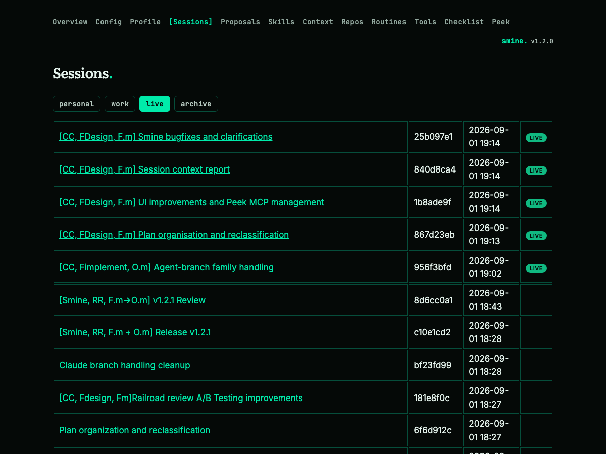

# Session Context Report — Implementation Plan

## TLDR
- Every Claude Code session gets an on-demand report page in the config server: meta (start, last active, runtime, idle time, cost, tokens) plus the context it ingested — one section per injection mechanism (SessionStart hook, skill-context hook, read-gate guide reads, ACDSL projections, plan-time rules, pack reads, subagent-inlined) — and the skills it invoked and files it touched.
- The data already exists in two places: peek-mcp's `session_events` tool (meta, invoked skills, touched files, cost telemetry) and the repo's transcript extractor `cmd/context/context_record.sh` (all injected context identifiers). Nothing records this per session today; the report combines the two live.
- New: a `session_events` client call in the peek MCP client, a report handler + two templates in the config server, a "live" tab in the Sessions area listing all sessions with links to their reports.
- No new storage, no new daemon, no peek-mcp source changes — the report is computed on page load.

## Context
- **Problem:** which context (global/skill/language docs, ACDSL rules) actually reached a session is invisible after the fact; meta like cost and idle time is locked inside peek-mcp tools nobody renders.
- **Cause:** the injecting hooks write nothing to disk on the inline path ([cmd/hooks/global-context.sh](cmd/hooks/global-context.sh), [cmd/hooks/skill-context.sh](cmd/hooks/skill-context.sh)); the config server's peek client consumes only `session_list` ([peek.go:68](internal/peek/peek.go)).
- **Design:** per-session report page in the config server — the repo's UI surface (FACT-REPO-ARCH-002) — fed by peek-mcp `session_events` plus a shell-out to [cmd/context/context_record.sh](cmd/context/context_record.sh).
- **Constraint:** peek-mcp is external; the tool interface is the whole contract — never imported as a library ([peek.go:8-11](internal/peek/peek.go)).
- **Constraint:** degraded modes are first-class: peek down, transcript pruned, telemetry disabled must all render a page, not an error.

## Drivers
N/A — new route

## Scope
- **In:**
  - **peek client:** `SessionEvents(ctx, id)` in `internal/peek` (new `events.go`), typed against the probed `session_events` payload.
  - **report page:** `GET /sessions/live/{id}` handler + `session_report.html` — meta card, context-identifier sections, invoked skills, touched files.
  - **live list:** `GET /sessions/live` + `sessions_live.html` — all sessions from `session_list`, newest first, linking to their reports; "live" tab added to `sessions_index.html`.
  - **plumbing:** `ClaudeHome` option threaded from `cmd/configserver/main.go` into the server (transcript path derivation).
  - **tests:** parsing, path-munging, and grouping unit tests.
- **Out:**
  - **Codex sessions:** claude agent only, matching the existing peek client.
  - **persisted report artifacts:** nothing written per session (see [D1](#decisions)).
  - **peek-mcp changes:** the report uses the tool surface as-is.
  - **context_record.sh changes:** consumed unchanged; it stays the single transcript extractor.
  - **subagent breakdown:** `session_events breakdown:true` per-subagent split — later if wanted.
- **Not changed:**
  - **smine pipeline:** batch mining and `internal/sessions` store untouched.
  - **hooks:** no new recording side-channel; the transcript stays the source of truth.
- **Deferred findings:**
  - **batch context dropped:** `internal/sessions.Session` silently drops the `context`/`permissions` blocks the smine-batch schema already produces — surfacing mined context in the batch view is a separate change.
  - **stale peek instance:** the machine's long-running HTTP peek instance answered `session_list` without `meta` during grounding — version drift vs. the ≥1.0.5 contract; worth a reinstall check ([F12](#baseline-verified)).

## Assumptions
| Assumption | Reality | Location |
|---|---|---|
| "Now that everything is present" — data sources exist | Confirmed: `session_events` (peek ≥1.2) carries meta/skills/files; `context_record.sh` carries identifiers | [F1](#baseline-verified), [F2](#baseline-verified) |
| The config server's spawned peek-mcp supports `session_events` with `json:true` | Probed against the stdio peek instance only; the spawned instance is version-managed by install.sh (README pins ≥1.2.2) — verified at implementation against the configured endpoint, stop condition S7 if absent | [F1](#baseline-verified), README.md:50 |
| Transcript dir munging holds on Windows | Verified on macOS only (`/` and `.` → `-`); Windows munging unverified — missing transcript degrades to a banner, never an error page | [F3](#baseline-verified) |
| "session context" is a distinct injected channel | No channel of that name exists; per [D4](#decisions) the report divides context by injecting mechanism instead | cmd/hooks/global-context.sh:26 |

## Current state
N/A — new route

## Target state
N/A — new route

## Behavior contract
N/A — new route

## Decisions
| ID | Problem | Facts | Decision | Why |
|---|---|---|---|---|
| D1 | Where "each session's report" lives | [F5](#baseline-verified), [F6](#baseline-verified) | [USER] config-server page, computed on load | No storage/lifecycle, always current, and the config server is the repo's UI (FACT-REPO-ARCH-002) |
| D2 | One extractor or two data paths | [F1](#baseline-verified), [F2](#baseline-verified) | Meta + invoked skills + touched files from peek `session_events`; context identifiers from `context_record.sh` — no overlap, no reimplementation | Each source is the existing single owner of its data; duplicating either in Go creates a second parser to keep in sync (debuggable axis) |
| D3 | How the server runs the extractor | [F2](#baseline-verified), [F7](#baseline-verified) | Shell out to `cmd/context/context_record.sh <transcript>` via `internal/shell.Run`, decode stdout into typed structs | Mirrors the server's shell-out pattern (sync scripts, FACT-REPO-ARCH-002) and the ACDSL exec gate; script stays the one transcript parser |
| D4 | How the report groups the ingested context | [F2](#baseline-verified), [F10](#baseline-verified) | [USER] Sections divided by the mechanism that injected the context: SessionStart global-context hook (injected.global file list), skill-context hook (injected.skill), read-gate–forced guide reads (injected.lang), ACDSL projection hook (acdsl_rules), plan-time rules (plan_rules), context-pack reads (pack_reads), subagent-inlined (subagent_context) | Each record field already maps 1:1 to one injection mechanism — no re-grouping logic needed, the record IS the mechanism split |
| D5 | Where the `session_events` call lives | [F4](#baseline-verified) | New `internal/peek/events.go`: exported `SessionEvents` domain type + unexported wire structs + `Client.SessionEvents` | Mirrors the `listItem`/`Session` split in peek.go; keeps `session_list` untouched (RULE-GOLANG-FILE-002 concern split) |
| D6 | Route naming under `/sessions/{scope}` | [F6](#baseline-verified) | `GET /sessions/live` and `GET /sessions/live/{id}`; a mined scope literally named "live" would be shadowed (accepted, scopes are repo names) | Go 1.22 mux gives literal segments precedence over `{scope}`; keeps the report under the Sessions nav without a new top-level namespace |
| D7 | Degraded modes | [F8](#baseline-verified), [F9](#baseline-verified) | Peek unreachable → banner naming the endpoint (mirrors repos.go `SessionsErr`); transcript missing/unparseable → meta-only page + note; telemetry absent → cost renders "—" (`HasTelemetry`) | Telemetry is optional by config (control-port=0 → no block); a report that 500s on any missing source is useless for exactly the sessions one wants to inspect (reliable axis) |
| D8 | Transcript path derivation | [F3](#baseline-verified) | Pure Go helper `transcriptPath(claudeHome, cwd, id)` replacing `/`, `\`, `.`, `:` with `-`; unit-tested | Deterministic and testable; asking peek for the path would extend the tool contract for a string the client can build |

## Open questions
None — Q1 ([D1](#decisions)) and Q2 ([D4](#decisions)) answered at presentation, see Changelog.

## Baseline (verified)
Base branch: `claude/session-context-report-f06773` (worktree, clean at plan start).

| ID | Fact | Needed for | Location |
|---|---|---|---|
| F1! | `session_events` (json:true) returns `time{started_at, last_active, wall_seconds, idle_seconds, active_seconds, telemetry{cost_usd, status}}`, `usage{input/output/cache tokens}`, `touched_files[{path, reads}]`, and `events[]` incl. `kind:"skill_invoked"` with `skill{skill, source}` — probed live against this session | [D2](#decisions), [§1](#changes) | live probe, this session |
| F2! | `context_record.sh` emits `injected{global[], skill[{skill, ids}], lang[{lang, guide, ids, coverage}]}`, `acdsl_rules[{file, ids}]`, `plan_rules[]`, `pack_reads[]`, `subagent_context[]` — and no meta, no invoked-skills, no touched-files | [D2](#decisions), [D3](#decisions), [§3](#changes) | [context_record.sh:52-72](cmd/context/context_record.sh) |
| F3! | Transcript path = `<claude-home>/projects/<cwd with '/' and '.' → '-'>/<session-id>.jsonl` | [D8](#decisions), [§3](#changes) | verified on disk (~/.claude/projects/) |
| F4! | `internal/peek` is a thin MCP client — connect/initialize per call, `session_list` only, structured content unmarshalled into wire structs; "the tool interface is the whole contract" | [D5](#decisions), [§1](#changes) | [peek.go:8-11,68-91](internal/peek/peek.go) |
| F5! | The config server is the repo's UI and shells out to repo scripts rather than reimplementing them | [D1](#decisions), [D3](#decisions) | internal/contextdocs/sync.go:62, FACT-REPO-ARCH-002 |
| F6! | Route table uses Go 1.22 patterns incl. `GET /sessions/{scope}`; literal segments take precedence over wildcards | [D1](#decisions), [D6](#decisions), [§4](#changes) | [server.go:316-322](internal/server/server.go) |
| F7 | `internal/shell.Run` runs allowlisted commands with a 60s timeout, combined output, `.sh`-to-bash mapping via `platformArgv` | [D3](#decisions), [§3](#changes) | [shell.go:27-47](internal/shell/shell.go) |
| F8 | Degraded-peek pattern exists: repos page renders `SessionsErr` banner naming `peekClient.Endpoint()` | [D7](#decisions), [§3](#changes) | internal/server/repos.go:330-385 |
| F9! | Telemetry (cost) exists only when peek runs with a control port; control-port=0 → no `telemetry` block | [D7](#decisions) | peek README, memory (peek telemetry in-memory only) |
| F10! | `global-context.sh` injects machine-global (`$HOME/.claude/context/global/*.md`) then repo-local (`<docs>/global/*.md`) with per-file `===== <path> =====` markers; `context_record.sh` captures those markers as `injected.global` | [D4](#decisions), [§3](#changes) | cmd/hooks/global-context.sh:26-38, [context_record.sh:56-57](cmd/context/context_record.sh) |
| F11 | `cmd/configserver/main.go` already has `-claude-home` (default `~/.claude`) but only passes it to the spawned peek, not into `server.Options` | [§4](#changes), [§5](#changes) | [main.go:54](cmd/configserver/main.go), [server.go:54-57](internal/server/server.go) |
| F12 | The machine's long-running HTTP peek instance answered `session_list` without `meta` items during grounding — older than the client's ≥1.0.5 contract | Assumptions, S7 | live probe, this session |
| F13 | Server tests use `httptest` stubs; `internal/peek/peek_test.go` has `newStubPeek` serving initialize + `tools/call` with fixed `structuredContent` | [§2](#changes) | [peek_test.go:15-60](internal/peek/peek_test.go) |
| F14 | Sessions templates: tabs block + `{{t}}` i18n + `renderFragment`; module path is `github.com/kevinhorst/smine` | [§6](#changes), [§7](#changes) | [sessions_index.html:13-19](internal/server/templates/sessions_index.html), internal/server/sessions.go:21 |

## Exemplar & reuse
| Existing | Used for |
|---|---|
| `internal/shell.Run` | running `context_record.sh` under the mandatory deadline |
| `internal/peek.Client` (connect / CallTool / structured-content unmarshal) | the `session_events` call |
| `renderFragment` + `layout.html` head/nav/foot + `{{t}}` | both new templates |
| `shortId` (internal/server/sessions.go:306) | live-list display |
| `cmd/context/context_record.sh` | the entire context-identifier extraction — unchanged |

- Change WITHOUT an exemplar: none — every new unit names a sibling below.

## Changes

### 1. Session events client (new)
location: `internal/peek/events.go`
mirrors: `internal/peek/peek.go` (wire-struct/domain-type split, `listSessions` call shape)

ACDSL (project -plan): ACDSL-GOLANG-EXEC-001, ACDSL-GOLANG-STATE-001, ACDSL-GOLANG-FMT-001, ACDSL-GOLANG-FUNC-001, ACDSL-GOLANG-ENUM-001.

```go
package peek

import (
	"context"
	"encoding/json"
	"errors"
	"fmt"
	"time"

	"github.com/mark3labs/mcp-go/mcp"
)

// SessionEvents is the meta slice of one session_events response: timing,
// cost telemetry, token usage, skill invocations, and touched files (D5).
// CostUsd is meaningful only when HasTelemetry is true — peek runs without
// a telemetry store when its control port is disabled (F9).
type SessionEvents struct {
	ActiveSeconds int
	CostUsd       float64
	HasTelemetry  bool
	IdleSeconds   int
	InvokedSkills []SkillInvocation
	LastActive    time.Time
	StartedAt     time.Time
	TouchedFiles  []TouchedFile
	Usage         TokenUsage
	WallSeconds   int
}

type SkillInvocation struct {
	Skill     string
	Source    string
	Timestamp time.Time
}

type TokenUsage struct {
	CacheCreationInputTokens int
	CacheReadInputTokens     int
	InputTokens              int
	OutputTokens             int
}

type TouchedFile struct {
	Path   string
	Reads  int
	Writes int
}

type eventsItem struct {
	Kind      string      `json:"kind"`
	Skill     eventsSkill `json:"skill"`
	Timestamp time.Time   `json:"timestamp"`
}

type eventsResult struct {
	Events       []eventsItem        `json:"events"`
	Time         eventsTime          `json:"time"`
	TouchedFiles []eventsTouchedFile `json:"touched_files"`
	Usage        eventsUsage         `json:"usage"`
}

type eventsSkill struct {
	Skill  string `json:"skill"`
	Source string `json:"source"`
}

type eventsTelemetry struct {
	CostUsd float64 `json:"cost_usd"`
}

type eventsTime struct {
	ActiveSeconds int              `json:"active_seconds"`
	IdleSeconds   int              `json:"idle_seconds"`
	LastActive    time.Time        `json:"last_active"`
	StartedAt     time.Time        `json:"started_at"`
	Telemetry     *eventsTelemetry `json:"telemetry"`
	WallSeconds   int              `json:"wall_seconds"`
}

type eventsTouchedFile struct {
	Path   string `json:"path"`
	Reads  int    `json:"reads"`
	Writes int    `json:"writes"`
}

type eventsUsage struct {
	CacheCreationInputTokens int `json:"cache_creation_input_tokens"`
	CacheReadInputTokens     int `json:"cache_read_input_tokens"`
	InputTokens              int `json:"input_tokens"`
	OutputTokens             int `json:"output_tokens"`
}

// SessionEvents calls session_events for one session id (json:true) and
// keeps only the meta slice the report renders — event kinds other than
// skill_invoked are dropped here, not modelled.
func (c *Client) SessionEvents(ctx context.Context, id string) (*SessionEvents, error) {
	mcpClient, err := c.connect(ctx)
	if err != nil {
		return nil, err
	}
	defer mcpClient.Close()

	request := mcp.CallToolRequest{}
	request.Params.Name = "session_events"
	request.Params.Arguments = map[string]any{"id": id, "json": true}
	result, err := mcpClient.CallTool(ctx, request)
	if err != nil {
		return nil, fmt.Errorf("Client.SessionEvents: %w", err)
	}
	if result.IsError {
		return nil, errors.New("Client.SessionEvents: Tool returned an error")
	}

	data, err := json.Marshal(result.StructuredContent)
	if err != nil {
		return nil, fmt.Errorf("Client.SessionEvents: %w", err)
	}

	var parsed eventsResult
	if err := json.Unmarshal(data, &parsed); err != nil {
		return nil, fmt.Errorf("Client.SessionEvents: %w", err)
	}

	usage := TokenUsage{
		CacheCreationInputTokens: parsed.Usage.CacheCreationInputTokens,
		CacheReadInputTokens:     parsed.Usage.CacheReadInputTokens,
		InputTokens:              parsed.Usage.InputTokens,
		OutputTokens:             parsed.Usage.OutputTokens,
	}
	events := &SessionEvents{
		ActiveSeconds: parsed.Time.ActiveSeconds,
		HasTelemetry:  parsed.Time.Telemetry != nil,
		IdleSeconds:   parsed.Time.IdleSeconds,
		LastActive:    parsed.Time.LastActive,
		StartedAt:     parsed.Time.StartedAt,
		Usage:         usage,
		WallSeconds:   parsed.Time.WallSeconds,
	}
	if parsed.Time.Telemetry != nil {
		events.CostUsd = parsed.Time.Telemetry.CostUsd
	}
	for _, item := range parsed.Events {
		if item.Kind != "skill_invoked" {
			continue
		}
		invocation := SkillInvocation{
			Skill:     item.Skill.Skill,
			Source:    item.Skill.Source,
			Timestamp: item.Timestamp,
		}
		events.InvokedSkills = append(events.InvokedSkills, invocation)
	}
	for _, file := range parsed.TouchedFiles {
		touched := TouchedFile{
			Path:   file.Path,
			Reads:  file.Reads,
			Writes: file.Writes,
		}
		events.TouchedFiles = append(events.TouchedFiles, touched)
	}
	return events, nil
}
```

### 2. Session events client test (new)
location: `internal/peek/events_test.go`
mirrors: `internal/peek/peek_test.go` (`newStubPeek` httptest stub)

- **stub:** add `newStubPeekStructured(t, structured map[string]any, toolError bool)` — same handler as `newStubPeek` but taking the whole `structuredContent` (the existing helper hardcodes the `sessions` wrapper); `newStubPeek` becomes a one-liner over it or stays as-is (whichever keeps the diff minimal — no behavior change to existing tests).
- **cases (table per RULE-GOLANG-TEST-001/007):**
  - full payload → all meta fields, one `skill_invoked` extracted, non-skill events dropped, touched files mapped
  - no `telemetry` block → `HasTelemetry` false, `CostUsd` 0
  - `isError` → error returned
- Test data is inline fixture maps (matching the sibling's style), deterministic timestamps.

### 3. Session report handlers (new)
location: `internal/server/sessionreport.go`
mirrors: `internal/server/sessions.go` (handler + viewmodel + helper layout), repos.go degraded-banner pattern

ACDSL (project -plan): same five rules as §1.

```go
package server

import (
	"context"
	"encoding/json"
	"fmt"
	"net/http"
	"path/filepath"
	"slices"
	"strings"

	"github.com/kevinhorst/smine/internal/peek"
	"github.com/kevinhorst/smine/internal/shell"
)

const (
	tmplSessionReport = "session_report.html"
	tmplSessionsLive  = "sessions_live.html"
)

type contextFileRules struct {
	File string   `json:"file"`
	Ids  []string `json:"ids"`
}

// contextRecord models the JSON contract of cmd/context/context_record.sh
// (F2) — the script stays the single transcript extractor (D3).
type contextRecord struct {
	AcdslRules      []contextFileRules     `json:"acdsl_rules"`
	Injected        injectedContext        `json:"injected"`
	PackReads       []string               `json:"pack_reads"`
	PlanRules       []string               `json:"plan_rules"`
	SubagentContext []subagentContextEntry `json:"subagent_context"`
}

type injectedContext struct {
	Global []string       `json:"global"`
	Lang   []langContext  `json:"lang"`
	Skill  []skillContext `json:"skill"`
}

type langContext struct {
	Coverage string   `json:"coverage"`
	Guide    string   `json:"guide"`
	Ids      []string `json:"ids"`
	Lang     string   `json:"lang"`
}

type liveSessionView struct {
	Session peek.Session
	ShortId string
}

type sessionReportPage struct {
	ContextErr string
	Events     *peek.SessionEvents
	EventsErr  string
	Page       string
	Record     *contextRecord
	Session    peek.Session
	Title      string
}

type sessionsLivePage struct {
	Page       string
	PeekErr    string
	ScopeNames []string
	Sessions   []liveSessionView
	Title      string
}

type skillContext struct {
	Ids   []string `json:"ids"`
	Skill string   `json:"skill"`
}

type subagentContextEntry struct {
	Ids   []string `json:"ids"`
	Paths []string `json:"paths"`
}

// contextRecordForSession shells out to the repo's transcript extractor —
// the script is the single owner of the transcript format (D3); the server
// only decodes its JSON.
func (s *Server) contextRecordForSession(ctx context.Context, cwd, sessionId string) (*contextRecord, error) {
	script := filepath.Join(filepath.Dir(s.syncScripts), "context", "context_record.sh")
	transcript := transcriptPath(s.claudeHome, cwd, sessionId)
	output, err := shell.Run(ctx, "", script, transcript)
	if err != nil {
		return nil, fmt.Errorf("Server.contextRecordForSession: %s: %w", transcript, err)
	}

	var record contextRecord
	if err := json.Unmarshal([]byte(output), &record); err != nil {
		return nil, fmt.Errorf("Server.contextRecordForSession: Non-JSON extractor output: %w", err)
	}
	return &record, nil
}

func (s *Server) handleSessionReport(w http.ResponseWriter, r *http.Request) {
	id := r.PathValue("id")
	byId, err := s.peekClient.SessionsById(r.Context())
	if err != nil {
		data := sessionReportPage{
			EventsErr: fmt.Sprintf("peek-mcp unreachable at %s: %v", s.peekClient.Endpoint(), err),
			Page:      pageSessions,
			Title:     "Session report",
		}
		s.renderFragment(w, tmplSessionReport, data)
		return
	}

	session, ok := byId[id]
	if !ok {
		http.NotFound(w, r)
		return
	}

	data := sessionReportPage{
		Page:    pageSessions,
		Session: session,
		Title:   "Session — " + shortId(id),
	}
	events, err := s.peekClient.SessionEvents(r.Context(), id)
	if err != nil {
		data.EventsErr = err.Error()
	}
	data.Events = events

	record, err := s.contextRecordForSession(r.Context(), session.Cwd, id)
	if err != nil {
		data.ContextErr = err.Error()
	}
	data.Record = record
	s.renderFragment(w, tmplSessionReport, data)
}

func (s *Server) handleSessionsLive(w http.ResponseWriter, r *http.Request) {
	s.reloadSessions()
	names := make([]string, 0)
	for _, scopeInfo := range s.sessions.Scopes() {
		names = append(names, scopeInfo.Name)
	}
	data := sessionsLivePage{
		Page:       pageSessions,
		ScopeNames: names,
		Title:      "Sessions — live",
	}
	byId, err := s.peekClient.SessionsById(r.Context())
	if err != nil {
		data.PeekErr = fmt.Sprintf("peek-mcp unreachable at %s: %v", s.peekClient.Endpoint(), err)
		s.renderFragment(w, tmplSessionsLive, data)
		return
	}

	for _, session := range byId {
		view := liveSessionView{
			Session: session,
			ShortId: shortId(session.Id),
		}
		data.Sessions = append(data.Sessions, view)
	}
	slices.SortFunc(data.Sessions, func(a, b liveSessionView) int {
		return b.Session.LastActive.Compare(a.Session.LastActive)
	})
	s.renderFragment(w, tmplSessionsLive, data)
}

// transcriptPath maps a session to its transcript JSONL: Claude Code munges
// the cwd by replacing path separators and dots with '-' (F3).
func transcriptPath(claudeHome, cwd, sessionId string) string {
	munged := strings.NewReplacer("/", "-", "\\", "-", ".", "-", ":", "-").Replace(cwd)
	return filepath.Join(claudeHome, "projects", munged, sessionId+".jsonl")
}
```

- **Note (combined output):** `shell.Run` returns stdout+stderr combined; on success `context_record.sh` writes JSON to stdout only. Any stderr noise breaks the decode and surfaces as `ContextErr` — visible, not silent ([D7](#decisions)).
- **Note (ctx-dir):** the script's `pack_reads` uses its default ctx dir (`docs`); sessions in repos with a different context dir under-report pack reads. Accepted — the identifier sections come from markers, not the ctx dir.

### 4. Route wiring + claude home (modified)
location: `internal/server/server.go`

```diff
 type Options struct {
 	// ...
+	ClaudeHome         string
 	SyncScriptsDir     string
 	// ...
 }
```

```diff
 func New(opts Options) *Server {
 	// ...
 	server := &Server{
 		// ...
+		claudeHome:         opts.ClaudeHome,
 		syncScripts:        opts.SyncScriptsDir,
 		// ...
 	}
```

```diff
 func (s *Server) Handler() http.Handler {
 	// ...
 	mux.HandleFunc("GET /sessions", s.handleSessionsIndex)
+	mux.HandleFunc("GET /sessions/live", s.handleSessionsLive)
+	mux.HandleFunc("GET /sessions/live/{id}", s.handleSessionReport)
 	mux.HandleFunc("GET /sessions/{scope}", s.handleSessionsScope)
```

- Plus the `claudeHome string` field on the `Server` struct (alphabetical within its group).

### 5. Pass claude home into the server (modified)
location: `cmd/configserver/main.go`

```diff
 	serverOptions := server.Options{
 		// ... (existing fields)
+		ClaudeHome:         *claudeHome,
 		SyncScriptsDir:     syncScriptsDir,
```
(anchored at [main.go:158](cmd/configserver/main.go); field name slots alphabetically into the existing literal)

### 6. Live sessions template (new)
location: `internal/server/templates/sessions_live.html`
mirrors: `internal/server/templates/sessions_index.html` (tabs, layout partials)
ui: `plans/session-context-report/design/ui/sessions_live.png` — captured from the running server (embedded in raw.md relative to design/)

```html
{{template "head" .}}
{{template "nav" .}}
<h1>{{t "Sessions"}}</h1>
<div class="tabs">
  {{range .ScopeNames}}
  <a href="/sessions/{{.}}">{{.}}</a>
  {{end}}
  <a href="/sessions/live" class="active">{{t "live"}}</a>
  <a href="/sessions/archive">{{t "archive"}}</a>
</div>
{{if .PeekErr}}
<div class="empty">{{.PeekErr}}</div>
{{else}}
<table>
  <thead><tr><th>{{t "Session"}}</th><th>{{t "Id"}}</th><th>{{t "Last active"}}</th><th></th></tr></thead>
  <tbody>
    {{range .Sessions}}
    <tr>
      <td><a href="/sessions/live/{{.Session.Id}}">{{.Session.Title}}</a></td>
      <td><code>{{.ShortId}}</code></td>
      <td>{{.Session.LastActive.Format "2006-01-02 15:04"}}</td>
      <td>{{if .Session.Live}}<span class="badge">{{t "live"}}</span>{{end}}</td>
    </tr>
    {{end}}
  </tbody>
</table>
{{end}}
{{template "foot" .}}
```
(final class names/badge markup follow the existing stylesheet at implementation — nearest existing badge/table classes win over new CSS)

### 7. Session report template (new)
location: `internal/server/templates/session_report.html`
mirrors: `internal/server/templates/sessions_batch.html` (section layout, partial usage)
ui: `plans/session-context-report/design/ui/session_report.png` — captured from the running server (embedded in raw.md relative to design/)

- **Meta card:** started, last active, runtime (`WallSeconds`), idle (`IdleSeconds`), active (`ActiveSeconds`), cost (`{{if .Events.HasTelemetry}}${{printf "%.2f" .Events.CostUsd}}{{else}}—{{end}}`), token usage (input/output/cache read+create), cwd, branch.
- **Errors:** `EventsErr` / `ContextErr` render as `.empty` banners above their sections; the rest of the page still renders ([D7](#decisions)).
- **Context sections — one per injecting mechanism ([D4](#decisions)):**
  - **SessionStart (global-context hook):** file list from `Record.Injected.Global`.
  - **Skill context (skill-context hook):** per skill, the ID list from `Record.Injected.Skill`.
  - **Language guides (read-gate):** table lang | guide | coverage | IDs from `Record.Injected.Lang`.
  - **ACDSL projections (Read hook):** file → IDs from `Record.AcdslRules`.
  - **Plan-time rules (acdsl project -plan):** ID list from `Record.PlanRules`.
  - **Context-pack reads (model Reads):** path list from `Record.PackReads`.
  - **Subagent-inlined:** IDs + paths from `Record.SubagentContext`.
- **Invoked skills:** table skill | source | timestamp from `Events.InvokedSkills`.
- **Touched files:** table path | reads | writes from `Events.TouchedFiles`.
- Complete file is mirrored boilerplate over these named blocks (head/nav/tabs/foot identical to §6); ID lists render as plain text chips — no links, the identifiers are the payload.

### 8. Live tab on the batch index (modified)
location: `internal/server/templates/sessions_index.html`

```diff
 <div class="tabs">
   {{$active := .Scope.Name}}
   {{range .ScopeNames}}
   <a href="/sessions/{{.}}" {{if eq . $active}}class="active"{{end}}>{{.}}</a>
   {{end}}
+  <a href="/sessions/live">{{t "live"}}</a>
   <a href="/sessions/archive">{{t "archive"}}</a>
 </div>
```
(both tab blocks — the empty-state block at [sessions_index.html:5-7](internal/server/templates/sessions_index.html) gets the same link)

### 9. Server helper tests (new)
location: `internal/server/sessionreport_test.go`
mirrors: nearest pure-helper test in `internal/server` (e.g. `i18n_test.go` style — direct asserts per RULE-GOLANG-TEST-014, tables only where branching)

- `transcriptPath`: table over macOS path, worktree path (dots), Windows-style path.
- `contextRecord` decode: real `context_record.sh` output captured as a fixture string → typed struct fields populated.

## Hot items
- **UI (ACTION-CONCEPT-HOT-007 / RULE-PLAN-069):** screenshots of the real rendered pages captured from the running config server, stored under `plans/session-context-report/design/ui/`:
  - 
  - 
- No SQL/CTE, no concurrency, no new interface or generic, no anonymous structs (template data is the named viewmodels in §3), no validation/guard changes — no other hot classes apply.

## Tests
| Location.Method | Cases | Comment |
|---|---|---|
| internal/peek/events_test.go TestSessionEvents | full payload maps all fields<br>skill events extracted, others dropped<br>telemetry absent → HasTelemetry false<br>tool isError → error | stub via structured-content httptest helper |
| internal/server/sessionreport_test.go TestTranscriptPath | plain cwd<br>worktree cwd with dots<br>windows drive path | pure function |
| internal/server/sessionreport_test.go TestContextRecordDecode | captured script output decodes into all sections | fixture from a real transcript run |
| not tested: handleSessionReport end-to-end | — | needs live peek + transcript; covered by the runbook scenarios below |

## Test runbook
Scenario index (no `runbook` arg; smoke tool = curl against the local config server, per the repo's config-server verification convention):
- **live-list:** `curl -s localhost:<port>/sessions/live` — table with session rows, live badge on a fresh session.
- **report-happy:** `curl -s localhost:<port>/sessions/live/<real-session-id>` — meta values present, skill/global/language sections non-empty for a session that invoked a skill.
- **report-unknown-id:** `curl -s -o /dev/null -w '%{http_code}' localhost:<port>/sessions/live/does-not-exist` — 404.
- **report-degraded-transcript:** report for a session whose transcript was pruned — page renders with ContextErr banner, meta intact.
- **report-degraded-peek:** stop peek-mcp, `curl /sessions/live` — endpoint-naming banner, no 500.

## Contracts & sweeps
| Contract | Sides | Sweep |
|---|---|---|
| `session_events` JSON shape (time/usage/touched_files/events) | peek-mcp binary ↔ internal/peek/events.go | probed live (F1); stub tests pin the decode; S7 guards version drift at implementation |
| `context_record.sh` stdout JSON | cmd/context/context_record.sh ↔ internal/server contextRecord structs; also consumed by /smine-batch | decode fixture test from real output; script itself unchanged — no consumer sweep needed |
| `/sessions/{scope}` route namespace | new literal routes ↔ mined scope names | check `sessions/` scopes for a folder named `live` (none today); shadowing accepted (D6) |
| `server.Options` construction | internal/server ↔ cmd/configserver/main.go (sole constructor caller) | build proves the sweep; no other Options literals exist |

## Verification
- [ ] Run `make audit` — green (build, vet, acdsl gates, tests).
- [ ] Probe the configured peek endpoint (`curl -s localhost:4242` MCP session_events via a one-off client or the stdio peek) — `session_events` accepted with `json:true`; if not, stop per S7.
- [ ] Start the config server locally, `curl -s localhost:<port>/sessions/live` — expect rows for current sessions, newest first.
- [ ] `curl -s localhost:<port>/sessions/live/<this plan session's id>` — expect start/last-active/runtime/idle/cost, fdesign under invoked skills, RULE-PLAN-* IDs under skill context, go.md under language context, touched files listed.
- [ ] Unknown id → 404; pruned-transcript session → meta-only page with banner; peek stopped → endpoint banner (degenerate cases explicit).
- [ ] Capture screenshots of both real pages into `plans/session-context-report/design/ui/` and link them from §6/§7.
- [ ] Persist the approved plan to `plans/session-context-report/design/raw.md`.

## Stop conditions
| ID | Condition | Action |
|---|---|---|
| S1 | An approved signature/contract can't hold as planned | Stop and report (ACTION-IMPL-001) |
| S2 | Second failed approach in a row | Stop, re-read disk state, write a plan (ACTION-IMPL-002) |
| S3 | Missing prerequisite (peek not running, script missing) | Run the producing step; if infra is down, ask (ACTION-IMPL-003) |
| S4 | Discovered work materially exceeds this scope | Ask before continuing (ACTION-IMPL-004) |
| S5 | Same kind of bug found twice | Fix all in-diff instances; report pre-existing ones (ACTION-IMPL-005) |
| S6 | Structural obstacle tempts a new abstraction | Stop and report (ACTION-IMPL-006) |
| S7 | The configured peek instance rejects `session_events`/`json:true` or returns a shape diverging from F1 | Stop — version drift; the fix is a peek-mcp update via install.sh, not client-side guessing |
| S8 | `context_record.sh` output fails to decode on a healthy transcript | Stop — the script contract is shared with /smine-batch; never fork a server-side parser |

## Changelog
| Date | Trigger | What changed |
|---|---|---|
| — | initial | plan created |
| 2026-09-01 | Q: report surface | D1 answered [USER]: config-server page, computed on load |
| 2026-09-01 | Q: context grouping | D4 answered [USER]: sections divided by injecting mechanism; global/session path split dropped from §3/§7 and tests |
