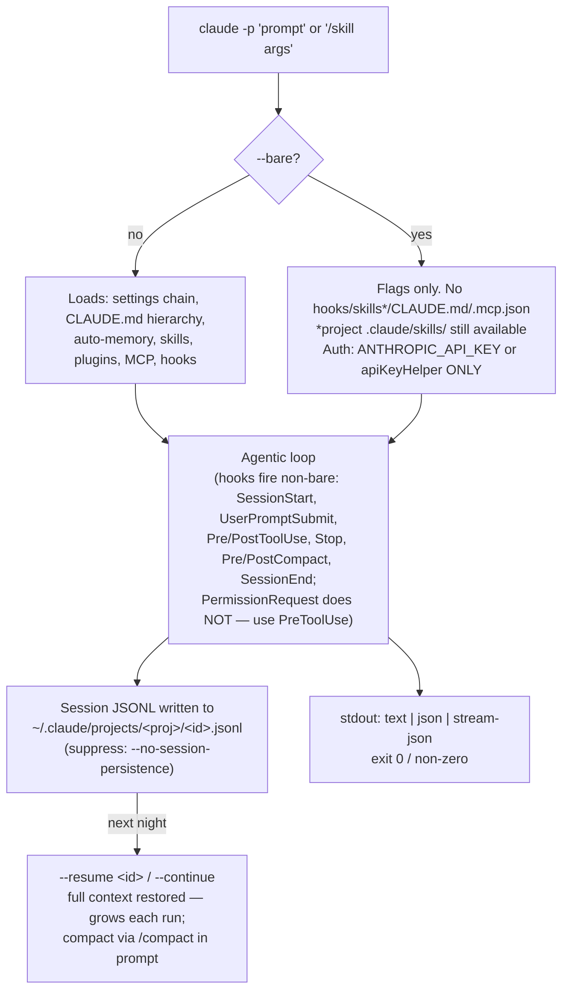
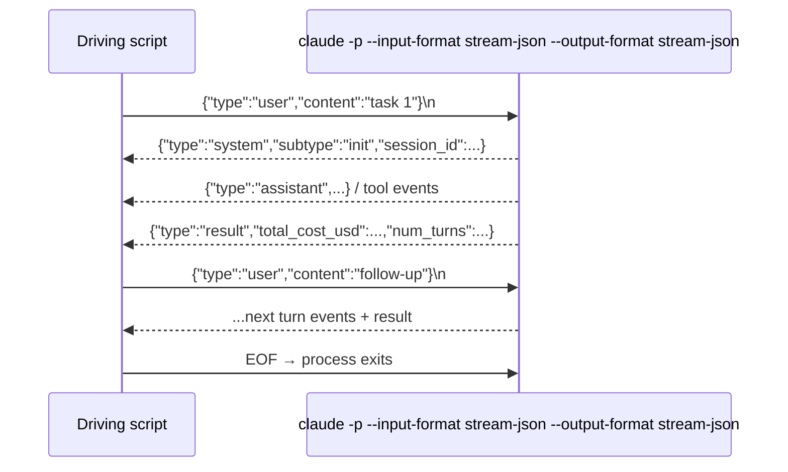

# Routines — Operations

Local scheduled jobs wrapping headless `claude -p` runs — launchd on macOS,
Task Scheduler on Windows (see [Windows](#windows)). This README covers what
runs, what you can adjust and where, what must exist before anything works, and
how to observe and debug a run. The generic `claude -p` mechanics (flags, auth
options, stream-json) are in [claude -p mechanics](#claude--p-mechanics) below;
authoring a new routine is `/skillroutine-create` (routine route).

## What runs

| Routine | Schedule (local) | Group / branch | Prompt | Budget |
|---|---|---|---|---|
| `smine-nightly` | 03:00 | `smine-nightly` → `claude-routines/smine-nightly-<date>` | `/smine --nightly`, then `/smine-consolidate proposals`, then `/smine-apply <votes file>` when votes are pending (three stages, one publish) | $15 per stage |
| `coverage-increaser` | 04:00 | `coverage-increaser` → `claude-routines/coverage-increaser-<date>` **in the target repo** | `/coverage-increase --nightly` | $15 |
| `skill-eval` | 05:00 | `skill-eval` → `claude-routines/skill-eval-<date>` | A/B matrix of the evaluated skill (default `fexplore`): one real `claude -p "/<skill>[--<variant>] [--no-context] <brief>"` session per cell in a detached worktree (context on/off × skill variants × replicas, cap 16), then `/skillroutine-eval <manifest>` on the generated manifest; results under `evals/<skill>-<date>/` | $5 per cell, $15 eval |

| `skill-eval-fexplore` | — (Run Now only) | `skill-eval-fexplore` → `claude-routines/skill-eval-fexplore-<date>` | fexplore model bake-off pinned in the plist env: 4 cells ({fable-5, opus-4-8} × {medium, max}, context on, 1 replica, applied-probe-safety brief), then `/skillroutine-eval <manifest>`; results under `evals/fexplore-<date>/` | $5 per cell, $15 eval |

`skill-eval` is **opt-in**: its routine directory carries a `default-disabled`
marker, so the config server never auto-bootstraps it — start it once via the
Routines page's Start button (the resulting explicit enable persists across
logins).

`skill-eval-fexplore` has **no schedule**: its plist carries no
`StartCalendarInterval`, so it is bootstrapped but never fires on its own —
run it via the Routines page's Run Now button (or
`launchctl kickstart gui/$(id -u)/com.smine.routine.skill-eval-fexplore`).

Each group owns one worktree at `~/.cache/claude-routine/worktrees/<group>` and
one lineage of dated branches `claude-routines/<group>-<date>` (a `-2`, `-3`, … suffix
disambiguates two runs on the same day). Every run mints a **fresh** branch — it
never reuses one: the new branch is based on the newest un-merged dated branch
(the chain tip) so consecutive runs stack linearly, or on `main` when none
survives. A chain-based run then **syncs with `main` before it starts**: a clean
`git merge main`, or — on conflicts — an unattended `/merge-resolve` claude run
in the worktree, gated by a clean tree and a conflict-free
`git merge-tree --write-tree main HEAD`; a sync that cannot reach a mergeable
state fails the run and leaves the chain untouched. Every run's result is
therefore mergeable into main as of run start — a conflict at accept time only
means main moved after the run. Chain members (routines sharing a `ROUTINE_GROUP`) serialize on the
group lock; different groups run concurrently and never touch each other's
worktrees or branches. Output is committed locally on the run's dated branch — no
push, no PR. **Locally merging the newest branch accepts the whole chain;
deleting a branch discards its run.** A run that failed (non-zero exit) is still
committed but its subject is prefixed `[failed]`.

Cleanup is automatic on the next create: dated branches already merged into main
are pruned, and if the tip holds only `[failed]` runs the whole dead chain is
discarded and the next run starts from main — so the steady state needs no
hand-reconcile. Merge the newest branch to accept everything; if you merge a
middle branch instead, the branches at or below it prune next run and the tip
chain (which still contains their work) carries on.

A configurable cap bounds accumulation: `ROUTINE_MAX_OPEN_BRANCHES` (5 for
`smine-nightly`, unset elsewhere) limits how many un-merged dated branches a
group may have open. At the cap a run creates no branch, logs to stderr, and
exits 0 — merge one before the next run.

## What you can adjust, and where

| Knob | Where | Takes effect |
|---|---|---|
| Schedule | `StartCalendarInterval` in `<routine>/com.smine.routine.<name>.plist` | after re-bootstrap (below) |
| Model, effort, budget, timeout | flags on the `claude -p` call in `<routine>/run.sh` (`--model`, `--effort`, `--max-budget-usd`, the `timeout 3600` wrapper) | next run |
| Prompt / wrapped skill | `PROMPT=` in `run.sh` (the smine-nightly apply stage builds its prompt inline) | next run |
| Group membership | `ROUTINE_GROUP=<group>` in `run.sh` before sourcing `_lib/worktree.sh`; default is the routine's own name | next run — starts a new `claude-routines/<group>-<date>` lineage |
| Worktree root / branch prefix | `ROUTINE_WT_ROOT` / `ROUTINE_BRANCH_PREFIX` env overrides (defaults in `_lib/worktree.sh`; the dated suffix is always appended) | next run |
| Max open branches | `ROUTINE_MAX_OPEN_BRANCHES` in the plist's `EnvironmentVariables` (Configure form) — cap on un-merged dated branches for the group; empty = unlimited. At the cap a run logs to stderr and exits 0 without creating a branch | next run |
| Per-routine params | `EnvironmentVariables` in the routine's plist — editable from the config server's Routines page (Configure form: one input per plist-declared key), which rewrites the plist and re-bootstraps | after the re-bootstrap the form does |
| Coverage target repo | `ROUTINE_TARGET_REPO` in the plist's `EnvironmentVariables` (Configure form); falls back to `~/.config/claude-routine/coverage-target` when unset, for manual non-launchd runs | next run |
| Run every N days | `ROUTINE_CADENCE_DAYS` in the plist's `EnvironmentVariables` (Configure form). launchd stays on its daily schedule; `_lib/cadence.sh` gates the run against a `<routine>/.cadence-stamp` file and skips until N days have passed. Unset or `1` = every scheduled run | next run |
| Skill-eval matrix | `ROUTINE_EVAL_*` in the `skill-eval` plist (Configure form): `SKILL` (evaluated skill, must be deployed in `~/.claude/skills`), `CONTEXT_ARMS` (`on,off` — `off` invokes with `--no-context`), `VARIANTS` (`name=ID,glob;name2=…` — each rendered by `sync_skills.sh --variant` and invoked as `/<skill>--<name>`), `MODELS`, `EFFORTS`, `REPLICAS`, `BRIEFS` (basenames under `routines/skill-eval/briefs/<skill>/`; empty = all), `CELL_BUDGET_USD`, `CELL_TIMEOUT_S`, `QUALITY_CONTEXT` / `CONTEXT_FILES` (comma paths → manifest arrays). Cells = arms × (1 + variants) × briefs × models × efforts × replicas, cap 16 | next run |

Plist changes need a reload from the **main checkout** (never a worktree):

```bash
launchctl bootout gui/$(id -u)/com.smine.routine.<name>
```

```bash
launchctl bootstrap gui/$(id -u) <repo-root>/routines/<name>/com.smine.routine.<name>.plist
```

## One-off model bake-off

Compare models/efforts on the same skill and context with full telemetry
(wall-clock, output tokens, cost) — run the skill-eval matrix once, manually,
from the **main checkout** (never a worktree):

```bash
ROUTINE_EVAL_SKILL=fexplore ROUTINE_EVAL_MODELS="claude-fable-5,claude-opus-4-8[1m]" ROUTINE_EVAL_EFFORTS="medium,max" ROUTINE_EVAL_CONTEXT_ARMS=on ROUTINE_EVAL_VARIANTS= ROUTINE_EVAL_REPLICAS=2 bash routines/skill-eval/run.sh
```

8 cells (2 models × 2 efforts × 2 replicas, context on, default variant only —
cap 16). Results land on the run's dated branch under `evals/<skill>-<date>/`:
`manifest.json` (per-cell `model.telemetry`), `eval.json` / `eval.md` (scores),
`deltas.json`. Needs the routine token file (`~/.config/claude-routine/token`)
like every routine run. The off-diagonal cells (fable-max, opus-medium) come
free with the cross-product — extra comparison data, not waste.

## Prerequisites (nothing runs without these)

1. **Token** — `~/.config/claude-routine/token`, non-empty, from `claude setup-token`
   (1-year OAuth; strip whitespace when pasting). Missing/empty → run exits 78
   before doing anything. Never cat it; check with `[[ -s ]]`.
   Multiple accounts: add labeled tokens via the Configure widget (Add token —
   stored 0600 under `~/.config/claude-routine/tokens/<label>`, value stripped
   server-side and never displayed), then pick one per routine with the
   Token (account) setting (`ROUTINE_TOKEN`). Unset = the legacy file above;
   a selected-but-missing token exits 78 naming `tokens/<label>` — it never
   falls back to another account. Delete a token by removing its file.
2. **Tools** — `brew install flock coreutils` (macOS ships neither `flock` nor
   `timeout`); `jq`; `claude` on PATH (run.sh prepends `/opt/homebrew/bin`).
   Windows needs none of these: `routinewrap.exe` holds the locks and the
   backstop deadline, and `_lib/platform.sh` replaces `timeout`/`caffeinate`
   with a bash watchdog; `jq` ships as `jq.exe` in `smine-setup.exe` (from
   source: winget via `install.ps1`).
3. **Coverage target** — only `coverage-increaser` gates on it, same exit 78.
   Set `ROUTINE_TARGET_REPO` via the Configure form (see table); without it the run
   falls back to `~/.config/claude-routine/coverage-target`, which is what manual
   non-launchd invocations use. One of the two must resolve.
4. **Bootstrap** — handled by the configserver: at startup it bootstraps every
   routine that is not degraded, already loaded, or stopped via the UI (Stop
   persists through `launchctl disable`; Start re-enables). Since the
   configserver runs as a LaunchAgent, a fresh login re-loads all enabled
   routines automatically. Manual `launchctl bootstrap` (command above) is only
   needed for ad-hoc testing without the server. Verify by exit code, not
   output: `launchctl print gui/$(id -u)/<label>` — 0 loaded, 113 not loaded.

## Observing a run

- **Result line per run** — `<routine>/results.jsonl`: timestamp, exit_status,
  session_id, num_turns, total_cost_usd, first 300 chars of the agent's result.
  First stop for "did last night work".
- **Wrapper stdout/stderr** — `~/Library/Logs/claude-routine-<name>.out.log` /
  `.err.log` (read stderr first).
- **launchd state** — `launchctl print gui/$(id -u)/<label>`: classify by the
  `runs` and `last exit code` counters, never by the `state` string (a finished
  job always reports `state = not running`).
- **The work itself** — `git log main..claude-routines/<group>-<date>` (list the lineage
  with `git branch --list 'claude-routines/<group>-*'`) in the repo the group runs
  against (smine; the target repo for `coverage-increaser`).
- **Full transcript** — the session_id from results.jsonl, via peek-mcp.
- **skill-eval A/B answer** — the `eval` line in `routines/skill-eval/results.jsonl` carries
  `deltas[]` (`{axis, dimension: context|variant, arm, delta_pct, n}` — mean pct of the
  arm minus the baseline arm, `context-on` / `default`); the same list is
  `<resultsDir>/deltas.json` next to `eval.json`, `eval.md`, `manifest.json`,
  `cells.jsonl` (per-cell session id, transcript path, cost, turns) and
  `runs/<id>.md` (the cell's output bundle) on the run's dated branch.

## Debugging

- **Manual run**: execute `<routine>/run.sh` directly from the main checkout —
  same code path as launchd. `launchctl kickstart gui/$(id -u)/<label>` runs it
  with launchd's environment instead.
- **Exit codes**: 78 = precondition (token / coverage target), 75 = group lock
  timeout (2 h), 70 = worktree create failed or worktree vanished mid-run,
  0 with `is_error: true` in results.jsonl = the agent itself reported failure.
  A run skipped because `ROUTINE_MAX_OPEN_BRANCHES` is reached logs `open-instance
  limit reached` to `.err.log` and exits 0 with no results line (like the cadence skip).
- **"already running"** = the routine's own `.lock` (self-overlap);
  **group lock timeout** = a chain sibling held `claude-routines/<group>` too long.
- **Leftover worktree** under `~/.cache/claude-routine/worktrees/<group>` after
  a failure is intentional (kept for inspection); the group's next create
  removes it. Only that group's own path is ever swept — sibling groups are
  never touched.
- **smine-apply vote safety** (smine-nightly apply stage): the live sidecar `proposals/votes.jsonl`
  is *copied* (never moved) into the worktree as `votes-processing-<ts>.jsonl`, so
  the sidecar is never emptied by the wrapper. The agent appends every terminally
  processed vote to `votes-archive.jsonl` (with its disposition); after a committed
  publish the wrapper drains the live sidecar by removing exactly those archived
  `(kind, id)` keys. A half-failed night still drains whatever the agent finished,
  so progress is monotonic; over-cap votes stay live for a future run; a failed
  publish leaves the sidecar fully intact. The wrapper also fails the run when the
  claude JSON envelope reports `is_error`/non-`success`, not just on a non-zero exit.
  `SMINE_APPLY_CAP` (default 3) overrides the per-run implementation cap.
  `SMINE_AGENTS` (default `claude,codex`) selects which agents' sessions smine-batch mines; passed as `--agents`.
  `SMINE_SUBAGENTS` (default `0`) — set to `1` to also mine each session's per-subagent transcripts (peek-mcp `subagent` parameter); passed as `--subagents`. Expensive (one extra paginated pull per subagent), so off by default.
- **skill-eval**: exit 2 = matrix refused (over the 16-cell cap, unknown arm, no
  briefs) — no cells ran; 70 with `stage: cells` = variant render failed or no
  cell produced output. Cell worktrees live under
  `~/.cache/claude-routine/worktrees/skill-eval-cells/<cell-id>` and are removed
  after the eval stage (kept only when the wrapper itself died); rendered variant
  skills `~/.claude/skills/<skill>--<name>` are removed the same way — a leftover
  is prunable via `cmd/sync/sync_skills.sh --prune`. The default cell loads the
  *deployed* skill, so sync skills before changing what the A/B measures.
- **Lib regression tests**: `bash cmd/tests/test_routine_worktree.sh`
  (branch reuse/reset, own-group sweep, sibling survival, commit-body handoff);
  `bash cmd/tests/test_routine_matrix.sh` (skill-eval matrix expansion, cell
  prompts, manifest shape, deltas, cleanup — stub claude).

## claude -p mechanics

Docs: [headless](https://code.claude.com/docs/en/headless.md), [cli-reference](https://code.claude.com/docs/en/cli-reference.md), [sessions](https://code.claude.com/docs/en/sessions.md), [auth](https://code.claude.com/docs/en/authentication.md), [settings](https://code.claude.com/docs/en/settings.md).

### Scheduling options (decision)

| Mechanism | Runs where | Survives sleep/app close | Min interval | Local files | Nightly fit |
|---|---|---|---|---|---|
| `/loop` (in-session) | open CLI session | no (unless backgrounded) | 1m, 7-day expiry, ≤30m jitter | yes | ✗ intra-session polling only |
| Desktop scheduled tasks | local, Desktop app | restart yes; needs app open + awake; 1 catch-up after wake | 1m | yes | ✓ if Desktop reliably open |
| **launchd + `claude -p`** | local, no app | yes | any | yes | ✓ true unattended |
| Cloud routines (`/schedule`) | Anthropic cloud | machine-independent | 1h | **no** | ✗ for local maintenance |

### `-p` run lifecycle



### Auth for headless

| Credential | Non-bare `-p` | `--bare` | launchd viability |
|---|---|---|---|
| Keychain OAuth (from `/login`) | works interactively | ignored | ✗ no keychain in launchd |
| `CLAUDE_CODE_OAUTH_TOKEN` (`claude setup-token`, 1-year) | **works** | **ignored** | ✓ best for subscription; multi-account via `~/.config/claude-routine/tokens/<label>` + per-routine `ROUTINE_TOKEN` |
| `ANTHROPIC_API_KEY` | works | **required** | ✓ (API billing) |
| `apiKeyHelper` script (+`CLAUDE_CODE_API_KEY_HELPER_TTL_MS`) | works | works | ✓ vault-backed rotation |

Consequence: subscription-billed nightly jobs must run **non-bare** — which also gives you skills, hooks, and MCP.

### Key flags

| Flag | Use |
|---|---|
| `--output-format json` | result envelope: `session_id`, `total_cost_usd`, `usage`, `num_turns`, `structured_output` |
| `--json-schema <schema>` | enforced structured output |
| `--allowedTools` / `--disallowedTools` | tool allowlist (above settings rules, below managed) |
| `--permission-mode acceptEdits\|dontAsk\|bypassPermissions` | prompt-free baseline |
| `--permission-prompt-tool <mcp-tool>` | programmatic permission handler (v2.1.199+) — the headless answer to "ask" prompts |
| `--max-turns` / `--max-budget-usd` | depth cap / spend cap (both exit non-zero on hit) |
| `--fallback-model a,b` | ordered fallback on overload |
| `--resume <id>` / `--continue` | stateful jobs |
| `--input-format stream-json` + `--output-format stream-json` | multi-turn NDJSON protocol (below) |
| `--append-system-prompt-file` | inject routine instructions without touching CLAUDE.md |
| `--settings <file>` / `--mcp-config <file>` | per-routine config |

Permission precedence: managed settings > `--disallowedTools`/`--allowedTools` > `--permission-mode` > settings allow/deny/ask > default. Blocked tool ⇒ error fed back to Claude, run continues (no abort).

Skills: `claude -p "/skill args"` expands (v2.1.205+, skill needs `enable-model-invocation: true`).

### stream-json: local orchestration without the SDK



Envelope types: `system` (init, api_retry), `user`, `assistant`, `result`, `stream_event` (with `--include-partial-messages`, v2.1.205+). Full schema is **not officially documented** ([#24612](https://github.com/anthropics/claude-code/issues/24612) open) — pin the CLI version if you build on it.

### Robustness for launchd/cron

| Concern | Handling |
|---|---|
| Transient API errors (429/529/5xx) | auto-retried with backoff internally |
| Auth expiry | not retried — exits non-zero; 1-year `setup-token` minimizes |
| Exit codes | 0 / non-zero only, no per-error map; parse stderr + result subtype (`error_during_execution`, `error_max_turns`) |
| Run timeout | none built-in — wrap in `timeout(1)`; background-task grace via `CLAUDE_CODE_PRINT_BG_WAIT_CEILING_MS` (default 10m, v2.1.182+) |
| Overlap | `flock` wrapper (macOS; on Windows `routinewrap.exe` holds LockFileEx locks — see [Windows](#windows)) |
| Cost | `--max-budget-usd` + log `total_cost_usd` per run via jq |
| Notification | ERR trap → terminal-notifier |
| launchd env | explicit PATH (`/opt/homebrew/bin`), HOME, no `~` expansion, StandardOut/ErrorPath logs, StartCalendarInterval |
| Stability | `DISABLE_AUTOUPDATER=1`, `DISABLE_TELEMETRY=1` |
| Isolation | `CLAUDE_CONFIG_DIR=/path/to/routine-home` — own settings, credentials, session store per routine |

### Template

```bash
#!/bin/zsh
export PATH="/opt/homebrew/bin:$PATH"
# ROUTINE_TOKEN (plist env, set via the Configure widget) picks a labeled
# per-account token; unset falls back to the shared default file.
if [[ -n "${ROUTINE_TOKEN:-}" ]]; then
  token_file="$HOME/.config/claude-routine/tokens/$ROUTINE_TOKEN"
else
  token_file="$HOME/.config/claude-routine/token"
fi
export CLAUDE_CODE_OAUTH_TOKEN="$(cat "$token_file")"
export CLAUDE_CONFIG_DIR="$HOME/.claude-nightly"
export DISABLE_AUTOUPDATER=1

exec flock -n /tmp/claude-nightly.lock timeout 3600 \
  claude -p "/smine --nightly" \
    --permission-mode acceptEdits \
    --max-budget-usd 5 \
    --output-format json \
  | jq -r '"\(.session_id) \(.total_cost_usd) \(.num_turns)"' \
  >> "$HOME/Library/Logs/claude-nightly.log"
```

launchd plist: `ProgramArguments` → this script, `StartCalendarInterval` Hour 3, log paths set. Non-bare deliberately: skills + subscription token need it.

## Windows

- **Scheduler** — routines register as Task Scheduler tasks under `\smine\`
  (task name = plist label). The plist stays the manifest; the config server
  translates `StartCalendarInterval` to task XML at registration time.
  Stop disables the task (never deletes it); Start re-registers with `-Force`
  and enables; startup reconcile (`SyncAll`) registers new routines and
  refreshes enabled ones, leaving disabled ones alone.
- **Launcher** — the task action is `bin\routinewrap.exe <routine-dir>`: it
  injects the plist env, holds the self- and group locks (LockFileEx), keeps
  the machine awake, arms the `ROUTINE_TIMEOUT_S` backstop (default 46800s),
  and runs `run.sh` under Git for Windows bash.
- **Install** — `smine-setup.exe` (prebuilt payload, wizard clones the repo),
  or from source `install.ps1` (prereqs via winget after consent, build);
  both delegate to `configserver.exe -install` for the shared logic and the
  logon task + routines. Port overrides: `-Addr`, `-PeekPort`,
  `-PeekControlPort`.
- **Token** — same path as macOS: `~/.config/claude-routine/token`, which Git
  Bash resolves under `%USERPROFILE%\.config\claude-routine\`.
- **Logs** — `%LOCALAPPDATA%\claude-routine\logs\<label>.{out,err}.log`
  (Task Scheduler captures nothing; routinewrap redirects).
