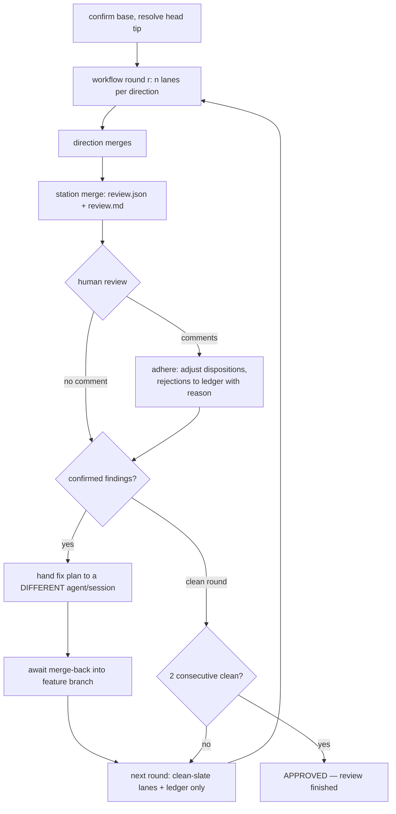

# Railroad Review

Structural code review that validates changes against the project's documented standards, specifications, and implementation plans. The review is organized as **directions** — independent lenses with their own context requirements — each reviewed by **n lanes** (parallel agents), run by one agent walking them sequentially (solo mode) or through the station protocol (railroad mode).

## When to use

**Use when:** reviewing pull requests, commits, or feature branches against project conventions, specs, style guides, and definition-of-done criteria — the full compliance review. Invoked via /railroad-review (railroad multi-agent by default); /railroad-review solo runs the in-session review.
**Don't use when:** reviewing the working diff in the current session — the built-in /code-review handles that. Diagnosing a bug — /diagnose-debug. Checking test coverage — /coverage-increase. Evaluating a change's qualitative consequences — /fimpact.
**Preconditions:** a diff base (branch) and the project's context docs (AGENTS.md, definition-of-done, style guides); the correctness direction additionally needs the spec or plan.
**Workflow position:** standalone (see `docs/skill-map.md`, smine repo).

## Directions

A direction is a review lens with its own context requirements; a **lane** is one review agent walking a direction. Every invocation names its directions (default: code-style, correctness, critical). One agent can walk several directions sequentially (solo mode); the railroad fans each direction out to `lanes` independent lanes (default 2) and merges them per direction.

| Direction | Context it needs | Hunts for |
| :--- | :--- | :--- |
| `code-style` | Style guides + AGENTS.md only (hook-injected) — no spec | Naming, idiom, comment policy<br>Pattern conformance: nearest-sibling mirror, name the sibling<br>Convention violations, hand-edited generated files |
| `correctness` | The spec or plan: `plans/{slug}/design/refined.md`, else `raw.md`, else the user-named doc | Spec compliance, unimplemented plan items, unjustified deviations<br>Concept audit: additions tracing to no requirement<br>Business logic, error handling at boundaries |
| `critical` | `ALWAYS-HOT-*` entries in `rules/concepting.md` (hook-injected, baseline + overlay); fallback built-in list | Race conditions, goroutines/channels/locking<br>Nil-pointer derefs<br>SQL with CTEs, migrations/generated formats<br>Weakened or bypassed validation/transaction guards, resource leaks |
| `special-focus` | The user-supplied focus argument | Whatever the focus names; runs only with an explicit argument |
| `data-integrity` | `NEVER/ALWAYS-INTEG-*` entries in `rules/implementing.md` | State-bearing changes: append-only migrations, timer-driven transitions, claim-before-send, exhaustive enums |
| `contracts` | Repo-wide search, all languages | Cross-boundary contract changes (JSON tags, routes, params, key formats)<br>Leftover old names in other languages, fixtures, docs |
| `tests` | Test style guide + nearest sibling test files | Coverage gaps on changed code, off-pattern tests<br>Deterministic test constants used as identity keys |
| `security` | The Security rules below | Quantified exploits: attack math + reproducible probe |

Direction checklist details:

- **code-style** (absorbs the former Style/Convention/Design-pattern checks):
  - Flag violations of any style guides found in `$AGENT_CONTEXT_DIR_DEFAULT/`; naming conventions per AGENTS.md.
  - Pattern conformance: new code MUST mirror the architecture of its nearest sibling (service, model, test file). Name the sibling it should mirror; flag every deviation.
  - Generated files: were templates edited directly instead of regenerating from source? Project-specific conventions from AGENTS.md followed?
- **correctness** (absorbs the former Spec/Plan-Compliance and Correctness checks):
  - Do the changes implement what the specification requires? Are all planned items implemented? Deviations justified?
  - Concept audit: list every new concept the change introduces (type, file, interface, goroutine, dependency, endpoint). Flag any that does not trace back to the spec/request.
  - Error handling at all system boundaries; calculations and conditions match the specification.
- **critical** — the `ALWAYS-HOT-*` gate entries in `$AGENT_CONTEXT_DIR_DEFAULT/rules/concepting.md` (baseline 001–006 + repo overlay 100+); fallback list when unavailable: race conditions and goroutine/channel/locking misuse, nil-pointer dereferences, SQL with CTEs, migrations and generated formats, weakened or removed validation/transaction guards, resource leaks. Findings cite the entry ID.
- **data-integrity** — check state-bearing changes (persistence, messaging, stateful flows) against the `NEVER-INTEG-*` / `ALWAYS-INTEG-*` entries in `$AGENT_CONTEXT_DIR_DEFAULT/rules/implementing.md`: append-only migrations, no timer-driven transitions, claim-before-send, exhaustive enums. Findings cite the entry ID.

The Definition-of-Done walk is not a direction: every mode ends with the DoD table in consolidation (see Output Format).

## Modes

- `railroad` (default) — multi-agent: n lanes per direction (default 2), direction merges, station merge, then the station protocol loop (human gate, ledger, fix handoff, two consecutive clean rounds). One bundled-workflow invocation per round.
- `solo` — selected with the inline arg `solo` (`/railroad-review solo`): one agent, plan mode, walks the selected directions sequentially and delivers one consolidated review as the session plan. Single-pass — no station loop. When `plans/{slug}/reviews/rejected.json` exists, solo reads it and never re-reports its entries.
- Auto-solo — railroad falls back to solo, stating why, when any of these holds:
  - only one direction is selected (the workflow refuses single-direction fan-out),
  - the session is already in plan mode (a workflow cannot run read-only),
  - the Workflow tool is unavailable.

Railroad mode runs through the bundled **workflow script** (`workflows/railroad-review.js` in this skill's directory), following the skill-bundled convention of `analyze` — one invocation per station-protocol round. This skill's front resolves the range (Guard, below): `headCommit` (`git rev-parse <head>`, re-resolved every round — fixes move the head), `baseCommit` (`git merge-base <base> <head>` — the fork point, never the base tip; recomputed every round against the new head), `commitsAhead` (`git rev-list --count <baseCommit>..<headCommit>`), `diffFiles` (`git diff --name-only <base>...<head>`), checks the diff is non-empty, and invokes the Workflow tool: `{scriptPath: '<this skill's base directory>/workflows/railroad-review.js', args: {base, head, baseCommit, headCommit, commitsAhead, artifactsDir, diffFiles, round, directions, lanes, contextRefs, focus, laneModel, laneEffort, rejectedFindings}}` — the base directory is stated when this skill loads; `artifactsDir` is the session scratchpad directory (absolute path) where agents persist their artifacts under `round-{r}/`, outside every worktree; `rejectedFindings` is the rejection ledger's content (see Station protocol), passed by value because agent worktrees fork from committed state; pass `args` as a real JSON object (the script also tolerates a JSON-encoded string, since the harness delivers one on resume). `lanes` defaults to 2; `laneModel`/`laneEffort` are optional per-lane overrides — map a directive like `lanes: opus-medium` onto them; omitted, agents inherit the session model. The workflow's own guards refuse to fan out on a missing base or `commitsAhead <= 0`, but the interactive stop-and-ask for an ambiguous or empty range stays with the front — a workflow cannot prompt.

The workflow implements one round:

- **Fan-out (no barrier):** n lanes per selected direction, each in an isolated worktree at the review head tip (`headCommit` — agent worktrees fork from the orchestrator's checkout; each lane verifies HEAD == `headCommit` and `baseCommit` is an ancestor), following its direction definition here, blind to its sibling lanes. Every lane is **review-only** (no edits — fixes belong to a different agent), self-verifies coverage (its return lists every diff file it actually read), writes its findings as a JSON+MD artifact pair under `round-{r}/` — its worktree stays pristine so the cleanup stage can remove it — and terminates after writing; it never parks on `ExitPlanMode`.
- **Coverage check (deterministic):** the workflow script diffs each lane's `files_reviewed` against `diffFiles`; uncovered files are injected into the direction merge and surfaced in the station review — never silently dropped.
- **Direction merge (per direction, pipelined):** as soon as a direction's lanes finish, one merge agent — isolated worktree, branch `claude/railroad-merge-{direction}-r{r}-{hash6}` — unions its lanes' findings, collapses duplicates, reconciles divergent severities against the code, and writes the direction report as a JSON+MD pair. A direction with a single surviving lane skips the merge agent — the lane result is the direction report.
- **Station merge (barrier):** a single agent — isolated worktree forked after the fan-out (so it re-verifies against the current tree), branch `claude/railroad-station-r{r}-{hash6}` — unions every direction report, assigns each finding exactly one disposition (`confirmed` | `rejected-with-reason` | `duplicate-of` | `debunked`), auto-rejects ledger matches, re-verifies every BLOCKER/WARNING against the **current tree** (fixes land out of band mid-review), reconciles severities, resolves spec-vs-code conflicts against `decisions.md`, separates real bugs from intentional deviations, walks the Definition of Done, and writes the consolidated review as the round's handoff pair: `round-{r}/review.json` + `review.md` — the trains have arrived at the station.
- **Cleanup:** a final agent in the orchestrator checkout invokes the agent-toolset `~/.claude/agents/tools/remove_agent_worktrees.sh --delete-branch` per expected `claude/railroad-*` branch — safety-gated, never forced; refusals and unattributable worktrees come back in the workflow's `cleanup` return field, and the front relays them in the review record.

## Execution Requirements (mandatory)

- **Solo mode** (via the `solo` arg or auto-solo) MUST be executed in **plan mode**. Do not make any edits to the codebase during a solo review. If you are not in plan mode, enter it before proceeding.
- Solo findings **MUST** be delivered as the plan itself — submitted via `ExitPlanMode`. Claude persists one plan file per session under `~/.claude/plans`, which renders in the desktop UI and can be copied. This is the durable, easily-accessible record; terminal output alone is transient.
- **Railroad mode** runs from an orchestrating session: lanes work in isolated worktrees, review-only; the orchestrator never edits code itself and keeps the session plan file as the consolidated record. The orchestrator also never implements fixes — the accepted fix plan is always handed to a different agent/session (see Station protocol).

## Required Reading (do this first, every time)

A `UserPromptSubmit` hook injects the required context files. Look for the `===== REVIEW CONTEXT (injected by hook) =====` header above. If present, the files below are already in your context — do not re-read them.

**Fallback** — if the hook header is missing, read these context files from the project root manually (each direction needs only its own context — see Directions):

1. `AGENTS.md` — Agent/service architecture and naming conventions
2. `$AGENT_CONTEXT_DIR_DEFAULT/rules/reviewing.md` — Definition of Done checklist for all changes
3. `$AGENT_CONTEXT_DIR_DEFAULT/rules/concepting.md` — high-risk `ALWAYS-HOT-*` classes (critical direction)
4. `$AGENT_CONTEXT_DIR_DEFAULT/rules/implementing.md` — `NEVER/ALWAYS-INTEG-*` data-integrity doctrine and `ALWAYS-EXEC-*` stop conditions
4. `$AGENT_CONTEXT_DIR_DEFAULT/style/go.md` — Go code style rules incl. TESTS and GOROUTINES sections (if Go project)
5. `go.mod` / `pyproject.toml` / `package.json` — language version and dependencies
6. Any active specs or implementation plans referenced in commit messages or PR description (correctness direction)

If any required file is missing, note it as a blocker.

## Review Process

0. **Guard**: resolve the review range yourself from the two branches — the branch to merge into (`<base>`) and the branch under review (`<head>`, default HEAD). The premise pin is the fork point: `git merge-base <base> <head>`, **never the base tip** — develop-vs-master mismatches and a base that advanced past the fork point are recurring review killers. `<base>` unresolvable → retry `origin/<base>`; no common ancestor → stop and report. Stop and ask only when no base branch is given or derivable, or `git diff <base>...<head>` is empty.
1. **Diff**: `git diff <base>...HEAD` for the changed files.
2. **Confirm scope**: state inclusions and exclusions up front. `vendor/` and generated files (`*.gen.go`, `*_gen.go`) are pre-excluded unless the review explicitly asks for them.
3. **Read each changed file in full** — review not just the diff hunks, but the entire context of modified files.
4. **Cross-reference against spec** (correctness direction): verify changes match the specification and implementation plan.
5. **Walk the selected directions** — systematically evaluate against each direction's checklist.

## Station protocol (railroad mode)



1. **Round**: invoke the bundled workflow (one invocation per round). It fans out n lanes per direction, merges each direction, and arrives at the station: one consolidated review written as `round-{r}/review.json` + `review.md` under the session scratchpad.
   A round returning `consolidation: null` or non-empty `abortedLanes` is a **failed round**, not a clean one: the premise pin was wrong or worktrees mis-forked. Re-resolve the range (fetch, recompute `git merge-base <base> <head>` and `headCommit`) and re-dispatch once; a second failure stops the review and reports the lanes' abort notes verbatim. Failed rounds never count toward the two clean rounds.
2. **Human review gate**: present the station review (session plan file + the handoff paths). No comment → the review is accepted as is. Comments are binding — adjust dispositions accordingly before proceeding.
3. **Rejections are permanent**: every finding the human rejects is appended, with its reason, to `plans/{slug}/reviews/rejected.json` in the reviewed repo (slug = the feature's plan slug when one exists, else the head branch slugified). Entry shape: `{finding_id, file, line, claim, reason, round, date}`. This ledger is passed by content (`args.rejectedFindings`) into every later round and into the station merge — a rejected finding never comes back.
4. **Fix handoff (mandatory)**: when the accepted review contains confirmed findings, the fix plan MUST be implemented by a different agent or session — via this session's own tools (e.g. spawning an implementation agent on the feature branch) when available, else via the human. The orchestrator never implements fixes itself. Await the fixes merged back into the feature branch; verify the head moved (`git rev-parse <head>`) and re-resolve `headCommit` before the next round.
5. **The trains leave the station again**: the next round runs with clean-slate lanes — fresh agents, no memory of prior rounds — carrying only the rejection ledger as context.
6. **Termination**: the review is finished only after **two consecutive clean rounds** — a clean round has zero confirmed findings and human acceptance. Any round with confirmed findings resets the counter. Then overall APPROVED → hand off to package-commit.
7. **Oscillation guard**: the same finding confirmed again after its fix was merged back (fixes fighting each other) → stop and report; never a third automated attempt.

## Security rules (security direction)

When the security direction runs (or the review is security-scoped):

- Quantify each exploit: concrete attack math (attempts, window, cost) — "insecure" without numbers is not a finding.
- Confirm each exploit with a reproducible probe (one `curl` per exploit) where the environment allows it.
- List what was **removed from scope** and why — an unexamined surface is itself a finding.
- The user's release decisions are fixed constraints: findings propose mitigations within them, never release delays.

## Stacked PRs

- Attribute each finding to the branch that introduced it (`git log <base>..<child>`) and fix it there, not in the top branch.
- Skip findings already fixed further down the stack.
- Attach the review state (findings + statuses) as JSON to the PR so the next review resumes instead of re-deriving.

## Output Format

Present findings as a table, one row per finding, with a proposed fix for every row:

```markdown
| ID | Severity | Location | Finding | Proposed fix |
|----|----------|----------|---------|--------------|
| style-01 | WARNING | pkg/foo.go:42 | <the defect and the standard it violates> | <one-sentence fix or a short diff sketch> |
```

- **ID** — stable, unique across directions; in railroad mode prefix with the direction name (`style-01`, `critical-03`).
- **Proposed fix** — never empty: the concrete edit that resolves the finding, one sentence or a short diff sketch.
- **Coverage** — every review output states the files reviewed against the diff file list; uncovered files are listed explicitly, never silently dropped.
- **Artifacts** — every artifact under `artifactsDir` exists as a JSON+MD pair; the round's consolidated review is `round-{r}/review.json` + `review.md`.

Severity levels (in order of urgency):
- **BLOCKER** — Prevents merge; breaks spec, DoD, or introduces bugs
- **WARNING** — Should be addressed; style violation, missing test, incomplete DoD item
- **NIT** — Minor; documentation, formatting, code clarity

Calibration:
- Deterministic test-mode constants used as uniqueness/identity keys are a **BLOCKER**, never a nit.
- Temporal TODOs ("remove after X", "until Y ships") are checked against the current date — expired ones are findings.

Order rows by severity; in railroad mode add a Direction column (or one table per direction) so each finding's direction is visible.

End the review (every mode) with a Definition of Done summary table — walk `$AGENT_CONTEXT_DIR_DEFAULT/rules/reviewing.md` and mark each item:

```
| Criterion | Status | Notes |
|-----------|--------|-------|
| Item 1    | PASS   |       |
| Item 2    | FAIL   | Missing X |
| Item 3    | N/A    | Not applicable |
```

Provide a final recommendation: **APPROVE**, **CONDITIONAL** (pending fixes), or **REJECT**.

## Delivering the Review as the Plan (mandatory)

Solo mode submits the full review through `ExitPlanMode`; railroad mode's orchestrator maintains the same plan file with one section per round, each referencing that round's handoff JSON/MD paths. Claude writes it to the session plan file under `~/.claude/plans`, where it displays in the desktop UI and can be copied. Do not hand-write a `plan.md` in the repo — the plan system is the storage.

**Merge, don't overwrite.** All reviews in a session accumulate in the same plan file:

1. Before submitting, read the current session plan. If it already contains earlier review sections, **append** this review as a new dated section rather than replacing prior content. Preserve all earlier sections.
2. When a new review supersedes a previous finding (e.g. a BLOCKER was fixed), do not delete the old entry — mark it as resolved (e.g. `~~strikethrough~~` with a note pointing to the review that resolved it) so the history stays traceable.
3. On a re-review: sync the session worktree first, confirm the spec/plan is still current, then report **deltas** — findings carried over, new, and resolved — instead of re-dumping the full review.

Each review section MUST follow this structure:

```markdown
## Review — <YYYY-MM-DD> — <base>...<head> — <mode, directions, round>

<the findings table (with a Direction column in railroad mode), in the Output Format above>

### Definition of Done
<the DoD summary table>

### Recommendation
<APPROVE | CONDITIONAL | REJECT>
```

## Model

- Suggested: frontier / large
- Reason: multi-standard compliance review; railroad orchestration
- Tested unviable: — (none yet)

## Changelog

- v3.4 (2026-07-31): diff range self-resolved — baseCommit pinned to the merge-base fork point (never the base tip); lane premise aborts explicit (required `aborted` flag), aborted lanes excluded from merges, fully-aborted rounds return `abortedLanes` loudly; front re-resolves and re-dispatches once on a premise-failed round
- v3.3 (2026-07-31): critical direction reads the hot-class gates from rules/concepting.md
- v3.2 (2026-07-31): activity-scoped context — hot classes and integrity entries in rules/implementing.md, DoD walk via rules/reviewing.md, Go style at style/go.md
- v3.1 (2026-07-30): context redesign — hot-items via ../fdesign/assets/ + rules/ overlay; data-integrity direction reads rules/integrity.md and cites entry IDs
- v3.0 (2026-07-30): station protocol — tracks → directions, n lanes per direction (default 2) with per-direction merge, per-lane diff-coverage self-verification, JSON+MD artifact pairs, human gate + durable rejection ledger, mandatory fix handoff to a different agent/session, loop until two consecutive clean rounds; v2 hand-run protocol and approval styles deleted
- v2.7 (2026-07-30): moved under skills/quality/ group; reference rename per-package-commit → package-commit
- v2.6 (2026-07-26): findings render as a table with a mandatory Proposed-fix column (was a bare severity line); Stage A TRACK_SCHEMA gains a required `fix` per finding, and the merge stage carries/refines each track's fix into the ranked plan instead of inventing one
- v2.5 (2026-07-24): railroad is the default mode (`solo` inline arg for in-session; auto-solo on single track / plan mode / no Workflow tool); track artifacts move to args.artifactsDir so worktrees stay removable; new Cleanup stage invokes the agent-toolset remove_agent_worktrees.sh per claude/railroad-* branch — safety-gated, never forced, refusals reported
- v2.4 (2026-07-20): merge agent runs in an isolated worktree too, branch renamed to claude/railroad-merge-{base} — same leftover visibility as the track agents
- v2.3 (2026-07-20): workflow guard fixed to the head tip (worktrees fork from the orchestrator checkout, not the base) — args gains headCommit, agents verify HEAD == headCommit + baseCommit ancestry; string args tolerated (harness delivers JSON strings on resume); optional trackModel/trackEffort passthrough
- v2.2 (2026-07-19): track agents rename their worktree branch to claude/railroad-{track}-{base} so leftovers are visible to claude/* tooling
- v2.1 (2026-07-19): railroad mode fronts the bundled workflow (workflows/railroad-review.js, invoke via scriptPath as analyze does) — Stage A track fan-out (review-only, isolated worktrees) + Stage B/C merge barrier with per-finding dispositions, current-tree re-verification, and ranked fix plan
- v2.0 (2026-07-16): tracks, solo/railroad modes, multi-agent merge protocol, hot-items critical track
- v1.1 (2026-07-13): When-to-use section (routing, preconditions, workflow position)
- v1.0 (2026-06-22): initial version
