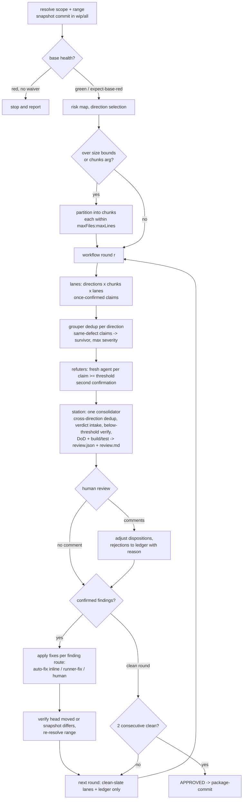

# Railroad Review

Structural code review against the project's documented standards, specs, and plans. The review is organized as **directions** — independent lenses with their own context — fanned out to parallel lanes through the station protocol. The session running this skill is the **dispatcher**: it schedules the rounds, holds the human gate, and applies the fixes; it never reviews a lane itself. The skill is the procedure skeleton; the review standards themselves live in the project's context entries.

## When to use

**Use when:** reviewing any code change against project conventions, specs, style guides, and definition-of-done criteria — pull requests, feature branches, commits, uncommitted work-in-progress, untracked files, or a single file. THE review skill, every scope; scope is an intake arg (see Args), not a routing boundary. Invoked via /railroad-review.

**Don't use when:** diagnosing a bug — /diagnose-debug. Checking test coverage — /coverage-increase. Evaluating a change's qualitative consequences — /fimpact. Verdict on existing (unchanged) code — /code-verdict.

**Preconditions:** an interactive non-plan-mode session with the Workflow tool (MODES-002); the project's context docs; branch/all scopes need a diff base; a green base (PROC-009, waivable via `expect-base-red`); the correctness direction needs a spec, plan, or request doc (**dropped** per DIR-004 without one).

**Workflow position:** standalone (see README.md § Skill map, smine repo).

## Args

- directions: string list overriding the default direction set — values from the Directions table (`special-focus` still requires `focus`), e.g. `directions: tests security contracts`. An explicit set is binding: MODES-004 dynamic selection (diff-proportional drops, risk-map adds) is skipped, the override stated in the review record. Absent ⇒ defaults + MODES-004.
- lanes: parallel lanes per direction with an optional per-lane model/effort bracket — `lanes: <n>[<model>-<effort>]`, e.g. `lanes: 2[opus-medium]`. Bracket tokens resolve by vocabulary: a token in `low | medium | high | xhigh | max` is the effort, anything else the model — `2[opus]`, `2[medium]`, and `2[opus-medium]` all parse. Default 2; absent bracket ⇒ lanes inherit the session model/effort.
- spec: spec/plan/request doc for the correctness direction; absent ⇒ the DIR-003 table's default chain, and with no doc at all the direction drops (DIR-004).
- scope: what to review, with the diff base in an optional bracket — `branch[<base>]` (committed range, fork point → head tip), `wip` (working tree only: staged, unstaged, and untracked; base = HEAD, never a bracket), `all[<base>]` (fork point → working tree including untracked), e.g. `scope: branch[develop]`. An explicit bracket base supersedes derivation: unresolvable (after the `origin/<base>` retry) ⇒ stop and report, never a silent substitute; bracket absent ⇒ PROC-002 derivation with an explicit warning in chat naming the derived base. Scope absent ⇒ dynamic default: `branch` when the tree is clean, `all` when dirty — the chosen scope and why is stated in the review record.
- paths: optional pathspec narrowing any scope to named files or directories — e.g. `paths: internal/server cmd/*.go`.
- focus: the special-focus direction's subject; the direction runs only with this argument — e.g. `focus: "goroutine lifecycle in the scheduler rewrite"`.
- refute-level: severity threshold for per-candidate refutation, read like a log level — the value names the **minimum** severity that gets a fresh refuter, everything at that level and above is included. `blocker | major | minor | nit | info` (`blocker` = blockers only, `info` = every candidate); `none` disables the stage (the station is the sole second confirmation). Default `major`.
- expect-base-red: boolean flag — present waives the base-health gate (PROC-009), the review proceeds on a red base, stated in the review record; absent ⇒ a red base stops the review.
- chunks: chunked fan-out — partition mode with optional chunk-size bounds, `chunks: <mode>[maxFiles:maxLines]`. Modes: `layers` (the dispatcher derives dependency-ordered layers from the repo's actual structure), `languages` (partition by file language), or explicit pathspec groups, e.g. `chunks: domain=internal/model/**; api=internal/server/**`. The bracket bounds each chunk over the **reviewed code only** — the PROC-005 pre-excluded set (vendor/, generated, deps, lockfiles) never counts; defaults 30 files / 2000 changed lines, e.g. `chunks: layers[30:200]`, `chunks: languages[40:1000]`. Arg absent ⇒ no partition while the reviewed set fits the default bounds; over either bound the dispatcher partitions automatically (PROC-008). See MODES-005.

## Scope resolution

**SKILL-RAILROADREVIEW-SCOPE-001** `[step]` — **Scope first:** `branch` = committed range (PROC-001). `wip`/`all` = snapshot commit, never live tree — author maybe still typing.

**SKILL-RAILROADREVIEW-SCOPE-002** `[step]` — **Snapshot commit:** built without touching branch, index, or working tree: copy the index to a temp `GIT_INDEX_FILE`, `git add -A` (captures untracked files — `git diff` cannot see a file never added), `git write-tree`, `git commit-tree <tree> -p HEAD`. `headCommit` = the snapshot SHA; `baseCommit` = HEAD for `wip`, the fork point for `all`.

**SKILL-RAILROADREVIEW-SCOPE-003** `[step]` — **Snapshot rounds:** fixes land on the dispatcher's working tree. Each round new snapshot. "Head moved" (STATION-006) = new snapshot tree differs.

## Directions

**SKILL-RAILROADREVIEW-DIR-001** `[review]` — **Definitions:** direction = review lens. Lane = one agent walking one direction. Dispatcher = the session running this skill. Defaults (absent an explicit `directions` arg): code-style, correctness, critical; each direction fans to `lanes` lanes.

**SKILL-RAILROADREVIEW-DIR-002** `[gate]` — **Falsifiability bar** (every direction except code-style, whose ground truth is the style doctrine): a candidate must name the concrete input, state, or sequence that produces the wrong behaviour — naming opinions, architecture preference, and unquantified robustness are rejected at the lane.

**SKILL-RAILROADREVIEW-TPL-001** `[payload]` — Falsifiability bar, worked example:

```markdown
Accepted: correctness-MAJ-1 · order.go:142 — ApplyDiscount divides by len(items) with no guard;
          a cart emptied between validation and pricing (DELETE /cart/items racing checkout)
          reaches this with len == 0 and panics.
Rejected: "the service layer could be more robust against empty inputs"  (no concrete trigger)
Rejected: "OrderManager should be named OrderService"                    (naming)
Rejected: "this should use the repository pattern"                       (architecture preference)
```

**SKILL-RAILROADREVIEW-DIR-003** `[review]` — **Direction table:** each direction is a goal plus a context requirement — the standards themselves are context, never restated here:

| Direction | Goal | Context |
| :--- | :--- | :--- |
| `code-style` | The change reads like the repo wrote it — naming, idiom, structure. | `ACTION-REVIEW-QUALITY-*`; the repo's style rules for the change's language |
| `correctness` | The change does exactly what the spec requires — nothing missing, nothing nobody asked for. | the spec/plan/request: invocation-named, else `plans/{slug}/design/refined.md`, else `raw.md`; `ACTION-REVIEW-SPEC-*` |
| `critical` | No high-risk defect class ships. | `ACTION-CONCEPT-HOT-*` (fallback one-liner: concurrency misuse, nil derefs, weakened guards, resource leaks) |
| `special-focus` | Whatever the focus argument names. | the `focus` arg |
| `data-integrity` | State-bearing changes keep the integrity doctrine. | `ACTION-IMPL-INTEG-*` (fallback one-liner: append-only migrations, no timer-driven transitions, claim-before-send, exhaustive enums) |
| `contracts` | A cross-boundary contract change lands on every side — no leftover old names in any language, fixture, or doc. | repo-wide search, all languages; `ACTION-REVIEW-DEPLOY-002` |
| `tests` | Changed code is covered by on-pattern tests. | `ACTION-REVIEW-TEST-*`; nearest sibling test files |
| `security` | Only quantified, reproducible exploits. | the Security rules below |

**SKILL-RAILROADREVIEW-DIR-004** `[review]` — **No spec, no correctness:** without a spec, plan, or request doc the correctness direction is **dropped**, named as dropped (MODES-004). Ticket text or stated request counts as minimal spec.

## Modes

**SKILL-RAILROADREVIEW-MODES-001** `[step]` — **Railroad:** bundled workflow per round, then station loop — human gate, ledger, fixes, two consecutive clean rounds.

**SKILL-RAILROADREVIEW-MODES-002** `[gate]` — **Runnability gate:** plan-mode session or Workflow tool missing ⇒ stop, report railroad cannot run here (EXEC-002 — never a prompt, never a degraded single-context review). One direction is a valid railroad.

**SKILL-RAILROADREVIEW-MODES-003** `[step]` — **Workflow invocation:** the dispatcher invokes the bundled workflow (`workflows/railroad-review.js`, base directory stated at skill load) once per round: `{scriptPath, args: {base, head, baseCommit, headCommit, commitsAhead, scope, riskMap, chunks, refute, artifactsDir, diffFiles, round, directions, lanes, contextRefs, focus, laneModel, laneEffort, rejectedFindings}}` — `args` as a real JSON object; the workflow interface stays decomposed, the dispatcher unpacks the intake brackets into it (`scope[base]` → `base`, `lanes[model-effort]` → `laneModel`/`laneEffort`, `chunks[maxFiles:maxLines]` → the computed `chunks` groups, `refute-level` → `refute`). `artifactsDir` = session scratchpad (absolute), artifacts under `round-{r}/` outside every worktree. `rejectedFindings` = ledger content by value — worktrees fork from committed state, cannot see an uncommitted file. The range is re-resolved every round (PROC-001..004).

**SKILL-RAILROADREVIEW-MODES-004** `[step]` — **Direction selection:** an explicit `directions` arg is binding — the selection is exactly that set, dynamic drops and adds skipped, the override stated in the review record. Absent ⇒ diff-proportional — a small diff may drop defaults; risk map (PROC-007) high for auth/crypto/input handling/persisted data MUST add `security`. Every drop and add named with reason in the review record.

**SKILL-RAILROADREVIEW-MODES-005** `[step]` — **Chunked fan-out** (an explicit `chunks` arg, or automatic when the reviewed set exceeds the size bounds — PROC-008): the dispatcher partitions the reviewed files (derived layers, per-language groups, or explicit groups), states the partition. Fan-out = directions × chunks × lanes. Lane reads only its chunk, coverage per chunk. `contracts` chunk-exempt (cross-boundary). Cross-chunk suspicions flagged in notes.

## Round (what the workflow does)

**SKILL-RAILROADREVIEW-ROUND-001** `[step]` — **Fan-out:** `lanes` lanes per selected direction (× chunks per MODES-005), each in an isolated worktree at `headCommit`, blind to sibling lanes.

**SKILL-RAILROADREVIEW-ROUND-002** `[gate]` — **Lane premise:** HEAD must equal `headCommit` with `baseCommit` an ancestor; when `headCommit` is a descendant of HEAD (snapshot scope), the lane runs `git checkout -B <its claude/railroad-* branch> <headCommit>` — the one sanctioned checkout, which also anchors the unreferenced snapshot. Any other mismatch ⇒ abort with the commit facts, never review from a different premise.

**SKILL-RAILROADREVIEW-ROUND-003** `[gate]` — **Lanes are review-only:** no edits, no plan mode, no tree-mutating git; artifacts are written as a JSON+MD pair under `round-{r}/` outside the worktree; the lane terminates after writing.

**SKILL-RAILROADREVIEW-ROUND-004** `[step]` — **Lane output is claims:** before returning, the lane re-reads each claim's cited code and drops what does not survive, recording the check in `evidence` — the claim's **first confirmation**; it stays in question until refuted or station-verified.

**SKILL-RAILROADREVIEW-ROUND-005** `[step]` — **Coverage check (script, deterministic):** each lane's `files_reviewed` is diffed against its assigned file list; gaps surface in the station review, never silently dropped.

**SKILL-RAILROADREVIEW-ROUND-006** `[step]` — **Dedup (semantic, per direction):** a lightweight grouper agent — text-only, no worktree, no code access, low effort — groups the direction's same-defect claims across lanes; the script assembles the result deterministically: best-argued survivor, **max group severity** (so any lane's higher vote still reaches the `refute-level` threshold), absorbed ids kept as `merged_from`. In doubt the grouper keeps claims separate — a wrong merge silently drops a finding, a missed merge only costs one duplicate refutation.

**SKILL-RAILROADREVIEW-ROUND-007** `[step]` — **Refutation:** every deduped claim at or above the `refute-level` threshold goes to a **fresh refuter agent that did not produce it** — isolated worktree (premise per ROUND-002, branch `claude/railroad-refute-{finding-id}-r{r}-{hash6}`), pipelined per direction, second confirmation per the Probe protocol.

**SKILL-RAILROADREVIEW-ROUND-008** `[review]` — **Refuter verdicts:** `confirmed` (survived, artifact in hand) | `debunked` (refuted) | `unverified` (survives but not demonstrable here). "Could not reproduce" is a successful result; evidence is never manufactured. Cross-direction duplicates may refute twice — the station reconciles.

**SKILL-RAILROADREVIEW-ROUND-009** `[step]` — **Station (single barrier agent):** isolated worktree forked after the fan-out (premise per ROUND-002), branch `claude/railroad-station-r{r}-{hash6}`; unions the directions' deduped claim sets, dedups **across** directions (within-direction dedup already happened, ROUND-006), reconciles divergent severities against the code.

**SKILL-RAILROADREVIEW-ROUND-010** `[gate]` — **Verdict intake:** refuter verdicts are binding — mapped straight into dispositions with their reason, probe, and artifacts — unless internally inconsistent with the code; then the station re-verifies and says so.

**SKILL-RAILROADREVIEW-ROUND-011** `[step]` — **Below-threshold verification:** claims without a refuter verdict the station second-confirms itself, adversarially — it attempts to refute, per the Probe protocol.

**SKILL-RAILROADREVIEW-ROUND-012** `[gate]` — **Dispositions (closed set, exactly one per claim):** `confirmed` (twice-confirmed, enters the review) | `unverified` (kept, flagged) | `rejected-with-reason` (ledger or human) | `duplicate-of` | `debunked` (refuted, removed to the audit list).

**SKILL-RAILROADREVIEW-ROUND-013** `[review]` — **Unverified means kept:** survives refutation, not demonstrable here — stays in the review body, flagged, with the concrete missing precondition ("needs a device with an expired subscription"). Never a bare "not demonstrated". Repeated in the report ending as needing a recorded re-check once the precondition is available.

**SKILL-RAILROADREVIEW-ROUND-014** `[step]` — **Reconciliation & routing:** the station resolves spec-vs-code conflicts against `decisions.md`, separates real bugs from intentional deviations to canonicalize, and assigns every confirmed finding a `route` (OUT-006).

**SKILL-RAILROADREVIEW-ROUND-015** `[step]` — **Permanent checks:** for every confirmed finding that is a recurring class, the station names the durable check that would catch the class (ACDSL rule, lint rule, assertion, golden file, test); the dispatcher relays these and offers to add them — never unasked.

**SKILL-RAILROADREVIEW-ROUND-016** `[step]` — **Build + tests once:** the station runs the project's build and test suite in its worktree and reports both results; too slow ⇒ explicitly "skipped", never unmentioned.

**SKILL-RAILROADREVIEW-ROUND-017** `[step]` — **DoD walk:** the station marks every `[DoD]`-marked context entry PASS/FAIL/N/A. The set is queried from the context dir (`rules entries --marker DoD`, or jq over `context.json`: `.entries[] | select(.markers // [] | index("DoD"))`) — never assumed to equal one file's contents.

**SKILL-RAILROADREVIEW-ROUND-018** `[step]` — **Handoff pair:** the station writes the consolidated review as `round-{r}/review.json` + `review.md`.

**SKILL-RAILROADREVIEW-ROUND-019** `[review]` — **Escalate, don't bury:** a suspected but undemonstrated defect in migrations, auth, concurrency, money, a public API contract, or persisted data goes at the **top** of `review.md`, never as one unverified line among many.

**SKILL-RAILROADREVIEW-ROUND-020** `[step]` — **Funnel:** `review.md` ends with one line — claims produced / confirmed / unverified / duplicates / rejected / debunked.

**SKILL-RAILROADREVIEW-ROUND-021** `[step]` — **Cleanup:** a final agent in the dispatcher's checkout runs the agent-toolset `remove_agent_worktrees.sh --delete-branch` per expected `claude/railroad-*` branch — safety-gated, never forced; refusals and unattributable worktrees return in `cleanup` and the dispatcher relays them.

## Probe protocol (second confirmation)

**SKILL-RAILROADREVIEW-PROBE-001** `[step]` — **Deterministic probes:** in ACDSL repos (`acdsl/registry.json` present or `bin/acdsl` vendored), the second confirmation is deterministic — per claim a debug probe, at least two authoring attempts before declaring the claim unprobeable.

**SKILL-RAILROADREVIEW-PROBE-002** `[step]` — **Probe anatomy:** a probe is three parts: a task-lifetime rule line in an untracked `railroad-probes-r{r}.acdsl` at the worktree root (file-scoped anchor, why = the claim); a verifier under `round-{r}/probes/` (files-list + `key=value` argv, exit 0 clean, exit 1 + `file:line: message` on hit); a merged registry under `round-{r}/probes/` (repo registry + local overlay + the probe entries, absolute argv paths, timeout ≤ 60s). The hand-built files list for the validity self-check is transient scaffolding — written under the system temp dir, never persisted under `probes/`.

**SKILL-RAILROADREVIEW-PROBE-003** `[gate]` — **Validity first:** the probe must exit 1 on a minimal fail fixture under `round-{r}/probes/fixtures/` before the real run — a probe that cannot detect its own fixture is a failed attempt. The proving fixture's path is recorded on the probe's `probes[]` entry in `review.json`.

**SKILL-RAILROADREVIEW-PROBE-004** `[step]` — **Verdict:** `<acdsl binary> check -rule <probe-id> -registry <probe registry>` — red on the claimed file ⇒ `confirmed` (probe recorded on the finding); green ⇒ `debunked`; unprobeable after two attempts ⇒ manual re-verification, flagged `probe: "none: <why>"`.

**SKILL-RAILROADREVIEW-PROBE-005** `[step]` — **Probe persistence:** exactly the scripts, `fixtures/`, `registry.json`, and the `probes.acdsl` rule-line mirror persist under `round-{r}/probes/` and travel with the review copy — every confirmed claim stays mechanically recheckable. The probe→fixture→verdict index lives in `review.json`'s `probes[]` field, never in sidecar files (no verdicts.md, no files lists).

**SKILL-RAILROADREVIEW-PROBE-006** `[step]` — **Manual path (non-ACDSL or unprobeable):** the cheapest settling artifact, in preference order — a failing test, a command with actual and expected output, a reproduction sequence with the observed result — written under `round-{r}/`, named for the finding.

**SKILL-RAILROADREVIEW-PROBE-007** `[gate]` — **Both directions:** a test demonstrates a claim only if it fails on the current tree **for the reason the claim states** and passes with the proposed fix — both directions checked and stated. The fix may be applied temporarily in the disposable worktree for this check and is restored exactly afterwards, never committed.

## Execution requirements

**SKILL-RAILROADREVIEW-EXEC-001** `[review]` — **Dispatcher session:** railroad runs from the dispatcher's session — lanes review-only in worktrees, the dispatcher keeps the session plan file as the consolidated record. After the human gate, fixes land on the review branch (STATION-005).

**SKILL-RAILROADREVIEW-EXEC-002** `[gate]` — **Never prompt.** The review never calls AskUserQuestion or stops for input — resolve every input yourself, state the assumption in the review record, carry on; the genuinely unresolvable ends the review with a report. The only pause is the human gate (STATION-003), which presents a finished round and asks nothing.

## Context

**SKILL-RAILROADREVIEW-CTX-001** `[review]` — **Dispatcher context:** the dispatcher's doctrine arrives via this skill's frontmatter `acdsl-context:` declaration, injected at invocation by the skill-context hook.

**SKILL-RAILROADREVIEW-CTX-002** `[review]` — **Lane context:** lanes get no injection (they never invoke a skill) — each lane's prompt names its direction's context requirement; the Directions table is the source, lanes read the named entries' files from the repo's context directory.

**SKILL-RAILROADREVIEW-CTX-003** `[gate]` — **Missing context:** a context source a direction requires that cannot be found is a blocker finding in the review, never silently skipped.

**SKILL-RAILROADREVIEW-CTX-004** `[review]` — **Gate evidence:** in ACDSL repos, gate output (`acdsl check`, projection blocks) is review evidence — directions skip what gates already enforce and cite rule IDs where relevant.

## Review process (dispatcher)

**SKILL-RAILROADREVIEW-PROC-001** `[gate]` — **Guard:** resolve the scope (SCOPE-001), then the range. The premise pin is the fork point — `git merge-base <base> <head>`, **never the base tip**; a base that advanced past the fork point is a recurring review killer.

**SKILL-RAILROADREVIEW-PROC-002** `[step]` — **Base resolution:** an explicit scope-bracket base supersedes derivation — resolvable (retrying `origin/<base>` counts as resolution, not substitution) ⇒ used as given; unresolvable ⇒ stop and **report** (EXEC-002), never a silently derived substitute. No bracket ⇒ derive: the tracked upstream, else the repository's mainline — with an explicit warning in chat naming the derived base. An empty diff (snapshot tree identical to the base tree included) ⇒ stop and **report** (EXEC-002).

**SKILL-RAILROADREVIEW-PROC-003** `[review]` — **Wrong-base heuristic:** a diff running to thousands of lines ⇒ suspect a stacked-branch base; settle the base before reviewing anything.

**SKILL-RAILROADREVIEW-PROC-004** `[step]` — **Diff:** `git diff <baseCommit> <headCommit>`, narrowed by the `paths` arg when given.

**SKILL-RAILROADREVIEW-PROC-005** `[step]` — **Confirm scope:** state inclusions and exclusions up front; `vendor/` and generated files (per repo convention) are pre-excluded unless explicitly requested.

**SKILL-RAILROADREVIEW-PROC-006** `[step]` — **Read changed files in full** — the whole file, not just the hunks.

**SKILL-RAILROADREVIEW-PROC-007** `[step]` — **Risk map:** tier every changed file per the `ACTION-REVIEW-RISK-*` entries (fallback: high — migrations/auth/concurrency/money/API contracts/persisted data; medium — business logic/error handling; low — tests/renames/formatting/generated). Print the map, pass it as `args.riskMap`; attention goes to high and medium, low is read only for scope creep; the map drives MODES-004.

**SKILL-RAILROADREVIEW-PROC-008** `[step]` — **Size bounds ⇒ partition:** counted after the PROC-005 exclusions; there is no total review cap. Within the bounds (`chunks` bracket, defaults 30 files / 2000 changed lines insertions+deletions) and no explicit `chunks` arg ⇒ no partition, lanes read the whole diff. Over either bound ⇒ the dispatcher partitions automatically (mode from `chunks`, `layers` when absent) until every chunk fits `maxFiles:maxLines`; a single file exceeding `maxLines` rides alone in its chunk, stated. The partition is always stated (MODES-005).

**SKILL-RAILROADREVIEW-PROC-009** `[gate]` — **Base health (once per review):** build + tests at `baseCommit` in a disposable worktree (Makefile targets, else stack commands, else none — stated). Red ⇒ stop and report unless the `expect-base-red` flag is present (then stated: pre-existing breakage attributes to the base). Too slow ⇒ stated skip.

## Station protocol

**SKILL-RAILROADREVIEW-TPL-002** `[payload]` — Station-protocol flow:



**SKILL-RAILROADREVIEW-STATION-001** `[step]` — **Round:** one workflow invocation; after it returns, copy the handoff pair and `probes/` (when present) to `plans/{slug}/reviews/round-{r}/` in the reviewed repo — the durable copy; the scratchpad pair stays the inter-agent handoff.

**SKILL-RAILROADREVIEW-STATION-002** `[gate]` — **Failed round:** `consolidation: null` or non-empty `abortedLanes` — re-resolve the range and re-dispatch once; a second failure stops the review with the abort notes verbatim. Failed rounds never count as clean.

**SKILL-RAILROADREVIEW-STATION-003** `[step]` — **Human gate:** present the station review (plan file + handoff paths). No comment ⇒ accepted as is; comments are binding — adjust dispositions before proceeding.

**SKILL-RAILROADREVIEW-STATION-004** `[gate]` — **Rejections permanent:** every human-rejected finding appended with its reason to `plans/{slug}/reviews/rejected.json` (`{finding_id, file, line, claim, reason, round, date}`; slug = plan slug, else head branch slugified). Passed by content into every later round. Matching by file and claim substance, never by ID. A rejected finding never comes back.

**SKILL-RAILROADREVIEW-STATION-005** `[step]` — **Fix application:** on the review branch (the dispatcher's working tree in snapshot scopes, SCOPE-003), routed per finding by `route` (OUT-006): `auto-fix` inline, `runner-fix` via a same-worktree delegate runner (`/delegate /fimplement <review doc>`), `human` to the author; the gate can override. Cross-branch handoff with merge-back is opt-in.

**SKILL-RAILROADREVIEW-STATION-006** `[step]` — **Head verification:** after fixes land, verify the head moved (`git rev-parse <head>`; snapshot scopes: the new snapshot differs) and re-resolve the range before the next round.

**SKILL-RAILROADREVIEW-STATION-007** `[step]` — **Clean-slate rounds:** the next round runs fresh lanes with no memory of prior rounds, carrying only the rejection ledger.

**SKILL-RAILROADREVIEW-STATION-008** `[gate]` — **Termination:** finished only after **two consecutive clean rounds** (zero confirmed findings + human acceptance); any confirmed finding resets the counter. Then APPROVED → hand off to package-commit.

**SKILL-RAILROADREVIEW-STATION-009** `[gate]` — **Oscillation guard:** the same finding confirmed again after its fix landed ⇒ stop and report; never a third automated attempt.

## Security rules (security direction)

**SKILL-RAILROADREVIEW-SEC-001** `[review]` — **Attack math:** quantify each exploit — attempts, window, cost; "insecure" without numbers is not a finding.

**SKILL-RAILROADREVIEW-SEC-002** `[review]` — **Exploit probe:** confirm each exploit with a reproducible probe (one `curl` per exploit) where the environment allows.

**SKILL-RAILROADREVIEW-SEC-003** `[review]` — **Scope accounting:** list what was removed from scope and why — an unexamined surface is itself a finding.

**SKILL-RAILROADREVIEW-SEC-004** `[review]` — **Release constraints:** the user's release decisions are fixed constraints — findings propose mitigations within them, never release delays.

## Stacked PRs

**SKILL-RAILROADREVIEW-STACK-001** `[review]` — **Finding attribution:** attribute each finding to the branch that introduced it (`git log <base>..<child>`) and fix it there, not in the top branch.

**SKILL-RAILROADREVIEW-STACK-002** `[review]` — **Down-stack fixes:** skip findings already fixed further down the stack.

## Output Format

**SKILL-RAILROADREVIEW-OUT-001** `[step]` — **Findings table:** one row per finding, a proposed fix in every row.

**SKILL-RAILROADREVIEW-TPL-003** `[payload]` — Findings table format:

```markdown
| ID | Severity | Route | Location | Finding | Proposed fix |
|----|----------|-------|----------|---------|--------------|
| code-style-NIT-1 | NIT | auto-fix | pkg/foo.go:42 | <the defect and the standard it violates> | <one-sentence fix or a short diff sketch> |
```

**SKILL-RAILROADREVIEW-OUT-002** `[review]` — **ID:** `<direction>-<SEV>-<n>`, SEV ∈ BLK · MAJ · MIN · NIT · INF, numbered from 1 per direction and severity — so the author can reply "fix critical-BLK-1, strike code-style-NIT-2".

**SKILL-RAILROADREVIEW-OUT-003** `[review]` — **Proposed fix** — never empty: the concrete edit, one sentence or a short diff sketch.

**SKILL-RAILROADREVIEW-OUT-004** `[review]` — **Coverage** — every review states the files reviewed against the diff list; uncovered files listed explicitly, never silently dropped.

**SKILL-RAILROADREVIEW-OUT-005** `[review]` — **Severity by consequence** (in order of urgency): **BLOCKER** — wrong behaviour on a production path, data loss, security, irreversible migration defect; **MAJOR** — wrong behaviour on a secondary path, missing requirement, stated edge case untested; **MINOR** — should be addressed; **NIT** — documentation, formatting, clarity; **INFO** — observation, no action required.

**SKILL-RAILROADREVIEW-OUT-006** `[review]` — **Route** per confirmed finding: `human` (needs author judgment) | `auto-fix` (mechanical, dispatcher inline) | `runner-fix` (well-specified but large — delegate-runner batch). Consumed by STATION-005; the human gate can override.

**SKILL-RAILROADREVIEW-OUT-007** `[review]` — **Row order:** rows ordered by severity; a Direction column keeps each finding's direction visible.

**SKILL-RAILROADREVIEW-OUT-008** `[step]` — **DoD table:** end every review with the Definition-of-Done summary table.

**SKILL-RAILROADREVIEW-TPL-004** `[payload]` — Definition of Done summary table format:

```
| Criterion | Status | Notes |
|-----------|--------|-------|
| Item 1    | PASS   |       |
| Item 2    | FAIL   | Missing X |
| Item 3    | N/A    | Not applicable |
```

**SKILL-RAILROADREVIEW-OUT-009** `[step]` — **Recommendation:** **APPROVE** (mergeable as is) | **CONDITIONAL** (mergeable once the named fixes land) | **REJECT** (fundamental rework).

**SKILL-RAILROADREVIEW-OUT-010** `[step]` — **Probes index:** a review that authored probes carries a Probes table in `review.md` (one row per `probes[]` entry: id, finding, script, fixture, tree verdict) before the funnel line — the reviewer navigates from the review doc to each probe and its fixture.

## Delivering the review as the plan

**SKILL-RAILROADREVIEW-DELIVER-001** `[gate]` — **Plan-file record:** the dispatcher maintains the session plan file, one section per round, each referencing the round's handoff paths. Never hand-write a `plan.md` in the repo — the plan system is the storage.

**SKILL-RAILROADREVIEW-DELIVER-002** `[gate]` — **Merge, don't overwrite:** reviews accumulate in the session plan file — append new dated sections, preserve earlier ones.

**SKILL-RAILROADREVIEW-DELIVER-003** `[step]` — **Resolved findings:** a superseded finding is marked resolved (strikethrough + pointer to the resolving review), never deleted — history stays traceable.

**SKILL-RAILROADREVIEW-DELIVER-004** `[step]` — **Re-review deltas:** sync the worktree, confirm the spec is current, report deltas — carried over, new, resolved — instead of re-dumping.

**SKILL-RAILROADREVIEW-DELIVER-005** `[gate]` — **Section structure:** each review section follows this structure:

**SKILL-RAILROADREVIEW-TPL-005** `[payload]` — Review section structure:

```markdown
## Review — <YYYY-MM-DD> — <base>...<head> — <directions, round>

<the findings table, per the Output Format>

### Definition of Done
<the DoD summary table>

### Recommendation
<APPROVE | CONDITIONAL | REJECT>
```

## Model

- Suggested: frontier / high
- Reason: multi-standard compliance review; railroad orchestration
- Tested unviable: — (none yet)
